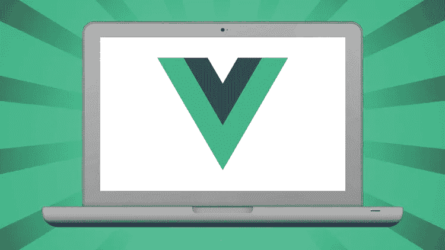
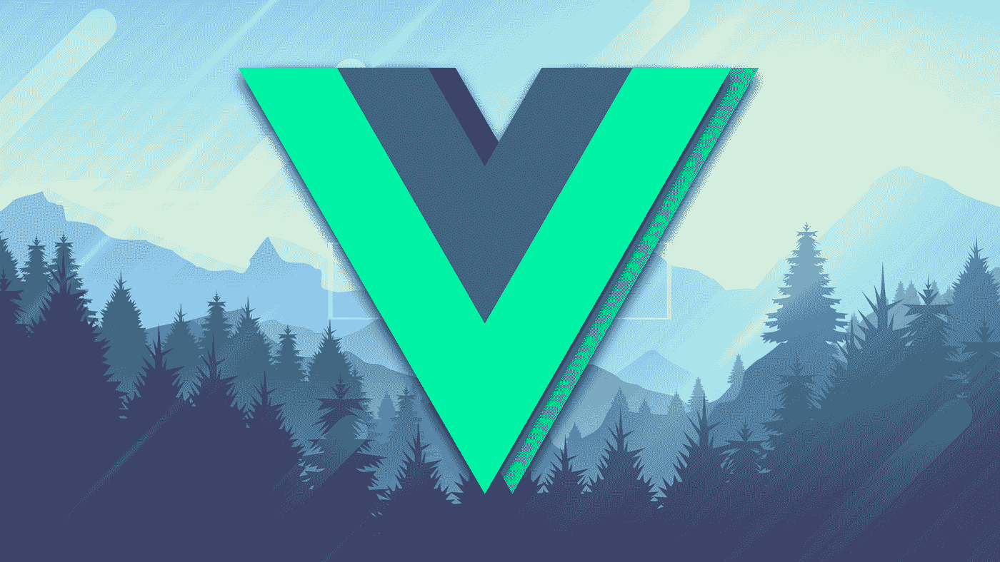
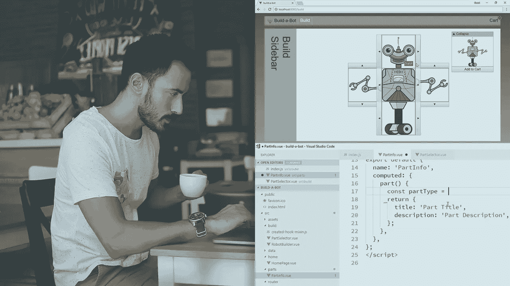
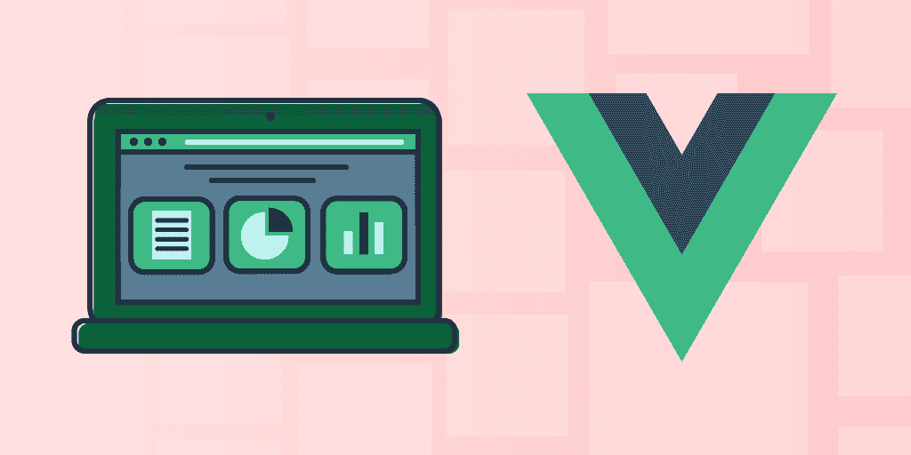
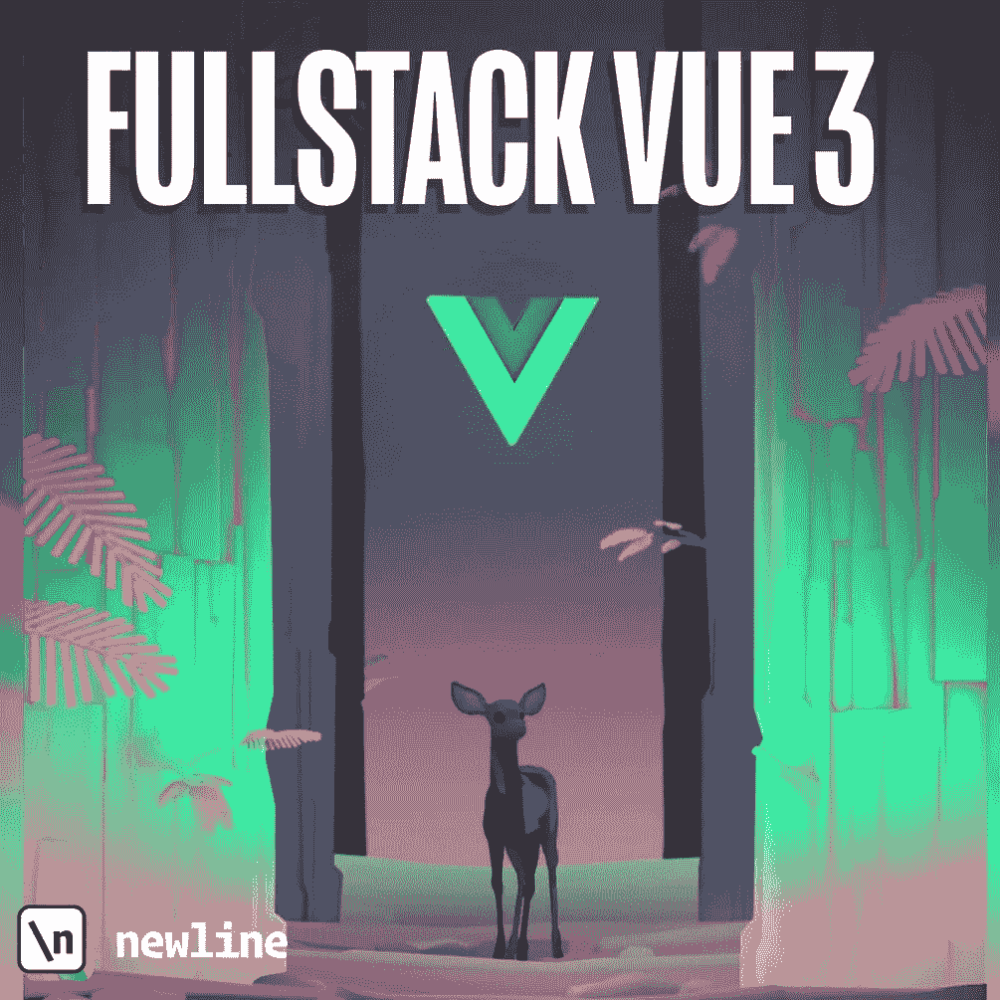
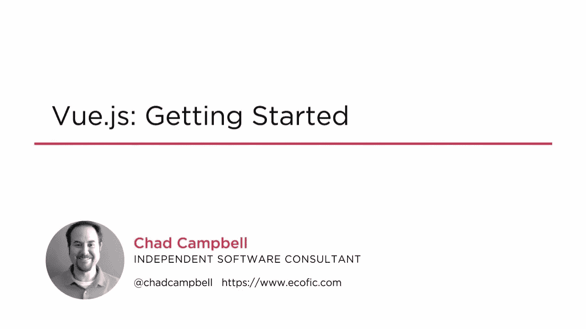
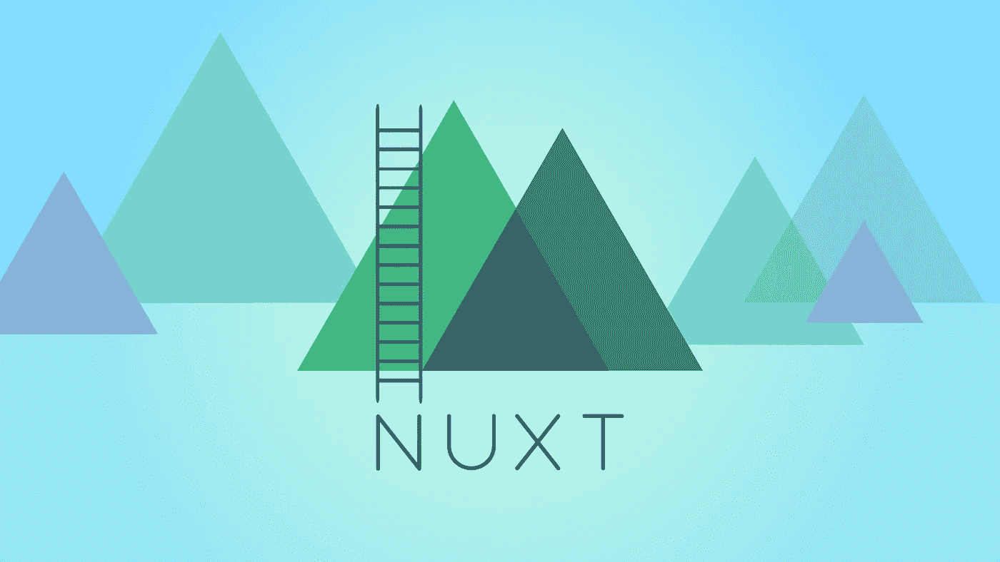

# 2023 年学习 Vue.js 的 8 大在线课程

> 原文：<https://medium.com/javarevisited/top-5-online-courses-to-learn-vue-js-in-2021-249e66b60646?source=collection_archive---------1----------------------->

## 我最喜欢的 Vue.js 或来自 Udemy、Pluralsight、Educative、ZTM 学院和其他在线网站的 Vue 课程。

大家好，如果你想在 2023 年学习 Vue.js 并寻找最好的 Vue.js 在线课程，那么你来对地方了。之前我已经分享了学习 Angular 和 [**React.js**](/@javinpaul/top-5-courses-to-learn-react-js-in-2019-best-of-lot-fa02cd96cdf0) 的 [**最佳课程而今天我要分享的是 2023 年学习 Vue.js 的最佳课程，这是 web 开发人员可以学习的令人兴奋的 JavaScript 框架之一。**](/javarevisited/10-courses-to-learn-angular-for-web-development-6da1bd2856dc)

Angular 和 React.js 改变了前端开发空间后，我认为他们将统治前端世界很多年，不会有更多的框架接近，但是，像你们许多人一样，我错了；有人在敲门。

说实话，我忽略了 Vue.js 很长一段时间，希望它会慢慢消失，但我又一次错了，Vue.js 不只是敲门，它就在那里呆着。

那么，Vue.js 提供了什么是 [Angular](https://javarevisited.blogspot.com/2018/06/top-10-angular-tutorials-and-courses-for-web-developers.html) 和 [React](https://javarevisited.blogspot.com/2018/10/the-2018-react-developer-roadmap.html) 所没有的呢？如果一个 JavaScript 或前端开发人员已经知道 Angular，为什么还要学习 Vue.js，并做出反应？嗯，当我开始认真思考 Vue.js 的时候，我也问过自己和朋友同样的问题。

**Vue.js** 通过结合 Angular 和 React 的优点，提供了两全其美的**。实际上所有的 [Angular](http://www.java67.com/2018/01/top-5-free-angular-js-online-courses-for-web-developers.html#ixzz5BZVl3kcg) 、 [React](https://javarevisited.blogspot.com/2019/04/10-free-angular-and-react-courses-for.html) 和 Vue.js 都是稳定的，有适当的文档，可以帮助服务器端渲染，只是规模和需求不同。

根据您的具体情况，您可以选择 Angular、React 或 Vue.js，但既然我们是来学习 Vue.js 的，让我强调一下 Vue.js 的几个特点，这些特点是我喜欢的，也迫使我学习和推荐这个优秀的前端框架:

1。Vue.js 非常小，最小化和压缩后的大小在 16KB 左右，这使得它的加载速度更快。它还提供了出色的运行时性能，有时甚至比 Angular 和 React.js.

2 还要好。Vue.js 很容易，因为如果你知道 [HTML](https://javarevisited.blogspot.com/2019/05/top-5-html-5-and-css-3-courses-for-web-developers.html) 和 [CSS](https://hackernoon.com/top-5-free-online-courses-to-learn-html-css-web-development-in-2020-ae8e7466dfa7) 你可以很快学会，每个 web 开发者都知道 HTML 和 CSS，不是吗？没有的话，先学它们再跳 Vue.js，说实话 HTML 和 CSS 也是超级容易快速理解的。这意味着如果你雇佣的开发人员几乎没有经验，他们可以很快跟上你团队的其他成员。如果你不知道 HTML 和 CSS，看看这些[课程](/javarevisited/5-free-html-and-css-courses-to-learn-front-end-web-development-online-8b04517c6ecb?source=collection_home---4------0-----------------------)和教程来学习它们。

3。Vue.js 也有非常描述性的属性，可以添加到元素或组件中。例如，您可以使用 v-model 将用户在文本框中输入的值与该组件的状态同步。
4。Vue.js 为组件上的所有属性提供了内置的类型验证，并且它还提供了插槽，这是在没有复杂解决方案的情况下构建复杂组件的好方法。**

# **2023 年 8 门最适合初学者的 Vue.js 在线课程**

**所有这些特性使 Vue.js 成为开发应用前端的绝佳选择，如果你已经被说服学习 Vue.js，这里有一些最好的在线培训课程，你可以参加，开始你的旅程。

这些都是初学者学习 Vue.js 的一些最好的在线课程，中级 web 开发者甚至专家都会在上面找到一些东西。它包含了一些来自 [Udemy](https://click.linksynergy.com/deeplink?id=CuIbQrBnhiw&mid=39197&murl=https%3A%2F%2Fwww.udemy.com%2F) 、 [Pluralsight](https://pluralsight.pxf.io/c/1193463/424552/7490?u=https%3A%2F%2Fwww.pluralsight.com) 、 [Educative](https://www.educative.io/subscription?affiliate_id=5073518643380224) 、 [ZTM 学院](https://academy.zerotomastery.io/p/academy?affcode=441520_zytgk2dn)以及其他网站的免费和付费课程。**

**当我发现一些值得添加的东西时，我还打算在这个列表中添加更多的课程，所以你可以将这个列表加入书签以供将来参考。无论如何，在不浪费你更多时间的情况下，这里是我列出的 2023 年学习 Vue.js 的最佳课程:**

## **1. [Vue JS 2 —完全指南](https://click.linksynergy.com/deeplink?id=JVFxdTr9V80&mid=39197&murl=https%3A%2F%2Fwww.udemy.com%2Fvuejs-2-the-complete-guide%2F)【Udemy 最佳课程】**

**如果你是这里的常客，那么你可能知道我是 Maximilian Schwarzüller 的超级粉丝，他是 Udemy 教授 web 开发的最好的指导者之一。

上过马克西米利安的 [**Angular 完全指南**](https://click.linksynergy.com/fs-bin/click?id=JVFxdTr9V80&subid=0&offerid=323058.1&type=10&tmpid=14538&RD_PARM1=https%3A%2F%2Fwww.udemy.com%2Fthe-complete-guide-to-angular-2%2F) 和 [**React.js 课程**](https://click.linksynergy.com/deeplink?id=JVFxdTr9V80&mid=39197&murl=https%3A%2F%2Fwww.udemy.com%2Freact-the-complete-guide-incl-redux%2F) **，**我最初想学 Vue.js 的时候其实是在找他的 Vue.js 课程，这就是我上的课程。让我告诉你，我没有失望，因为 Max 的教学技巧既强大又迷人，我学到了很多我甚至不知道存在的 Vue.js 知识，这就是为什么我向任何想学习 Vue.js 的人推荐这门课程。**

***这是 Vue.js 上的一门很棒的深度课程，最适合初学者*和中级开发人员，包含 21.5 小时的超级吸引人的内容，还提供结业证书。**

****这里是加入这个令人敬畏的 Vue.js 课程的链接**——[Vue JS 2——完全指南](https://click.linksynergy.com/deeplink?id=JVFxdTr9V80&mid=39197&murl=https%3A%2F%2Fwww.udemy.com%2Fvuejs-2-the-complete-guide%2F)**

****

**谈到社交证明，已经有超过 90，000 名学生选修了这门课程，这充分说明了这门课程的伟大，它也是 Udemy 中针对初学者的**评分最高的 Vue.js 课程之一，近 30，000 名参与者的平均评分为 4.7。除英语外，本课程还提供德语、印度尼西亚语、意大利语、日语、波兰语、葡萄牙语、罗马尼亚语、西班牙语和土耳其语版本。****

## **2.[2023 年在 ZTM 学院完成 Vue 开发](https://academy.zerotomastery.io/a/aff_095m8pfx/external?affcode=441520_zytgk2dn)**

**这个来自 [*ZTM 学院*](https://academy.zerotomastery.io/a/aff_fvgz1fnn/external?affcode=441520_zytgk2dn) 的 29 小时在线课程是在线学习 Vuejs 的最全面和最新的课程之一，也涵盖了 Vue 3 的功能。**

**课程非常注重实践，从一开始就教你 Vue 基础知识和基本原理。之后，您将深入高级主题，以便在未来的任何 Vue.js 项目中对架构和工具做出好的决定。**

**本 Vue 课程侧重于效率。永远不要再花时间在令人困惑、过时、不完整的教程上，而是学习使用 Vue 3 构建专业和现代的应用程序。**

**这也是一个基于项目的课程，你不仅会学到 2023 年 Vue JS 开发人员的所有现代工具链，还会**使用 Vue、Vuex、Vue Router、Composition API、Firebase、Jest、Sass +等构建一个类似于 Spotify** 的大型全栈音乐播放器应用程序。**

****这里是加入本课程的链接**—[2023 年完成 Vue 开发者(w/ Vuex，Composition API，Router)](https://academy.zerotomastery.io/a/aff_095m8pfx/external?affcode=441520_zytgk2dn)**

****

**顺便说一句，你需要一个 [ZTM 会员](https://academy.zerotomastery.io/p/academy?affcode=441520_zytgk2dn)来观看这个课程，这个课程每月花费大约 23 美元，但也提供了许多超级吸引人和有用的课程，如他的 Python 和 JavaScript Web 项目:20 个项目来建立你的作品集课程。您还可以使用我的代码朋友 10 获得您选择的任何订阅的 10%的折扣。**

** [## ZTM 学院

### 无论你是刚刚开始学习编码，还是想提高你的技能，零到精通学院将教你…

academy.zerotomastery.io](https://academy.zerotomastery.io/p/academy?affcode=441520_zytgk2dn)** 

## **3. [Vue.js 基础吉姆·库珀](https://pluralsight.pxf.io/c/1193463/424552/7490?u=https%3A%2F%2Fwww.pluralsight.com%2Fcourses%2Fvuejs-fundamentals)【plural sight 最佳课程】**

**这是另一个自学 Vue.js 在线学习的初级课程。如果你知道的话，Vue.js 由于其易用性正在迅速普及，这意味着越来越多的开发人员正在学习 Vue.js 来开发单页面应用程序。

本课程将教你 Vue 开发的所有基础知识，包括创建组件、指令、过滤器、路由、Vuex 状态管理，以及部署到生产。**

****这是加入本在线课程** — [Vue.js 基础](https://pluralsight.pxf.io/c/1193463/424552/7490?u=https%3A%2F%2Fwww.pluralsight.com%2Fcourses%2Fvuejs-fundamentals)的链接**

****

**顺便说一句，你需要一个 [Pluralsight 会员](/javarevisited/pluralsight-or-udemy-d9a94d2e8ee)才能进入这两门课程，费用大约是每月 29 美元或每年 299 美元(节省 14%)。我有这个会员资格，它真的很值得你的钱，因为你可以获得超过 6000 个关于最新技术的顶级在线课程，由专家讲授。

无论如何，即使你没有会员资格，你也可以利用他们的 [**10 天免费试用期**](http://pluralsight.pxf.io/c/1193463/424552/7490?u=https%3A%2F%2Fwww.pluralsight.com%2Flearn) 免费学习他们的所有课程，为期 10 天。唯一的问题是你只有 200 分钟的观看时间。**

** [## 为个人培养更好的技术技能| Pluralsight

### 培养从网络安全到软件开发等各方面的技能。然后利用这些技能…

pluralsight.pxf.io](http://pluralsight.pxf.io/c/1193463/424552/7490?u=https%3A%2F%2Fwww.pluralsight.com%2Flearn)** 

## **4. [Hands-on Vue.js:在 Educative 上建立一个功能齐全的 SPA](https://www.educative.io/courses/hands-on-vue-js-build-fully-functional-spa?affiliate_id=5073518643380224)**

**这是 2023 年学习 Vue.js 的又一个奇幻课程。本课程与其他课程的不同之处在于，它是一门基于文本的交互式课程，这意味着您可以在浏览器上编写代码并在线查看结果，而无需设置 IDE 和开发环境。**

**本课程向您提供使用 Vue.js 开发中级单页应用程序(SPA)的必要技能。您将从 Vue.js 的介绍开始，了解它为什么有用，并解释其基本结构。**

**最后，您将把所有这些概念结合在一起，创建一个与后端服务器、API 和数据库交互的页面应用程序。**

****这是参加本课程的链接**——[动手操作 Vue.js:建造一个功能齐全的水疗中心](https://www.educative.io/courses/hands-on-vue-js-build-fully-functional-spa?affiliate_id=5073518643380224)**

****

**此外，如果你觉得教育平台和他们的互动课程很有用，那么你还可以获得 [**教育订阅**](https://www.educative.io/subscription?affiliate_id=5073518643380224) ，每月只需 14.9 美元，不仅可以访问这门课程，还可以访问他们的 500 多门课程。它非常划算，非常适合获得一些实践学习经验。**

** [## 教育性课程值得吗？

### 如果你正在准备编码面试，那么 Educative 是最好的去处之一，他们的探索课程…

medium.com](/javarevisited/is-educative-courses-worth-it-6b6014ffbdb9)** 

## **5.[换行符全栈 Vue 3](https://gumroad.com/a/221148275/FAZuo)**

**到目前为止，我已经分享了学习 Vue.js 的最佳在线课程但书籍呢？嗯，书籍在学习像书籍这样的新技术方面也发挥着重要作用，如果你喜欢书籍，那么你会喜欢这个 Fullstack Vue 3 书籍工具。**

**Fullstack Vue 是一个教程驱动的书，很像 [Fullstack React](https://gumroad.com/a/221148275/LNUti) 和[ng-book:Angular 11](https://gumroad.com/a/221148275/FlvVl)的完整指南，可以让你立刻编写 Vue 应用。您将学习如何使用 Vue.js 创建时尚、动态的 web 应用程序**

**当你购买 Fullstack Vue 时，你买的不仅仅是一本书，而是几十个代码示例。书中的每一章都有一个完整的项目，它以一种实用的、可运行的格式使用了这一章中的概念。**

**简而言之，书籍和在线课程的良好组合，这是 2023 年学习 Vue.js 3 的最佳选择。**

**这是获得这本书的链接— [Fullstack Vue 3](https://gumroad.com/a/221148275/FAZuo)**

****

## **6.[带 Vuex 和 Vue 路由器的 Vue JS Essentials](https://click.linksynergy.com/deeplink?id=JVFxdTr9V80&mid=39197&murl=https%3A%2F%2Fwww.udemy.com%2Fvue-js-course%2F)【Udemy】**

**除了 Maximilian Schwarzüller，Stephen Grider 是 Udemy 上的另一位导师，我很喜欢。我在完成第一个课程后加入了这个课程，这就是为什么我有足够的关于 Vue.js 的知识来理解正在发生的事情，但我必须说，这个课程帮助我巩固了我的 Vue.js 经验，那时我只有几个星期。

参加过他的 [**React 和 Redux**](https://click.linksynergy.com/deeplink?id=JVFxdTr9V80&mid=39197&murl=https%3A%2F%2Fwww.udemy.com%2Fcourse%2Freact-redux%2F)课程，我确信他的 Vue.js 课程也会有类似的质量，我是对的，它是 Udemy 在线课程的又一个瑰宝。

这也是一门快速速成课程，将在 11 个小时内教会你 Vue、Vuex 和 Vue 路由器！**

**因此，如果你必须在一个周末为你在新公司的下一个项目学习 Vue.js，这是你应该参加的课程。它将教会你开发第一个 Vue.js 项目所需的大部分东西。**

****以下是加入本 Vuejs 课程的链接**—[Vue JS Essentials with Vuex](https://click.linksynergy.com/deeplink?id=JVFxdTr9V80&mid=39197&murl=https%3A%2F%2Fwww.udemy.com%2Fvue-js-course%2F)**

****

**谈到社会证明，已经有超过 5339 名学生选修了这门课程，860 名参与者对这门课程的平均评分为 4.6，这太棒了。除英语外，该课程还提供印尼语、波兰语、罗马尼亚语和泰语版本。**

## **7. [Vue.js:查德·坎贝尔入门](https://pluralsight.pxf.io/c/1193463/424552/7490?u=https%3A%2F%2Fwww.pluralsight.com%2Fcourses%2Fvuejs-getting-started)【复数视线】**

**正如你们许多人已经知道的，我是 Pluralsight 会员，我经常去那里学习新的东西。因此，当我开始学习 [Vue.js](https://javarevisited.blogspot.com/2019/08/top-5-online-courses-to-learn-vue.js-best.html) 时，我也查看了 Pluralsight 以找到一些入门课程，这是其中之一。

本课程将教你为什么 Vue.js 有价值，如何从用户那里获取数据，处理事件，高效渲染，从而让你快速上手 Vue.js。**

**我强烈推荐这个课程给任何想学习 Vue.js 的程序员和正在提升技能的 web 开发人员。**

****这是加入 Pluralsight** - [Vue.js:入门](https://pluralsight.pxf.io/c/1193463/424552/7490?u=https%3A%2F%2Fwww.pluralsight.com%2Fcourses%2Fvuejs-getting-started)的 Vue.js 课程的链接**

****

## **8.[类固醇上的 nuxt . js—vue . js](https://click.linksynergy.com/deeplink?id=JVFxdTr9V80&mid=39197&murl=https%3A%2F%2Fwww.udemy.com%2Fnuxtjs-vuejs-on-steroids%2F)(Udemy)**

**这是 Maximilian Schwarzüller 在 Udemy 上的另一个优秀课程，它将教你如何使用 Nuxt.js 构建高度吸引人的 Vue JS 应用程序。接下来，为 Vue.js 添加简单的服务器端渲染和基于文件夹的配置方法，这使其开发更加舒适。

如果你知道的话，Vue.js 是一个奇妙的 [JavaScript 框架](http://www.java67.com/2019/01/top-10-javascript-frameworks-and-libraries-for-web-developers.html)，你可以用它来构建高度吸引人的用户界面和单页应用程序，而 Nuxt.js 将它带到了一个新的高度！

它是 Vue.js 的一个库(有点像“框架中的框架”)，它给 Vue.js 增加了两个重要的东西:

1。开箱即用的 Vue 应用的服务器端渲染
2。通过文件夹和文件轻松配置 Vue 应用**

**在本课程中，Max 将教你如何从头开始创建 Nuxt/ Vue 应用程序！我们将构建一个完整的课程项目，并深入研究 Nuxt.js 提供的核心功能。**

**这里是加入这个 Nuxt.js 课程的链接。 [Nuxt.js — Vue.js 服用类固醇](https://click.linksynergy.com/deeplink?id=JVFxdTr9V80&mid=39197&murl=https%3A%2F%2Fwww.udemy.com%2Fnuxtjs-vuejs-on-steroids%2F)**

****

**课程结束时，您将拥有一个完整的 Vue 应用程序，使用 Nuxt.js 构建，可以在服务器上呈现(或作为静态网站！)并且是高度优化的。所以，如果你喜欢 **Nuxt.js** 并想在你的下一个项目中使用它，这就是要加入的课程。**

**以上就是 2023 年针对初学者和中级 web 开发人员学习 Vue.js 的**最佳在线课程。正如我所说，Vue.js 正变得越来越流行，现在更多的创业公司正在使用 Vue.js，而不是 React.js 或 Angular。****

**学习 Vue.js 不仅可以帮助你为你的项目创建一个很好的前端，还可以让你得到你一直想要的 web 开发人员的工作。

其他**你可能喜欢探索的 Web 开发文章****

*   **[2023 年网络开发者路线图](https://javarevisited.blogspot.com/2019/02/the-2019-web-developer-roadmap.html)**
*   **[面向 Java 开发者的 5 门免费 Spring 框架课程](http://www.java67.com/2017/11/top-5-free-core-spring-mvc-courses-learn-online.html)**
*   **[2023 年学习 JavaScript 的 10 门课程](https://javarevisited.blogspot.com/2018/06/top-10-courses-to-learn-javascript-in.html)**
*   **[2023 年学习 HTML 和 CSS 的 5 大免费课程](http://www.java67.com/2018/02/5-free-html-and-css-courses-to-learn-web-development.html)**
*   **[2023 年学习 Web 开发我最喜欢的课程](/better-programming/my-5-favorite-courses-to-learn-web-development-in-2019-a5e74167f8b2)**
*   **[2023 年学习 Bootstrap 的 5 门免费课程](https://www.java67.com/2019/01/5-free-bootstrap-course-to-learn-online.html)**
*   **[初学者学习打字稿的 10 门免费课程](/javarevisited/top-10-free-typescript-courses-to-learn-online-best-of-lot-44bce9da41d1)**
*   **[为什么学习 Web 开发永远不晚](https://javarevisited.blogspot.com/2019/06/its-never-too-late-to-learn-web-development.html)**
*   **[2023 年学习 React 和 Redux 的 5 大课程](/@javinpaul/top-5-courses-to-learn-react-js-in-2019-best-of-lot-fa02cd96cdf0)**
*   **[2023 年学习 Angular 的前 5 门课程](https://javarevisited.blogspot.com/2018/06/5-best-courses-to-learn-angular.html)**
*   **[2023 年学习 Node.js 最佳课程之五](https://javarevisited.blogspot.com/2018/01/top-5-nodejs-and-express-js-online-courses-for-web-developers.html#axzz5VllnxgVT)**
*   **[如何在 2023 年成为一名 Moder React JS 开发者](https://javarevisited.blogspot.com/2018/10/the-2018-react-developer-roadmap.html)**

**感谢您阅读本文。如果你喜欢这些*最好的 Vue.js 课程*，那么请分享给你的朋友和同事。如果您有任何问题或反馈，请留言。**

**顺便说一句，你不需要参加所有的课程，它是给你选择的。对我来说，这更容易，因为我与 Max 和 Stephen Grider 都有联系，这就是为什么前两门课程是我首选的课程。**

**如果你也喜欢马克西米连和斯蒂芬·格里德，那就加入他们或者探索其他三位，感受一下你正在得到的东西。

**P. S.** —如果你不介意从免费资源中学习，并寻找免费的在线课程来学习 Vue.js，那么你也可以在 Udemy 上查看这个 [**免费的 Vue.js 速成班**](https://click.linksynergy.com/deeplink?id=JVFxdTr9V80&mid=39197&murl=https%3A%2F%2Fwww.udemy.com%2Fcourse%2Fvuejs-fast-crash-course%2F) 。这是完全免费的，你只需要一个 Udemy 帐户就可以加入这个课程。**

** [## 免费 Vue JS 教程- Vue.js 快速速成班

### 埃德温·迪亚兹是一名软件和网络技术工程师，一名生活教练培训师，也是一名连续企业家，拥有…

udemy.com](https://click.linksynergy.com/deeplink?id=JVFxdTr9V80&mid=39197&murl=https%3A%2F%2Fwww.udemy.com%2Fcourse%2Fvuejs-fast-crash-course%2F)**