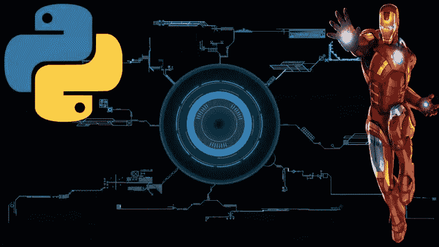
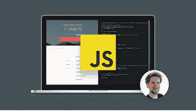
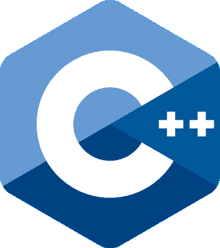
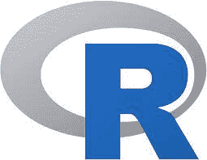

# 2023 年人工智能和深度学习的 Top 5 编程语言

> 原文：<https://medium.com/javarevisited/top-5-programming-language-for-artificial-intelligence-ai-and-machine-learning-fccd3e6da809?source=collection_archive---------3----------------------->

## 迷茫编程语言和 AI 哪个最好？这些是开始职业人工智能和机器学习的最佳编程语言。

你好，伙计们，如果你想做人工智能开发，或者想创建基于人工智能的应用，并寻找最好的编程语言，那么你来对地方了。早些时候，我已经分享了[web 开发的最佳编程语言](/javarevisited/top-5-programming-languages-for-web-development-in-2021-f6fd4f564eb6)、 [app 开发](/javarevisited/top-5-programming-languages-for-mobile-app-development-in-2021-19a1778195b8)和[数据科学开发](/javarevisited/top-5-programming-language-for-data-science-and-machine-learning-badc2f8eff72)，今天，我将分享深度学习和人工智能开发的最佳编程语言。

人工智能(AI)和深度学习是科技领域最热门的两个话题。从语音助手到自动驾驶汽车，人工智能和深度学习已经在改变我们所知道的世界。

随着对这些技术的需求越来越大，开发者为 AI 和深度学习选择正确的编程语言至关重要。

在这篇文章中，我们将讨论 2023 年开发者应该学习的五大 AI 和深度学习编程语言。我们将探讨每种语言的特点、优缺点，以帮助您做出明智的决定。

所以，如果你对人工智能和深度学习感兴趣，请继续阅读，了解哪种编程语言适合你。

所有的编程语言都不是生来平等的。在不计其数的编程语言中，只有少数保留下来并为社区服务。我们即将讨论的编程语言经受住了时间的考验。几十年来，它们被用于各种各样的事业。

在人工智能/机器学习领域，几种编程语言正在产生很大的影响。以下是你应该学习的编程语言。你可以从 Udemy 网站学习这些语言，该网站根据你的水平和喜好提供成千上万的课程。

如果你是一个完全的人工智能初学者，那么我也建议你首先通过吴恩达的经典 [**人工智能为每个人**](https://coursera.pxf.io/c/3294490/1164545/14726?u=https%3A%2F%2Fwww.coursera.org%2Flearn%2Fai-for-everyone) 课程来学习人工智能的基础知识，并大致了解什么是人工智能以及它能为你和你的业务做什么。在 Coursera 上学习人工智能是一个很棒的课程，适合来自不同领域和技术的人。

 [## 面向所有人的人工智能

### 人工智能不仅仅是工程师的专利。如果你想让你的组织在使用人工智能方面变得更好，这是一门课程告诉…

coursera.pxf.io](https://coursera.pxf.io/c/3294490/1164545/14726?u=https%3A%2F%2Fwww.coursera.org%2Flearn%2Fai-for-everyone) 

# 5 人工智能开发的最佳编程语言

虽然有许多编程语言可以用于人工智能开发，但拥有强大的库、在线支持、巨大的社区和不断增长的用户数量的语言并不多。基于这些标准，这是你可以用于人工智能开发的 5 种最好的编程语言。

## 1.计算机编程语言

在过去的几年里，Python 一直是创建人工智能和机器学习解决方案最容易接受和最受欢迎的语言。这个类别的大多数排名都把它放在第一位。Python 是人工智能工程师中最受欢迎的选择，因为它比其他任何东西都更加用户友好。

然而，它是一种高性能和广泛使用的编程语言，能够为广泛的活动和平台执行复杂的过程。

另一个要考虑的好处是来自图书馆和在线社区的无止境的帮助。想象一下，使用 Tkinter GUI 框架，使用像 [NumPy](https://javarevisited.blogspot.com/2021/10/top-5-courses-to-learn-numpy-for-python.html) 和 SciPy 这样的机器学习库，你可以用 Python 构建桌面程序。

它包括一个机器学习框架，可以缩短从研究原型到生产部署的时间。你可以向 Udemy 的专家学习 Python，也可以根据自己的喜好进行搜索。

如果你需要推荐，那么 Udemy 上完整的 Python 训练营课程是一个很好的开始。Udemy 的这门课程不仅涵盖了 Python 编程语言的所有重要原理，还包括使用 Python 3 的在线指导。

超过 26k 人评论了该教程，平均评分为 4.4 星(满分 5 分)。成功完成热门的 Python 入门在线课程后，您将获得结业证书，就像其他 Udemy 课程一样。

## 2.Java 语言(一种计算机语言，尤用于创建网站)

Java 是世界上使用最广泛的编程语言之一。这是一种通用编程语言。因此它的适应性很强。由于其多功能性、易用性和广泛的支持，Java 在人工智能程序员中越来越受欢迎。

Java 对大型项目(这在 AI/ML 中至关重要)、可视化、调试和无缝用户交互有着强大的支持。由于其庞大的在线社区，您可以随时获得帮助。Java 调试起来很简单。它出色的用户友好性和在各种平台上运行的灵活性使它成为软件开发人员的最爱。

Java 还是一种相对安全和可伸缩的语言，这使它成为大规模应用程序的绝佳选择。Java 的好处和易于学习的代码使它成为人工智能领域最优秀的编程语言之一。

你可以从著名的 Coursera 网站学习 Java，该网站提供了数千门课程，你可以根据自己的水平选择一些课程。如果你需要推荐，那么 Udemy 的这个[**Java 大师班**](https://click.linksynergy.com/fs-bin/click?id=JVFxdTr9V80&subid=0&offerid=323058.1&type=10&tmpid=14538&RD_PARM1=https%3A%2F%2Fwww.udemy.com%2Fjava-the-complete-java-developer-course%2F) 课程是个不错的开始。这门课程将教你所有你需要知道的关于 Java 编程语言的知识。

它是 Java 专家的教学回顾和复习课程。您将学习如何利用图形用户界面(GUI)构建新的应用程序，以及如何设计包含大量数据的程序。

## 3.Java Script 语言

JavaScript 是一种脚本语言，在安全和动态网站上越来越常用。JavaScript 的人工智能技能主要集中在与其他源代码兼容的交互上，例如，Html 和 CSS。它可以处理前端和后端任务，包括从按钮到视频到数据存储的任何事情。

它有一些高级机器学习工具和库。它直接在浏览器中运行，并为开发人员提供了许多附加选项。它还允许用户在基于网络的仪表板上查看机器学习算法的结果。

如果你想学习 JavaScript，那么有很多选择，有免费的也有付费的，如果你需要推荐，那么你可以今天就加入这个由 Jonas Schmedtmann 在 Udemy 上开设的 [**JavaScript 课程。**](https://click.linksynergy.com/fs-bin/click?id=JVFxdTr9V80&subid=0&offerid=323058.1&type=10&tmpid=14538&RD_PARM1=https%3A%2F%2Fwww.udemy.com%2Fthe-complete-javascript-course%2F)

本课程涵盖了变量、循环、函数，甚至一点点关于调试工具的内容都在本课程中涉及。您将了解 JavaScript 如何使用文档对象模型(DOM)来识别和更改页面的特定组件，以及如何与之交互。

## 4.C++编程语言

C++ 是软件开发者中广泛使用的编程语言。C++是一种高级面向对象编程语言，执行时间比大多数其他语言都要快。这是因为它更类似于机器语言。

与其他编程语言相比， [C++](/javarevisited/top-10-courses-to-learn-c-for-beginners-best-and-free-4afc262a544e) 提供了更快的运行时间，使其成为机器学习的理想选择，在机器学习中，快速和一致的反馈至关重要。 [C++](/javarevisited/10-advanced-c-books-and-courses-for-experienced-programmers-a90c3942471a) 也为机器学习提供了很多库支持。

它在程序员中广泛使用，如果掌握了正确的技巧，相对容易学习和使用。Udemy C++课程对于学习 C++代码的学生来说总是小菜一碟，因为他们的老师是专家，可以快速地从头到尾教你 C++。

与 Java 和 Python 类似，学习 C++有很多资源，有免费的也有付费的，但是如果你需要推荐，那么 Udemy 的这个**[**c++编程入门——从初学者到超越**](https://click.linksynergy.com/deeplink?id=JVFxdTr9V80&mid=39197&murl=https%3A%2F%2Fwww.udemy.com%2Fcourse%2Fbeginning-c-plus-plus-programming%2F) 课程是一个很好的起点。**

**这是一门学习 C++的极好的课程，可以在 Udemy 上免费获得。本课程将教你如何从头开始用强大、快速、广泛使用的 C++编程语言编写程序，只需要对计算机有基本的了解。**

****

## **5.r 编程语言**

**r 是一种设计用来解决数字和统计问题的编程语言。刚出来的时候，粉丝不多。但随着人工智能的出现，机器学习和数据科学极大地提高了它的吸引力。**

**R 简单易学，特别是对于那些以前用另一种语言编写过代码的人来说。它不需要高水平的专业知识，因为它包括大量现成的包、库和资源，可以在软件开发过程的几乎每个阶段帮助您。**

**DPLYR 是一个复杂的包，在 R 中的数据操作过程中使用了简单的语法。这是一个开源程序，可以分析数据，显示趋势和变化，并协助预测。**

**你可以向 Udemy 博学的教授学习这种流行语言，并可以根据你的选择选择任何课程。如果你需要一个建议，那么这个 [**R 编程 A-Z:R 为数据科学提供真实的练习！**](https://click.linksynergy.com/deeplink?id=JVFxdTr9V80&mid=39197&murl=https%3A%2F%2Fwww.udemy.com%2Fcourse%2Fr-programming%2F) **i** s 非常适合初学者。**

**本课程将教你如何用 R 编写代码，以及如何使用 R 进行数据分析。您将学习如何为统计编程环境设置软件，以及如何在高级统计语言中使用通用编程语言思想。**

****

**这就是关于 AI 或人工智能开发的最佳编程语言的全部内容。虽然今天有几种编程语言可用于各种基于人工智能的解决方案，但我们必须记住，没有一种编程语言是人工智能的一站式商店。**

**因为当今的 IT 行业需要为每个项目制定独特的策略，所以在选择之前，您应该考虑哪一个最符合您的需求。**

**学习编程语言有几个好处。会提高你在 AI/机器学习领域找工作的几率。除此之外，您还可以在各种行业中使用这种才能，比如数据科学、企业软件开发、web 开发等等。**

**您可能想探索的其他**编程文章****

*   **[初学者学习数据科学的 10 门课程](https://hackernoon.com/10-machine-learning-data-science-and-deep-learning-courses-for-programmers-7edc56078cde)**
*   **[使用 Python 和 AI 构建聊天机器人的 5 大课程](https://javarevisited.blogspot.com/2019/12/want-to-build-chat-bots-using-ai.html)**
*   **[面向数据科学和机器学习的 8 大 Python 库](https://javarevisited.blogspot.com/2018/10/top-8-python-libraries-for-data-science-machine-learning.html)**
*   **[初学者学习 Python 的 5 大课程](https://hackernoon.com/top-5-courses-to-learn-python-in-2018-best-of-lot-26644a99e7ec)**
*   **[初学者学习 Python 的 10 门免费课程](https://hackernoon.com/10-free-python-programming-courses-for-beginners-to-learn-online-38312f3b9912)**
*   **[学习数据科学 Python 的 5 本书](https://javarevisited.blogspot.com/2019/08/top-5-python-books-for-data-science-and-machine-learning.html)**
*   **[10 份 Coursera 证书，开启云计算和数据科学职业生涯](/javarevisited/top-10-coursera-certificates-to-start-your-career-in-cloud-data-science-ai-mainframe-and-it-558690c83587)**
*   **[学习机器学习的 5 大免费课程](https://www.java67.com/2019/01/5-free-courses-to-learn-machine-and-deep-learning-in-2019.html)**
*   **[学习熊猫数据分析的 5 大课程](https://javarevisited.blogspot.com/2019/10/top-5-courses-to-learn-pandas-for-data-analysis-python.html)**
*   **【Java 开发人员可以学习的 10 项加速职业发展的技能**
*   **[学习和掌握编程的 6 本书](http://javarevisited.blogspot.in/2014/09/top-6-books-to-learn-programming-coding.html)**
*   **[成为更好的软件开发人员的 10 个技巧](http://javarevisited.blogspot.sg/2014/01/10-tips-to-improve-programming-skill-become-better-programmer.html)**
*   **[每个程序员都应该知道的 10 个面向对象设计原则](http://javarevisited.blogspot.sg/2012/03/10-object-oriented-design-principles.html)**
*   **[面向 Java 开发人员的 10 个多线程和并发性最佳实践](http://javarevisited.blogspot.com/2015/05/top-10-java-multithreading-and.html)**

**感谢您迄今为止阅读这篇文章。如果你喜欢请分享。如果你有任何其他对人工智能很好的编程语言，或者有语言支持，人工智能和机器学习的库和生态系统，那么请分享。**

**如果你是一个完全的人工智能初学者，那么我也建议你首先通过吴恩达的经典的**人工智能课程来学习人工智能的基础知识，并大致了解什么是人工智能以及它能为你和你的企业做什么。在 Coursera 上学习人工智能是一个很棒的课程，适合来自不同领域和技术的人。****

**** [## 面向所有人的人工智能

### 人工智能不仅仅是工程师的专利。如果你想让你的组织在使用人工智能方面变得更好，这是一门课程告诉…

coursera.pxf.io](https://coursera.pxf.io/c/3294490/1164545/14726?u=https%3A%2F%2Fwww.coursera.org%2Flearn%2Fai-for-everyone)****