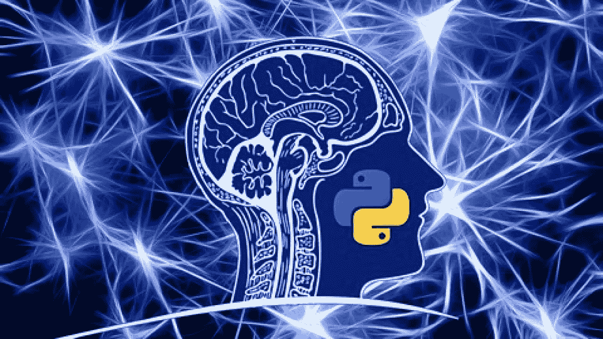
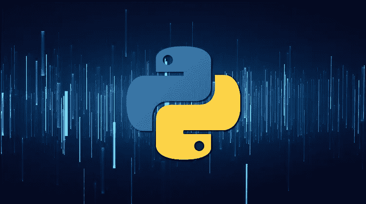
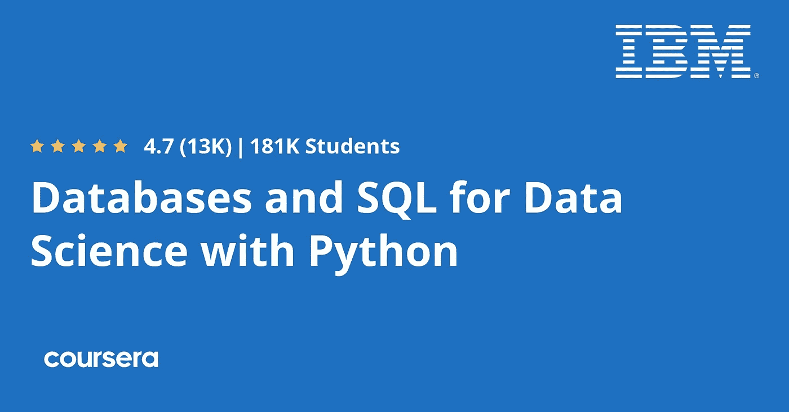
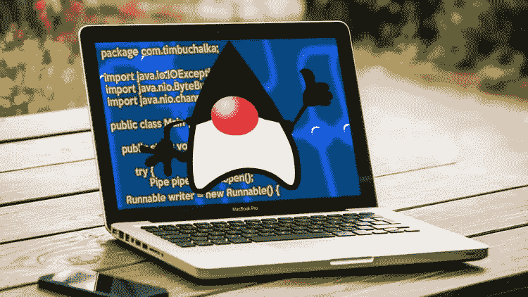
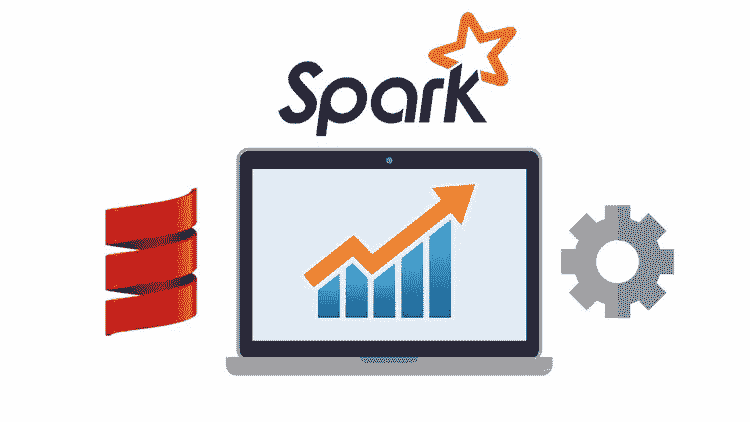

# 2023 年数据科学和机器学习的 5 大编程语言

> 原文：<https://medium.com/javarevisited/top-5-programming-language-for-data-science-and-machine-learning-badc2f8eff72?source=collection_archive---------0----------------------->

## 这些是数据科学和机器学习的最佳编程语言，包括 Python、R、SQL、Java 和 Scala

image_credit — Udemy

如果你想在 2023 年学习数据科学和机器学习，但不确定选择哪种编程语言，那么你来对地方了。之前我已经分享过， [**最佳数据科学初学者课程**](/javarevisited/my-favorite-data-science-and-machine-learning-courses-from-coursera-udemy-and-pluralsight-eafc73acc73f) 以及[免费数据科学](/javarevisited/10-free-data-science-online-courses-for-beginners-a5fe78c2cb7b)和[免费机器学习课程](/javarevisited/10-free-machine-learning-courses-for-beginners-181f83b4c816)，在这篇文章中，我将分享 2023 年你可以学习的数据科学和机器学习的最佳 *est 编程语言。*

数据科学是一个令人兴奋的领域，越来越多的程序员希望成为数据科学家，但一个经常困扰他们的问题是，他们应该为数据科学学习哪种编程语言？

他们中的许多人**在流行的数据科学编程语言之间感到困惑，如**[**Python**](https://javarevisited.blogspot.com/2020/05/why-python-is-best-programming-language.html)**和** [**R**](/javarevisited/10-best-r-programming-courses-for-data-science-and-statistics-8f84ebec4974) **，**以及一些像 Java 开发人员这样的人问我他们是否可以使用 [Java](/javarevisited/why-java-is-the-best-programming-language-to-learn-coding-for-beginners-cba79aed1271) 进行数据科学。

作为一个编程博客的作者，我已经问过这个问题很多次了，最后我想把我的想法写成一篇文章。

我分享最好的编程语言也有一段时间了，在过去，我分享了用于 web 开发的最好的编程语言**和 [**移动应用程序开发**](/javarevisited/top-5-programming-languages-for-mobile-app-development-in-2021-19a1778195b8) ，如果你还没有查看它们，那么如果你希望在 2023 年成为 web 开发人员或移动应用程序开发人员，你也可以查看它们。**

**为了选择数据科学的最佳编程语言，您需要首先了解数据科学家在日常工作中做些什么？因为这才是最重要。如果你选择了错误的语言，那么你的工作效率和表现将会受到影响，这会阻碍你的职业发展。**

**数据科学最常见的任务之一是获取数据、清理数据并对其进行处理，以便对其进行分析。通常情况下，你需要编写一个快速脚本来完成这项工作，为此，你需要一种[编程语言](/hackernoon/10-best-programming-languages-to-learn-in-2019-e5b05af4a972)，它拥有合适的工具，允许你用几行代码来完成这项工作。**

**同时，你也不想选择一种性能很差的编程语言，因为时间很关键，而且你经常需要处理大量的数据。如果你的脚本需要几天时间来处理数据，那就没什么用了。**

**记住所有这些事情，这里列出了数据科学的最佳编程语言。**

# **2023 年数据科学和机器学习的 5 种最佳编程语言**

**对于任何数据科学家或有志成为数据科学家的程序员来说，你可以使用下面的列表来*选择 2023 年机器学习和数据科学的正确和最佳编程语言。***

**除了分享每种编程语言的优缺点，我还分享了学习这些编程语言的有用资源，如在线课程和书籍。你可以用它们来获得必要的技能。**

## **1.python[数据科学最佳通用编程语言]**

**Python 是目前世界上排名第一的编程语言，原因有很多，但最重要的原因是它的多功能性。你可以学习 Python，在数据科学方面可以像在网页开发或游戏开发方面一样有效。**

**l *为数据科学*赢得 Python 的主要原因是其强大的库，如 [NumPy](/javarevisited/6-best-online-courses-to-learn-numpy-for-beginners-60120f611e06) 、 [Pandas](/javarevisited/5-best-free-pandas-courses-for-beginners-in-2022-d7dbe017b90c) 、 [TensorFlow](https://becominghuman.ai/top-10-courses-to-learn-tensorflow-for-machine-learning-in-2020-39a31e7cd84b) 、 [Scikit-learn](/javarevisited/5-best-scikit-learn-online-courses-for-machine-learning-and-data-science-6beb02e9cca0) 、 [MatplotLib](/javarevisited/5-best-matplotlib-online-courses-for-python-developer-and-data-scientist-9f3bf4359b86) 等等。**

**通过使用像 Pandas 这样的库，您可以轻松地清理您的数据并将它们转换成您需要的格式。使用 TensorFlow，您可以进行严肃的机器学习，并创建强大的模型。**

**简而言之， [Python 是数据科学的最佳编程语言](/javarevisited/5-reasons-to-learn-python-for-data-science-16a9d4c44d6d)，像 Jupyter 这样的工具也使与其他数据科学家的合作变得容易，因为你可以共享你的代码、你的模型并一起工作。**

**Python 也非常容易学习，这使得它非常适合初学者。如果你只想学习一门数据科学的编程语言，我建议你学习 Python，如果你需要资源，我推荐[**Python A-Z:Python For Data Science With Real exercise！**](https://click.linksynergy.com/deeplink?id=JVFxdTr9V80&mid=39197&murl=https%3A%2F%2Fwww.udemy.com%2Fcourse%2Fpython-coding%2F) 课程由基里尔·叶列缅科在 Udemy 上讲解。这是一门非常棒的学习 Python 的课程，重点是数据科学相关的任务和练习。**

****

## **2.r 编程语言[第二好]**

**r 是统计学、数学和数据科学领域的另一种流行的编程语言。它不像 Python 那样有多种用途，但它是一种特定领域的语言，非常适合数据科学和机器学习。**

**r 是更老的 S 编程语言的直接后代，它是用 C 和 Fortron 编写的，这意味着性能在这里不是真正的问题。R 非常适合数据科学的主要原因之一是因为它收集了大量用于定量和统计应用的软件包。**

**这包括神经网络，非线性回归，系统发育学，高级绘图，以及许多许多其他的。此外，像 R Studio 这样的工具使得使用 R 编程语言变得很容易。**

**您还可以使用**gg lot 2**库进行数据可视化，这对数据科学家来说非常重要。与 Python 相比，它有点难学，但它是数据科学和机器学习的最佳编程语言之一。**

**如果你想学习 R 编程语言，并且需要资源，那么我强烈推荐 Udemy 上的这个 [**R 编程 A-Z:R For Data Science 的真实练习**](https://click.linksynergy.com/deeplink?id=JVFxdTr9V80&mid=39197&murl=https%3A%2F%2Fwww.udemy.com%2Fcourse%2Fr-programming%2F) 课程。它既现代又全面，而且价格合理。**

****

## **3.SQL【必学】**

**SQL 代表结构化查询语言，它已经存在很长时间了。SQL 是一种声明式编程语言，是与关系数据库交互的标准语言。**

**这是任何程序员的另一项必备技能，但对数据科学家来说更重要。您可以使用 [SQL](/hackernoon/top-5-sql-and-database-courses-to-learn-online-48424533ac61) 来存储和加载数据库中的数据，也可以编写 SQL 查询和脚本来清理和转换数据。**

**限制 SQL 用于数据科学的唯一因素是其分析能力，因为除了聚合和求和、计数和平均数据、计算最大值和最小值之外，您的选择是有限的，但供应商实施，如 [PostgreSQL](/javarevisited/7-best-free-postgresql-courses-for-beginners-to-learn-in-2021-3bf369d73794) 、 [MySQL](/javarevisited/top-5-courses-to-learn-mysql-in-2020-4ffada70656f) ，Oracle 以更大的能力补充了它们。**

**无论你是学习 Python 还是 R，我都强烈推荐你学习 SQL，它不是很难，但是会给你很大的帮助，并且会为你服务很长一段时间。如果你需要资源，我建议你加入 Coursera 上的数据科学 课程的 [**SQL。这是一门很棒的课程，由加州大学戴维斯分校提供。**](https://click.linksynergy.com/deeplink?id=JVFxdTr9V80&mid=40328&murl=https%3A%2F%2Fwww.coursera.org%2Flearn%2Fsql-for-data-science)**

****

**顺便说一下，如果你觉得 Coursera 的课程很有用，因为它们是由世界各地知名的公司和大学创建的，我建议你加入 Coursera Plus 的订阅计划，它可以让你无限制地访问他们最受欢迎的课程、专业知识、专业证书和指导项目。**

** [## Coursera Plus |无限制访问 3000 多门在线课程

### 用 Coursera Plus 投资你的职业目标。无限制地访问 90%以上的课程、指导项目…

coursera.com](https://click.linksynergy.com/deeplink?id=JVFxdTr9V80&mid=40328&murl=https%3A%2F%2Fwww.coursera.org%2Fcourseraplus)** 

## **4.Java 语言(一种计算机语言，尤用于创建网站)**

**Java 是我最喜欢的编程语言，也是最流行但被低估的编程语言之一。Java 有很多让人喜欢的地方，它简单、易于阅读和编写，并且有巨大的社区支持。**

**你不可能坚持使用 Java，你肯定会遇到问题，但是只要把你的问题复制粘贴到谷歌上，你就会有大量的博客文章和答案来帮助你。**

**Java 在性能方面也很好，因为它与 C++相比已经有了很大的进步，并且因为它的低性能而受到嘲笑，现在有了先进的 JIT 和 JVM，Java 即使不比 C++更安全和高效，也是一样的。**

**说到数据科学，Java 也不甘落后。是的，当谈到生产力时，它不如 [Python](https://javarevisited.blogspot.com/2020/05/why-python-is-best-programming-language.html) 好，因为你不能真正用 Java 创建快速脚本，但是对于更大的项目，Java 用它的包提供了更好的组织。**

**还有相当多的机器学习和*数据*挖掘*库*可用于 *Java* 和其他 JVM 语言，如 DL4J 和 H2O，一个用 *Java* 编写的分布式 ML 框架，但可用于多种语言，包括 Scala、R 和 Python。**

**如果你是初学者，我强烈推荐你加入 Java，因为它是一种主流编程语言，你不仅可以将 Java 用于数据科学，还可以用于许多其他方面，比如后端开发。如果需要资源，我强烈推荐 Udemy 上的 [**软件开发者 Java 编程大师班**](https://click.linksynergy.com/deeplink?id=JVFxdTr9V80&mid=39197&murl=https%3A%2F%2Fwww.udemy.com%2Fcourse%2Fjava-the-complete-java-developer-course%2F) 。这个长达 8 小时的课程非常适合学习 Java。**

****

## **5.斯卡拉**

**Scala 是另一种 JVM 编程语言，拥有数据科学领域所需的高性能和可伸缩性。像 Apache Spark 这样的库确实让 Scala 成为大数据和数据科学的首选。**

**Scala 由 Martin Odersky 开发，于 2004 年发布，是一种 JVM 编程语言。它是一种多范式语言，支持面向对象和函数式方法。**

**Scala 的另一个好处是 Scala 代码被编译成 Java 字节码，并在一个 [JVM](/javarevisited/7-best-courses-to-learn-jvm-garbage-collection-and-performance-tuning-for-experienced-java-331705180686?source=---------8------------------) 上运行。这允许与 Java 语言本身的互操作性，使 Scala 成为一种非常强大的通用语言，同时也非常适合数据科学。**

**如果你想学习 Scala，需要一个资源，我强烈推荐这个[**Apache Spark with Scala——大数据动手！弗兰克·凯恩在 Udemy 上的课程。它既全面又现代，而且非常实惠，你只需花几美元就可以在 Udemy 上买到。**](https://click.linksynergy.com/deeplink?id=JVFxdTr9V80&mid=39197&murl=https%3A%2F%2Fwww.udemy.com%2Fcourse%2Fapache-spark-with-scala-hands-on-with-big-data%2F)**

****

**以上就是 2023 年数据科学的**最佳编程语言。对于任何认真研究数据科学的人来说，我强烈建议学习一个 **Python + SQL** 或者 **R + SQL** 的组合，这可能是数据科学家最好的编程语言组合。不建议 R 和 Python 都学。****

**同样，对于 Java 和 Scala 开发人员，我建议使用 Java 和 Scala 中可用的库，用于[大数据](/javarevisited/top-5-big-data-frameworks-java-developers-can-learn-in-2021-9a3e20437c8c)和[数据科学](https://javarevisited.blogspot.com/2020/12/udemy-course-review-data-science-bootcamp-course.html#axzz6hL5FIXGv)，它们不像 Python 那样容易和高效，但至少你不需要学习新的编程语言。如果可以，[学 Python](https://javarevisited.blogspot.com/2019/09/5-websites-to-learn-python-for-free.html) 。**

**最后，初学者应该从 Python 开始，没有比 Python 更好的语言来开始编码和编程，然后转向数据科学。**

**其他**数据科学和机器学习一篇**文章可能喜欢**

*   **[2023 年学习 Python 的 10 个理由](https://hackernoon.com/10-reasons-to-learn-python-in-2018-f473dc35e2ee)**
*   **[学习数据科学表格的前 5 门课程](https://javarevisited.blogspot.com/2019/07/top-5-tableau-online-courses-and-certifications-for-data-science-engineers.html)**
*   **[学习数据科学 Python 的 5 本书](https://javarevisited.blogspot.com/2019/08/top-5-python-books-for-data-science-and-machine-learning.html)**
*   **[学习机器学习的 5 大免费课程](https://www.java67.com/2019/01/5-free-courses-to-learn-machine-and-deep-learning-in-2019.html)**
*   **[面向初学者的 5 大机器学习算法](https://www.java67.com/2020/07/top-5-machine-learning-algorithms-for-beginners.html)**
*   **[面向程序员的 10 门机器学习和深度学习课程](https://hackernoon.com/top-5-courses-to-learn-python-in-2018-best-of-lot-26644a99e7ec)**
*   **[学习熊猫数据分析的 5 门最佳课程](https://becominghuman.ai/5-best-courses-to-learn-pythons-pandas-libary-for-data-analysis-and-data-science-34b62abb0e96)**
*   **[初学者学习数据科学的 10 门课程](https://hackernoon.com/10-machine-learning-data-science-and-deep-learning-courses-for-programmers-7edc56078cde)**
*   **[面向数据科学和机器学习的 8 大 Python 库](https://javarevisited.blogspot.com/2018/10/top-8-python-libraries-for-data-science-machine-learning.html)**
*   **[学习人工智能的 7 门最佳课程](/javarevisited/7-best-courses-to-learn-artificial-intelligence-in-2020-26d59d62f6fe)**
*   **[初学者学习 TensorFlow 的 5 大课程](https://hackernoon.com/top-5-tensorflow-and-ml-courses-for-programmers-8b30111cad2c)**
*   **[2023 年学习 Python 的 5 大课程](https://hackernoon.com/top-5-courses-to-learn-python-in-2018-best-of-lot-26644a99e7ec)**
*   **[为数据科学学习数学和统计学的 5 门课程](https://javarevisited.blogspot.com/2019/09/top-5-statistics-and-mathematics-course-for-data-science.html)**
*   **[学习高级数据科学的前 5 门课程](https://hackernoon.com/top-5-data-science-and-machine-learning-course-for-programmers-e724cfb9940a)**
*   **[初学者学习 Python 的 10 门免费课程](https://hackernoon.com/10-free-python-programming-courses-for-beginners-to-learn-online-38312f3b9912)**
*   **[程序员 10 大最佳 Coursera 课程和认证](https://javarevisited.blogspot.com/2020/08/top-10-coursera-courses-specilizations-and-certifications.html)**

**感谢您阅读本文。如果你觉得这个*数据科学和机器学习的最佳编程语言列表*有用，那么请与你的朋友和同事分享。如果您有任何问题或反馈，请留言。

**附言——**如果你现在只想做一件事，那么我建议你开始学习 Python，这将极大地帮助你的数据科学之旅，你可以通过参加[**Python A-Z:Python For Data Science With Real exercise 来实现这一点！课程由基里尔·叶列缅科在 Udemy，你不会后悔你的决定。**](https://click.linksynergy.com/deeplink?id=JVFxdTr9V80&mid=39197&murl=https%3A%2F%2Fwww.udemy.com%2Fcourse%2Fpython-coding%2F)**

** [## Python A-Z:具有真实练习的数据科学 Python！

### 我的名字是基里尔·叶列缅科，我非常高兴你能读到这封信！专业上，我是数据科学的…

udemy.com](https://click.linksynergy.com/deeplink?id=JVFxdTr9V80&mid=39197&murl=https%3A%2F%2Fwww.udemy.com%2Fcourse%2Fpython-coding%2F)**