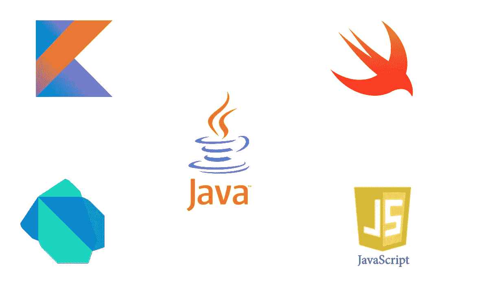
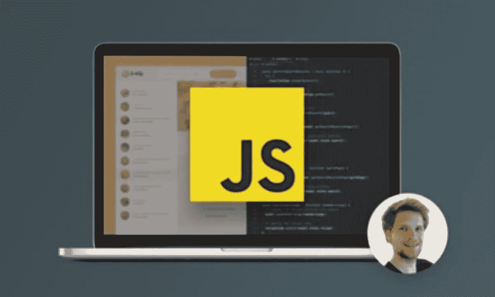
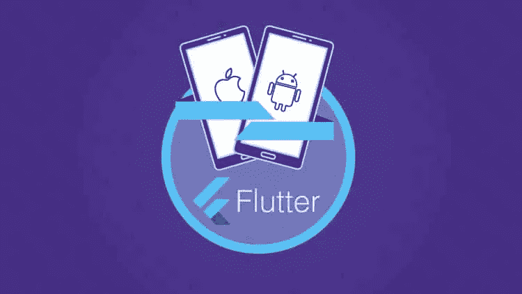

# 2023 年移动应用开发的五大编程语言

> 原文：<https://medium.com/javarevisited/top-5-programming-languages-for-mobile-app-development-in-2021-19a1778195b8?source=collection_archive---------0----------------------->

## 2023 年最强大的移动应用程序开发语言列表，适用于初学者和有经验的程序员。

图片 _ 来源—作者

如果你想在 2023 年成为一名移动应用开发者，但不确定选择哪种编程语言来开始你的应用开发生涯，那么你来对地方了。

早些时候，我已经分享了学习 Flutter 和 [React Native](/javarevisited/top-5-react-native-courses-for-mobile-application-developers-b82febdf8a46?source=---------112------------------) 的[最佳和免费课程，这是两个最受欢迎的移动应用程序开发框架，在本文中，我将分享开始您的应用程序开发生涯的最佳编程语言。](/javarevisited/my-favorite-flutter-and-dart-programming-courses-for-beginners-9e8355710d78)

随着对移动应用程序的需求与日俱增，对应用程序开发人员的需求也在增加。随着大公司和小公司都在招聘应用程序开发人员来开发他们的移动应用程序，对拥有 [Android](/hackernoon/top-5-courses-to-learn-android-for-java-programmers-667e03d995b4) 和 [iOS 应用程序开发](/javarevisited/top-5-online-courses-to-learn-ios-12-swift-in-2019-a35ae1be7b2b)技能的人需求很大。

老实说，很长一段时间以来，应用程序开发一直是一个利润丰厚的职业。它始于 J2ME 和诺基亚时代，但真正繁荣是在 Android 和 iOS 时代。

虽然有很多编程语言，但并不是每个人都适合应用程序开发，这就是为什么知道有哪些选择并选择最佳编程语言很重要，这不仅可以帮助你为 Android 和 iOS 创建应用程序，还可以成为一名更全面的应用程序开发人员。

对于有抱负的应用程序开发人员来说，有很多选择可以用来开始应用程序开发，比如您可以使用 Java 和 Kotlin 开始 Android 开发，或者您可以使用 Swift 为 iPhone 和 iPad 开发 iOS 应用程序，或者您可以使用 JavaScript 和 React Native 等主流语言来创建 Android 和 iOS 的跨平台应用程序。

如果你赶时间，只想现在就开始，我的建议是从 JavaScript 和 React Native 开始，这是 2023 年最受欢迎的两项技术。

如果需要资源，我推荐 Udemy 上 Stephen Grider 的[**React Native——实用指南【2023 版】**](https://click.linksynergy.com/deeplink?id=JVFxdTr9V80&mid=39197&murl=https%3A%2F%2Fwww.udemy.com%2Fcourse%2Freact-native-the-practical-guide%2F) 课程。这是 2023 年学习 JavaScript 和 React Native 应用程序开发的综合和最新资源之一。

 [## React Native 实用指南:构建 iOS/Android 应用

### 本课程已完全更新，现在不仅涵盖 React Native 的最新版本，还包括…

udemy.com](https://click.linksynergy.com/deeplink?id=JVFxdTr9V80&mid=39197&murl=https%3A%2F%2Fwww.udemy.com%2Fcourse%2Freact-native-the-practical-guide%2F) 

# 2023 年应用程序开发的 5 种最佳编程语言

现在，作为应用程序开发人员，您已经对可用的不同选择有了基本的概念，让我们深入了解哪种编程语言最适合 2023 年的移动应用程序开发

## 1.Java Script 语言

信不信由你，JavaScript 是网络的头号语言。像 [jQuery](https://www.java67.com/2018/04/top-5-free-jquery-courses-for-web-developers.html) 、 [Angular](/javarevisited/top-10-free-courses-to-learn-angular-framework-in-2020-bb62148c73d3) 、 [Vue](https://javarevisited.blogspot.com/2019/08/top-5-online-courses-to-learn-vue.js-best.html) 、 [Svelte](https://javarevisited.blogspot.com/2020/05/top-3-courses-to-learn-sveltejs-in-2020.html) 和 [React.js](/javarevisited/top-10-free-courses-to-learn-react-js-c14edbd3b35f) 这样的框架的兴起让 JavaScript 更加流行。因为你就是离不开网络，所以学习 JavaScript 越早越好。

JavaScript 最好的一点是它是一种真正的全栈开发语言，你可以使用 JavaScript 创建前端 GUI、后端服务器，甚至移动应用。

React Native 是一个流行的 JavaScript 框架，允许您为 Android 和 iOS mobile 开发跨平台的应用程序。我强烈推荐您选择 JavaScript，因为它具有普遍的吸引力和受欢迎程度。优秀的 JavaScript 开发人员有很多工作可以做。

如果你决定在 2023 年学习 JavaScript，那么这个 [**JavaScript 大师班**](https://click.linksynergy.com/fs-bin/click?id=JVFxdTr9V80&subid=0&offerid=323058.1&type=10&tmpid=14538&RD_PARM1=https%3A%2F%2Fwww.udemy.com%2Fthe-complete-javascript-course%2F) 就是一个绝佳的入手点。这是一门从零开始学习 JavaScript 的项目课程。

如果你选择了 JavaScirpt，我也推荐你学习 React Native 进行 app 开发，如果你需要一门课程那么我推荐 Udemy 上 Stephen Grider 的[**React Native——实用指南【2023 版】**](https://click.linksynergy.com/deeplink?id=JVFxdTr9V80&mid=39197&murl=https%3A%2F%2Fwww.udemy.com%2Fcourse%2Freact-native-the-practical-guide%2F) 课程。

 [## React Native 实用指南:构建 iOS/Android 应用

### 本课程已完全更新，现在不仅涵盖 React Native 的最新版本，还包括…

udemy.com](https://click.linksynergy.com/deeplink?id=JVFxdTr9V80&mid=39197&murl=https%3A%2F%2Fwww.udemy.com%2Fcourse%2Freact-native-the-practical-guide%2F) 

而且，如果你不介意从一些免费资源中学习，那么你也可以看看这个为初学者提供的[免费 JavaScript 课程列表](/javarevisited/12-free-courses-to-learn-javascript-and-es6-for-beginners-and-experienced-developers-aa35874c9a32)。

## 2.Java 语言(一种计算机语言，尤用于创建网站)

Java 是另一种流行的、强大的、有效的编程语言，有很多工作和职业发展的需求。虽然 Java 主要是一种服务器端编程语言，用于创建健壮的后端服务器，但是您也可以使用 Java 编程语言来创建 Android 应用程序。

对于想成为应用程序开发人员的初学者来说，学习 Java 有很多好处。你不仅可以开发 Android 应用，还可以通过在 Java 中创建后端成为一名全栈开发者。

因为我是一名 Java 开发人员，所以我有点偏见，但是基于我 15 年的 Java 经验，我可以说学习 Java 是我做出的最好的决定，这就是为什么我建议每个初学者学习 Java，即使是为了应用程序开发。

如果你想学习 Java 并且需要一个资源，那么 [**完整的 Java MasterClass**](https://click.linksynergy.com/fs-bin/click?id=JVFxdTr9V80&subid=0&offerid=323058.1&type=10&tmpid=14538&RD_PARM1=https%3A%2F%2Fwww.udemy.com%2Fjava-the-complete-java-developer-course%2F) 是一个很好的起点；它是深入学习 Java 的全面和最新的资源。

而且，如果你需要一些免费的在线课程，那么你也可以看看这个为初学者提供的免费 Java 课程列表。

## 3.迅速发生的

如果你正在考虑 iOS 开发，比如为 iPhone 和 iPad 制作应用，那么你应该在 2023 年认真考虑学习 Swift。

它取代 Objective C 成为开发 iOS apps 的首选语言。我喜欢 Swift 语言，因为它让我想起 Python，也是 iOS 的官方编程语言，这足以学习 Swift 编程语言。

以下是 swift 编程语言的一些优点

1.  Swift 有一个很棒的 IDE，叫做 Xcode，它是自包含的，如果你包含一个库，使用工作区是没有痛苦的。
2.  Swift 是一种类型安全的语言，易于阅读、理解和编码，并且在编译时可以捕捉大多数初学者的错误。
3.  Swift 可以应用于服务器工作。这仍然是一个新概念，根据你的工作地点不同，增加难度有点困难，因为大多数公司都有自己的框架，或者使用大的框架

虽然这一切都很棒，但有一点值得一提的是，找到一份初级开发人员的工作或你的第一份工作很难，真的很难。这是 Java 和 JavaScript 真正胜过 swift 的地方，但这也不是不可能的，Swift 的开发者报酬很高。

如果你想学习 Swift，需要资源，我强烈推荐你加入[**iOS&Swift——完整的 iOS App 开发训练营**](https://click.linksynergy.com/deeplink?id=JVFxdTr9V80&mid=39197&murl=https%3A%2F%2Fwww.udemy.com%2Fcourse%2Fios-13-app-development-bootcamp%2F) ，这是我上个月买的 Udemy 的另一门优秀课程。

如果你不介意从免费资源中学习，那么你也可以看看这个[免费 iOS 课程](https://javarevisited.blogspot.com/2018/11/5-free-ios-app-development-courses-for.html)的列表，以获得更多选择。

## 4.科特林

如果你正在认真思考 Android 应用程序开发，那么 Kotlin 是 2023 年要学习的编程语言。这可能是 Android 世界发生的下一件大事。

即使 Java 是我的首选语言，Kotlin 也有原生支持，许多 ide 如 [IntelliJ IDEA](https://itnext.io/top-5-intellijidea-and-android-studio-courses-for-java-and-android-programmers-afcc27309b60) 和 [Android Studio](https://dzone.com/articles/top-5-intellij-idea-and-android-studio-courses-for) 都支持 Kotile 进行 Android 开发。

以下是学习 Kotlin 进行应用程序开发的一些利弊:

赞成的意见

1.  具有现代特征的清晰简洁的语言。
2.  允许您使用 lambdas 进行函数式编程
3.  类型安全
4.  检查异常
5.  良好的工具和社区支持。

虽然 Koltlin 被吹捧为下一代 Java，但它还没有出现。编译速度比 Java 慢 2-3 倍(增量编译适用于 IDEA，但不适用于 Gradle)

学习 Kotlin 的最大好处是，它是 Android 应用开发的官方应用开发语言，谷歌将继续推广它。

如果你想在 2023 年学习 Kotlin 进行 app 开发，那么 [**完整的 Android Kotlin 开发者课程**](https://click.linksynergy.com/fs-bin/click?id=JVFxdTr9V80&subid=0&offerid=323058.1&type=10&tmpid=14538&RD_PARM1=https%3A%2F%2Fwww.udemy.com%2Fthe-complete-kotlin-developer-course%2F) 大概是最好的入门在线课程。

而且，如果你不介意从一些免费资源中学习，那么你也可以看看这个为初学者提供的[免费 Kotlin 课程列表](/javarevisited/7-free-courses-to-learn-kotlin-in-2020-327c3872c1e1)。

## 5.镖

Dart 是 Google 在 2011 年开发的一种开源、面向对象的通用编程语言。Dart 使用“C”风格的语法，并选择性地将其转换为 JavaScript。它用于客户端和服务器端 web 开发。Dart 还被用于本地和跨平台的移动开发。

我能想到的学习 Dart 的最重要的原因是因为 Flutter，这使得开发跨平台应用程序变得非常容易。如果想学 Flutter，建议你挑 Dart 编程语言。

以下是 Dart 编程语言的一些优点和缺点:

赞成的意见

*   当习惯于 C 风格的语法时容易学习
*   代码可以在网络和移动应用之间共享
*   超级友好和乐于助人的社区

骗局

*   可能需要编写许多 subs 和通用域包来支持核心域
*   后端(API/服务器)关注度目前非常低

如果你选择在 2023 年学习 Dart 进行应用开发，那么我强烈推荐你加入 Udemy 上的这个[**Flutter&Dart——完全指南【2023 版】**](https://click.linksynergy.com/deeplink?id=JVFxdTr9V80&mid=39197&murl=https%3A%2F%2Fwww.udemy.com%2Fcourse%2Flearn-flutter-dart-to-build-ios-android-apps%2F) 课程。这个课程是由我最喜欢的导师之一，academy mind 的 Maximillian Schwarzmuller 创建的，它涵盖了 2023 年的颤振和飞镖。

而且，如果你不介意从一些免费资源中学习，那么你也可以查看一下这个为初学者提供的[免费 Flutter 和 Dar 课程列表](/javarevisited/7-free-flutter-online-courses-to-build-android-and-ios-apps-in-2021-54c0c92f16f9)。

以上就是 2023 年 App 开发的 **5 种最佳编程语言**。你可以选择你想要的任何东西，但如果你问我，我建议你学习 Java 或 JavaScript，因为它们都是主流语言，也允许你开发应用程序。你不仅会成为一名应用程序开发大师，还会成为一名全栈开发人员，从而获得更高的薪水。

您可能喜欢的其他**应用开发文章**

1.  [每个程序员都应该学会的 10 项技能](/javarevisited/11-essential-skills-to-become-software-developer-in-2020-c617e293e90e?source=extreme_sidebar---------0-2----------------------)
2.  [应用开发的 10 大流行移动框架](https://javinpaul.medium.com/10-frameworks-and-libraries-mobile-application-developers-can-learn-in-2020-e0b91391cade)
3.  [我最喜欢的学习 iOS 应用开发的免费课程](https://dev.to/javinpaul/5-free-online-courses-to-learn-ios-app-development-1332)
4.  [2023 年我最喜欢的学习 Flutter 的免费课程](https://www.java67.com/2020/06/5-free-courses-to-learn-flutter-in-2020.html)
5.  [掌握 Android 应用开发的 5 大课程](/hackernoon/top-5-courses-to-learn-android-for-java-programmers-667e03d995b4)
6.  [学习 iOS 应用开发的 5 大课程](https://javarevisited.blogspot.com/2019/01/top-5-ios-developer-course-to-learn-ios.html#axzz6OmACrJ9M)
7.  [完整的 Web 开发者路线图](/javarevisited/the-2019-web-developer-roadmap-ab89ac3c380e)
8.  [完整的 React.js 开发者路线图](https://javarevisited.blogspot.com/2018/10/the-2018-react-developer-roadmap.html)
9.  [初学者的 15 门最佳 JavaScript 课程](/javarevisited/10-best-online-courses-to-learn-javascript-in-2020-af5ed0801645)
10.  [2023 年初学者学习 Java 的 10 门最佳课程](/javarevisited/top-5-java-online-courses-for-beginners-best-of-lot-1e1e240a758)
11.  [2023 年学习 iOS 和 Swift 的 5 大课程](/swlh/top-5-course-to-learn-ios-12-and-swift-4-in-depth-5a7351785f8d)

感谢您阅读本文。如果你发现这些编程语言对网络开发有用，那么请与你的朋友和同事分享。

如果您有任何问题或反馈，请留言。如果你有任何其他 Web 开发人员应该学习的编程语言，请随意发表评论。

**p . s .**——如果你是一个完全的初学者，并想在 2023 年成为一名应用程序开发人员，那么我强烈建议你加入 Udemy 上由 Stephen Grider 开设的[**React Native——实用指南【2023 版】**](https://click.linksynergy.com/deeplink?id=JVFxdTr9V80&mid=39197&murl=https%3A%2F%2Fwww.udemy.com%2Fcourse%2Freact-native-the-practical-guide%2F) 课程。这是 2023 年学习 JavaScript 和 React Native 应用程序开发的综合和最新资源之一。

 [## React Native 实用指南:构建 iOS/Android 应用

### 本课程已完全更新，现在不仅涵盖 React Native 的最新版本，还包括…

udemy.com](https://click.linksynergy.com/deeplink?id=JVFxdTr9V80&mid=39197&murl=https%3A%2F%2Fwww.udemy.com%2Fcourse%2Freact-native-the-practical-guide%2F)