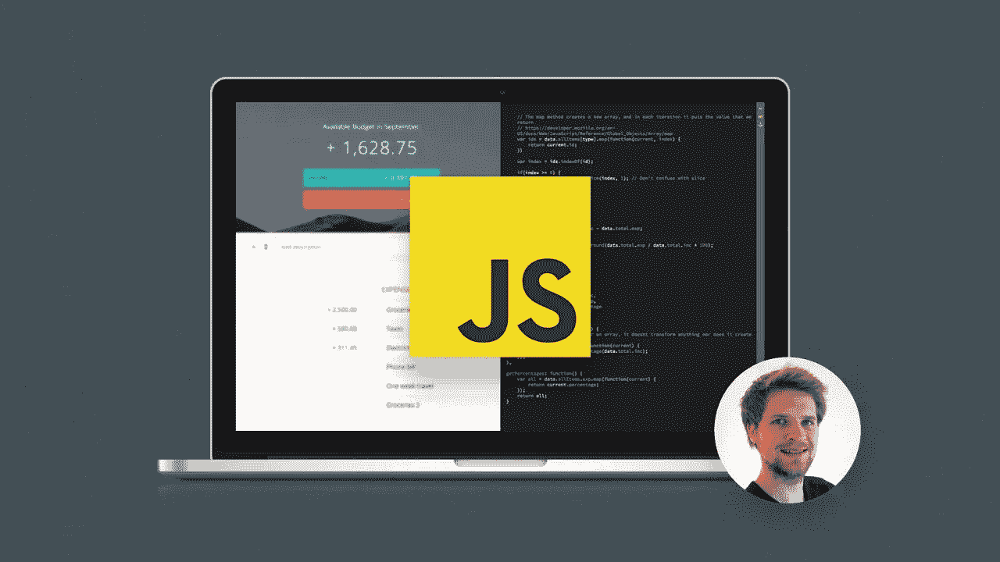
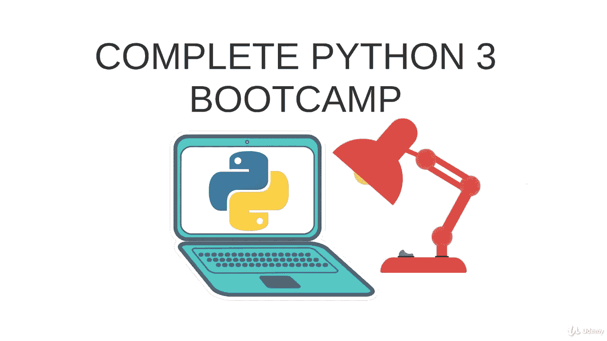

# 2023 年 Web 开发的五大编程语言

> 原文：<https://medium.com/javarevisited/top-5-programming-languages-for-web-development-in-2021-f6fd4f564eb6?source=collection_archive---------0----------------------->

## 2023 年想成为网页开发者？这里有 5 种你可以选择的编程语言

大家好，如果你想在 2023 年成为一名 web 开发人员，但不确定哪种编程语言最适合 web 开发，那么你来对地方了。之前我已经分享了[最佳 web 开发课程](/better-programming/my-5-favorite-courses-to-learn-web-development-in-2019-a5e74167f8b2)和 [web 开发者路线图](/javarevisited/the-2019-web-developer-roadmap-ab89ac3c380e)，今天我要讲的是 2023 年 *5 种最佳 web 开发编程语言*。是的，这包括 Javascript。

有一种说法是关于**“正确的工具用于正确的工作”**，它非常适用于编程语言。并不是所有的编程语言都设计得一样，这就是为什么它们并不适合所有的事情。

例如 [Java](/javarevisited/top-5-java-online-courses-for-beginners-best-of-lot-1e1e240a758) ，我最喜欢的编程语言非常适合编写服务器端代码，但是我不能用它进行前端开发。过去曾有过使用 Java 代码在 Servlet 和 JSP 中编写动态代码的尝试，但这带来的问题比解决的问题还多。

这就是了解不同的[编程语言](/hackernoon/10-best-programming-languages-to-learn-in-2019-e5b05af4a972)有助于你选择最适合你工作的编程语言的地方。例如， *Java 最适合创建后端*，但是 *JavaScript 最适合前端和后端*，毫无疑问，它是 web 开发的顶级编程语言。

因此，有了这个宣言，让我们深入探讨一下 2023 年 web 开发的 5 种最佳编程语言。如果你赶时间，只需要一个，我会推荐 JavaScript，如果你需要资源 [**完整的 JavaScript 课程:构建真实世界的项目**](http://bit.ly/2ytow1z)**Udemy 上的课程是学习 web 开发 JavaScript 的最佳课程。**

** [## 学习现代 Javascript(构建和测试应用)-完整课程

### 完全从零开始重建(65 小时视频)***“真的真的制作精良的球场。超级深入…

udemy.com](http://bit.ly/2ytow1z) 

# 2023 年 Web 开发的 5 种最佳编程语言

为了不浪费你更多的时间，这里列出了 web 开发的最佳编程语言，按照它们的重要性和受欢迎程度排序。

不过，你不需要学习所有这些编程语言，选择一个你喜欢的，符合你的要求。如果你被卡住或弄糊涂了，选择 JavaScript，因为你永远不会出错。

## 1.Java Script 语言

毫无疑问，JavaScript 是 web 开发之王，可能是 web 开发人员中最受欢迎的语言。它也是唯一允许你创建 web 应用程序的语言，包括前端、后端和移动应用程序。

JavaScript 的优势不仅在于它可以在使用 Nodejs 的浏览器和服务器上运行，还在于它为 web 开发和应用程序开发提供了出色的框架和库。

比如可以用[*React.js*](/@javinpaul/top-5-courses-to-learn-react-js-in-2019-best-of-lot-fa02cd96cdf0) 和 [*Angular*](/javarevisited/10-courses-to-learn-angular-for-web-development-6da1bd2856dc) 做前端，用[*Nodejs*](/javarevisited/top-10-online-courses-to-learn-node-js-in-depth-8ef0e31ca139)*做后端，React Native 做跨平台(Android 和 iOS 都可以)的移动应用。*

*如果你刚开始 web 开发生涯，那么我强烈推荐你在 2023 年学习 JavaScript，如果你需要资源，我推荐 [**完整的 Javascript 课程:构建一个真实世界的项目**](http://bit.ly/2ytow1z) 作者 Jonas Schmedtmannon Udemy。这是学习 JavaScript 最好的在线课程之一。*

**

*如果你需要更多的选择，你也可以看看这个为初学者准备的最佳 JavaScript 课程列表。*** 

## ***2. [Python](https://www.python.org/)***

***Python 是近年来广受欢迎的另一种语言。虽然它并不算新，而且已经通过了时间的考验，但它可能是目前最通用的编程语言。***

***您可以将 Python 用于 web 开发、数据科学、脚本编写和自动化。与 JavaScript 类似，Python 也享有巨大的社区支持，并拥有许多有用的框架、库和工具，可以帮助您快速创建 web 应用程序。***

***例如，您可以使用 [Django](/javarevisited/my-favorite-courses-to-learn-django-for-beginners-2020-ac172e2ab920) 来创建全栈 web 应用程序。如果你想要更多的控制，你也可以使用 [Flask](/javarevisited/5-best-python-flask-courses-for-beginners-2f262f8e23da) ，一个极简的 web 开发框架。***

***Python 也是学习编码的一种很好的编程语言，所以如果你是软件开发领域的新手，那么选择 Python 可以是一个很好的开始，不仅仅是对于 web 开发，对于整个编程生涯都是如此。现在，如果你需要 2023 年学习 Python 的资源，我强烈推荐 Udemy 上何塞·波尔蒂利亚的 [**完整 Python 训练营:从零到 Python 中的英雄**](http://bit.ly/2BY5LJC) 课程。***

******

***如果你需要更多的选择，你也可以看看他在 Medium 上为初学者列出的[最佳 Python 在线课程](/better-programming/top-5-courses-to-learn-python-in-2018-best-of-lot-26644a99e7ec)。***

## ***3.[打字稿](https://www.typescriptlang.org/)***

***TypeScript 是我个人最喜欢的，也是一种用于 web 开发的现代编程语言。就像我们有 [C](/javarevisited/10-best-c-programming-courses-for-beginners-2c2c1f6bcb12) 和 [C++](/javarevisited/top-10-courses-to-learn-c-for-beginners-best-and-free-4afc262a544e) 一样，TypeScript 也可以被认为是 *JavaScript++* 虽然它没有 C++流行。***

***TypeScript 的优点是它在 JavaScript 代码中增加了类型安全，这意味着您可以在开发阶段捕获讨厌的 JavaScript 类型相关错误。***

***它还使 JavaScript 开发面向对象的代码变得容易，TypeScript 的几个内置调试工具使 web 开发变得非常容易。***

***如果你必须在 2023 年选择一门现代编程语言来学习，我强烈建议你学习 TypeScript，如果你需要一个资源，Maximillian Scwarzmuller 和 AcadMind 的 [**理解 TypeScript**](https://click.linksynergy.com/deeplink?id=JVFxdTr9V80&mid=39197&murl=https%3A%2F%2Fwww.udemy.com%2Funderstanding-typescript%2F) 是 Udemy 上的一门很好的课程。***

******

***如果你需要更多的选择，这里有另一个列表，列出了一些最好的打字课程。***

## ***4. [PHP](https://www.php.net/)***

***我可能会因为将 PHP 列入 2023 年 web 开发最佳编程语言的名单而受到很多批评，但老实说，PHP 是创建 web 应用程序的最佳编程语言之一。***

***它是一种动态的服务器端脚本语言，使得创建全功能的 web 应用程序变得非常容易。如果这还不够的话，半个互联网都是在 PHP 的肩膀上运行的，还记得 WordPress 吗，最流行的网络应用软件就是在 PHP 上制作的。***

***PHP 也有像 [*Laraval*](/javarevisited/7-best-laravel-online-courses-for-beginners-and-php-developers-61deac95f6b4) 这样的框架，它既强大又允许你使用模型-视图-控制器架构模式快速创建 web 应用程序。***

***不要听那些说 PHP 没用的人，如果你觉得它很简单，就去学吧，如果你想在 2023 年学习 web 开发的 PHP，并且需要一个资源，我强烈推荐 [**PHP with Laravel for 初学者——成为 Udemy 的 Laravel**](https://click.linksynergy.com/deeplink?id=JVFxdTr9V80&mid=39197&murl=https%3A%2F%2Fwww.udemy.com%2Fcourse%2Fphp-with-laravel-for-beginners-become-a-master-in-laravel%2F) 课程的大师。深入学习 PHP 和 Laravel 的在线课程。***

******

***如果你需要更多的选择或免费的替代品，这里有另一个列表，列出了一些免费的 PHP 和 MySQL 课程。***

## ***5.[红宝石](https://www.ruby-lang.org/en/)***

***Ruby 是另一种非常适合 web 开发的编程语言。与 PHP 和 Python 类似，Ruby 对于初学者来说也是易学易粘的。***

***Ruby 对于 web 开发的特别之处在于 Ruby on Rails 框架，它为 Github、Shopify、Airbnb、Groupon、GoodReads 和 Kickstarter 等网站提供支持。***

***如果你不知道， *Rails* 是一个模型-视图-控制器(MVC)框架，为数据库、web 服务和网页提供默认结构。它鼓励并促进使用 web 标准，如用于数据传输的 JSON 或 XML，以及用于用户界面的 HTML、CSS 和 JavaScript***

***如果你想在 2023 年学习 Ruby 和 Ruby on Rails，我强烈推荐你在 Udemy 上查看由[罗布·珀西瓦尔](https://medium.com/u/479f328b80ac?source=post_page-----f6fd4f564eb6--------------------------------)主持的 [**完整的 Ruby on Rails 开发者**](https://click.linksynergy.com/deeplink?id=JVFxdTr9V80&mid=39197&murl=https%3A%2F%2Fwww.udemy.com%2Fcourse%2Fthe-complete-ruby-on-rails-developer-course%2F) 课程。学习使用 Ruby on Rails 进行 web 开发并释放您的创造力的最佳课程之一***

******

***而且，如果你需要更多的选择或免费的替代品，这里有一些免费的 Ruby on Rails 课程清单可以开始。***

## ***6.HTML 和 CSS***

***虽然 HTML 和 CSS 不是真正的编程语言(好吧，你们中的一些人可能不同意，但是的，它们不是编程语言)，但它们是 web 开发的支柱，每个 web 开发人员都必须学习它们。***

***HTML 提供了**结构**，而 CSS 提供了**风格**，并帮助它们看起来更好，更具视觉吸引力。如果你想成为一个严肃的前端开发者，那么你必须在 2023 年掌握这两个。***

***它们的好处是，你可以在几周内轻松掌握它们，而且它们也相对容易学习。***

***如果你需要一门课程，我强烈推荐 Jonas Schmedtmann Udemy 的 [**用 HTML5 和 CSS3**](http://bit.ly/2AHSpl6) 课程开始。它提供了学习现代网页设计、HTML5 和 CSS3 的最简单的方法，从一个庞大的项目开始一步一步地学习***

******

***如果你需要更多的选择，这里有另一个列表，列出了最好的 HTML 和 CSS 课程。***

***以上就是 2023 年**最好的 WEb 开发编程语言**。毫无疑问，JavaScript 是 Web 开发之王，但 Python 同样出色。PHP 和 Ruby 提供了创建 web 应用程序的最简单的方法，而 TypeScript 是相对较新的、现代的、有前途的编程语言，您可以学习它来创建 web 应用程序。***

***你可能喜欢的其他**网络开发文章*****

*   ***[学习 React 钩子和上下文 API 的 10 门免费课程](/javarevisited/top-10-free-courses-to-learn-react-js-c14edbd3b35f?source=extreme_main_feed----d3a191ac6ed-----5-1--------------------561c2dc6_a2b4_41e0_b7be_1d97edbf631c--8)***
*   ***[2023 年你可以学会的 10 种编程语言](http://www.java67.com/2017/12/10-programming-languages-to-learn-in.html)***
*   ***[2023 年开发运维工程师路线图](https://javarevisited.blogspot.com/2018/09/the-2018-devops-roadmap-your-guide-to-become-DevOps-Engineer.html#axzz61d5FPRru)***
*   ***[成为全栈式网络开发者的 10 门最佳课程](/javarevisited/top-10-online-courses-to-become-a-fullstack-web-developer-in-2020-d608a6b63232)***
*   ***[2023 年 Java 和 Web 开发人员应该学习的 10 个框架](http://javarevisited.blogspot.sg/2018/01/10-frameworks-java-and-web-developers-should-learn.html)***
*   ***[2023 年 Java 开发者路线图](https://javarevisited.blogspot.com/2019/10/the-java-developer-roadmap.html)***
*   ***[初学者学习 Nodejs 的十大课程](/javarevisited/top-10-online-courses-to-learn-node-js-in-depth-8ef0e31ca139)***
*   ***[2023 年学习打字稿的 10 门免费课程](/javarevisited/top-10-free-typescript-courses-to-learn-online-best-of-lot-44bce9da41d1)***
*   ***[2023 年 Java 程序员应该学会的 10 件事](https://javarevisited.blogspot.com/2017/12/10-things-java-programmers-should-learn.html#axzz5atl0BngO)***
*   ***[我最喜欢的学习角框架的课程](/javarevisited/10-courses-to-learn-angular-for-web-development-6da1bd2856dc)***
*   ***[初学者和有经验者的 15 门最佳 JavaScript 课程](/javarevisited/10-best-online-courses-to-learn-javascript-in-2020-af5ed0801645)***
*   ***[2023 年学习 HTML 5 和 CSS 的前 5 门课程](https://javarevisited.blogspot.com/2019/05/top-5-html-5-and-css-3-courses-for-web-developers.html)***
*   ***[2023 年要学习的 10 个 JavaScript 框架和库](https://www.java67.com/2019/01/top-10-javascript-frameworks-and-libraries-for-web-developers.html)***

***感谢您阅读本文。如果你发现这些编程语言对网络开发有用，那么请与你的朋友和同事分享。***

***如果您有任何问题或反馈，请留言。如果你有任何其他编程语言是一个 Web 开发者应该学习的，请随意发表评论。

**p . s .**——如果你不仅是网页开发的初学者，也是编程界的初学者，但你的目标是在 2023 年成为一名网页开发员，那么我也建议你加入 Udemy 网站上的[**2023 年网页开发训练营**](https://click.linksynergy.com/deeplink?id=JVFxdTr9V80&mid=39197&murl=https%3A%2F%2Fwww.udemy.com%2Fcourse%2Fthe-complete-web-development-bootcamp%2F) 课程。这是 2023 年学习 Web 开发的最全面和最新的资源之一。***

*** [## 完整的 2023 年网络开发训练营

### 欢迎来到完整的 Web 开发训练营，这是您学习编码并成为全栈 web…

udemy.com](https://click.linksynergy.com/deeplink?id=JVFxdTr9V80&mid=39197&murl=https%3A%2F%2Fwww.udemy.com%2Fcourse%2Fthe-complete-web-development-bootcamp%2F)***