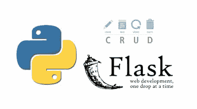
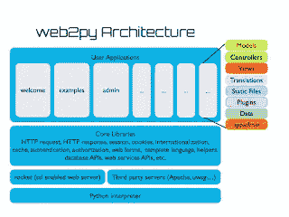

# 2023 年 Web 开发的 5 个基本 Python 框架

> 原文：<https://medium.com/javarevisited/top-5-python-frameworks-for-web-development-e034ebe85574?source=collection_archive---------0----------------------->

## Django、Flask、Bottle 和 Web2Py 是你可以学习的最好的 Python 框架，用于 Web 开发，并在 2023 年成为 Fullstack 开发人员

大家好，如果你想学习 Python 来进行 web 开发，并寻找最好的 Python 框架来进行 web 开发，那么你来对地方了。之前，我已经为初学者分享了 [**最佳 Python 课程**](/javarevisited/10-best-python-3-courses-on-udemy-ddd4e3ec5dbf)[书籍](/javarevisited/best-python-books-a93d1a0d842d)[项目](/javarevisited/8-projects-you-can-buil-to-learn-python-in-2020-251dd5350d56)和[网站](/javarevisited/10-free-python-tutorials-and-courses-from-google-microsoft-and-coursera-for-beginners-96b9ad20b4e6)，在这篇文章中，我将分享 web 开发的最佳 Python 框架。

Python 目前是编程语言之王，其中一个重要原因是它拥有令人敬畏的框架和库集合。就 web 开发而言，Python 可能是最强大、最活跃、最高效的框架。

Web 开发从来都不容易，因为你必须实现许多功能，如认证、授权、数据库连接、CRUD、处理支付等，但是像 [Django](https://javarevisited.blogspot.com/2020/07/top-5-courses-to-learn-django-in-2020.html) 和 [Flask](https://javarevisited.blogspot.com/2020/01/top-5-courses-to-learn-flask-for-web-development-with-python.html) 这样的框架确实可以很容易地快速创建 web 应用程序。

最初，我对 Python 不感兴趣，但最终，当我开始探索[机器学习](https://javarevisited.blogspot.com/2018/10/data-science-and-machine-learning-courses-using-python-and-R-programming.html)和[数据科学](https://javarevisited.blogspot.com/2018/03/top-5-data-science-and-machine-learning-online-courses-to-learn-online.html)时，我不得不加入 Python 的行列。

毫无疑问，Python 是头号编程语言，它在自动化、web 开发、机器学习和数据科学等领域得到了广泛应用。

近年来，随着越来越多的人开始学习 [Python 用于 Web 开发](/javarevisited/top-10-courses-to-learn-python-for-web-development-in-2020-best-of-lot-efe11fb6d212)和机器学习，Python 的受欢迎程度出现了爆炸式增长。如此受欢迎的一个重要原因是 Python 中可用的框架和库，这使得一切都变得容易。

用其他编程语言如 [Java](/javarevisited/10-best-places-to-learn-java-online-for-free-ce5e713ab5b2) 或 [C++](/javarevisited/10-advanced-c-books-and-courses-for-experienced-programmers-a90c3942471a) 需要 50 多行代码的任务，用 Python 只需 5 行代码就能完成。最重要的是，与其他主流编程语言如 [Java](http://www.java67.com/2018/08/top-10-free-java-courses-for-beginners-experienced-developers.html) 、 [C++](https://javarevisited.blogspot.com/2020/07/top-10-courses-to-learn-c-in-depth-best.html) 、 [C#](http://www.java67.com/2019/03/5-free-c-net-courses-to-learn-online.html) 或 [JavaScript](https://javarevisited.blogspot.com/2018/06/top-10-courses-to-learn-javascript-in.html) 相比，学习 Python 相对容易。如果您正在使用 Python 进行 web 开发，或者想要使用 Python 开发 Web 应用程序，但是不确定使用哪种框架，那么您来对地方了。

在这篇文章中，我将分享一些最好的 Web 开发 Python 框架，从像 Django 这样的全栈框架[到像 Cherry2Py 这样的极简框架。你很有可能已经熟悉了其中的一些框架，但是如果你还不熟悉，那么不要担心，因为我还会告诉你在哪里可以学习并获得足够的经验在你的项目中使用它们。

顺便说一句，如果你不了解 Python 或者刚开始以用 Python 开发 Web 应用为目的编码，我建议你去看看 Udemy 上的](https://javarevisited.blogspot.com/2019/01/10-web-development-frameworks-fullstack-developer-should-learn.html) [**完整的 Python Bootcamp**](https://click.linksynergy.com/deeplink?id=JVFxdTr9V80&mid=39197&murl=https%3A%2F%2Fwww.udemy.com%2Fcomplete-python-bootcamp%2F) 课程，这是学习 Python 编程联盟最受欢迎和最全面的课程之一。

 [## 初学者学习 Python 进行 Web 开发的 10 大课程——最好的

### Udemy、Pluralsight、Coursera 和 FreeCodecamp 提供的学习 Python 的最佳 Python 和 Django 在线课程…

medium.com](/javarevisited/top-10-courses-to-learn-python-for-web-development-in-2020-best-of-lot-efe11fb6d212) 

# 2023 年 Web 开发的 5 个最佳 Python 框架

这里是我为 Python 开发者列出的一些最好的 Web 开发框架。该列表包括全栈框架和微框架，允许您选择构建 web 应用程序所需的扩展。

## 1.姜戈

Django 是一个免费、开源、全栈的 Python 框架。您可以使用 Django 从头开始创建您的 web 应用程序。Django 的关键特性是它试图默认提供所有必要的特性，而不是作为单独的库提供。Django 的主要目标是简化复杂的、数据库驱动的网站的创建，这是大多数现代 Web 应用程序的特点。Django 还是一个非常快速、安全和可伸缩的框架，这使得它成为现代 web 应用程序的理想选择。如果你想进一步了解 Django，建议你去 Udemy 上的 [**Python 和 Django 全栈 Web 开发者 Bootcamp**](https://click.linksynergy.com/deeplink?id=JVFxdTr9V80&mid=39197&murl=https%3A%2F%2Fwww.udemy.com%2Fpython-and-django-full-stack-web-developer-bootcamp%2F) 课程。

这是学习 Django 最全面的课程之一，几乎有 7 万名学生在 Udemy 上相信了这一点，这真是太神奇了。它还在近 17，000 条评论中获得了平均 4.5 分的评分，这表明了它的质量。

## 2.瓶

Flask 是 BSD 许可下的另一个 Python 框架。它的灵感来自 Sinatra Ruby 框架。Flask 依赖于 Werkzeug WSGI 工具包和 **Jinja2 模板。**

[Flask](https://flask.palletsprojects.com/en/2.0.x/) 与 Django 相反，而 Django 将你需要的一切捆绑在一个包中，Flask 背后的主要思想是帮助构建一个坚实的 [web 应用](http://www.java67.com/2018/02/5-free-html-and-css-courses-to-learn-web-development.html)基础。从那里，您可以使用任何您可能需要的扩展。Flask 是轻量级的模块化设计，可以很容易地适应开发者的需求。它包括许多有用的开箱即用特性，如内置的开发服务器和快速调试器，以及对单元测试的集成支持。

如果你想了解更多关于 Flask 开发现实世界 web 应用的知识，请查看 Udemy 上的[**REST API with Flask 和 Python**](https://click.linksynergy.com/deeplink?id=JVFxdTr9V80&mid=39197&murl=https%3A%2F%2Fwww.udemy.com%2Frest-api-flask-and-python%2F) 课程。使用 Python 的 REST API 较好的课程之一。它还受到 30，000 多名学生的信任，在近 5300 条评论中平均得到 4.6 分，这令人印象深刻。

## 3.Web2Py

Web2py 是另一个流行的、可伸缩的、开源的全栈 Python 框架。Web2py 框架有许多令人喜欢的地方，因为它自带基于 Web 的 IDE，其中包括代码编辑器、调试器和一键部署。

这个 web 框架的缺点是 Web2py 不支持 Python 3，而 Python 3 是目前为止最流行的 Python 编程语言版本。

如果你想了解更多关于 Web2Py 的知识，我建议你去 Udemy 上的 [**用 Python 和 Web2py**](https://click.linksynergy.com/deeplink?id=JVFxdTr9V80&mid=39197&murl=https%3A%2F%2Fwww.udemy.com%2Fweb-engineering-with-python-and-web2py%2F) 学习有趣且有创意的 Web 工程课程。

学习 [Python](https://javarevisited.blogspot.com/2018/03/top-5-courses-to-learn-python-in-2018.html) 中的 Web2Py 框架是最好的课程之一，而且也是完全免费的，你不需要支付一分钱就可以加入这个课程。你所需要的只是一个 Udemy 账户，就这样。已经有超过 20，000 名学生从这门课程中受益，500 多条评论平均给它打了 4.0 分，这对于一门免费的在线课程来说是极好的。

## 4.金字塔

金字塔也是一个开源的基于 Python 的 web 开发框架。它的主要目标是以最小的复杂度做尽可能多的事情。如果你关注大型框架，为你做决定，但是如果你不符合他们的观点，你最终会纠结于他们的选择。另一方面，微框架不强制做出决定，这使得开始变得容易。但是随着应用程序的增长，您只能靠自己了。

金字塔最显著的特点是它能够很好地处理小型和大型应用程序。

金字塔框架就像是两全其美，我的意思是从 Django 这样的巨型框架到 Flask 和 Cherry2Py 这样的微框架。参见 Udemy 课程上的 [**Python 金字塔 Web Dev —初学者**](https://click.linksynergy.com/deeplink?id=JVFxdTr9V80&mid=39197&murl=https%3A%2F%2Fwww.udemy.com%2Fpython-pyramid-web-dev-beginners%2F) **s** 了解更多关于金字塔框架的信息。

## 5.瓶子

瓶子是另一个 [Python](https://hackernoon.com/top-5-courses-to-learn-python-in-2018-best-of-lot-26644a99e7ec) 微框架，很容易上手。最初是为了构建 API，Bottle 在一个源文件中实现了所有功能。

除了 Python 标准库，它没有依赖关系。用 Bottle 编码比用任何全栈框架编码更接近金属。它的默认特性包括路由、模板、实用程序和基于 WSGI 标准的基本抽象。可以进一步查看 [**Python — Bottle Web 框架**](https://click.linksynergy.com/deeplink?id=JVFxdTr9V80&mid=39197&murl=https%3A%2F%2Fwww.udemy.com%2Fpython-bottle-web-framework%2F) 课程，了解更多 Python 中的 Bottle Web 开发框架。

学习 Python Web 开发框架和 covers Bottle 又是一门极好的免费课程。这是一门相对较新的课程，但仍有 8000 多名学生注册了这门课程，并从中受益。

顺便说一句，不要忘记在加入前查看课程的价格因为，在 [*Udemy*](/javarevisited/my-favorite-udemy-online-courses-for-programmers-and-software-engineers-f9d941dd0035) 中，大部分免费课程一旦达到营销目标就转为付费，但一旦你加入课程，它将终身免费提供给你。

这就是今年程序员可以学习的一些最流行的 Python Web 开发框架**。Python 的选择余地很大，你可以根据自己的具体需求选择自己想要的。Django 是最好的通用，[全栈框架](https://javarevisited.blogspot.com/2019/01/10-web-development-frameworks-fullstack-developer-should-learn.html)，而 [Flask](https://javarevisited.blogspot.com/2020/01/top-5-courses-to-learn-flask-for-web-development-with-python.html) 是最好的微框架，可以让你选择想要的扩展。

其他**编程文章**你可能喜欢**

*   [2023 年学习 Python 的 10 个理由](https://javarevisited.blogspot.com/2018/05/10-reasons-to-learn-python-programming.html)
*   [2023 年 Java 程序员应该学会的 10 件事](https://javarevisited.blogspot.com/2017/12/10-things-java-programmers-should-learn.html#axzz5atl0BngO)
*   [来自谷歌和微软的免费 Python 教程](/javarevisited/10-free-python-tutorials-and-courses-from-google-microsoft-and-coursera-for-beginners-96b9ad20b4e6)
*   [2023 年你可以学习的 10 种编程语言](http://www.java67.com/2017/12/10-programming-languages-to-learn-in.html)
*   每个 Java 开发人员都应该知道的 10 个工具
*   [学习 Java 编程语言的 10 个理由](http://javarevisited.blogspot.sg/2013/04/10-reasons-to-learn-java-programming.html)
*   [2023 年 Java 和 Web 开发人员应该学习的 10 个框架](http://javarevisited.blogspot.sg/2018/01/10-frameworks-java-and-web-developers-should-learn.html)
*   [2023 年成为更好的 Java 开发人员的 10 个技巧](http://javarevisited.blogspot.sg/2018/05/10-tips-to-become-better-java-developer.html)
*   [2023 年需要学习的 5 大 Java 框架](http://javarevisited.blogspot.sg/2018/04/top-5-java-frameworks-to-learn-in-2018_27.html)
*   [8 个用于机器学习的 Python 库](https://javarevisited.blogspot.com/2018/10/top-8-python-libraries-for-data-science-machine-learning.html)
*   [每个 Java 开发人员都应该知道的 10 个测试库](https://javarevisited.blogspot.sg/2018/01/10-unit-testing-and-integration-tools-for-java-programmers.html)
*   [免费学习 Python 编码的五大网站](https://javarevisited.blogspot.com/2018/07/top-5-websites-to-learn-coding-in-java.html)

感谢您阅读本文。如果你喜欢这些*最好的 Python Web 开发框架*，那么请分享给你的朋友和同事。如果您有任何问题或反馈，请留言。

**P. S. —** 如果您是 Python 世界的新手，并且想在探索这些框架和寻找一些免费的东西开始之前学习 Python 编程语言，那么您也可以查看这个列表中的 [**10 门免费 Python 课程**](https://javarevisited.blogspot.com/2018/12/10-free-python-courses-for-programmers.html) 来深入学习 Python。

 [## 2023 年初学者在线学习的 15 门最佳免费 Python 课程

### 学习 Python 的一些免费在线课程的精选列表。

medium.com](/swlh/5-free-python-courses-for-beginners-to-learn-online-e1ca90687caf)