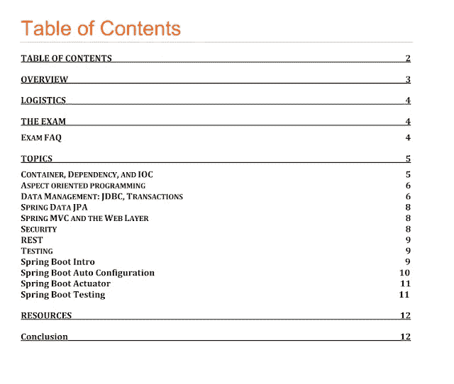
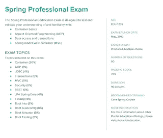

# 面向 Java 开发人员的 5 大春季专业认证考试资源

> 原文：<https://medium.com/javarevisited/top-5-spring-professional-certification-exam-resources-for-java-developers-3ef9fa42fe13?source=collection_archive---------0----------------------->

## 准备春季专业认证？这些书籍、课程和模拟测试可以帮助你。

自从 Pivotal 宣布 [Spring 培训不是成为 Pivotal 认证 Spring 开发人员的强制](http://www.java67.com/2017/06/is-it-possible-to-take-spring-certification-without-training.html)后，越来越多使用 Spring 多年的经验丰富的 Java 程序员正在准备这项久负盛名的认证。

这是显而易见的，因为昂贵的 Spring 培训，在美国和大多数西方国家花费大约 **32000 美元**，在印度花费大约 50000 印度卢比，是获得 Spring 认证的最大障碍。

尽管培训是准备认证的最佳方式，因为它完全专注于认证考试，并且您将涵盖所有主题，但对于世界上大多数 Java 开发人员来说，这是负担不起的。现在，春季认证的[费用已经从之前高达 3200 美元降低到 200 美元。允许 Java 开发人员无需强制性培训即可参加 Spring 认证的举措也鼓励了流行的自学模式，这种模式非常流行，因为即使是传统的 Oracle Java 认证也是以此为基础的。](http://javarevisited.blogspot.sg/2017/06/what-is-cost-of-spring-framework-certification-training-India-USA.html)

它允许程序员按照自己的节奏准备，而且也不是很贵。你所需要的只是一本[学习指南](http://javarevisited.blogspot.sg/2017/06/2-books-to-prepare-for-spring-certification-exam.html#axzz4jK9IIH4S)和一个[春季模拟考试模拟器](https://www.certification-questions.com/practice-exam/spring/professional?affiliateCode=fcff36fd-557a-4713-abf6-973e9924770f&utm_source=Javin&utm_medium=affiliate&utm_campaign=affiliate)。

 [## 春季专业实践考试和春季专业实践考试

### 春季专业实践考试和春季专业实践考试:真正的春季专业…

www.certification-questions.com](https://www.certification-questions.com/practice-exam/spring/professional?affiliateCode=fcff36fd-557a-4713-abf6-973e9924770f&utm_source=Javin&utm_medium=affiliate&utm_campaign=affiliate) 

即使你可以使用 [Spring 框架书籍](http://javarevisited.blogspot.sg/2013/03/5-good-books-to-learn-spring-framework-mvc-java-programmer.html)来准备认证，学习指南也是非常必要的。学习指南比一般的书籍有很多好处，比如它们专注于认证考试。它们完全涵盖所有主题，并有针对主题的评估问题。从考试的角度来看，他们在突出关键概念方面也做得很好。如果你想在[春季认证](https://javarevisited.blogspot.com/2018/08/how-to-crack-spring-core-professional-certification-exam-java-latest.html#axzz5j90KOik7)上取得好成绩，你必须为你的准备选择一个学习指南和一门课程，你会在这篇文章中找到大量优秀的资源。

# 春季专业认证考试资源

不幸的是，没有太多的资源可用于准备 Spring 认证，因为与 Oracle 的 [Java 认证](/javarevisited/my-favorite-books-and-courses-to-pass-java-se-8-certification-ocajp-8-and-ocpjp-8-b657a195aa07)相比，Spring 认证仍然没有那么受欢迎。其中一个原因是一些开发人员选择 Spring 认证，因为昂贵的[强制培训](http://javarevisited.blogspot.sg/2017/05/can-you-take-spring-certification-without-training-course.html)。

现在限制解除了，你可以期待更多的学习指南、书籍和模拟考试来帮助 Spring 开发者自己准备 Spring 认证。

顺便说一句，如果你是一名经验丰富的 Java 开发人员，并且使用了 [Spring 框架](/javarevisited/10-advanced-spring-boot-courses-for-experienced-java-developers-5e57606816bd?source=collection_home---4------0-----------------------)几年，并且你认为不需要太多准备就可以通过 Spring 认证，我建议你先去参加**大卫·梅尔的** [**在线 Spring 模拟测试**](https://www.certification-questions.com/practice-exam/vmware/edu-1202?affiliateCode=fcff36fd-557a-4713-abf6-973e9924770f&utm_source=Javin&utm_medium=affiliate&utm_campaign=affiliate) ，这是一个**免费测试**，如果你能获得 80%以上的分数，那么你就为真正的考试做好了准备。

反正这里有几个目前市面上有的**有用的春季认证**学习指南和在线培训课程。该列表包括 Spring core、Spring web 和 Spring Enterprise Integration 认证的学习指南。

## 1.[春季职业认证考试教程](https://click.linksynergy.com/deeplink?id=JVFxdTr9V80&mid=39197&murl=https%3A%2F%2Fwww.udemy.com%2Fcourse%2Fspring-certified-tutorial%2F)

这是 Udemy 上的一门优秀课程，专门针对春季认证，目前。这是一个多部分的课程，每个部分涵盖一个模块，有 8 个模块准备春季认证。

本课程讲解并回答**春季职业认证学习指南**中的所有问题。考试题目的每个答案都有详细的解释，包括视频教程、描述和一个很好的例子，让你对所讨论的题目有更深的理解。

通过本课程，您将获得通过春季专业认证考试所需的所有知识和技能。

**以下是加入本课程的链接—** [**春季职业认证考试教程**](https://click.linksynergy.com/deeplink?id=JVFxdTr9V80&mid=39197&murl=https%3A%2F%2Fwww.udemy.com%2Fcourse%2Fspring-certified-tutorial%2F)

本课程分为 8 个模块:

*   模块 01 — [容器、依赖关系和 IoC](https://click.linksynergy.com/deeplink?id=JVFxdTr9V80&mid=39197&murl=https%3A%2F%2Fwww.udemy.com%2Fcourse%2Fspring-certified-tutorial%2F)
*   模块 02 — [面向方面编程](https://click.linksynergy.com/deeplink?id=JVFxdTr9V80&mid=39197&murl=https%3A%2F%2Fwww.udemy.com%2Fcourse%2Fspring-professional-certification-exam-tutorial-module-02%2F)
*   模块 03 — [数据管理:JDBC、交易、JPA、春季数据](https://click.linksynergy.com/deeplink?id=JVFxdTr9V80&mid=39197&murl=https%3A%2F%2Fwww.udemy.com%2Fcourse%2Fspring-professional-certification-exam-tutorial-module-03%2F)
*   模块 04 — [Spring Boot](https://click.linksynergy.com/deeplink?id=JVFxdTr9V80&mid=39197&murl=https%3A%2F%2Fwww.udemy.com%2Fcourse%2Fspring-professional-certification-exam-tutorial-module-04-spring-boot%2F)
*   模块 05 — [Spring MVC 和 Web 层](https://click.linksynergy.com/deeplink?id=JVFxdTr9V80&mid=39197&murl=https%3A%2F%2Fwww.udemy.com%2Fcourse%2Fspring-professional-certification-exam-tutorial-module-05%2F)
*   模块 06 — [安全性](https://click.linksynergy.com/deeplink?id=JVFxdTr9V80&mid=39197&murl=https%3A%2F%2Fwww.udemy.com%2Fcourse%2Fspring-professional-certification-exam-tutorial-module-06%2F)
*   模块 07 — [休息](https://click.linksynergy.com/deeplink?id=JVFxdTr9V80&mid=39197&murl=https%3A%2F%2Fwww.udemy.com%2Fcourse%2Fspring-professional-certification-exam-tutorial-module-07%2F)
*   模块 08 —测试

这是整个课程的第一个模块，在里面，您可以找到 Spring Professional Certification Study Guide 的第一部分(容器、依赖关系和 IoC)中所有主题的答案。

## 2.[官方春季专业考试学习指南](https://d1fto35gcfffzn.cloudfront.net/academy/Spring-Professional-Certification-Study-Guide.pdf)

这是 Pivotal 自己提供的 Spring Core Professional Certification version 5 的免费学习指南。它包含一些常见问题和有关考试本身的信息。

它还包括测试你是否知道基本概念的谜题。这些春季问题也是面试的绝佳资源。

如果你已经使用 Spring 几年了，那么你已经知道大多数问题的答案了。它们也有助于快速检查您是否准备好接受 Spring 认证，因为 Spring 认证的通过率非常高。你需要从 50 道题中答对 38 道才能通过春季认证。

总的来说，如果你能和大卫·梅耶尔在线 [**春季专业转储**](https://www.certification-questions.com/practice-exam/spring/professional?affiliateCode=fcff36fd-557a-4713-abf6-973e9924770f&utm_source=Javin&utm_medium=affiliate&utm_campaign=affiliate) 一起回答那些问题，那么你就为真正的考试做好了准备。

## 3. [Pivotal 认证春季专业认证考试:学习指南](https://www.amazon.com/Pivotal-Certified-Professional-Spring-Developer/dp/1484208129?tag=javamysqlanta-20)

这是一个合适的 Spring core 认证学习指南。它涵盖了所有主题和基本概念。它还有针对春季认证的主题式问题，需要做好准备。一本你可以结合 [Spring in Action](https://www.amazon.com/Spring-Action-Craig-Walls/dp/1617294942?tag=javamysqlanta-20) 为考试做好充分准备的书。

## 4.[官方春季核心专业考试简章](https://d1fto35gcfffzn.cloudfront.net/training/exam-briefs/Pivotal_ExamBrief_SpringProfessional.pdf)

这是 Pivotal 提供的另一份免费学习指南，其中包含一些关于 Spring 认证的必读信息和用于检查您理解程度的主题式问题。

它只是包含了题目的分布以及每个题目在真实考试中所占的权重。它还包含一些对考试本身有用的信息，如一些问题、格式和及格分数。

你也可以用它们来准备春季面试。

## 5. [Spring Framework 5:初学者到大师](https://click.linksynergy.com/fs-bin/click?id=JVFxdTr9V80&subid=0&offerid=323058.1&type=10&tmpid=14538&RD_PARM1=https%3A%2F%2Fwww.udemy.com%2Fspring-framework-5-beginner-to-guru%2F)

外面涵盖 Spring 5 的课程并不多，如果你准备 Spring Professional v5.0 认证的话，这是非常重要的。

本课程不仅深入介绍了 Spring 框架，还解释了 **Spring 5.0** 的所有新特性，如**反应式编程模型**以及对 Java 8 和 JUnit 5 的支持。

以下是加入本课程的链接— [**Spring 框架 5:初学者到宗师**](https://click.linksynergy.com/fs-bin/click?id=JVFxdTr9V80&subid=0&offerid=323058.1&type=10&tmpid=14538&RD_PARM1=https%3A%2F%2Fwww.udemy.com%2Fspring-framework-5-beginner-to-guru%2F)

以上是准备春季认证的一些最佳资源。我们已经查看了一些关于 Spring core、Spring web developer 考试和 Spring Enterprise Integration Specialist 考试的最佳学习指南。

我还分享了几本[书来学习 Spring 框架](http://www.java67.com/2016/12/5-spring-framework-books-for-java-programmers.html)，然后阅读学习指南来关注考试主题。与传统出版物相比，学习指南提供了几个好处，比如它们涵盖了所有考试主题，还提供了针对主题的测验和选择题，以便更好地准备，但 Udemy 上的课程也很棒，你可以将它们与学习指南和书籍结合使用，以便更好地准备。

> 我还创建了一个 [**春季认证模拟考试**](https://www.udemy.com/course/spring-professional-practice-test-questions-vmware-edu-certification/?referralCode=7419B0A2C8AB79F0520E) ，有 250 多个来自所有考试主题的问题，您可以在 Udemy 上购买。

面向 Java 开发人员的其他 **Spring 认证资源**

*   [Spring 框架大师班——初学者到专家](https://click.linksynergy.com/deeplink?id=JVFxdTr9V80&mid=39197&murl=https%3A%2F%2Fwww.udemy.com%2Fcourse%2Fspring-tutorial-for-beginners%2F)
*   [第一次尝试如何破解 Spring 认证](https://javarevisited.blogspot.com/2018/08/how-to-crack-spring-core-professional-certification-exam-java-latest.html#axzz5j90KOik7)
*   [Java & Moie 的 Core Spring 4.2 认证考试 PDF](http://javaetmoi.com/wp-content/uploads/2016/01/spring-certification-4_2-mock-exam-antoine.pdf)
*   [Java SE 11 认证书籍和课程](https://javarevisited.blogspot.com/2019/10/top-5-books-courses-to-crack-oracles-java-se-11-certification-OCAJP11.html)
*   [Spring 认证的好处和优势](https://javarevisited.blogspot.com/2017/07/does-spring-certification-help-in-job-and-career.html)
*   [深入了解 Spring Boot 的五大课程](https://hackernoon.com/top-5-online-courses-to-learn-spring-boot-in-2019-c2fd7a0282c2)
*   [春季认证书和 PDF](http://javarevisited.blogspot.sg/2017/06/2-books-to-prepare-for-spring-certification-exam.html)
*   [从零开始学习春云的 5 大课程](https://javarevisited.blogspot.com/2018/04/top-5-spring-cloud-courses-for-java.html#axzz5eGLL7VBt)
*   [使用 Spring 学习 RESTful Web 服务的五大课程](https://javarevisited.blogspot.com/2018/02/top-5-restful-web-services-with-spring-courses-for-experienced-java-programmers.html)
*   [学习 Spring 微服务的 5 大课程](https://javarevisited.blogspot.com/2018/02/top-5-spring-microservices-courses-with-spring-boot-and-spring-cloud.html)

感谢你阅读这篇文章，如果你觉得这些资源有用，请与你的朋友和同事分享。如果您有任何其他有助于准备春季认证的资源，请随时与我们分享。

**P.S.** —如果你是一名经验丰富的 Java 开发人员，并且使用 Spring 框架 3 到 5 年，并且希望获得技能认证，我建议你去参加[大卫·梅耶尔的**在线 Spring 模拟测试**](https://www.certification-questions.com/practice-exam/spring/professional?affiliateCode=fcff36fd-557a-4713-abf6-973e9924770f&utm_source=Javin&utm_medium=affiliate&utm_campaign=affiliate)**；这是一个免费的测试。如果你能考到 80%以上，那么你就准备好真正的考试了。**

 [## 春季专业实践考试和春季专业实践考试

### 更新了春季专业实践考试和春季专业实践考试:真正的春季专业…

www.certification-questions.com](https://www.certification-questions.com/practice-exam/spring/professional?affiliateCode=fcff36fd-557a-4713-abf6-973e9924770f&utm_source=Javin&utm_medium=affiliate&utm_campaign=affiliate)