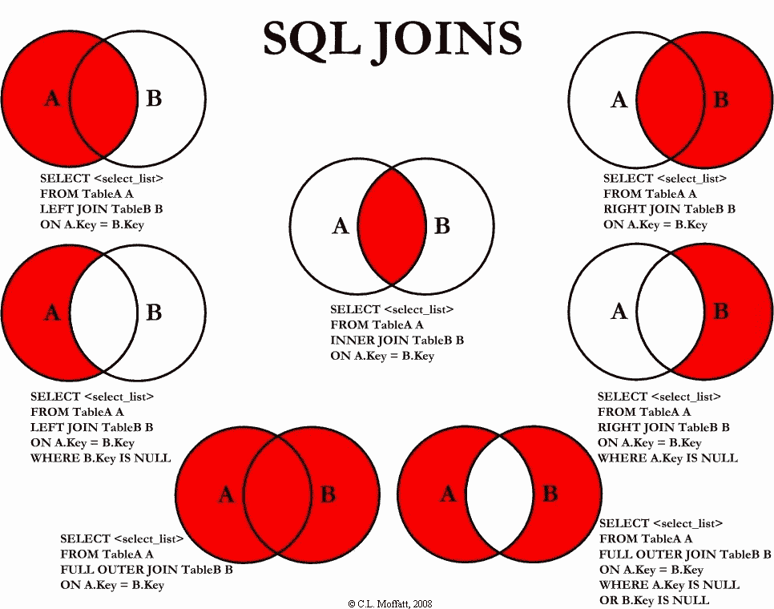
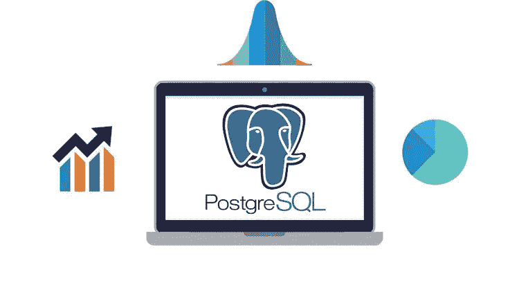
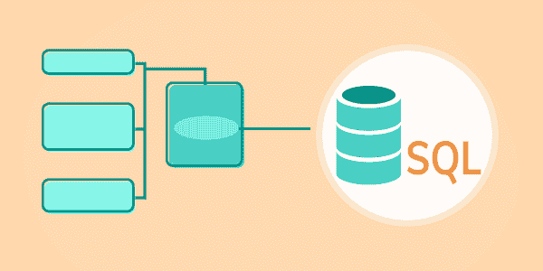
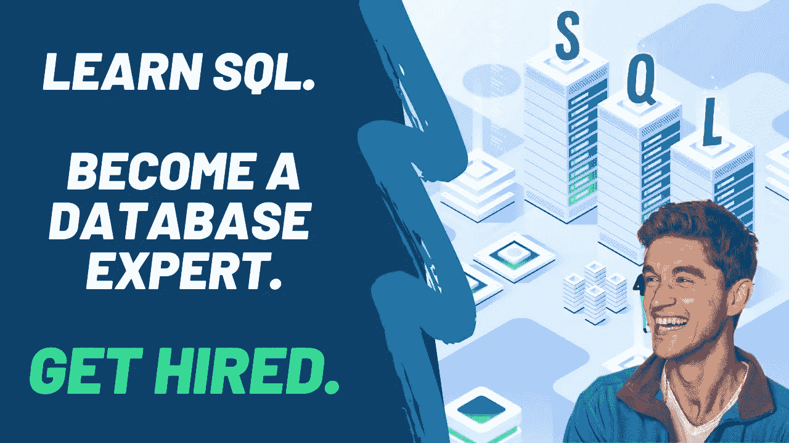
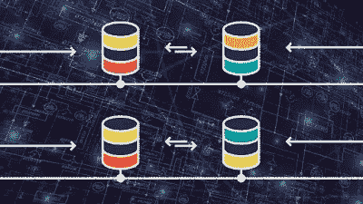
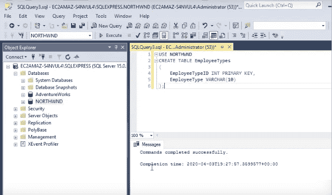
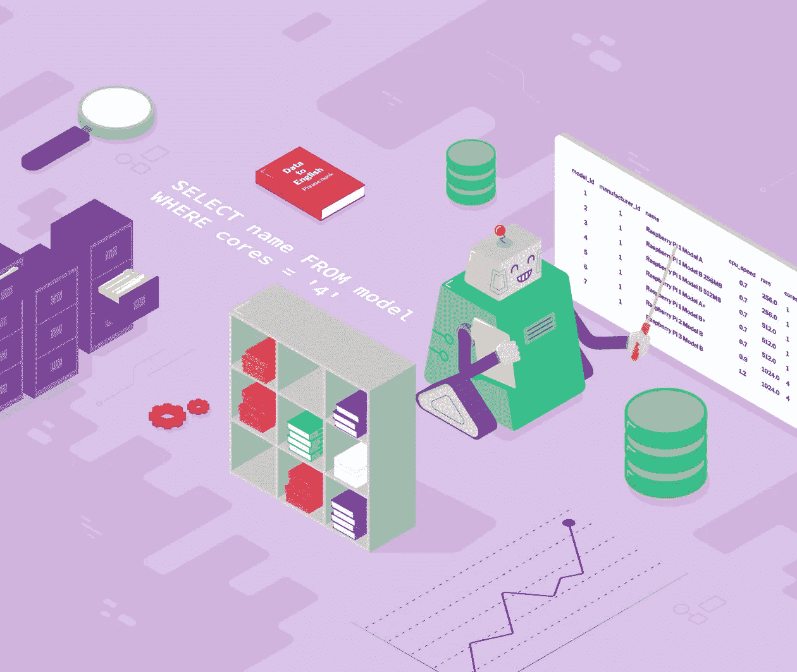
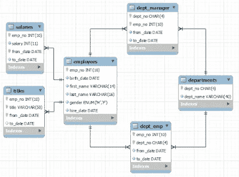
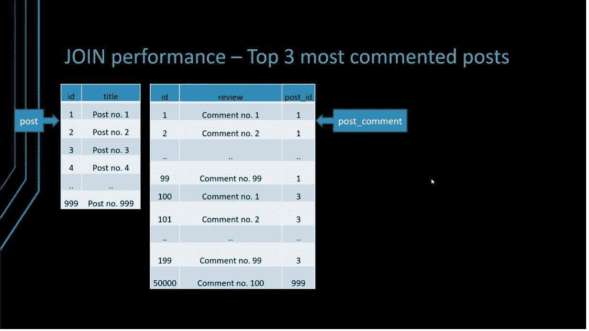

# 2023 年学习 SQL 的 10 门最佳课程[更新]

> 原文：<https://medium.com/javarevisited/top-5-sql-and-database-courses-to-learn-online-48424533ac61?source=collection_archive---------2----------------------->

## 我最喜欢的学习 SQL 和数据库的在线课程 2023 初学者用 PostgreSQL，MySQL，Oracle，和 SQL Server 的例子。

大家好，如果你是一名程序员、开发人员、IT 专业人员、数据科学家或软件工程师，对学习数据库和 SQL 感兴趣，并且正在寻找最好的资源，如最好的书籍、课程和教程，那么你来对地方了。

以前我分享过一些 [**最好的 SQL 书籍**](/javarevisited/5-best-books-to-learn-sql-and-database-design-for-programmers-and-developers-1e7839df2f3e?source=---------7------------------) 和 [**网站**](https://javarevisited.blogspot.com/2015/06/5-websites-to-learn-sql-online-for-free.html) ，今天我就分享一些最好的 SQL 和数据库课程来学习，让你掌握这个有用的技术。

如果你不知道什么是 SQL，也不知道为什么要学习 SQL，那么为了大家的利益，我来给大家简单的概述一下 SQL。SQL 是一种处理数据库的编程语言。

您可以使用 SQL 创建数据库对象，如表、存储过程等。—从数据库中存储和检索数据。

SQL 对于任何程序员来说都是最重要的技能之一，与技术、框架和领域无关。它甚至比像 [Java](http://www.java67.com/2014/09/top-10-java-8-tutorials-best-of-lot.html) 和 [Python](https://javarevisited.blogspot.sg/2018/05/10-reasons-to-learn-python-programming.html) 这样的主流编程语言更受欢迎，它绝对为你的简历增色不少。

SQL 允许您处理数据，这是当今世界最重要的资产。通过学习 SQL，你可以得到你的问题的答案。例如，如果你是一个热门在线课程平台 [Udemy](http://javarevisited.blogspot.sg/2018/01/top-10-udemy-courses-for-java-and-web-developers.html) 的课程创建者，想知道哪个课程最畅销，哪个课程根本卖不出去，你可以使用 SQL。

它有助于故障排除和报告。此外， [SQL](http://www.java67.com/2016/09/sql-5-best-books-to-learn-and-master.html) 是一项非常稳定的技术，已经存在多年，将来也会需要它。这意味着你在学习 SQL 上的任何投资也将在你的职业生涯中为你服务很长时间。

# 2023 年最适合初学者的 10 门 SQL 在线课程

以前我也分享过一些[免费的 SQL 课程](http://www.java67.com/2018/02/5-free-database-and-sql-query-courses-programmers.html)，我的读者很喜欢。尽管如此，反馈是他们想要更全面和深入的材料，这就是为什么我为初学者和有经验的程序员提供了这个最佳 SQL 和数据库课程列表。

在这个列表中，我收录了来自 [Udemy](https://click.linksynergy.com/fs-bin/click?id=JVFxdTr9V80&offerid=323058.9409&type=3&subid=0) 和 [Pluralsight](http://pluralsight.pxf.io/c/1193463/424552/7490?u=https%3A%2F%2Fwww.pluralsight.com%2Flearn) 的一些最好的 SQL 和数据库课程，这两个网站是在线课程的领先网站。

这些课程将从头开始教你 SQL。他们中的大多数甚至不需要先决条件，只要你知道如何操作电脑和从互联网上下载东西，这是你知道的，这就是为什么你正在阅读这篇文章。

## 1.[数据科学 SQL](https://coursera.pxf.io/c/3294490/1164545/14726?u=https%3A%2F%2Fwww.coursera.org%2Flearn%2Fsql-for-data-science)【Coursera 最佳 SQL 课程】

如果您正在学习数据科学的 SQL，那么这是一门完美的入门课程。这实际上是 Coursera 上最好的 SQL 课程之一，教你 SQL 基础知识和如何处理数据。

加州大学提供这门课程，也称为 UCDavis，由讲师 Sadie St. Lawrence 授课。本课程是数据科学专业 的 [**学习 SQL 基础知识的一部分，该课程在完成所有课程和项目后提供证书。**](https://coursera.pxf.io/c/3294490/1164545/14726?u=https%3A%2F%2Fwww.coursera.org%2Fspecializations%2Flearn-sql-basics-data-science)

以下是您将在本课程中获得的技能

1.  SQL 基础知识
2.  数据分析
3.  数据科学
4.  SQLite

谈到社会证明，超过 39%的学习者在完成这门课程后开始了新的职业生涯，34%的人从这门课程中获得了切实的职业利益，超过 10%的人获得了加薪或晋升。

**这是加入本课程** — [数据科学 SQL](https://coursera.pxf.io/c/3294490/1164545/14726?u=https%3A%2F%2Fwww.coursera.org%2Flearn%2Fsql-for-data-science)的链接

如果你发现 Coursera 的课程很有用，因为它们是由世界各地知名的公司和大学创建的，我建议你购买 Coursera PlusT3 的[课程，这是 Coursera 的一个订阅计划，让你可以无限制地访问他们最受欢迎的课程、专业、专业证书和指导项目。它每年花费大约 399 美元，但是它完全值得你的钱，因为你得到无限的证书。](https://coursera.pxf.io/c/3294490/1164545/14726?u=https%3A%2F%2Fwww.coursera.org%2Fcourseraplus)

<https://coursera.pxf.io/c/3294490/1164545/14726?u=https%3A%2F%2Fwww.coursera.org%2Fcourseraplus>  

## [2**。完整的 SQL 训练营**](https://click.linksynergy.com/fs-bin/click?id=JVFxdTr9V80&subid=0&offerid=323058.1&type=10&tmpid=14538&RD_PARM1=https%3A%2F%2Fwww.udemy.com%2Fthe-complete-sql-bootcamp%2F)**【Udemy 的最佳 SQL 课程】**

对于初学者来说，这是一门优秀的 SQL 课程。该课程从零开始，不需要任何编程技能或经验。

顾名思义，该课程受训练营的启发，侧重于强化学习。这也是一门综合课程，通过使用幻灯片和现场编码来解释每一个概念。

作者使用 PostgreSQL 进行演示，它是免费和开源的。它还带有一个名为 **PgAdmin** 的 GUI 工具，使得使用 **PostgreSQL** 数据库变得容易。

即使作者使用 PostgreSQL，您在本书中学到的所有概念也适用于其他主要数据库。[甲骨文](http://www.java67.com/2018/02/5-free-oracle-and-microsoft-sql-server-online-courses.html)、[微软 SQL Server](http://www.java67.com/2018/01/top-4-free-microsoft-sql-server-books.html) 和 [MySQL](https://javarevisited.blogspot.sg/2018/05/top-5-mysql-courses-to-learn-online.html) 。

这门课程的另一个好处是有一位非常热情、教学方法详细的讲师。总的来说，这是一个从头开始学习 SQL 的很好的课程，尤其是对初学者来说。

**这是参加本课程**——[完整 SQL 训练营](https://click.linksynergy.com/fs-bin/click?id=JVFxdTr9V80&subid=0&offerid=323058.1&type=10&tmpid=14538&RD_PARM1=https%3A%2F%2Fwww.udemy.com%2Fthe-complete-sql-bootcamp%2F)的链接

## 3.[SQL 入门指南](https://www.educative.io/courses/introductory-guide-to-sql?affiliate_id=5073518643380224)【Educative 的最佳 SQL 课程】

这是一个在 Educative 上学习 SQL 的交互式课程，Educative 是一个交互式编码和学习平台。

在本课程中，您将熟悉最流行和最受欢迎的 RDBMS 之一— [MySQL](/javarevisited/top-5-courses-to-learn-mysql-in-2020-4ffada70656f) 。您将从介绍 [SQL、](/javarevisited/7-free-courses-to-learn-database-and-sql-for-programmers-and-data-scientist-e7ae19514ed2)的基础知识开始，比如创建数据库、插入、查询和更新数据。

您还将学习开发人员和数据科学家每天使用的基本概念，例如多表操作、嵌套查询以及如何设置视图。

自始至终，您都可以在浏览器中执行 SQL 查询并实时查看结果——您不需要担心任何设置。

在本课程结束时，您还将获得一些关于常见的 [SQL 面试问题](https://javarevisited.blogspot.com/2021/05/sql-and-database-phone-interview-questions.html)的实践，因此到时候，您将准备好并自信地回答任何出现在您面前的问题。我们开始吧！

**这是参加本课程**—[SQL 入门指南](https://www.educative.io/courses/introductory-guide-to-sql?affiliate_id=5073518643380224)的链接

而且，如果你觉得互动教育平台很有用，你也可以考虑购买<https://www.educative.io/subscription?affiliate_id=5073518643380224>**教育订阅，每月只需**18 美元就能获得 100 多门课程。非常划算，非常适合准备编码面试。****

****<https://www.educative.io/subscription?affiliate_id=5073518643380224> **** 

## ****4.[完成 SQL +数据库训练营:零到精通【2023】](https://academy.zerotomastery.io/p/complete-sql-database-bootcamp-zero-to-mastery?affcode=441520_zytgk2dn)****

****SQL 和知道如何处理数据对于几乎任何角色来说都是一项有价值的技能，并且越来越有价值，这是 2023 年学习 SQL 和数据库基础的最佳课程之一。****

****该课程由 Andrei Neagoie 及其团队创建，将教您掌握 SQL 和数据库管理&设计+练习，让您体验使用所有数据库类型的真实世界。****

****以下是您将在本课程中学到的重要内容:****

1.  ****如何创建自己的数据库，同时使用 SQL 与数据交互****
2.  ****了解如何处理用户密码和保护数据安全****
3.  ****高级 SQL 主题，如[索引](https://javarevisited.blogspot.com/2013/08/difference-between-clustered-index-and-nonclustered-index-sql-server-database.html)、[聚合函数](https://javarevisited.blogspot.com/2020/06/5-example-of-group-by-clause-in-sql.html)，缓存使您的数据库查询更高效****

****该课程完全是动手操作，并且有大量的练习来练习你所学的内容和测试你的知识。您还将了解机器学习、数据科学和数据工程师如何使用大数据和数据库。****

******以下是参加本课程的链接** — [完整的 SQL +数据库训练营:零到精通【2023】](https://academy.zerotomastery.io/p/complete-sql-database-bootcamp-zero-to-mastery?affcode=441520_zytgk2dn)****

********

****顺便说一句，你需要一个 [**ZTM 会员**](https://academy.zerotomastery.io/p/academy?affcode=441520_zytgk2dn) 才能观看这个课程，这个课程每月花费大约**$ 29**并且提供许多超级吸引人和有用的课程，比如这个 [Python 课程](https://academy.zerotomastery.io/p/complete-python-developer-zero-to-mastery?affcode=441520_zytgk2dn)和这个 [JavaScript 项目](https://academy.zerotomastery.io/p/javascript-projects?affcode=441520_zytgk2dn)课程。****

****<https://academy.zerotomastery.io/a/aff_c0gnlvf7/external?affcode=441520_zytgk2dn>  

如果你像我一样是一个不断学习的人，那么我建议你去申请会员资格，而不是购买单一的课程，你会节省金钱，使学习变得容易，因为你不需要每次都购买课程来学习新的东西。**** 

## ****[**5。新手 SQL:新手数据分析**](https://click.linksynergy.com/fs-bin/click?id=JVFxdTr9V80&subid=0&offerid=323058.1&type=10&tmpid=14538&RD_PARM1=https%3A%2F%2Fwww.udemy.com%2Fsql-for-newbs%2F)**【Udemy SQL 课程】******

****这是初学者学习 SQL 的又一个牛逼又好玩的课程。我真的很喜欢看这门课，不仅仅是因为它的内容，还因为老师大卫和皮特身上的积极能量。****

****看他们讨论和解释 SQL 概念是令人愉快的。我知道 SQL 很有趣，但是他们让它更有趣。这就像过去的大学时光，一些朋友总是跳来跳去，做一些事情，这让你发笑，但它有助于消除课堂上的无聊。****

****至于内容，顾名思义，这是一个初学者课程，但你将学习所有的基本概念，如创建数据库、表、存储过程、使用 [SELECT](http://javarevisited.blogspot.sg/2011/10/selct-command-sql-query-example.html) 、INSERT、UPDATE 和 [DELETE](http://javarevisited.blogspot.sg/2016/03/how-to-delete-from-table-using-join-in-SQL-Server.html) 语句。****

****在这个课程中，他们使用 MySQL 数据库，这是最流行的开源数据库，你可以免费下载。他们也有下载和安装 MySQL 数据库的部分。****

******这里是加入本课程的链接**—[SQL for Newbs:Data Analysis for 初学者](https://click.linksynergy.com/fs-bin/click?id=JVFxdTr9V80&subid=0&offerid=323058.1&type=10&tmpid=14538&RD_PARM1=https%3A%2F%2Fwww.udemy.com%2Fsql-for-newbs%2F)****

********

****学习完基础知识后，您将学习一些重要的信息——例如， [GROUP BY](http://javarevisited.blogspot.sg/2013/08/difference-between-where-vs-having-clause-SQL-databse-group-by-comparision.html) 操作符和聚合函数、连接表、连接多个条件，以及处理其他 SQL 操作符和函数。****

****当然，最好的部分是它有测试您的 SQL 知识的脑力劳动，这是构建数据的关键，因为您需要使用关系数据库和 SQL。****

## ****[**6。SQL &数据库设计 A-Z:学习 MS SQL Server+PostgreSQL**](https://click.linksynergy.com/fs-bin/click?id=JVFxdTr9V80&subid=0&offerid=323058.1&type=10&tmpid=14538&RD_PARM1=https%3A%2F%2Fwww.udemy.com%2Fsqldatabases%2F)****

****这是深入学习 SQL 的另一个很好的课程。它几乎涵盖了应用程序开发人员应该了解的关于 SQL 的所有主题。****

****在本课程中，您将学习如何创建基本的 SQL 查询和不同类型的连接。[左右连接](http://javarevisited.blogspot.sg/2013/05/difference-between-left-and-right-outer-join-sql-mysql.html)，内连接，外连接，交叉连接，[自连接](http://www.java67.com/2013/01/difference-between-self-and-equi-join-sql-example-inner-mysql.html)等。****

****本课程还解释了一些高级概念，如。[索引](http://www.java67.com/2017/12/difference-between-table-scan-index.html)，用[多个表编写 SQL 查询，并将](https://javarevisited.blogspot.sg/2012/11/how-to-join-three-tables-in-sql-query-mysql-sqlserver.html)个表连接在一起生成有意义的报告。****

****您还将探索数据库设计概念，例如规范化。本课程有一整节解释规格化和各种范式，例如 **1NF、2NF、3NF、BCNF** 等。****

******以下是加入本课程的链接** — [SQL &数据库设计 A-Z:学习 MS SQL Server + PostgreSQL](https://click.linksynergy.com/fs-bin/click?id=JVFxdTr9V80&subid=0&offerid=323058.1&type=10&tmpid=14538&RD_PARM1=https%3A%2F%2Fwww.udemy.com%2Fsqldatabases%2F)****

********

****该课程同时使用了[微软 SQL Server](/javarevisited/top-10-free-courses-to-learn-microsoft-sql-server-and-oracle-database-in-2020-6708afcf4ad7) 和 [PostgreSQL](https://javarevisited.blogspot.com/2020/02/top-5-courses-to-learn-postgresql-in.html) ，并且该课程最好的部分是它的重点是通过真实世界的数据科学练习来增强您的数据分析技能。****

****如果你对[数据科学](http://javarevisited.blogspot.sg/2018/03/top-5-data-science-and-machine-learning-online-courses-to-learn-online.html)感兴趣，并想成为一名数据科学家，那么良好的 SQL 知识将大有帮助，本课程是一个很好的起点。****

## ****7.在 SQL Server Management Studio 中构建基本的关系数据库****

****这是最好的 Coursera 指导项目之一，它将教你如何使用 SQL Server Management studio 以循序渐进和有指导的方式使用 [SQL Server](/javarevisited/top-10-free-courses-to-learn-microsoft-sql-server-and-oracle-database-in-2020-6708afcf4ad7) 。****

****在这个一小时的项目中，您将应用在 SQL Server Management Studio (SSMS)环境中使用关系数据库的基本知识。****

****以下是您将在本课程中学到的主要内容:****

1.  ****了解如何将 AdventureWorks 数据库加载到 SQL 中****
2.  ****使用 SQL Server Management Studio (SSMS)中的对象资源管理器窗口创建数据库图表。****
3.  ****创建并运行简单的结构化查询语言(SQL)命令，从表中检索数据。****
4.  ****创建并运行一个简单的 SQL 命令来创建表和列。****

******这是加入本课程的链接** — [在 SQL Server Management Studio 中构建基本的关系数据库](https://coursera.pxf.io/c/3294490/1164545/14726?u=https%3A%2F%2Fwww.coursera.org%2Fprojects%2Fbasic-relational-databases-sql)****

********

****如果你不知道，引导式项目是来自 [Coursera、](/javarevisited/top-15-free-coursera-courses-and-certifications-for-it-professionals-384207d56f45)的一项新服务，你可以通过在浏览器上进行动手编程练习来学习，你的讲师会通过分屏授课来指导你。这是一种很好的学习方式，因为你可以在短时间内学会一项技能。****

****如果你觉得 Coursera 课程有用，你也可以选择一个[***Coursera Plus***](https://coursera.pxf.io/c/3294490/1164545/14726?u=https%3A%2F%2Fwww.coursera.org%2Fcourseraplus)*订阅，它提供了对 Coursera 课程、专业化和专业证书的无限制访问。在 Coursera 学习其实是一种性价比很高的方式。*****

*****<https://coursera.pxf.io/c/3294490/1164545/14726?u=https%3A%2F%2Fwww.coursera.org%2Fcourseraplus> ***** 

## *****[**8。Oracle SQL:从零开始成为认证 SQL 开发人员！**](https://click.linksynergy.com/fs-bin/click?id=JVFxdTr9V80&subid=0&offerid=323058.1&type=10&tmpid=14538&RD_PARM1=https%3A%2F%2Fwww.udemy.com%2Foracle-sql-12c-become-an-sql-developer-with-subtitle%2F)*****

*****毫无疑问，Oracle 是最受欢迎的关系数据库。对具有良好的 Oracle 数据库技能和经验的人有着巨大的需求，例如了解 Oracle [PL/SQL](http://javarevisited.blogspot.sg/2017/09/top-4-books-to-learn-oracle-plsql-best-must-read.html) 的应用程序开发人员和了解 Oracle 数据库详细信息的数据库管理员。*****

*****无论您是想从应用程序开发的角度还是从数据库管理员的角度学习 Oracle。从这个角度来看，这门课是一个很好的起点。*****

*****在本课程中，您将学习创建数据库、表和存储过程，以及如何编写 SQL 查询。您将学习 Oracle 数据库中的基本 SQL 概念，如 [SELECT](http://www.java67.com/2018/02/why-you-should-not-use-select-in-sql.html) ，INSERT、UPDATE、 [DELETE](https://javarevisited.blogspot.sg/2016/03/how-to-delete-from-table-using-join-in-SQL-Server.html) ， [ALTER](http://www.java67.com/2013/01/how-to-use-alter-command-in-sql-examples.html) 语句，join、group by、where 子句以及其他函数。*****

*****这是一门包含 100 多堂课的综合课程，分为 16 个部分，将教授您使用 Oracle 数据库的所有重要 SQL 概念。*****

*****老师很好，并且使用免费工具，比如 Oracle SQL Developer，你可以从网上下载。总的来说，如果你想学习 Oracle 数据库，这是一门很好的 SQL 课程。*****

*******以下是参加本课程的链接** — [Oracle SQL:从零开始成为认证 SQL 开发人员！](https://click.linksynergy.com/fs-bin/click?id=JVFxdTr9V80&subid=0&offerid=323058.1&type=10&tmpid=14538&RD_PARM1=https%3A%2F%2Fwww.udemy.com%2Foracle-sql-12c-become-an-sql-developer-with-subtitle%2F)*****

**********

## *****9.[数据库和 SQL 介绍](https://click.linksynergy.com/deeplink?id=JVFxdTr9V80&mid=42801&murl=https%3A%2F%2Fwww.futurelearn.com%2Fcourses%2Fintroduction-to-databases-and-sql)【未来学习最佳课程】*****

*****这是 FutureLearn 在 2023 年推出的又一门令人惊叹的学习数据库和 SQL 的在线课程，future learn 是领先的 MOOC 网站，有许多来自知名大学和组织的课程。*****

*****这门课程由 Raspberry Foundation 创建，由 Google 提供支持，你将从零开始学习数据库如何工作以及如何使用 SQL。*****

*****在这个过程中，您将了解主键和表关系，以及如何创建连接来搜索多个表。在最后一周，您将完成分组并查看从数据库导出数据。*****

*****以下是您将在本课程中学到的关键概念:*****

*   *****数据库是用来做什么的？*****
*   *****为什么要使用数据库或电子表格？*****
*   *****如何创建 SQL 语句来搜索数据库*****
*   *****主键的作用是什么*****
*   *****如何使用 SQL 语句添加数据*****
*   *****如何将关系应用于数据库中的表*****
*   *****在跨多个表的搜索中使用联接*****
*   *****如何使用 GROUP BY 和 HAVING 子句对数据库中的数据进行分组。*****

*****学习数据库和 SQL 是计算机科学的一个重要组成部分，所以对教育者、学生和家长来说，对这门学科充满信心是很重要的。*****

*****总的来说，这是对 SQL 的极好介绍。它不仅提供了清晰的说明，还提供了几次在数据库上试验代码的机会。*****

*******这是参加本课程** — [数据库和 SQL 介绍](https://click.linksynergy.com/deeplink?id=JVFxdTr9V80&mid=42801&murl=https%3A%2F%2Fwww.futurelearn.com%2Fcourses%2Fintroduction-to-databases-and-sql)的链接*****

**********

## *****[10。200+ SQL 面试问题](https://click.linksynergy.com/fs-bin/click?id=JVFxdTr9V80&subid=0&offerid=323058.1&type=10&tmpid=14538&RD_PARM1=https%3A%2F%2Fwww.udemy.com%2Fsql-interview-questions%2F)*****

*****这是一门从面试角度学习 SQL 的绝佳课程。如果你正在为你的第一次工作面试或下一份工作做准备，你会在面试中遇到很多 SQL 问题。*****

*****这是一项重要的技能，这也是为什么很多面试都关注 [SQL](https://javarevisited.blogspot.sg/2017/02/top-6-sql-query-interview-questions-and-answers.html) 和 d [数据结构和算法](http://javarevisited.blogspot.sg/2018/01/top-5-free-data-structure-and-algorithm-courses-java--c-programmers.html)的原因。*****

*****通过学习这门课程，你不仅可以为下一次面试做好准备，还可以学到很多重要的 SQL 概念。例如，观看一个章节的预览，该章节讨论了如何调优 SQL 查询或查找和解释执行计划，您会学到很多东西。*****

*****我是一个特别喜欢从[面试问题](http://www.java67.com/2013/04/10-frequently-asked-sql-query-interview-questions-answers-database.html)中学习的人，因为它们更能鼓励我，激起我的好奇心。如果你和我一样，你会发现这个课程非常有帮助。我去年花了 10.99 美元买了这个课程，直到今天我仍然喜欢它。*****

*******这里是加入本课程的链接**——[200+SQL 面试问题](https://click.linksynergy.com/fs-bin/click?id=JVFxdTr9V80&subid=0&offerid=323058.1&type=10&tmpid=14538&RD_PARM1=https%3A%2F%2Fwww.udemy.com%2Fsql-interview-questions%2F)*****

**********

*****它也是《T4》[**Joe Gekko 的 SQL puzzles book**](http://www.amazon.com/Puzzles-Answers-Edition-Kaufmann-Management/dp/0123735963?tag=javamysqlanta-20)的完美伴侣，一本很棒的读物。这是一本有趣的 SQL 查询和解谜书，如果你还没有读过的话，这是一本必读的书。*****

## *****11.[Vlad Mihalcea 的高性能 SQL 课程](https://vladmihalcea.teachable.com/p/high-performance-sql-online?coupon_code=HPSQLV150OFF&affcode=172599_kuoszt8s)*****

*****如果您正在寻找一门高级 SQL 课程来掌握复杂的 SQL 和数据库概念，如横向连接、分区、窗口函数和理解执行计划，那么这门高性能 SQL 课程正适合您。*****

*****顾名思义，它的目标是编写高性能的 SQL，而这是许多程序员所忽略的。他们所做的只是编写查询来完成工作，但他们从来没有注意到性能这样的事实，我的意思是查询有多快，查询性能是否随着时间的推移而下降，如果是，为什么以及如何改善。*****

*****除非您对 SQL 的工作原理有深入的了解，并且能够阅读和解开执行计划的谜团，否则您无法解决这些问题，而这正是本课程可以帮助您的地方。*****

*****以下是您将在本[高性能 SQL 课程](https://vladmihalcea.teachable.com/p/high-performance-sql-online?coupon_code=HPSQLV150OFF&affcode=172599_kuoszt8s)中学到的内容:*****

*   *****加入最佳实践，*****
*   *****子查询和半连接，*****
*   *****派生表和 CTE，*****
*   *****递归查询，*****
*   *****JSON 处理*****
*   *****窗口功能*****
*   *****解释、分析和揭示执行计划*****
*   *****透视、向上插入、合并*****
*   *****分页最佳实践*****

*****如您所见，您不仅将了解高级 SQL 概念，如连接最佳实践、子查询和半连接、派生表和 CTE、递归查询、JSON 处理，还将了解解释、分析和解密执行计划和分页最佳实践。*****

*****如果你真的想让你的 SQL 技能更上一层楼，我强烈推荐你参加这个课程。*****

*******以下是参加本课程的链接**—[Vlad Mihalcea 的高性能 SQL 课程](https://vladmihalcea.teachable.com/p/high-performance-sql-online?coupon_code=HPSQLV150OFF&affcode=172599_kuoszt8s)*****

**********

*****2023 年初学者学习这一有用技能的最佳 SQL 和数据库课程到此为止。这些也是从 Udemy、Coursera、Pluralsight、FutureLearn、Educative、edX 等网站学习 SQL 和数据库基础知识的最佳在线课程。对于初学者和不懂 SQL 的有经验程序员来说，这些都是优秀的 SQL 课程。*****

*****由于 SQL 技能一直很受欢迎，事实上，与其他编程技能一样，SQL 技能也是强制性的，所以掌握 SQL 知识将有助于您获得更好的工作，并帮助您完成当前的日常任务。*****

*****您可能想探索的其他**有用的编程资源**有:*****

*   *****[初学者学习棱角的 10 门免费课程](/javarevisited/top-10-free-courses-to-learn-angular-framework-in-2020-bb62148c73d3)*****
*   *****[2023 年 React 开发者路线图](https://javarevisited.blogspot.com/2018/10/the-2018-react-developer-roadmap.html)*****
*   *****[40 多岁能学编码和 Web 开发吗？](/javarevisited/can-you-learn-programming-and-become-a-web-developer-in-the-40s-and-50s-f9e117f32721)*****
*   *****[2023 年学会反应的 10 门免费课程](/javarevisited/top-10-free-courses-to-learn-react-js-c14edbd3b35f)*****
*   *****[成为全栈式 web 开发人员的 10 门最佳课程](/javarevisited/top-10-online-courses-to-become-a-fullstack-web-developer-in-2020-d608a6b63232)*****
*   *****[每个软件工程师都应该学习的 10 件事](/swlh/10-things-every-programmer-should-know-26ba37cfcaf4)*****
*   *****[2023 年我最喜欢学的课程 node . js](/javarevisited/top-10-online-courses-to-learn-node-js-in-depth-8ef0e31ca139)*****
*   *****[我最喜欢的学习 HTML 和 CSS 的免费课程](/javarevisited/5-free-html-and-css-courses-to-learn-front-end-web-development-online-8b04517c6ecb?source=collection_home---4------0-----------------------)*****
*   *****[2023 年学习打字稿的前 7 门课程](/javarevisited/7-best-courses-to-learn-typescript-in-depth-58439e1ce729)*****
*   *****[7 门免费学习网页设计自举的课程](/javarevisited/7-free-courses-to-learn-bootstrap-for-web-designers-and-developers-5135215648f1)*****
*   *****[我最喜欢的深入学习 Web 开发的课程](/better-programming/my-5-favorite-courses-to-learn-web-development-in-2019-a5e74167f8b2)*****

*****感谢您阅读本文。如果你喜欢这些*最好的在线 SQL 课程和班级*，那么请分享给你的朋友和同事。如果您有任何问题或反馈，请发表评论。*****

*******P.S** —如果你正在寻找一些免费的课程开始学习数据库和 SQL 基础知识，你应该查看 Udemy 上的 [**数据库和 SQL 查询简介**](http://bit.ly/2BQuq2O) 课程，它是完全免费的，你只需要一个免费的 Udemy 帐户就可以访问这门课程。*****

*****<http://bit.ly/2BQuq2O> *****