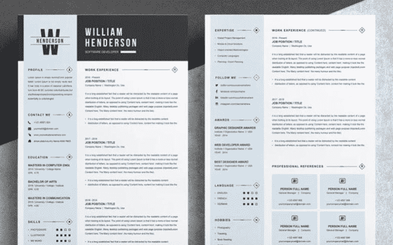

# 获得面试机会的前五名网站开发人员简历模板

> 原文：<https://medium.com/javarevisited/top-5-web-developer-resume-templates-to-get-the-desired-interview-d3368df3323?source=collection_archive---------4----------------------->

一份网络开发人员简历是一个尽可能展现你最好一面的机会。你的潜在雇主可以了解你的一切:

*   体验；
*   能力；
*   技能；
*   成就；
*   和其他重要的信息。

它还可以提供更多关于你工作生活的细节。你可以分享你的教育和职业生涯的所有方面。为了给你未来的雇主留下深刻印象，你可能需要一些特别的东西。出于这个原因，我们准备了五份简历模板，尽可能展示你最好的一面。让我们看看它们，为你的视野选择一些东西。

# 加里埃尔·马萨雷纳

[**更多信息**](https://www.templatemonster.com/resumes/gariel-masarena-resume-template-76948.html?aff=javarevisited&utm_campaign=webdeveloper_resume&utm_source=javarevisited&utm_medium=referral)

在一个人得到一个职位之前，简历是每个公司的基本要求。首先，一个潜在的雇主想在报纸上见到你。作为一个例子，你可以看看这份现代网络开发人员的简历。你可以写一份有效的简历，让公司知道你能为他们做什么。

# 你打算在包裹里装什么？

1.这个包有几个基本文件。首先包括两页简历或 CV 模板。除此之外，你还可以随意制作一页自荐信。

2.这个模板是完全分层的。它还提供了高度可定制的特性。每个人都有机会编辑所有必要的元素，使它们符合你的愿景。

3.您可以使用多种文件格式。这些文件包括 Adobe Photoshop、Adobe Illustrator、Microsoft Word 和 Apple Pages 的文件。

4.毫无疑问，这是一个现成的打印模板。添加完你的内容后，你就有可能得到一份打印的简历。

# 简历包

[**更多信息**](https://www.templatemonster.com/resumes/bundle-resume-template-88988.html?aff=javarevisited&utm_campaign=webdeveloper_resume&utm_source=javarevisited&utm_medium=referral)

简历应该充分展示你的技能。出于这个原因，最好有一个特定的 web 开发人员简历模板来留下印象。你可以用这个醒目的选择来描述你会给公司带来的所有好处。它不仅仅是一个只提供基础知识的标准模板。下面，您可以了解它提供的所有功能。

# 你打算在包裹里装什么？

1.首先，你可以从四个简历模板中选择。他们每个人都有独到的见解。意味着你要去找满足你需求的东西。

2.为了确保每个人都可以编辑模板，它提供了一些格式。有些人可以决定在 Adobe Photoshop 或 Illustrator 中进行更改。然而，也可以选择 Microsoft Word。

3.它有完全可编辑的颜色和形状。使用这种优雅的变体很容易产生创意。

4.您还将获得有序的图层，以便更快地使用它们。

# Word 简历包

[**更多信息**](https://www.templatemonster.com/resumes/word-bundle-resume-template-83607.html?aff=javarevisited&utm_campaign=webdeveloper_resume&utm_source=javarevisited&utm_medium=referral)

使用这个有价值的 web 开发人员简历包，不需要任何东西就可以展示你独特的技能和成就。有了它，就有可能产生差异，并保证公司选择你。我们应该仔细考虑一些最终会成为优势的关键选项。

# 你打算在包裹里装什么？

1.它有各种各样的现成页面。正如你所理解的，20 个选择可以让你和你的潜在雇主简洁地交流。

2.这是一个全矢量模板。此外，有可能按照你的灵魂的意愿调整所有元素的大小。

3.完全可编辑的性质是你进行所有必要编辑的绝佳机会。因此，你可以尽可能好地展示你的能力和经验。

4.该模板提供了字符和段落样式。不要忘记，这是一个现成的印刷选择。

顺便说一下，如果你是编程新手，你可以了解如何在五个月内[学会编码](/javarevisited/learn-to-code-in-5-months-get-hired-and-thrive-as-a-web-developer-5ab6838b2f07?source=false---------0)。

# 亨德森

[**更多信息**](https://www.templatemonster.com/resumes/henderson-resume-template-79183.html?aff=javarevisited&utm_campaign=webdeveloper_resume&utm_source=javarevisited&utm_medium=referral)

你想给招聘经理留下一个极好的初步印象吗？你需要他或她认为你是这个职位的合适人选吗？在这种情况下，探索这个 web developer 简历模板。它有一个结构良好的设计，让每个人都关注你的简历。下面，你可以熟悉它的主要选项。

# 你打算在包裹里装什么？

1.你可以利用完整的两页简历模板。除此之外，你还可以使用匹配的求职信和参考页。

2.你想用什么软件并不重要。它包括最著名的格式。其中包括微软 Word、Adobe Photoshop、Adobe Illustrator 和 Apple Pages。

3.完全可编辑的特性使得概述重要的信息片段成为可能。

4.它也是一个全矢量文件。你可以自由调整组件的大小，获得一份你梦想的简历。

# 迈克尔

[**更多信息**](https://www.templatemonster.com/resumes/82495.html?aff=javarevisited&utm_campaign=webdeveloper_resume&utm_source=javarevisited&utm_medium=referral)

除了总结你的经历之外，你还可以使用这个 web developer 简历模板。找工作并不总是一件困难的事情。然而，当你有了这样一个设计精美的变体时，它可能会变得更加舒适。

# 你打算在包裹里装什么？

1.它不仅有一个普通的两页简历模板。此外，该包装还增加了一页的求职信，可以引起注意。

2.要以您想要的方式概述您的背景和教育，您可以利用完全可编辑的特性。如果你打算自己个性化和格式化简历，这是至关重要的。

3.毫无疑问，它的元素是完全可调整大小的。通过这种方式，你可以确保得到一份看起来很专业的简历。

4.您还可以处理段落和字符样式。不要忘记，这也是一个完全分层的文件，使其更快地进行编辑。

如果你想更有见识，那就熟悉这十大课程来[学习前端和后端](/javarevisited/top-10-courses-to-learn-frontend-and-backend-development-in-2020-710d2d57e008)开发。

# 几句话作为结论

简历可以成为向潜在雇主推销你技能的工具。你可以证明你能胜任网站开发人员的职位。然而，请记住，要做到这一点，你需要组织良好的简历模板。我们希望你已经设法在这些中找到一个极好的选择。感谢阅读！

而且，如果你想做更多，你也可以看看这些模板来 [**建立雇主喜欢的令人敬畏的网络开发者作品集**](/javarevisited/top-6-web-developer-portfolio-templates-to-step-out-of-the-comfort-zone-b2d26de9cad4) :

 [## 走出舒适区的 6 大 Web 开发人员组合模板

### 每个 web 开发人员组合都允许告诉人们你是谁，你做什么，以及如何与你联系…

medium.com](/javarevisited/top-6-web-developer-portfolio-templates-to-step-out-of-the-comfort-zone-b2d26de9cad4)