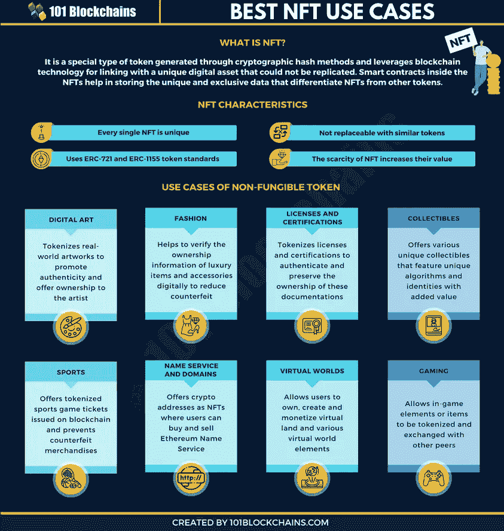

# 2023 年学习不可替代代币(NFT)的 5 个地方

> 原文：<https://medium.com/javarevisited/top-5-websites-to-learn-non-fungible-tokens-nfts-72e14a2a3546?source=collection_archive---------2----------------------->

## 想在 2023 年学习不可替换的代币或 NFT 吗？这里是你可以深入了解 NFT 的 5 个最好的地方，包括免费资源。

区块链 101 号

你好朋友，如果你想学习 2023 年不可替代的代币或 NFT，并寻找最佳资源，那么你来对地方了。早些时候，我已经分享了[最好的付费 NFT 课程](https://javarevisited.blogspot.com/2021/12/top-5-courses-to-learn-about-nfts-non.html)和[最好的免费 NFT 课程](https://www.java67.com/2022/03/top-5-free-courses-to-learn-nft-non-fun.html)，在这篇文章中，我将分享 2023 年学习 NFT 的最佳地点。

老实说，在互联网上很难找到好的 NFT 培训课程和证书。这篇文章告诉你学习 NFT 和在 2023 年成为 NFT 专业人士的最佳平台。

不可替代代币的声誉不断上升，引发了各个行业的变革浪潮。越来越多的人有兴趣更多地了解非功能性测试并探索其潜力。

然而，重要的是要小心你选择的[学习 NFT](/javarevisited/10-best-nfts-courses-and-certifications-for-beginners-to-learn-non-fungible-tokens-in-2022-3f36a4374ba) 的来源以及它们是如何工作的。自去年以来，对不可替代代币的需求一直是新闻。

即使不可替代的令牌在 2017 年的 CryptoPunks 中找到了自己的根，但世界还是注意到了 NFTs，一个 NFT 卖了 6900 万美元。

随后，关于不可替代令牌的讨论开始升温，2021 年 NFT 销售额超过 400 亿美元。你将如何进入这个新兴的、不断发展的行业？下面这篇文章通过概述学习 NFTs 的最佳在线平台来帮助你找到答案。

# 你为什么要学习 NFT 并获得 NFT 认证？

寻找最好的 NFT 课程的候选人通常会寻求最好的认证来证明他们的技能。从学习 NFTs 和获得相关证书中你能得到什么？关于认证，你应该知道的第一件事是你将拥有一个专家的职业身份。你更有可能吸引 NFT 专业人士或寻求 NFT 专家的企业的注意。

最重要的是，你可以在一项新技术中发展技能，这可能会定义数字资产的未来。平台中的多种选择[学习 NFT](https://savingsfunda.blogspot.com/2022/05/top-10-online-courses-to-learn-nfts-non-fun.html) 已经发展到能够满足在 NFTs 中确定合适职业道路的需求。谁会想错过利润丰厚的 NFT 销售呢？你能成为下一个百万美元 NFT 的创造者吗？职业发展的前景以及创建自己的 NFT 项目是追求 NFT 认证的重要原因。

为初学者寻找学习 NFT 的平台的最重要的原因也是着眼于成长

非功能性测试。[区块链技术](https://javarevisited.blogspot.com/2022/01/5-best-blockchain-certifications-and.html)从诞生到成为焦点花了将近七年时间。

然而，不可替代的令牌在加密生态系统中的传播速度比野火还要快。此外，对 NFTs 的大肆宣传出现在对去中心化网络的支持越来越强烈的时候。

由所有者单独控制的独特数字资产可以在新的去中心化生态系统中提供可信的价值。此外，不可替代的代币是元宇宙运作的一个重要方面。因此，通过[学习非功能性测试](https://www.courserevisited.com/2022/02/10-best-courses-to-learn-nft-in-2022.html)并积累使用和管理非功能性测试的专业知识，你可以期待一些看似合理的职业利益。

# 2023 年初学者学习 NFTs 的 5 个最佳地点

不可替代代币的价值优势，它们在流行文化中日益增加的认知度，以及名人的参与，都是吸引人的强大理由

对 NFTs 的关注。您可以在加密领域找到许多关于不可替代令牌的价值优势的讨论。

如果你想找到“我在哪里可以学习 NFT”的答案那么你可能不会去寻找一个像“互联网”那样笼统的答案

你需要寻找最好的平台

该网站提供与 NFTs 相关的学习资源。除此之外，许多其他因素也有助于你决定学习平台如何支持你在 NFTs 中的职业生涯。

例如，你可以寻找提供学习课程和认证的平台。另一方面，一些 NFT 初学者也可能会寻找免费资源来学习[不可替代代币](https://savingsfunda.blogspot.com/2022/05/how-to-create-and-sell-nft-non-fungible.html)。以下是在 NFTs 上发现最佳学习资源的最佳在线平台的概述。

## 1. [101 区块链学院](http://shrsl.com/349rm)

最好的地方找到一个 NFT 课程网上与专家的见解保证是 101 区块链。它是区块链培训和认证的先驱平台之一，拥有广泛的认证项目和培训课程。有抱负的 NFT 专业人士可以使用平台上的学习资源来建立理解非功能性测试的基本技能。

有兴趣了解不可替代代币的人可以找到 NFT 基础课程以及 [**认证 NFT 专业(CNFTP)认证**](https://shareasale.com/r.cfm?b=1696402&u=880419&m=105464&urllink=https%3A%2F%2Facademy%2E101blockchains%2Ecom%2Fcourses%2Fcertified%2Dnft%2Dprofessional&afftrack=) 。此外，除了区块链基础知识之外，关于标记化基础知识的培训课程可以帮助任何初学者充满信心地开始他们的学习之旅。

101 区块链 NFT 认证和培训课程的重要亮点之一

涵盖了使用不可替换令牌的方法。通过 NFT 基础课程，你不仅可以学习 NFT，还可以学习如何创建、买卖它们。

此外，[认证的 NFT 专业认证](https://javarevisited.blogspot.com/2022/06/review-is-certified-nft-certification-worth-it.html)是一个可信的工具，让你在创建自己的 NFT 系列时积累专业知识。

认证培训课程中的实践演示和互动练习为您提供了专业人士的最佳 NFT 课程

以及初学者。除此之外，该认证还通过强调基本面和最佳实践来验证 NFT 交易的技能和知识。

在 101 区块链上发现的关于非功能性语言测试的全面的信息收集使 sit 成为现在学习 NFT 的顶级平台之一。通过培训课程确保专业见解以及响应性支持

为学习体验增加了相当多的优势。

你可以选择参加这个课程

或者申请 [**区块链会员**](https://shareasale.com/r.cfm?b=1696402&u=880419&m=105464&urllink=https%3A%2F%2F101blockchains%2Ecom%2Fmembership%2F&afftrack=) ，该会员可以访问所有区块链、NFT、元宇宙和 Web3 培训材料。按年度计划，每月花费大约 25 美元，完全值得。在注册本课程时，您还可以使用我的代码 BCHAIN10 获得 10%的折扣。

## 2.[Udemy](https://click.linksynergy.com/deeplink?id=JVFxdTr9V80&mid=39197&murl=https%3A%2F%2Fwww.udemy.com%2F)【2023 年学习 NFT 的最佳在线课程】

寻找最佳 NFT 球场的第二大热门目的地是乌德米。在线培训和认证课程提供商因迎合全球许多专业人士的需求而广受欢迎。你可以在 Udemy 上找到许多免费和优质的课程，涵盖广泛的学科。

如果你想在课程中探索多种选择，那么 Udemy 显然是初学者学习 NFT 的顶级平台之一，具有众多优势。Udemy 上的免费 NFT 课程可以作为进入 NFTs 世界的可靠的初学者指南。

从 [**的课程到**](https://click.linksynergy.com/deeplink?id=JVFxdTr9V80&mid=39197&murl=https%3A%2F%2Fwww.udemy.com%2Fcourse%2Fnft-fundamentals%2F) 的大师班，再到完整的 NFT 技术课程，Udemy 在 NFTs 上有各种各样的学习资源可供选择。

Udemy 在选择学习 NFT 的资源时，最好的选择是多选。你有来自不同专业水平的不同教师的非功能性测试课程

在不可替换的令牌中。Udemy 还提供了一个理想的平台，让你根据现有的非英语专业知识选择 NFT 的学习资源。

## 3.[领英学习](http://linkedin-learning.pxf.io/c/1193463/449670/8005)

学习 NFT 的另一个热门平台是 LinkedIn Learning。作为顶级职业社交网站之一，LinkedIn 已经获得了很高的声誉。

通过 LinkedIn 学习工具，你可以在 LinkedIn 上找到许多初级课程和认证。LinkedIn Learning 上的 NFTs 入门课程是你开始学习 NFTs 的可靠选择。

LinkedIn 学习平台最有趣的细节是指专业人士对其学习资料的信任。

例如，这门关于 NFTs 的 [**入门课程可能是 NFT 最顶尖的在线课程，它概述了 NFT 的历史和基础知识。同时，您还可以深入了解如何创建自己的 NFT，以及与 NFT 交互和管理 NFT 的合适平台。超过 50，000 人参加了这个课程，它有一个令人惊讶的 4.7 分的评分，这说明了这个课程的很多情况。**](http://linkedin-learning.pxf.io/c/1193463/449670/8005?u=https%3A%2F%2Fwww.linkedin.com%2Flearning%2Fintroduction-to-nfts-non-fungible-tokens)

顺便说一下，你需要 LinkedIn Learning 会员才能观看这门课程，每月费用约为 19.99 美元，但你也可以通过参加他们的 [**1 个月免费试用**](http://linkedin-learning.pxf.io/c/1193463/449670/8005?u=https%3A%2F%2Fwww.linkedin.com%2Flearning%2Fsubscription%2Fproducts) 来免费观看这门课程，这是探索他们 17500 多门最新技术在线课程的好方法。

 [## LinkedIn Learning 免费试用和订阅价格

### 从初级到高级的 20，000 多门由专家指导的个性化优质内容课程。基于社区的…

linkedin-learning.pxf.io](http://linkedin-learning.pxf.io/c/1193463/449670/8005?u=https%3A%2F%2Fwww.linkedin.com%2Flearning%2Fsubscription%2Fproducts) 

## 4.YouTube[免费]

下一个方便回答“在哪里可以学习 NFT？”显然是指 YouTube。这是最吸引人的学习 NFTs 的平台之一，尤其是对于那些喜欢通过免费视频学习的人来说。

培训的视听性质

结果证明是最有效的，可以帮助熟悉非功能性测试很容易。

一旦你找到了可靠的 NFT 影响者和他们的 YouTube 频道，你就可以浏览他们的视频来提高你的专业知识。YouTube 上的培训视频也有助于了解该领域的新趋势和进展

非功能性测试。借助各种 YouTube 视频，您还可以了解专家对 NFT 及其潜在用例的看法。

这里有一个简单的视频，让我们从 NFT 开始学习

## 5.技能共享

初学者学习 NFT 的最佳平台列表中的最后一项将我们带到了 Skillshare。它是最值得信赖的专业培训和认证平台之一，提供有趣的基础课程。您可以通过本课程牢固掌握推动非功能性测试的概念。

同时，你可以理解 NFT 实际上是什么，以及它们如何能够产生价值。有趣的是，Skillshare 提供了一个 NFT 艺术大师班，不仅涵盖了基本面，还包括 NFT 交易中的实际案例。

例如，除了设计业务，你还可以了解比特币、数字艺术和数字营销背后的原理。Skillshare 上的大师班不仅能帮助你学习 NFT，还能让你学以致用。事实上，大师班涵盖的主题可以为创建您的 NFT 企业提供必要的信息和指导。

以上就是 2023 年**学习 NFT 的最佳在线平台**。关于选择顶级平台学习 NFT 的最后一点将最终总结在评估平台上。平台如何帮助你？根据你的技能，它有你需要的 NFT 课程吗

以及 NFTs 的知识？平台会提供专家支持吗？该平台提供 NFT 认证吗？所有这些问题都可以作为选择合适的非功能性外语教学平台的主要决定因素。

不可替代令牌是一个相对较新的概念，几乎每个人对这项技术都有不同的理解

然而，重要的是找到课程，提供中立和可信的描述非功能性测试和相关的生态系统。使用正确的学习资源为未来做准备，现在就成为 NFT 认证专家。

你可能喜欢的其他**区块链文章和教程**:

*   [2023 年十大区块链认证](https://javarevisited.blogspot.com/2020/07/top-5-online-courses-to-learn-blockchain.html)
*   [如何从零开始学习 2023 年的元宇宙？](https://javarevisited.blogspot.com/2022/07/how-to-learn-metaverse-from-scratch-is.html)
*   [开发者的 10 门最佳区块链课程](/javarevisited/best-blockchain-courses-and-certification-in-2020-63729f8f04d0)
*   [2023 年免费学习区块链的 5 个最佳地点](https://javarevisited.blogspot.com/2022/06/top-5-websites-to-learn-blockchain-in.html)
*   [2023 年 10 门元宇宙在线初学者课程](https://javarevisited.blogspot.com/2022/06/best-courses-to-learn-metaverse-online.html)
*   [认证 NFT 专业认证值得吗？](https://javarevisited.blogspot.com/2022/06/review-is-certified-nft-certification-worth-it.html)
*   [101 区块链认证区块链开发者值得吗？](https://javarevisited.blogspot.com/2022/05/review-is-certified-enterprise-blockchain-professional-certification-worth.html)
*   [学习区块链 HyperLedger Fabric 的 5 门课程](https://javarevisited.blogspot.com/2022/02/top-5-courses-to-learn-hyperledger-blockchain.html)
*   [2023 年区块链 5 门最佳 Coursera 课程](https://javarevisited.blogspot.com/2022/01/5-best-blockchain-certifications-and.html)
*   [我最喜欢的学习以太坊的在线课程](https://javarevisited.blogspot.com/2021/11/top-5-courses-to-learn-ethereum-for.html)
*   [2023 年学习区块链的前 5 本书](https://javarevisited.blogspot.com/2022/06/top-5-books-to-learn-blockchain-for.html)
*   [20 大区块链面试问题及答案](https://javarevisited.blogspot.com/2022/07/blockchain-interview-questions-answers.html)
*   [3 门 Coursera 课程让你在 2023 年成为区块链开发者](https://javarevisited.blogspot.com/2022/06/best-coursera-courses-for-blockchain.html)
*   [深度学习区块链的 6 大网站](https://dev.to/javinpaul/6-best-websites-to-become-a-blockchain-developer-in-2022-3han)

如果你喜欢这份深入了解 NFT 或不可替代的托克劳群岛的最佳地点清单，那么请随意与你的朋友和家人分享。如果您对 NFTs 有任何疑问，也可以发表评论，我们会尽快回复您。

**附言**。—如果你能负担得起，我强烈推荐你加入 [**101 区块链学院的 NFT 认证项目**](https://shareasale.com/r.cfm?b=1696402&u=880419&m=105464&urllink=https%3A%2F%2Facademy%2E101blockchains%2Ecom%2Fcourses%2Fcertified%2Dnft%2Dprofessional&afftrack=) ，这是学习 NFT 最好和最深入的课程之一，现在 101 区块链正在进行黑色星期五特卖，你还可以获得 50%的折扣。万事如意

 [## 2023 年了解 NFT(不可替代代币)的 8 大课程-最佳选择

### 你好伙计们，如果你想知道什么是 NFT 或不可替代的令牌，什么是 NFT 周围的嗡嗡声，并有问题…

javarevisited.blogspot.com](https://javarevisited.blogspot.com/2021/12/top-5-courses-to-learn-about-nfts-non.html)