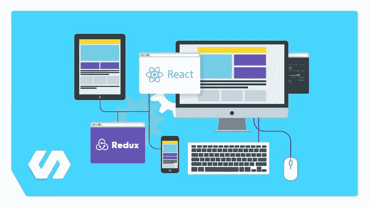
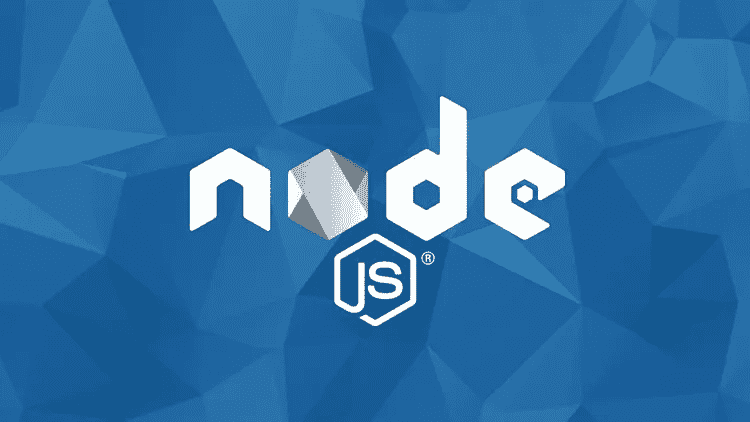
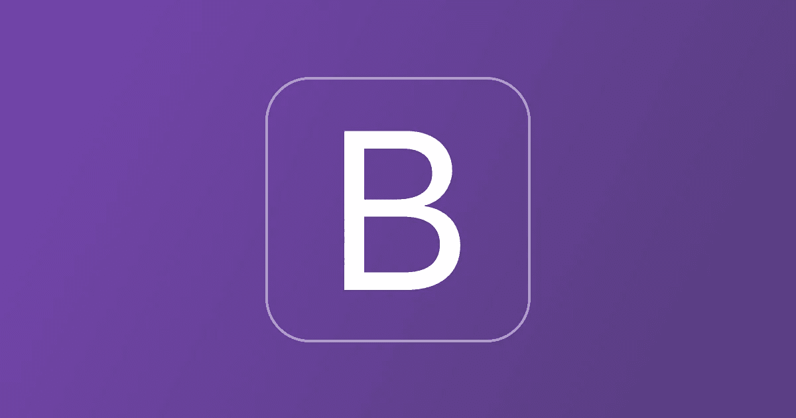
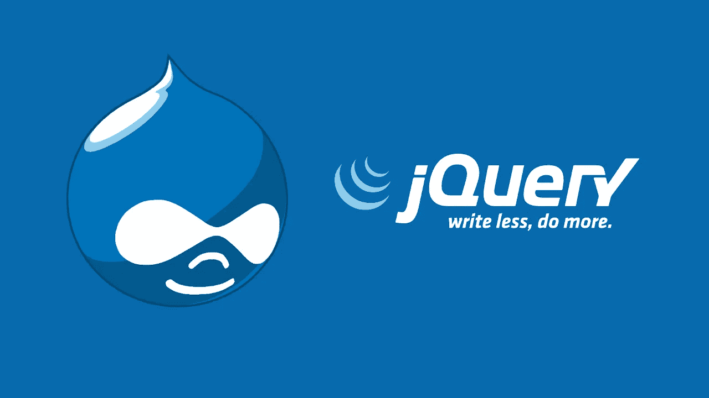
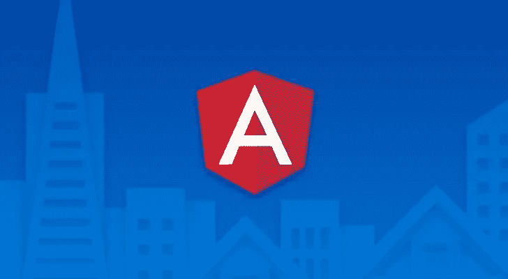
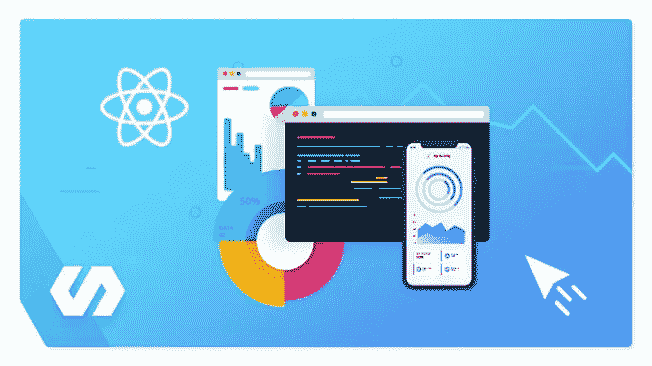

# 2023 年全栈开发者应该学习的 6 个基本 Web 开发框架

> 原文：<https://medium.com/javarevisited/top-6-javascript-frameworks-you-can-learn-to-become-a-truly-fullstack-developer-27561a8cf2e0?source=collection_archive---------0----------------------->

大家好，如果你是一名 JavaScript 开发人员，并且想知道在 2023 年你应该学习哪些框架和库，以成为一名真正的全栈开发人员，可以创建前端(web 和移动)并使用 node.js 编写服务器端代码来提升你的知名度，那么你来对地方了。

在过去，我已经分享了你可以学习的最佳框架，以提高你对[移动](/javarevisited/10-frameworks-and-libraries-mobile-application-developers-can-learn-in-2020-e0b91391cade)和[网络开发](/javarevisited/10-of-the-most-popular-javascript-frameworks-libraries-for-web-development-in-2019-a2c8cea68094)以及[大数据](http://www.java67.com/2018/05/top-5-free-big-data-courses-to-learn-Hadoop-Apache-Spark.html)技术的知识，今天，我将分享 JavaScript 开发人员应该学习的最佳框架。

当今世界，仅仅了解 [JavaScript](/javarevisited/10-best-online-courses-to-learn-javascript-in-2020-af5ed0801645) 是不够的，很好的了解各种框架(前端、后端、移动)非常重要。

它们允许你快速开发原型和真正的项目。如果你在创业领域工作，那么你应该马上做出一些很酷的东西，这就是框架知识的优势所在。

如果你被困在某个地方从事无聊的工作，比如启动和停止服务器，设置一些 cron 任务，回复相同的旧邮件，维护遗留应用程序，这也有助于你找到更好的工作，让你的职业生涯更上一层楼。

# 2023 年全栈开发的 6 个基本 JavaScript 框架

在这篇文章中，我分享了 6 个**有用的 JavaScript 框架**，分别涉及[前端开发](https://javarevisited.blogspot.com/2019/02/the-2019-web-developer-roadmap.html)，移动 app 开发，以及 [web 开发](/better-programming/my-5-favorite-courses-to-learn-web-development-in-2019-a5e74167f8b2)。你可以学习这些框架，成为真正的全栈 JavaScript 开发者。

一路上，我也分享了学习这些框架的最佳在线课程，你可以用它们来更好地学习这些框架，如果你有另一个好框架，你认为 JavaScript 和 web 开发人员应该在 2023 年学习，那么请在评论中分享它。

## 1.[反应](https://reactjs.org/)

React 是另一个用于构建用户界面的 JavaScript 库或框架。它就像 [Angular](http://www.java67.com/2018/01/top-5-free-angular-js-online-courses-for-web-developers.html) ，但由脸书、Instagram 和一个由个人开发者和公司组成的社区维护。它允许 web 开发人员创建大型 web 应用程序，无需重新加载页面就可以随时更改。

web 开发世界分为 [Angular](https://javarevisited.blogspot.com/2018/06/top-10-angular-tutorials-and-courses-for-web-developers.html#axzz5Ie75bPFF) 和 [React](http://www.java67.com/2018/02/5-free-react-courses-for-web-developers.html) 两种，如何选择取决于你自己。大多数时候，这是由环境决定的；例如，如果你在一个基于 **React 的项目**中工作，那么很明显，你需要学习 React。

如果你决定在 2023 年学习 React，那么 Udemy 的[**Modern React with Redux【2023 更新】**](https://click.linksynergy.com/deeplink?id=JVFxdTr9V80&mid=39197&murl=https%3A%2F%2Fwww.udemy.com%2Fcourse%2Freact-redux%2F) 课程是一个很好的起点。

## 2. [Node.js](https://nodejs.org/en/)

毫无疑问，JavaScript 是头号编程语言，Node.js 在其中扮演了重要角色。

传统上， [JavaScript](https://javarevisited.blogspot.com/2018/06/top-10-courses-to-learn-javascript-in.html) 被用作客户端脚本语言，它与 HTML 一起在客户端提供动态行为。它运行在 web 浏览器上，但是 Node.js 允许您在服务器端运行 JavaScript。

[Node.js](/javarevisited/top-10-online-courses-to-learn-node-js-in-depth-8ef0e31ca139) 是一个开源的、跨平台的 JavaScript 运行时环境，用于在服务器端执行 JavaScript 代码。在将动态网页发送到客户端之前，可以使用 Node.js 在服务器端创建动态网页。

这意味着您可以用 JavaScript 开发一个从前端到后端的客户端-服务器应用程序。上个月，我在 Udemy 的 10 美元特价上购买了完整的 Node.js 开发者课程 ，我期待着在 2023 年学习它。

## 3.[自举](https://getbootstrap.com/)

这是另一个流行的开源前端 web 框架，用于设计网站和 web 应用程序。最初是由 Twitter 提供给我们的， [Bootstrap](/javarevisited/7-free-courses-to-learn-bootstrap-for-web-designers-and-developers-5135215648f1) 提供了基于 [HTML](https://www.java67.com/2020/08/5-best-online-courses-to-learn-html-5.html) 和 [CSS](/javarevisited/top-10-free-courses-to-learn-html-5-css-3-and-web-development-872d62d97a97) 的设计模板，用于排版、表单、按钮、导航和其他界面组件，以及可选的 JavaScript 扩展。

Bootstrap 支持[响应式网页设计](https://www.java67.com/2020/08/top-5-courses-to-learn-responsive-web-design-best.html)，这意味着网页的布局会根据浏览器的屏幕大小进行动态调整。

在移动领域，Bootstrap 以其移动优先的设计理念引领潮流，强调默认的响应式设计。

如果你是一个 web 开发者，不知道 Bootstrap，2023 年是入门的好时机。 [**用 5 个项目从零开始的 Bootstrap 4**](https://click.linksynergy.com/fs-bin/click?id=JVFxdTr9V80&subid=0&offerid=323058.1&type=10&tmpid=14538&RD_PARM1=https%3A%2F%2Fwww.udemy.com%2Fbootstrap-4-from-scratch-with-5-projects%2F)**作者 Brad Traversy 是你 2023 年 Bootstrap 旅程的一个很好的起点。**

****

## **4. [jQuery](https://jquery.com/)**

**这是另一个统治世界的 JavaScript 库。很长一段时间以来，jQuery 一直是我的最爱，我建议每个开发人员都要学习 jQuery。它使得客户端脚本编写变得非常容易。**

**只需编写几行代码，您就可以制作动画、发送 HTTP 请求、重新加载页面以及执行客户端验证。**

**如果你决定在 2023 年学习 jQuery，那么我建议你看看这个 [**jQuery 大师班**](https://click.linksynergy.com/fs-bin/click?id=JVFxdTr9V80&subid=0&offerid=323058.1&type=10&tmpid=14538&RD_PARM1=https%3A%2F%2Fwww.udemy.com%2Fjquery-tutorial%2F) ，Udemy 提供的学习 jQuery 的免费在线课程。**

****

## **5.[有角度的](https://angular.io/)**

**这是另一个 [JavaScript 框架](/javarevisited/10-of-the-most-popular-javascript-frameworks-libraries-for-web-development-in-2019-a2c8cea68094)，在我 2023 年的学习清单上。它提供了一个完全客户端的解决方案。您可以使用 Angular 在客户端创建动态网页。**

**它提供了声明性模板、依赖注入、端到端工具和集成的最佳实践来解决客户端常见的开发挑战。**

**因为它是一个 JavaScript 库，所以可以使用`<script>`标签将它包含在 HTML 页面中。它使用指令扩展 HTML 属性，并使用表达式将数据绑定到 HTML。**

**由于谷歌落后于 Angular，所以在性能和定期更新方面你可以放心。我坚信 Angular 是长期存在的，因此，在它身上投入时间是完全合理的。如果你决定在 2023 年学习 Angular，那么来自 Udemy 的[**Angular —完整指南**](https://click.linksynergy.com/fs-bin/click?id=JVFxdTr9V80&subid=0&offerid=323058.1&type=10&tmpid=14538&RD_PARM1=https%3A%2F%2Fwww.udemy.com%2Fthe-complete-guide-to-angular-2%2F) 是一个很好的起点。**

****

## **6.反应自然**

**如果你正在寻找一个合适的 Javascript 框架来开发本地跨平台移动应用，那么你必须看看 React Native。它使用 [React](https://javarevisited.blogspot.com/2018/08/top-5-react-js-and-redux-courses-to-learn-online.html) 和 [JavaScript](https://javarevisited.blogspot.com/2018/06/top-10-courses-to-learn-javascript-in.html) 来制作高质量的本地移动应用。

对于所有想成为移动应用开发者并且已经熟悉像 [JavaScript](/javarevisited/10-best-online-courses-to-learn-javascript-in-2020-af5ed0801645) 和 [React](/@javinpaul/top-5-courses-to-learn-react-js-in-2019-best-of-lot-fa02cd96cdf0) 这样的技术的 web 开发者来说，这是一个正确的选择。如果你是其中之一，那么我建议你在 2023 年学习 React Native。

另外，有很多学习 React Native 的资源，有免费的也有付费的，但是如果你问我的推荐，我强烈推荐你去看看 Stephen Grider 的 [**完整的 React Native + Hooks**](https://click.linksynergy.com/deeplink?id=JVFxdTr9V80&mid=39197&murl=https%3A%2F%2Fwww.udemy.com%2Fcourse%2Fthe-complete-react-native-and-redux-course%2F) 课程，这是我最喜欢的在线学习 React Native 的资源之一。斯蒂芬是 Udemy 最好的老师之一，他的教学风格非常棒**

****

**这就是 2023 年全栈 wed 开发者能学到的最好的 JavaScript 框架和 web 开发框架**。这些框架需求量很大，尤其是 [Reactjs](/javarevisited/top-10-free-courses-to-learn-react-js-c14edbd3b35f?source=extreme_main_feed----d3a191ac6ed-----5-1--------------------561c2dc6_a2b4_41e0_b7be_1d97edbf631c--8) 、 [Nodejs](/javarevisited/7-free-courses-to-learn-node-js-in-2020-2f1dd6722b49?source=---------10------------------) 、 [React Native](/javarevisited/my-favorite-free-react-native-courses-for-beginners-in-2020-4629f5274eb6) 和 [Angular](/javarevisited/10-courses-to-learn-angular-for-web-development-6da1bd2856dc) 。****

**学习这些 JavaScript 和 web 开发框架不仅会增加你找到工作的机会，还会打开许多机会之门。**

**即使你已经在工作中安顿下来，让自己跟上最新最棒的技术对你的职业发展也是至关重要的。**

**因为我们大多数人通过 Angular、React 或 Node 使用 JavaScript，所以我也在列表中包含了其中的一门课程；如果需要更多推荐，可以进一步查看这份免费[角度](http://www.java67.com/2018/01/top-5-free-angular-js-online-courses-for-web-developers.html)、[反应](http://www.java67.com/2018/02/5-free-react-courses-for-web-developers.html)、[反应原生](/@javinpaul/top-5-react-native-courses-for-mobile-application-developers-b82febdf8a46?source=---------112------------------)、[节点 JS](http://javarevisited.blogspot.sg/2018/01/top-5-nodejs-and-express-js-online-courses-for-web-developers.html) 课程列表。**

**您可能喜欢的其他 **JavaScript 和 Web 开发文章**:**

*   **[成为全栈式 web 开发人员的 10 门最佳课程](/javarevisited/top-10-online-courses-to-become-a-fullstack-web-developer-in-2020-d608a6b63232)**
*   **[初学者学习棱角的 10 门免费课程](/javarevisited/top-10-free-courses-to-learn-angular-framework-in-2020-bb62148c73d3)**
*   **[2023 年 React 开发者路线图](https://javarevisited.blogspot.com/2018/10/the-2018-react-developer-roadmap.html)**
*   **[40 多岁能学编码和 Web 开发吗？](/javarevisited/can-you-learn-programming-and-become-a-web-developer-in-the-40s-and-50s-f9e117f32721)**
*   **[2023 年学会反应的 10 门免费课程](/javarevisited/top-10-free-courses-to-learn-react-js-c14edbd3b35f)**
*   **每个软件工程师都应该学习的 10 件事**
*   **[2023 年我最喜欢学的课程 node . js](/javarevisited/top-10-online-courses-to-learn-node-js-in-depth-8ef0e31ca139)**
*   **[我最喜欢的学习 HTML 和 CSS 的免费课程](/javarevisited/5-free-html-and-css-courses-to-learn-front-end-web-development-online-8b04517c6ecb?source=collection_home---4------0-----------------------)**
*   **[深入学习 TypeScript 的前 7 门课程](/javarevisited/7-best-courses-to-learn-typescript-in-depth-58439e1ce729)**
*   **[7 门免费学习网页设计自举的课程](/javarevisited/7-free-courses-to-learn-bootstrap-for-web-designers-and-developers-5135215648f1)**
*   **[我最喜欢的深入学习 Web 开发的课程](/better-programming/my-5-favorite-courses-to-learn-web-development-in-2019-a5e74167f8b2)**
*   **[程序员和开发人员的 15 门最佳 JavaScript 课程](/javarevisited/10-best-online-courses-to-learn-javascript-in-2020-af5ed0801645)**

**感谢您阅读本文。如果你喜欢这些 JavaScript 框架和库，那么请分享给你的朋友和同事。如果您有任何问题或反馈，请留言。**

****p . s .**——如果你是 JavaScript 世界的新手，渴望学习这一有用的技能，但正在寻找更多免费的选择，如免费的 JavaScript 课程，那么你也可以在 Udemy 上查看这个 [**JavaScript 基础知识**](https://click.linksynergy.com/deeplink?id=JVFxdTr9V80&mid=39197&murl=https%3A%2F%2Fwww.udemy.com%2Fcourse%2Fjavascript-essentials%2F) 课程。这是完全免费的，你只需要一个免费的 Udemy 帐户就可以参加这个课程。**

** [## 免费 JavaScript 教程- Javascript 基础

### 劳伦斯·图尔顿是一名网页开发和平面设计师，擅长 HTML、CSS、jQuery、UI 和 UX 设计。他有…

udemy.com](https://click.linksynergy.com/deeplink?id=JVFxdTr9V80&mid=39197&murl=https%3A%2F%2Fwww.udemy.com%2Fcourse%2Fjavascript-essentials%2F)**