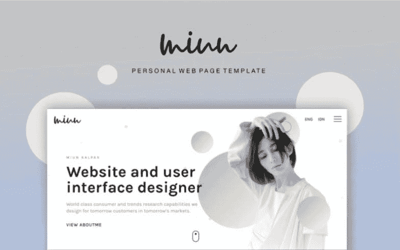
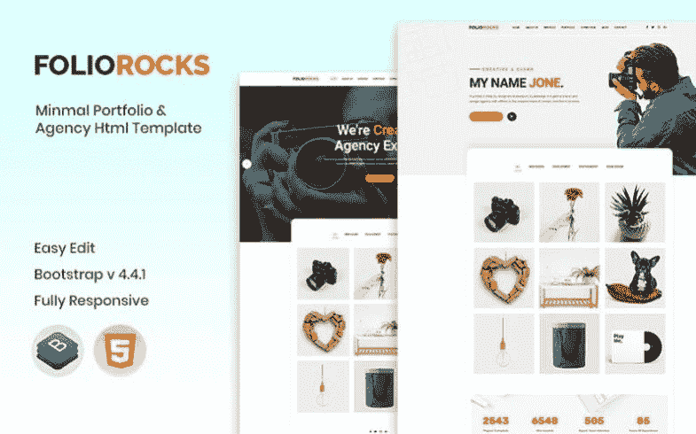
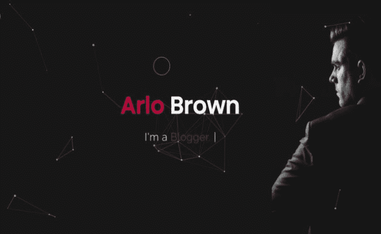
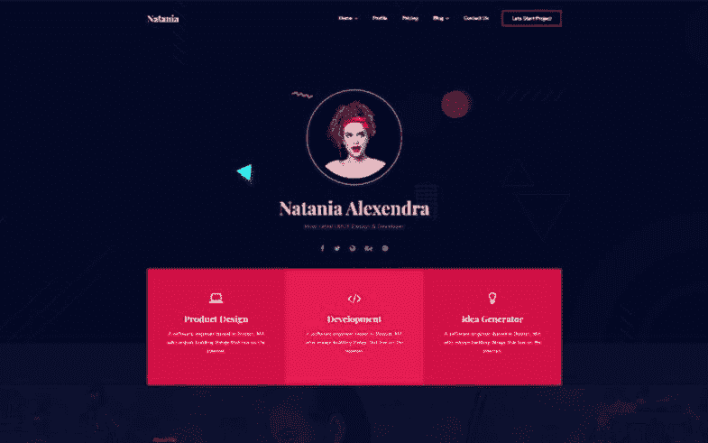
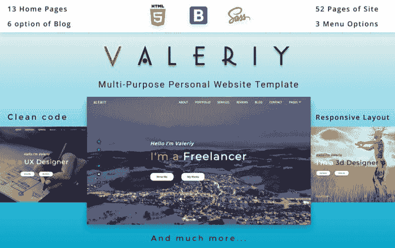

# 走出舒适区的 6 大 Web 开发人员组合模板

> 原文：<https://medium.com/javarevisited/top-6-web-developer-portfolio-templates-to-step-out-of-the-comfort-zone-b2d26de9cad4?source=collection_archive---------3----------------------->

每个 web 开发人员组合都允许告诉人们你是谁，你做什么，以及如何与你联系。然而，它比这更大。这是你展示专业技能和个人项目的机会。可以突出自己的奖项，得到更多的认可。

如果一个人有正确的在线展示，实现梦想就更容易了。今天，我们想分享几个不可思议的选择，值得你关注。让我们熟悉它们和它们允许实现的任务。

# 勇气

[**更多信息**](https://www.templatemonster.com/website-templates/grit-portfolio-cv-resume-html-website-template-101668.html?aff=javarevisited&utm_campaign=webdeveloper_portfolio&utm_source=javarevisited&utm_medium=referral)

Grit 是一个优雅的 web 开发人员组合，允许从人群中脱颖而出。它将尽可能好地展示你的数字作品。除此之外，你还可以自由地用它制作简历。

# 在 Grit 模板中寻找什么？

1.易于使用的定制流程。你可以改变必要的元素，让它们表达你的想法。

2.完全响应的设计。无论使用什么设备，人们都可以查看您的投资组合。

3.多功能博客功能。这里可以分享一些与设计相关的建议。

4.联系方式。多亏了它，每个人都有机会接触到你。

不要忘记看看这些组合设计的例子，以获得一些 [UX 设计组合](https://www.youtube.com/watch?v=mj5PuoaTmHE)的灵感:

UX 设计作品集灵感

# 米恩

[**更多信息**](https://www.templatemonster.com/website-templates/miun-personal-webpage-website-template-101675.html?aff=javarevisited&utm_campaign=webdeveloper_portfolio&utm_source=javarevisited&utm_medium=referral)

探索这个极简主义的 web 开发人员组合，为您的创造性工作带来一个焦点。让每个人都关注你的成就和项目不费吹灰之力。它使用了所有现代技术，包括 Bootstrap。

# 在 Miun 模板里找什么？

1.它有一个动画布局。与它一起，你可以自由地为你的访问者提供交互式的用户体验。

2.毫无疑问，个性化你的网站是可能的。利用多种选择将你的网络开发服务变成一个品牌。

3.您可以添加社交媒体集成。在这种情况下，传播你的活动应该更舒服。

4.由于有相关页面，共享您的联系人是可能的。在这里，人们也可以通过填写联系表格来回答他们的问题。

# 对叶岩

[**更多信息**](https://www.templatemonster.com/website-templates/foliorocks-portfolio-agency-website-template-101466.html?aff=javarevisited&utm_campaign=webdeveloper_portfolio&utm_source=javarevisited&utm_medium=referral)

另一个不可思议的模板，可以推广你的网站开发者组合和代理。它使您能够扩大受众，并使您的服务得到全球认可。它的软件包包括多种有用的工具。

# 在 FolioRocks 模板中寻找什么？

1.您可以从四种主页布局中进行选择。它们中的每一个都有可能以独特的方式呈现您的服务。

2.它包括各种预先设计的页面。例如，您有机会分享您的定价、团队和评价。

3.你可以利用社交媒体的整合。人们将可以访问您的个人资料，使您的业务更容易访问。

4.不要忘记博客的功能。它应该鼓励你的潜在客户采取行动。

顺便说一句，在隔离期间拯救你的观众可能有点困难。因此，请务必找出如何在封锁期间[停止丢失项目](https://www.youtube.com/watch?v=hc5K2bzGgJY):

在锁定期间停止丢失项目

# 威利·旺卡

[**更多信息**](https://www.templatemonster.com/website-templates/101269.html?aff=javarevisited&utm_campaign=webdeveloper_portfolio&utm_source=javarevisited&utm_medium=referral)

熟悉这个卓越的 web 开发人员组合网站模板。老实说，这是一个普遍的选择。多亏了它，你也可以自由地谈论你的创业或自由职业服务。我们应该浏览一下它的基本功能，看看它是否适合你。

# 在威利·旺卡模板中寻找什么？

1.黑色的原创设计。毫无疑问，许多人会觉得它在视觉上很吸引人，令人印象深刻。

2.全功能的社会融合。你可以自由添加链接到你的个人资料，并吸引你的核心受众。

3.联系方式。如果有人想问你几个问题，他或她可以利用联系方式。

4.博客功能。为了分享你的更新和最新消息，你可以写很多关于它们的帖子。想了解更多这个话题，可以查看 Himani Bansal 的 [**博客之旅**](/javarevisited/my-blogging-journey-with-data-science-45e2c0258acd) 。

# 纳塔尼亚

[**更多信息**](https://www.templatemonster.com/website-templates/101275.html?aff=javarevisited&utm_campaign=webdeveloper_portfolio&utm_source=javarevisited&utm_medium=referral)

这个超级漂亮的 web 开发人员组合模板可以激发对您的服务的更多兴趣。毫无疑问，它拥有所有必要的工具。我们希望你能了解它们和它们的好处。

# 在 Natania 模板中寻找什么？

1.首先，它有三个演示可供选择。他们每个人都提供了一个引人注目的外观。此外，你可以随时转向几个博客页面布局。

2.为了获得对你的服务的更多信任，你可以添加一个结构良好的页面，上面有他们的价格。它也有推荐书来分享你的客户的意见。

3.联系方式可以让我们与您取得联系，并获得必要的详细信息。

4.多亏了社交整合，你可以在广为人知的网络中包含你个人资料的所有链接。

如今，没有理由停止用你的投资组合赚钱。了解如何在隔离期间找到更多的[客户](https://www.youtube.com/watch?v=B3eTLu1-C8s)，以及这些给自由职业者的实用建议:

如何在隔离期间找到客户？

# 瓦列里

[**更多信息**](https://www.templatemonster.com/website-templates/valeriy-multi-purpose-personal-website-template-100745.html?aff=javarevisited&utm_campaign=webdeveloper_portfolio&utm_source=javarevisited&utm_medium=referral)

一个灵活且功能强大的 web 开发人员组合模板，可能会满足您的需求。它有一系列丰富的选项，会给你的想象力留下深刻印象。

1.首先，你可以从 13 种主页风格中选择。他们中的每一个都提供了许多内部预制页面来分享你灵魂想要的所有细节。

2.此外，可以使用多种工具来获得原始外观。其中包括三个菜单和四个滑块。不要忘记六种投资组合类型的可用性。

3.为了吸引最多的访问者，您可以实现视频和音频集成。

4.如果你添加一些动画效果，浏览你的网站将会更加令人兴奋。

你想有更多的工作选择吗？在这种情况下，你也可以通过这十个 [Photoshop 网站模板](/javarevisited/10-photoshop-website-templates-to-promote-your-photography-and-design-services-c289fd18a78e?source=false---------0)来为你的设计和摄影服务。

# 几句话作为结论

加上这些 [HTML5 作品集模板](https://www.templatemonster.com/category/personal-pages-website-templates/?aff=javarevisited&utm_campaign=webdeveloper_portfolio&utm_source=javarevisited&utm_medium=referral)，可能更容易给别人留下深刻印象。感谢他们，你可以解释为什么你的服务值得他们关注。

出于这个原因，试着在这些令人惊叹的选项中选择一些适合你的视觉的东西。感谢阅读！