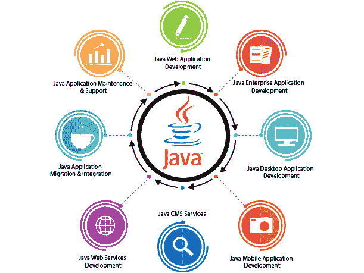
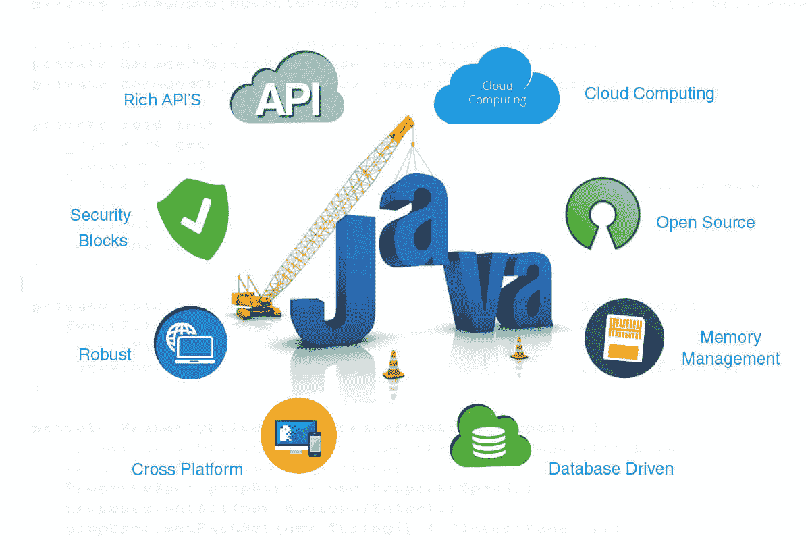

# Java 开发的 7 大引人注目的特征

> 原文：<https://medium.com/javarevisited/top-7-compelling-characteristics-of-java-development-df6d9a14d450?source=collection_archive---------1----------------------->

在这个技术驱动的世界里，应用程序开发行业发展如此之快，您对此感到惊讶吗？你知道这背后的原因是什么吗？

如今，全球约有 55 亿智能手机用户，应用程序开发在未来几年将是一个蓬勃发展的市场。因此，我们可以得出结论，应用程序开发行业需求增长背后的原因是智能手机用户和企业的快速增长。

假设您也注意到了革命性的业务趋势，并希望开发一个易于使用的应用程序。在这种情况下，是时候选择最佳编程语言来创建满足目标受众需求的应用程序了。

然而，当谈到应用程序开发解决方案时，我经常会收到这样的问题:

*   *投资哪种编程语言最好？*
*   *Java 适合我的企业吗？*
*   *Java 编程语言对商业有多好？*

你所有问题的答案是，Java 是最终选择的编程语言。它是构建高性能 web 应用程序的流行选择。

# Java 用在哪里？

所以很多新商人经常很困惑的问我“Java 一般用在哪里？”

[开发](https://www.standardfirms.com/top-java-web-app-development-companies/)统计显示，超过**30 亿**应用程序、设备和网站使用 Java 运行。

以下是 Java 编程语言的一些最常见的应用:

*   [**安卓应用开发**](/hackernoon/top-5-courses-to-learn-android-for-java-programmers-667e03d995b4)

你会惊讶地发现，你在 Android 手机上使用的许多应用程序都是用 Java 编程语言编写的。

这告诉我们许多关于仍有待实现的潜力。

谷歌 PlayStore 上最受欢迎的应用是 Whatsapp、Linkedin、脸书、Flipkart 和许多其他游戏应用。

*   [**Web 应用开发**](/javarevisited/top-5-programming-languages-for-web-development-in-2021-f6fd4f564eb6)

Java 使用和应用密集的另一个行业是编写 web 应用程序和电子商务应用程序/网站。

随着电子商务的发展，使用 Java 进行 web 开发的范围扩大了。例如 SAP、NetSuite、网飞、Alfresco、Youtube、Google、Liferay、Mifox(银行解决方案)等。

*   [**大数据**](/javarevisited/top-5-big-data-frameworks-java-developers-can-learn-in-2021-9a3e20437c8c)

公司现在正在处理大量的数据。像 Hadoop 这样的大数据管理工具以多种方式使用 Java。

*   **其他**

有许多软件工具和开发工具是用 Java 编写的，以方便软件开发的任务。

# 7 个理由:为什么 Java 编程语言是 2021 年的最优选择？

有几个令人信服的理由鼓励你[雇佣最好的 Java 开发人员](https://www.pixelcrayons.com/hire-Java-developers)来开发完全符合你的业务需求和预算的应用程序。

1.  **面向对象的编程语言**

OOP 使 Java 成为开发者和企业家中最受欢迎的编程语言。

Java 是一种面向对象的语言，这意味着它遵循一种包括类、对象、继承等概念的编程风格。

开发面向对象的编程应用程序要容易得多，因为它有助于保持系统的模块化、灵活性和可扩展性。

虽然 Java 允许你使用面向对象的设计模式，但它对于开发人员来说是用 Java 编码的最佳选择。

**2。一种开源编程语言**

如上所述，用 Java 开发应用程序时，开发人员可以利用源代码来定制应用程序的编码以满足他们的需求。

无需从头开始编写代码！

只需租用一个可以重新分发代码或使用相同代码进行开发的编码员。

此外，Java 还提供了一套出色的编程工具，使开发人员可以轻松地使用它们，并创建完全符合他们需求的应用程序。

[Java 编程语言](/javarevisited/top-5-java-online-courses-for-beginners-best-of-lot-1e1e240a758)也提供了大量的开源库，最终降低了应用程序开发的总成本，加快了开发过程。

**3。Java 有丰富的 API**

应用程序编程接口或 API 通过允许使用各种工具来帮助创建软件和应用程序。

现在，Java API 的伟大之处在于开发人员可以使用它们，即使他们不是很清楚编码结构的内部实现。

Java APIs 足够兼容，这使得它们适合与其他代码一起使用。

此外，有超过 4500 个 API 可供使用，所以开发者可以根据他们的具体需求选择任何人。

这些 API 提供了从 XML 解析到实用程序和数据库连接的几乎所有东西。

**4。对开发者的无缝社区支持**

像 [Android](/javarevisited/5-free-courses-to-become-an-android-developer-d4d207f53675) 一样，开发者也可以利用扩展社区无可挑剔的社区支持，让你在问题出现时尽快解决问题。

还没完呢！

开发人员社区欢迎所有开发人员，无论是新的还是有经验的，并实时提供急需的支持。

Java 开发人员可以从志同道合的开发人员那里获得关于这种[编程语言](/hackernoon/10-best-programming-languages-to-learn-in-2019-e5b05af4a972)的真正知识，并且他们可以广泛地扩展他们的网络。前瞻性开发者社区分享知识和相关信息，帮助初学者提高他们的编码技能。

你可能会问这对你的生意有什么帮助？

好吧，拥有更好的社区支持扩大了你接触顶级 Java 开发公司的机会。

**5。通用编程语言**

Java 非常通用，这意味着它可以在所有平台上使用。

对于不同的操作系统来说，编程语言是独立于平台的，这就是为什么它受到开发者和企业主的欢迎，而不管各自的操作系统。

流行的 Java 口号是“键入一次，在任何地方运行”，这意味着 Java 字节码可以在任何硬件上运行。

简单地说，这意味着在 Windows 环境中创建的应用程序可以轻松地在任何其他平台上运行。这为开发人员在不同平台上部署单一代码提供了极大的灵活性。

**6。出色的文档支持**

Javadoc 是一份优秀的文档，它为开发人员提供了关于 Java 扩展的扩展信息。

Javadoc 的开发目的是让开发人员更容易编码，并轻松使用一组类。

不是每个人都有时间去学习一个类是如何工作的，所以为了让这些专业人员更容易，Javadocs 创造了奇迹。

**7。Java 可以免费访问**

你不喜欢免费的东西吗？那么，为什么不为移动应用程序选择 Java 应用程序开发服务呢？

你可以雇佣 java 开发人员来学习更多关于这种编程语言的知识，以最低的成本开发一个应用程序。因为面向开发人员的 Java 入门是免费的。

由于 Java 没有提供价格，这也有助于 Java 在个人程序员和大型组织中流行起来。如果你已经对开始使用 Java 编程语言感到好奇，最后去见见最有信誉的 Java 应用程序开发公司。

# 结论

毫无疑问，Java 语言有一个光明的未来。Java 的灵活性、卓越的网络安全和高速特性使公司能够创建健壮的软件解决方案，为他们的业务增加价值。

简而言之，开发 web/移动应用程序的技术选择完全是主观的，应该基于用例、当前场景和未来目标，当然，还有可负担性。

毫无疑问，Java 的好处是巨大的，只有在正确的[软件开发公司的帮助下，公司才能充分利用这些好处。](https://www.pixelcrayons.com/custom-software-development-services)

到那时，这就是 java 开发的全部好处。如果您有任何其他疑问或建议，欢迎在下面评论。