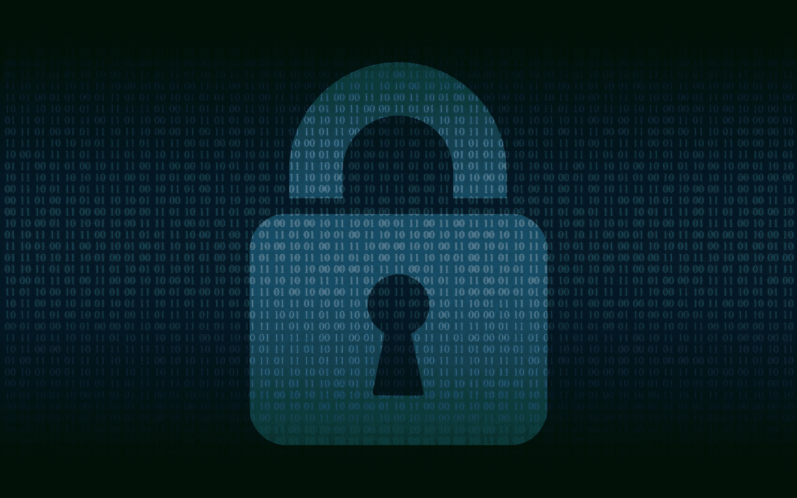
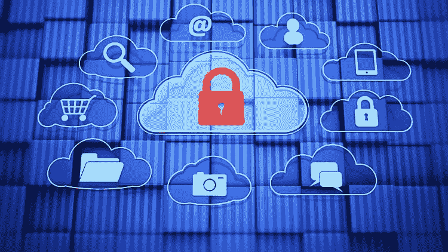
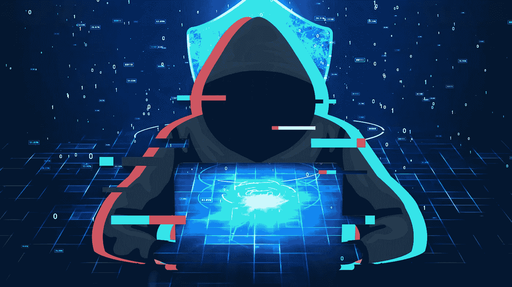
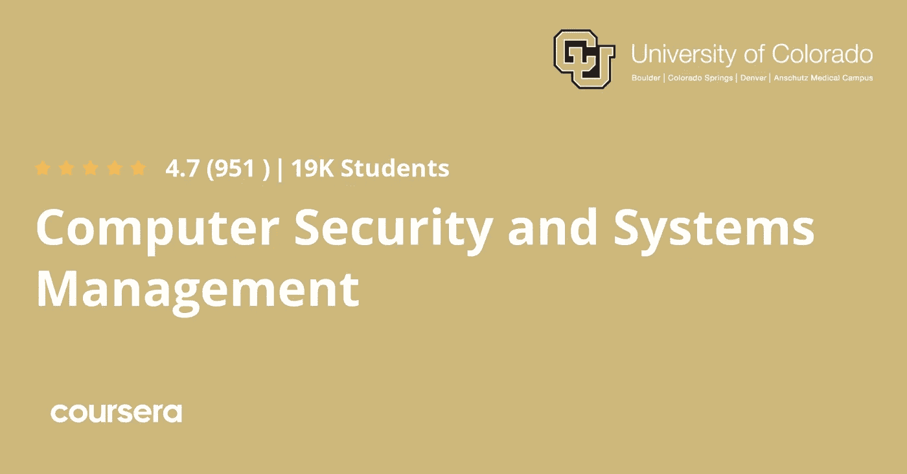
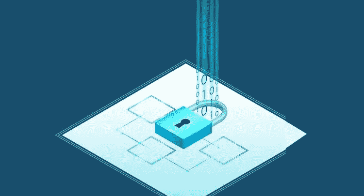
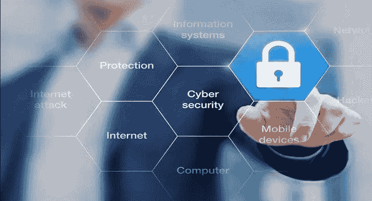

# 2022 年 7 门最佳计算机安全和 IT 安全初学者课程

> 原文：<https://medium.com/javarevisited/top-7-courses-to-learn-computer-security-and-it-security-for-beginners-in-2022-1d8833aae85f?source=collection_archive---------0----------------------->

## 从 Udemy、Coursera 和 Pluralsight 获得的深入学习计算机安全的最佳在线课程的精选列表。

大家好，如果你想了解 2022 年的计算机安全和 IT 安全，并寻找最好的在线课程和教程，那么你来对地方了。

早些时候，我已经分享了 [**最佳网络安全课程**](https://javarevisited.blogspot.com/2020/03/top-5-courses-to-learn-cyber-security.html) 和 [**最佳网络安全课程**](https://javarevisited.blogspot.com/2021/10/top-5-courses-to-learn-web-security-in.html) ，在这篇文章中，我将分享免费的在线课程，供初学者学习计算机安全，无论是技术人员还是非技术人员。

计算机安全是一个复杂的学习领域，但每个人都必须学会保护自己和他们的公司，不让坏人访问他们不应该访问的敏感信息。

我们总是在报纸上听到邪恶的人如何伤害公司和人民，并使世界每年损失数十亿美元。看起来坏人正在赢得与大公司和安全新手的斗争。

不过，你可以通过参加一些课程来改变这种情况，这些课程至少会教你计算机和网络安全的基础知识，以及这些家伙如何使用许多技术(如社会工程)访问你的计算机和信息，并阻止他们。

如果你想学习计算机安全，并且正在寻找学习计算机安全的最佳课程，那么请继续阅读这篇文章，在这篇文章中，我们将回顾 2022 年学习计算机安全和 IT 安全的最佳在线课程。

如果你决心在网络安全领域发展事业，那么我也推荐你参加 Udemy 网站上内森·豪斯的 [**完整网络安全课程**](https://click.linksynergy.com/deeplink?id=JVFxdTr9V80&mid=39197&murl=https%3A%2F%2Fwww.udemy.com%2Fcourse%2Fthe-complete-internet-security-privacy-course-volume-1%2F) 。Nathan 是一位著名的网络安全专家，这门课程非常有价值，但你可以在 Udemy sales 上花 9.9 美元获得，这是一种免费的学习

而且，如果你想开始一个网络安全职业生涯，并且需要替代品，那么 Coursera 的这个 [**网络安全专业**](https://coursera.pxf.io/c/3294490/1164545/14726?u=https%3A%2F%2Fwww.coursera.org%2Fspecializations%2Fcyber-security) 也不错

<https://coursera.pxf.io/c/3294490/1164545/14726?u=https%3A%2F%2Fwww.coursera.org%2Fspecializations%2Fcyber-security>  

# 2022 年初学者学习的 7 门最佳计算机安全在线课程

在不浪费你更多时间的情况下，这里列出了 2022 年初学者可以参加的最好的计算机安全课程。这些课程是由专家创建的，来自网站 [Udemy](https://javarevisited.blogspot.com/2020/11/top-10-udemy-courses-you-can-buy-in.html) 、 [Coursera](https://javarevisited.blogspot.com/2020/02/10-best-coursera-courses--for-python.html) 和 [edX](https://javarevisited.blogspot.com/2021/05/top-10-edx-courses-and-certificates-for.html) ，它们也受到了 2022 年想学习计算机安全的数千人的信任。

## 1.[计算机安全:实践方法](https://click.linksynergy.com/deeplink?id=CuIbQrBnhiw&mid=39197&murl=https%3A%2F%2Fwww.udemy.com%2Fcourse%2Fdu-computer-security%2F)

假设你是计算机安全领域的初学者，想通过实践课程学习如何保护你最有价值的数字资产，也就是你的计算机。在这种情况下，你可能需要参加这个学习计算机安全的实用课程。

您将讨论安全隐患以及坏人会如何伤害您，然后您将了解黑客如何利用电子邮件和短信应用程序获取您的信息，以及您如何应对他们。

您将发现过去发生的一些最重大的违规事件、将利用和损害您的计算机的不同种类的恶意软件，以及如何评估您的计算机安全性。

最后，了解加密以及如何保护您的敏感信息。

**这是参加本课程** — [计算机安全:实践方法](https://click.linksynergy.com/deeplink?id=CuIbQrBnhiw&mid=39197&murl=https%3A%2F%2Fwww.udemy.com%2Fcourse%2Fdu-computer-security%2F)的链接

## 2.[从头开始学习道德黑客](https://click.linksynergy.com/deeplink?id=CuIbQrBnhiw&mid=39197&murl=https%3A%2F%2Fwww.udemy.com%2Fcourse%2Flearn-ethical-hacking-from-scratch%2F)

另一个很好的课程是学习网络安全，这是黑客利用你的电脑的另一种方式。本课程将更侧重于网络安全，以及他们如何能够刺探您的敏感数据并访问您的计算机。

从学习网络漏洞和评估其安全性开始，您将设置您的环境并在 VirtualBox 上安装 kali Linux。你将学习终端的一些基本命令，以及如何在网上匿名冲浪。

稍后，您将了解网络足迹，它定义了网络内部的服务和操作系统，并且在您知道如何利用它们之后。

**这里是加入道德黑客课程的链接**——[从头开始学习道德黑客](https://click.linksynergy.com/deeplink?id=CuIbQrBnhiw&mid=39197&murl=https%3A%2F%2Fwww.udemy.com%2Fcourse%2Flearn-ethical-hacking-from-scratch%2F)

## 3.[网络安全& Bug 赏金:2022 年学会渗透测试](https://academy.zerotomastery.io/p/learn-penetration-testing?affcode=441520_zytgk2dn)

这是 ZTM 学院 2022 年学习网络安全和渗透测试的最佳在线课程之一，我鼓励每个人都参加这个课程来学习网络安全。大多数人对他们的网上个人安全不够重视。

事实上，大多数人甚至没有基本的知识，这可能会使您容易受到各种攻击。我们的生活变得越来越数字化，这就是为什么掌握网络安全知识是非常必要的。

但是这门课远不止这些。在这个课程中，你可以学习渗透测试并开始职业生涯或通过成为一名 Bug 赏金猎人来获得兼职收入。本课程将教你如何修复漏洞，提高网络安全性，等等。

您将从头开始学习渗透测试，并掌握 2022 年最现代的笔测试工具和最佳实践！

**这里是加入这个安全课程的链接** — [网络安全& Bug 赏金:2022 年学习渗透测试](https://academy.zerotomastery.io/p/learn-penetration-testing?affcode=441520_zytgk2dn)

顺便说一句，你需要一个 [**ZTM 会员**](https://academy.zerotomastery.io/a/aff_c0gnlvf7/external?affcode=441520_zytgk2dn) 才能观看这个课程，这个课程每月花费大约 39 美元，但也提供了许多像这样的超级吸引人和有用的课程。您还可以使用折扣优惠券代码 FRIENDS10 获得您选择的任何订阅的 10%折扣。

<https://academy.zerotomastery.io/a/aff_c0gnlvf7/external?affcode=441520_zytgk2dn>  

## 4.[计算机安全与系统管理](https://coursera.pxf.io/c/3294490/1164545/14726?u=https%3A%2F%2Fwww.coursera.org%2Fspecializations%2Fcomputer-security-systems-management)【Coursera 课程】

本课程旨在通过学习理论和现实世界的例子，教导那些希望为某个组织工作并保护自己和公司免受网络攻击的人，这些攻击会损害整个公司及其基础设施。

您将讨论企业计算系统和您的家庭环境之间的差异，了解 CIA triad 并将其应用于企业系统。然后，您将了解 windows 服务器安全性及其保护，以及 Linux 服务器管理。

最后，您将了解构建安全系统管理的要求。总体 2022 年学习计算机安全和系统管理的完整课程。

**这是参加本课程的链接**——[计算机安全和系统管理](https://coursera.pxf.io/c/3294490/1164545/14726?u=https%3A%2F%2Fwww.coursera.org%2Fspecializations%2Fcomputer-security-systems-management)

顺便说一下，如果你觉得 Coursera 的课程很有用，因为它们是由世界各地的知名公司和大学创建的，我建议你加入 Coursera 的 [**Coursera Plus**](https://coursera.pxf.io/c/3294490/1164545/14726?u=https%3A%2F%2Fwww.coursera.org%2Fcourseraplus) ，这是 Coursera 的一个订阅计划，让你可以无限制地访问他们最受欢迎的课程、专业、专业证书和指导项目。

<https://coursera.pxf.io/c/3294490/1164545/14726?u=https%3A%2F%2Fwww.coursera.org%2Fcourseraplus>  

## 5.[计算机基础:安全](https://pluralsight.pxf.io/c/1193463/424552/7490?u=https%3A%2F%2Fwww.pluralsight.com%2Fcourses%2Fcomputer-fundamentals-security)【多视角课程】

最后一门课程适合没有高级要求的初学者，它将讨论许多主要话题，使您的环境更加安全，其他人更难访问您的信息。

首先，您将了解物理安全，以及如果邪恶的人将您的计算机或任何设备掌握在手中，他们会做些什么。然后，您将学习像身份验证和授权这样的逻辑安全性。您将学习如何保护您的网络，防止恶意软件入侵您的系统。

你以后会明白黑客如何利用社会工程来欺骗你提供你的敏感信息。

最后，您将了解加密以及如何保护您的手机免受不同类型的攻击。总的来说，这是一门从头开始学习计算机安全的好课程。

**这是参加本课程的链接**——[计算机基础:安全](https://pluralsight.pxf.io/c/1193463/424552/7490?u=https%3A%2F%2Fwww.pluralsight.com%2Fcourses%2Fcomputer-fundamentals-security)

顺便说一下，你需要一个 Pluralsight 会员才能参加这个课程，费用大约是每月 29 美元或每年 299 美元(14%的折扣)。我向所有程序员强烈推荐这个订阅，因为它提供了超过 7000 个在线课程的即时访问，以学习任何技术技能。或者，你也可以使用他们的 [**10 天免费通行证**](https://pluralsight.pxf.io/c/1193463/424552/7490?u=https%3A%2F%2Fwww.pluralsight.com%2Fpricing%2Ffree-trial) 免费观看这个课程。

<https://pluralsight.pxf.io/c/1193463/424552/7490?u=https%3A%2F%2Fwww.pluralsight.com%2Fpricing%2Ffree-trial>  

## 6.[保护您的电脑](https://click.linksynergy.com/deeplink?id=CuIbQrBnhiw&mid=39197&murl=https%3A%2F%2Fwww.udemy.com%2Fcourse%2Fsecuring-your-pc-a-complete-novices-step-by-step-guide%2F)【我的课程】

这是一门入门课程，将教 IT 领域的初学者如何采取一些简单的步骤，通过了解坏人使用的简单技术来保护自己的计算机免受黑客攻击。

您将对互联网的安全性有一个总体的了解，然后了解密码以及如何保护自己免受这类攻击，比如使用密码管理器。您将了解 windows 防火墙如何工作并保护您，以及免费和付费防病毒软件之间的区别。

您将了解网络钓鱼和保护您的网络，以及加密您的磁盘将如何帮助您保护您的敏感信息。

**以下是参加本安全课程的链接** — [保护您的电脑](https://click.linksynergy.com/deeplink?id=CuIbQrBnhiw&mid=39197&murl=https%3A%2F%2Fwww.udemy.com%2Fcourse%2Fsecuring-your-pc-a-complete-novices-step-by-step-guide%2F)

## 7. [IT 安全 101 —新手网络安全](https://click.linksynergy.com/deeplink?id=JVFxdTr9V80&mid=39197&murl=https%3A%2F%2Fwww.udemy.com%2Fcourse%2Fit-security-101-protecting-and-securing-computer-networks%2F)

这是另一个很棒的 Udemy 课程，学习网络安全最佳实践技巧，保护计算机网络免受内部和外部 IT 网络安全威胁。

如果您是一名 IT 专业人员，并且希望了解计算机安全和一般的 IT 安全，那么本课程是一个很好的起点。在本课程中，您将学习如何保护您的计算机网络免受任何内部和外部的网络安全威胁，无论是从技术角度还是从人的角度。

以下是您将在本课程中学到的重要内容:

1.  如何防止网络钓鱼和电话诈骗，包括识别时需要注意的事项
2.  如何避免组织网络中正在使用的设备的网络安全设置的常见错误。
3.  密码策略和防止贵组织的最终用户之间共享凭据。

本课程还提供了这些安全漏洞的真实例子以及如何避免它们。

以下是参加本课程的链接— [IT 安全 101 —初学者网络安全](https://click.linksynergy.com/deeplink?id=JVFxdTr9V80&mid=39197&murl=https%3A%2F%2Fwww.udemy.com%2Fcourse%2Fit-security-101-protecting-and-securing-computer-networks%2F)

以上就是关于**2022 年初学者学习计算机安全的最佳在线课程**。学习计算机安全对于每个使用计算机进行工作和社交媒体的人来说都是至关重要的，因为黑客变得越来越聪明，并不断试图发现新的方法来攻击您的计算机并利用您的信息。

其他**认证资源**针对 **IT 专业人士**和 Java 程序员

*   [面向初学者的 5 门免费网络安全课程](https://javarevisited.blogspot.com/2021/10/top-5-free-cyber-security-courses-for.html)
*   [经验丰富的 Java 开发人员的五大职业选择](https://javarevisited.blogspot.com/2018/10/top-5-carrer-options-for-experienced-java-programmers.html)
*   [现代网络开发人员应该学习的 10 件事](/javarevisited/10-things-aspiring-web-developers-should-learn-in-2021-6747bfbfc12e)
*   [十大移动应用开发框架和库](/@javinpaul/10-frameworks-and-libraries-mobile-application-developers-can-learn-in-2020-e0b91391cade)
*   [完整的 Java 开发者路线图](https://javarevisited.blogspot.com/2019/10/the-java-developer-roadmap.html)
*   [2022 年 Java 程序员可以学到的 21 项技术技能](https://javarevisited.blogspot.com/2020/03/top-20-skills-java-developers-can-learn.html#axzz6k4XBgTw4)
*   [学习 Linux 命令行的 5 门免费课程](https://hackernoon.com/top-5-free-linux-courses-for-programmers-4a433b4edade)
*   [破解任何编码面试的 5 个关键技巧](https://javarevisited.blogspot.com/2020/04/5-essential-skills-to-crack-coding-interviews.html)
*   [给初学者的 6 门最佳道德黑客课程](/javarevisited/6-best-ethical-hacking-courses-to-learn-online-fe1fe171d05)
*   [如何在 2022 年成为 DevOps 工程师](https://javarevisited.blogspot.com/2018/09/the-2018-devops-roadmap-your-guide-to-become-DevOps-Engineer.html)
*   [2022 年通过 CompTIA Security+考试的 5 门最佳课程](https://javarevisited.blogspot.com/2020/06/top-5-courses-to-crack-comptia-security-certification-exam-sy0-501.html)
*   [每个开发人员都应该学习的 10 个 Linux 命令选项](https://javarevisited.blogspot.com/2020/08/10-examples-of-essential-linux-commands.html#axzz6nH4euiJX)
*   [5 个免费学习 Python 编码的网站](https://javarevisited.blogspot.com/2019/09/5-websites-to-learn-python-for-free.html)
*   [面向开发人员和安全工程师的 7 门 Linux 课程](/javarevisited/7-best-linux-courses-for-developers-cloud-engineers-and-devops-in-2021-7415314087e1)
*   [10 门针对初学者的免费渗透测试课程](/javarevisited/10-free-courses-to-learn-ethical-hacking-and-penetration-testing-for-beginners-84e40104aa6c)

感谢您阅读本文。如果你喜欢这些*最佳计算机安全在线课程*，那么请与你的朋友和同事分享。如果您有任何问题或反馈，请留言。

**附言** —如果你决心在网络安全领域发展，那么我也推荐你参加 Udemy 网站上内森·豪斯的 [**完整网络安全课程**](https://click.linksynergy.com/deeplink?id=JVFxdTr9V80&mid=39197&murl=https%3A%2F%2Fwww.udemy.com%2Fcourse%2Fthe-complete-internet-security-privacy-course-volume-1%2F) 。我向专业开发人员和任何想开始网络安全职业生涯的人强烈推荐这个网络安全课程，或者 Coursera 的这个 [**网络安全专业**](https://coursera.pxf.io/c/3294490/1164545/14726?u=https%3A%2F%2Fwww.coursera.org%2Fspecializations%2Fcyber-security) 也不错

<https://coursera.pxf.io/c/3294490/1164545/14726?u=https%3A%2F%2Fwww.coursera.org%2Fspecializations%2Fcyber-security> 