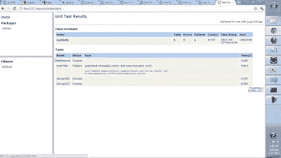
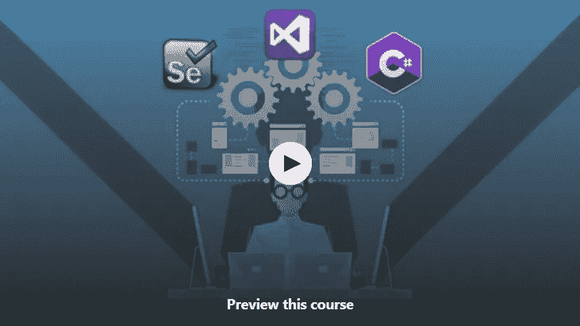
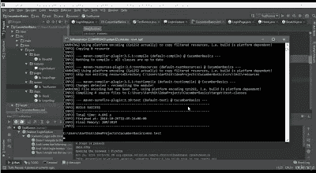
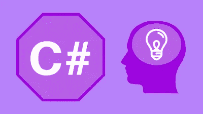
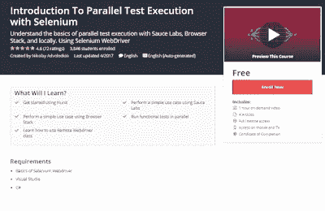

# 2023 年 7 门最好的免费 Selenium 在线课程供初学者学习

> 原文：<https://medium.com/javarevisited/top-7-courses-to-learn-selenium-for-java-and-c-developers-to-learn-automation-testing-free-and-e91637cd9622?source=collection_archive---------0----------------------->

## 这些是学习 Selenium for Automation Testing 使用 Java 和 C#编程语言的最好和最免费的在线课程。

马库斯·斯皮斯克在 [Unsplash](https://unsplash.com?utm_source=medium&utm_medium=referral) 上的照片

测试是[软件开发](/javarevisited/6-best-software-development-and-project-management-books-for-tech-leads-and-project-managers-5a82a6fbed6b)不可或缺的一部分，我们长期以来一直依赖测试人员和 QA 专业人员的手动测试来交付高质量的软件和发现错误，但这不再是可持续的了。

如今，自动化测试越来越受到关注，Selenium 正以其 web 驱动程序引领潮流。之前，我已经分享了学习软件测试的 [**最佳课程**](/javarevisited/10-best-software-testing-courses-for-beginners-a8c625b89664) 在这篇文章中，我将分享 2023 年初学者学习 Selenium 的最佳免费课程。

如果你不知道什么是硒，这里有一个快速介绍。Selenium 是一个免费的 web 应用程序自动化测试工具。它可以与 Chrome、Firefox、Internet Explorer、Opera 等不同的网络浏览器一起工作，并模拟类似人类的行为。

通过使用 Selenium，您可以以编程方式与网页上的所有不同元素进行交互。你可以点击它们，输入文本，提取文本等等。Selenium 也完全不同于其他 QA 自动化工具，如 QTP、Win Runner、Load Runner 等，它允许您记录和回放自动化测试。

Selenium 提供了一个 API，可以让你自动化网页上的一切。您可以检查某个元素是否存在，或者某个元素有什么值。Selenium 允许你测试用任何语言编写的任何类型的网站，比如 [PHP](/javarevisited/top-10-free-courses-to-learn-php-and-mysql-for-web-development-e96e69982675) ， [Perl](https://javarevisited.blogspot.com/2021/11/top-5-courses-to-learn-perl-programming.html#axzz7CdcuJdWs) ， [Python](/better-programming/top-5-courses-to-learn-python-in-2018-best-of-lot-26644a99e7ec) ， [Java](/javarevisited/top-5-java-online-courses-for-beginners-best-of-lot-1e1e240a758) ， [C#](https://www.java67.com/2019/03/5-free-c-net-courses-to-learn-online.html) 等等。它还支持多种浏览器，如 Chrome、Firefox、Internet Explorer、Safari 和 Opera，这意味着您不仅可以在多种浏览器中自动测试您的应用程序。

Selenium 允许你在任何语言上编写自动化测试，比如 [Java](http://javarevisited.blogspot.sg/2017/11/top-5-free-java-courses-for-beginners.html#axzz4zuIICRs9) 、 [C#](https://javarevisited.blogspot.com/2019/11/top-5-courses-to-learn-c-sharp-in.html) 、Perl、 [Python](http://www.java67.com/2018/02/5-free-python-online-courses-for-beginners.html) 等等，但是 90%的公司将 Selenium 与 Java 结合使用，这意味着愿意学习 Selenium 进行自动化测试的手工测试人员也应该学习 Java。虽然你只需要知道核心的 Java basic，但是你不需要成为 Java 专家来编写 selenium 测试。

顺便说一下，如果你正在寻找一个全面的 Java 和 Selenium 课程，那么我强烈推荐你加入 Udemy 上 Rahul Shetty 的[**Selenium web driver with Java-Basics to Advanced+Frameworks 课程**](https://click.linksynergy.com/deeplink?id=JVFxdTr9V80&mid=39197&murl=https%3A%2F%2Fwww.udemy.com%2Fcourse%2Fselenium-real-time-examplesinterview-questions%2F) 。它不是免费的，但它是初学者最好的 Selenium 和 Java 在线课程之一。

<https://click.linksynergy.com/deeplink?id=JVFxdTr9V80&mid=39197&murl=https%3A%2F%2Fwww.udemy.com%2Fcourse%2Fselenium-real-time-examplesinterview-questions%2F>  

# 2023 年用 Java 和 C#学习 Selenium 的 7 门最佳免费在线课程

在这篇文章中，我将分享一些免费的在线课程，你可以用 [Java](/javarevisited/10-best-places-to-learn-java-online-for-free-ce5e713ab5b2) 和 [C#](/javarevisited/5-best-c-c-sharp-programming-courses-for-beginners-in-2020-494f7afc7a5c) 来学习 Selenium webdriver。你不需要学习两种语言，但是你可以选择你觉得舒服的语言。

例如，如果你是一名想学习项目自动化测试的 Java 开发人员，你可以参加用 Java 教授 **Selenium webdriver 的课程。**

类似地，如果你是一个用 C#编写 GUI 的 GUI 开发人员，那么你可以参加用 [C#](/javarevisited/9-free-c-c-sharp-courses-and-tutorials-for-beginners-and-intermediate-programmers-best-of-lot-dc8c793aab31) 教授 Selenium 自动化测试的课程。

这些主要是初级课程，会向你解释什么是 Selenium，它是如何工作的，它给开发者提供了什么好处。一些课程也是高级的，教授一些高级的主题，例如使用 Selenium 的并行测试执行。

事不宜迟，下面是我为 Java 和 C#开发者列出的最好的免费 Selenium 课程。

## 1、 [**Selenium WebDriver 培训用 Java 基础知识**](https://click.linksynergy.com/fs-bin/click?id=JVFxdTr9V80&subid=0&offerid=323058.1&type=10&tmpid=14538&RD_PARM1=https%3A%2F%2Fwww.udemy.com%2Fselenium-training%2F) **【免费】**

这是一个简短的课程，可以帮助您开始学习 Selenium automation，并学习其他集成测试库的基础知识，如 [JUnit](http://www.java67.com/2018/02/5-free-eclipse-and-junit-online-courses-java-developers.html) ，TestNG 等。在本课程中，您将首先学习使用 selenium 编写自动化测试所需的 Java 基础知识，然后作者将继续解释 Selenium 的关键概念，如什么是 Selenium，它与 QTP 和其他 QA 自动化工具有何不同，以及如何使用 Selenium web driver 测试 GUI。本课程还涉及数据库测试、Selenium 网格、Selenium 2.0 webdriver 和 Appium 安装。简而言之，对于完全初学者来说，自动化环境是一个很好的起点。

**这里是报名本课程的链接—**[**Selenium web driver Java 基础知识培训**](https://click.linksynergy.com/fs-bin/click?id=JVFxdTr9V80&subid=0&offerid=323058.1&type=10&tmpid=14538&RD_PARM1=https%3A%2F%2Fwww.udemy.com%2Fselenium-training%2F)

## [**2。硒与 C#和 Java 花絮**](https://click.linksynergy.com/fs-bin/click?id=JVFxdTr9V80&subid=0&offerid=323058.1&type=10&tmpid=14538&RD_PARM1=https%3A%2F%2Fwww.udemy.com%2Fselenium-csharp-and-java-titbits%2F) **【付费课程】**

这是 Selenium 的另一个免费课程，用简短的例子解释了 Java 和 C#中的一些 Selenium 概念。大多数主题都是从 StackOverflow 中提出的问题衍生出来的，但我发现这个课程足够好，可以学到一些有价值的东西，最重要的是它是免费的。

**这里是报名参加本课程的链接—** [Selenium with C#和 Java 花絮](https://click.linksynergy.com/fs-bin/click?id=JVFxdTr9V80&subid=0&offerid=323058.1&type=10&tmpid=14538&RD_PARM1=https%3A%2F%2Fwww.udemy.com%2Fselenium-csharp-and-java-titbits%2F)

您还将学习如何使用 selenium 进行拖放，如何悬停鼠标，如何使用 selenium 进行单击，以及如何使用弹出窗口和 XPath。本课程还解释了如何使用 Java 配置 Selenium 网格和设置并行执行。

总的来说，这是一门很好的用 Java 和 C#学习 Selenium 的实践课程。虽然这门课更侧重于 Java 而不是 C#。

## [**3。硒渣黄瓜(基础)**](https://click.linksynergy.com/fs-bin/click?id=JVFxdTr9V80&subid=0&offerid=323058.1&type=10&tmpid=14538&RD_PARM1=https%3A%2F%2Fwww.udemy.com%2Fcucumber-with-selenium%2F) **【免费课程】**

这是 Udemy 上的另一个免费硒课程，由创建前一个课程的同一作者卡蒂克·KK 提供。在本课程中，他解释了黄瓜和行为驱动发展以及硒，但更详细。

本课程分为两个部分，在第一部分，您将从头开始学习 cumber，以及 BDD 或行为驱动开发的基础知识。

**这里是报名本课程的链接—** [硒渣黄瓜(基础](https://click.linksynergy.com/fs-bin/click?id=JVFxdTr9V80&subid=0&offerid=323058.1&type=10&tmpid=14538&RD_PARM1=https%3A%2F%2Fwww.udemy.com%2Fcucumber-with-selenium%2F)

第二部分重点介绍 Selenium with cumber，在这里您将学习如何为 Selenium with cumber 编写一个简单的代码，并学习如何与页面对象模型进行交互。

您还将通过 [Maven](http://www.java67.com/2018/02/6-free-maven-and-jenkins-online-courses-for-java-developers.html) 学习如何使用黄瓜运行 Selenium，并使用 TestNG 运行黄瓜测试。本课程还涉及到黄瓜中硒含量的报告。

总体来说是一个快速学习 bot 黄瓜和硒的好课程。

## [**4。Selenium WebDriver 用 C#初学者+现场测试网站**](https://click.linksynergy.com/fs-bin/click?id=JVFxdTr9V80&subid=0&offerid=323058.1&type=10&tmpid=14538&RD_PARM1=https%3A%2F%2Fwww.udemy.com%2Fselenium-qa%2F) **【免费教程】**

这是另一个免费的 selenium，侧重于现场演示和动手实践。对于没有 Selenium 经验的手工测试人员、QA 实习生和 QA 专业人员来说，这是一门很好的课程。在本课程中，您将学习图形用户界面和功能测试，以及如何使用 Selenium 提供的各种选择器，例如名称选择器、 [ID 选择器](http://javarevisited.blogspot.sg/2014/05/jquery-class-and-id-selector-example.html#axzz4skcM1VYj)、类名选择器、CSS 路径选择器和 XPath 选择器。之后，你将学习如何使用一些常见的 HTML 元素，如输入文本框、复选框、单选按钮、下拉菜单和 JavaScript 警告框。我们还会有一些理论讲座，在这些讲座中，我会解释什么时候应该使用这些选择器，如何检查元素，什么是自动化测试框架，以及为什么我们需要学习如何创建一个自动化测试框架。

**这里是报名参加本课程的链接—**[Selenium web driver c#初学者用](https://click.linksynergy.com/fs-bin/click?id=JVFxdTr9V80&subid=0&offerid=323058.1&type=10&tmpid=14538&RD_PARM1=https%3A%2F%2Fwww.udemy.com%2Fselenium-qa%2F)

## [**5。黄瓜，硒&Java——2.5 小时开发一个框架！**](https://click.linksynergy.com/fs-bin/click?id=JVFxdTr9V80&subid=0&offerid=323058.1&type=10&tmpid=14538&RD_PARM1=https%3A%2F%2Fwww.udemy.com%2Fcucumber-selenium-java-develop-a-framework-in-25-hours%2F) **【免费 Udemy 课程】**

你是一个自动化测试人员，想要在你的简历中加入行为驱动开发(BDD)或者黄瓜吗？或者，有人经常听说黄瓜或 BDD，但对它们是什么以及它们解决了什么问题有一点点概念，那么这就是适合你的课程。

在本课程中，您将使用 Selenium WebDriver 和 Java 从初学者水平一直学习到相当高级的水平。

如果你学习这门课程，你还可以学习如何为 BDD 开发小型健壮的黄瓜框架。

课程还会教你小黄瓜、 [Maven](/javarevisited/top-10-free-courses-to-learn-maven-jenkins-and-docker-for-java-developers-51fa7a1e66f6?source=collection_home---4------3-----------------------) 、 [Eclipse](http://www.java67.com/2018/01/how-to-remote-debug-java-application-in-Eclipse.html) ，以及其他你需要用 Selenium 和 cumber 工作的相关工具，成为一名成功的自动化 QA 工程师。

**这里是报名本课程的链接——**[黄瓜，硒&Java——2.5 小时开发一个框架！](https://click.linksynergy.com/fs-bin/click?id=JVFxdTr9V80&subid=0&offerid=323058.1&type=10&tmpid=14538&RD_PARM1=https%3A%2F%2Fwww.udemy.com%2Fcucumber-selenium-java-develop-a-framework-in-25-hours%2F)

## [**6。Selenium 并行测试执行简介**](https://click.linksynergy.com/fs-bin/click?id=JVFxdTr9V80&subid=0&offerid=323058.1&type=10&tmpid=14538&RD_PARM1=https%3A%2F%2Fwww.udemy.com%2Fparallel-test-execution%2F)

这是 Selenium WebDriver 的高级课程之一。它旨在通过教你如何使你的自动化测试更快、更健壮，将你的软件测试技能提升到一个新的水平。课程还会教你调试和分析自动化测试失败。顺便说一句，它涵盖了足够的选项来帮助您并行运行测试，而不会让您被一堆微小的细节淹没。

在本课程中，您不仅将学习在您的机器上并行运行 Selenium Webdriver 测试，还将学习在浏览器堆栈和这样的实验室云上运行。

您还将学习如何配置和使用 RemoteWebdriver 类，并理解在云中并行运行测试的好处。

**这里是注册本课程的链接—**[Selenium 并行测试执行简介](https://click.linksynergy.com/fs-bin/click?id=JVFxdTr9V80&subid=0&offerid=323058.1&type=10&tmpid=14538&RD_PARM1=https%3A%2F%2Fwww.udemy.com%2Fparallel-test-execution%2F)

## [**7。Selenium Webdriver:什么是隐式和显式等待**](https://click.linksynergy.com/fs-bin/click?id=JVFxdTr9V80&subid=0&offerid=323058.1&type=10&tmpid=14538&RD_PARM1=https%3A%2F%2Fwww.udemy.com%2Fsynchronization%2F)

这是另一个关于 Selenium 的高级免费课程，教你如何正确使用 Selenium Webdriver 上的隐式和显式等待。如果您的自动化功能测试随机失败，并且您不确定原因是什么？如果您的团队对您的 Selenium Webdriver 测试的“不稳定性”感到沮丧，并且您想要修复这些问题并使您的测试更加稳定，那么这是适合您的课程。

在本课程中，您将了解到由于同步不当而可能出现的问题，如何使用 Selenium Webdriver 显式等待，以及如何掌握这些问题。您还将学习如何在适当的情况下使用各种不同类型的等待。

**这里是报名参加本课程的链接—** [Selenium Webdriver:什么是隐式和显式等待](https://click.linksynergy.com/fs-bin/click?id=JVFxdTr9V80&subid=0&offerid=323058.1&type=10&tmpid=14538&RD_PARM1=https%3A%2F%2Fwww.udemy.com%2Fsynchronization%2F)

以上是关于用 Java 或 C#学习 Selenium Web Driver 进行自动化测试的一些免费课程。如果您是一名手工测试人员、QA 工程师或 Java 开发人员，学习自动化测试会有很大的价值。

如果你在考虑 2023 年要学什么，那么用 Selenium 进行自动化测试是一个不错的选择。这不仅会让你成为一个更好的 QA 或开发者，还会给你的职业生涯一个推动。

其他**对程序员有用的资源**
[10 个框架 Java Web 开发者要学的](http://javarevisited.blogspot.sg/2018/01/10-frameworks-java-and-web-developers-should-learn.html#axzz53Soo0i1a)
[10 个编程语言探索](http://www.java67.com/2017/12/10-programming-languages-to-learn-in.html)
[5 个免费的 Spring 框架课程对 Java 程序员](http://www.java67.com/2017/11/top-5-free-core-spring-mvc-courses-learn-online.html)
[10 个免费的课程对初学者学习 JavaScript](/javarevisited/12-free-courses-to-learn-javascript-and-es6-for-beginners-and-experienced-developers-aa35874c9a32)
[15 个课程学习 AWS、Docker、 和 Kubernetes](/javarevisited/top-15-online-courses-to-learn-docker-kubernetes-and-aws-for-fullstack-developers-and-devops-d8cc4f16e773)
[10 门课程深入学习 AWS 和云计算](/javarevisited/top-10-courses-to-learn-amazon-web-services-aws-cloud-in-2020-best-and-free-317f10d7c21d)
[10 门免费课程学习面向初学者的 TypeScript](/javarevisited/top-10-free-typescript-courses-to-learn-online-best-of-lot-44bce9da41d1)
[25 个软件设计面试问题](/javarevisited/25-software-design-interview-questions-to-crack-any-programming-and-technical-interviews-4b8237942db0)
[8 个 Python 项目面向初学者的思路](/@javinpaul/8-projects-you-can-buil-to-learn-python-in-2020-251dd5350d56)
[5 门免费核心 Java 课程面向初学者的](http://www.java67.com/2017/11/top-5-free-core-spring-mvc-courses-learn-online.html)
[Top 5 Node JS 和 Express JS 课程面向 Web 开发人员](http://javarevisited.blogspot.com/2018/01/top-5-nodejs-and-express-js-online-courses-for-web-developers.html#axzz53Q2pdqNE)

感谢您阅读本文。如果你喜欢这些最好的免费的 Selenium Webdriver 课程，请与你的朋友和同事分享。如果您有任何问题或反馈，请留言。

如果你正在寻找一门全面的 Java 和 Selenium 课程，那么我强烈推荐你加入 Udemy 网站上 Rahul Shetty 的[**Selenium web driver with Java-Basics to Advanced+Frameworks 课程**](https://click.linksynergy.com/deeplink?id=JVFxdTr9V80&mid=39197&murl=https%3A%2F%2Fwww.udemy.com%2Fcourse%2Fselenium-real-time-examplesinterview-questions%2F) 。它不是免费的，但它是初学者最好的 Selenium 和 Java 在线课程之一。

<https://click.linksynergy.com/deeplink?id=JVFxdTr9V80&mid=39197&murl=https%3A%2F%2Fwww.udemy.com%2Fcourse%2Fselenium-real-time-examplesinterview-questions%2F> 