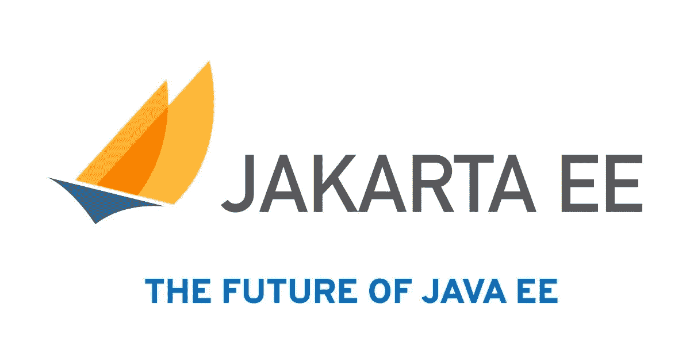
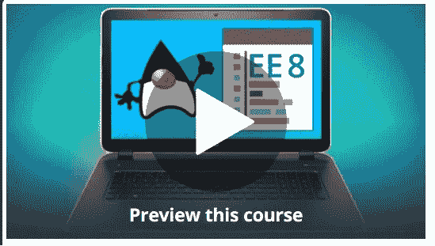
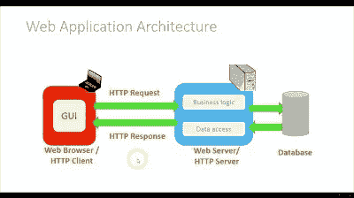
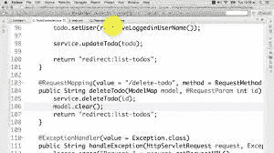
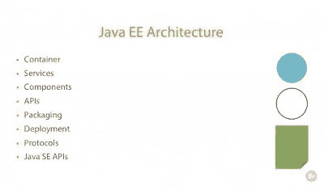
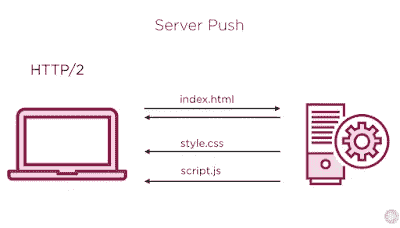

# 2023 年学习 Java EE (Jakarta EE)我最喜欢的课程

> 原文：<https://medium.com/javarevisited/top-7-online-courses-to-learn-java-ee-jakarta-ee-in-2020-216c1a5eea99?source=collection_archive---------0----------------------->

## 这些是 2023 年学习 Java EE (Jakarta EE)最好的课程

几年前发布了 Java 平台企业版 8 或 Java EE 8，以及 2017 年 9 月发布的 [Java 9](http://www.java67.com/2018/01/top-10-java-9-tutorials-and-courses.html) 。如果你是一名[的 Java 开发人员](https://hackernoon.com/tagged/java)或者想学习 Java EE 进行 web 开发并寻找一些课程来启动你的学习，那么你来对地方了。

在这篇文章中，我将分享**五门涵盖 Java EE 7 和 Java EE 8 的优秀 Java EE 课程**。如果您想知道什么是 Java EE 以及 Java EE 8 带来了什么，那么让我简单介绍一下 Java EE。

Java EE 是一个 Java 技术和 API 的集合，旨在支持“企业”应用程序，这些应用程序通常可以分为大型、分布式、事务性和高可用性应用程序，旨在支持关键业务需求。

它包含了一些你听说过的最流行的 Java 技术，像 [Servlet](http://www.java67.com/2018/02/5-free-servlet-jsp-and-jdbc-online-courses-for-java-developers.html) 、JSP、EJB、 [JAX-RS](https://javarevisited.blogspot.com/2018/02/top-5-restful-web-services-with-spring-courses-for-experienced-java-programmers.html) 、 [JDBC](http://www.java67.com/2018/03/top-5-free-jdbc-courses-for-java.html) 、JNDI、JMX、Java Mail、JTA、JTS、JAF、XML 等等。

此外，Java EE 8 的新版本支持 Java Servlet 4.0 API 和 HTTP/2 支持，增强的 JSON 支持，包括新的 JSON 绑定 API、新的 REST 反应式客户端 API、异步 CDI 事件、新的可移植安全 API、服务器发送事件支持(客户端和服务器端)，以及——最重要的——对 Java SE 8 新特性的支持(如[日期和时间 API](http://javarevisited.blogspot.sg/2015/03/20-examples-of-date-and-time-api-from-Java8.html) 、[流 API](http://www.java67.com/2014/04/java-8-stream-examples-and-tutorial.html) ，以及注释增强)。

关于 **Java EE 8，需要知道的另一件重要事情是 Oracle 发布的 Java EE 的最后一个版本，**现在，Oracle 已经将 Java EE 转移到一个开源基金会(Eclipse Foundation)，它被称为 Jakarta EE。

为什么会这样？嗯，甲骨文认为进入开源基金会可以增加开发者的参与，但是他们想控制 Java 商标；于是爪哇 EE 变成了**雅加达 EE** 。

# 2023 年 Java Web 开发人员的 5 门最佳 Java EE 课程

直到几年前，我个人喜欢阅读和从书中学习，但在我参加了几个关于 [Udemy](https://click.linksynergy.com/fs-bin/click?id=JVFxdTr9V80&offerid=323058.9409&type=3&subid=0) 和 [Pluralsight](http://pluralsight.pxf.io/c/1193463/424552/7490?u=https%3A%2F%2Fwww.pluralsight.com%2Flearn) (软件开发人员的网飞)的课程后，我的看法发生了变化。

现在，我从一个在线课程开始，然后阅读一本书来进一步巩固我的知识现在你知道什么是 Java EE，让我们进入这些课程，帮助你学习 Java EE。

如果您是在 Java EE 领域工作的 Java 开发人员，那么您可以从这些课程中受益。

## 1.面向初学者的 Java 企业版 8 课程

这是从零开始学习 Java EE 8 的一门非常棒的最新课程。在本课程中，您将学习 Jakarta EE、JPA、CDI、JAX-RS、REST、JWT、JSON-P 和 JSON-B 等。

您将了解什么是 JEE 规范和实现，以及如何使用它们，并理解各种 Java EE APIs 如何协同工作以使您成为一名高效的开发人员。

您还将了解如何使用 Java API Restful web 服务(JAX-RS)编写强大的 Web 服务，以及如何使用依赖注入 API (CDI)创建松散耦合的代码。

总的来说，如果你想在 2023 年学习 Java EE 8，这是一门很好的课程。它是由 Tim Buchalaka 的 Learn Programming Academy 创建的，已经得到了 3600 多名开发人员的信任。

以下是加入本课程的链接— [**Java EE 8 for 初学者**](https://click.linksynergy.com/deeplink?id=JVFxdTr9V80&mid=39197&murl=https%3A%2F%2Fwww.udemy.com%2Fjava-enterprise-edition-8%2F)

## 2.[拥有瓦丁、Spring Boot 和 Maven 的 Java EE](https://click.linksynergy.com/fs-bin/click?id=JVFxdTr9V80&subid=0&offerid=323058.1&type=10&tmpid=14538&RD_PARM1=https%3A%2F%2Fwww.udemy.com%2Fjava-ee-with-vaadin-spring-boot-and-maven%2F)

这是 Udemy 上最好最现代的 Java EE 课程之一。顾名思义，课程会教你相当多的技术，像 Vaadin 框架、Spring、Spring Security、Spring Boot、Maven、JPA、JBoss——wildly 等等。

但是，最重要的是，它遵循自上而下的方法，也就是说，它首先向您展示您将要构建的项目，然后解释您将如何通过教授创建该项目所涉及的每项技术来构建该项目。

即使你熟悉 [Spring](http://www.java67.com/2017/11/top-5-free-core-spring-mvc-courses-learn-online.html) 和 [Maven](http://www.java67.com/2018/02/6-free-maven-and-jenkins-online-courses-for-java-developers.html) ，你也会提高对这些平台的了解。

也是 CA 综合课程，18 个小时以上的内容。您将学到很多东西，比如设计模式、最佳编码实践，以及如何创建可维护的、健壮的软件。

正如我在这篇文章开头所说的，期末项目很棒，会教会你很多东西。这也给了你一个应用从课程中学到的知识的机会。

## 3.[Java EE 课程:从头构建一个 Java EE 应用](https://click.linksynergy.com/fs-bin/click?id=JVFxdTr9V80&subid=0&offerid=323058.1&type=10&tmpid=14538&RD_PARM1=https%3A%2F%2Fwww.udemy.com%2Fthe-java-ee-course%2F)

对于所有喜欢基于项目的学习的开发人员来说，这是一门很棒的[课程](https://click.linksynergy.com/fs-bin/click?id=JVFxdTr9V80&subid=0&offerid=323058.1&type=10&tmpid=14538&RD_PARM1=https%3A%2F%2Fwww.udemy.com%2Fthe-java-ee-course%2F)——我知道我肯定喜欢。根据我的个人经验，当我做一个项目并应用我从课程中学到的理论和实践时，我学到了最多，这就是我推荐这门课程的原因。

您将从头开始构建一个完整的 Java EE 航空公司管理应用程序，并在此过程中学习 Java EE 理论和实践。

在构建本课程的过程中，您将学习关键的 Java EE 技术，如用于构建健壮的后端和服务层的 EJB、用于在应用程序和数据库之间进行交互的 JPA、用于构建控制器和用户界面的 servlets 和 JSP，以及允许远程应用程序和 JavaScript 与应用程序进行交互的 [REST web 服务](https://javarevisited.blogspot.com/2017/02/how-to-consume-json-from-restful-web-services-Spring-RESTTemplate-Example.html#at_pco=smlwn-1.0&at_si=5a54c15f3ed286ce&at_ab=per-2&at_pos=0&at_tot=1)。

您还将了解 Java EE 中的资源和依赖注入，这对于编写干净的代码非常重要，这样的代码更容易扩展和测试。

## 4. [Java EE 变得简单:模式、架构和框架](https://click.linksynergy.com/fs-bin/click?id=JVFxdTr9V80&subid=0&offerid=323058.1&type=10&tmpid=14538&RD_PARM1=https%3A%2F%2Fwww.udemy.com%2Fjava-ee-design-patterns-architecture-and-frameworks%2F)

这可能是 Udemy 上[最受欢迎的 Java EE 课程](https://click.linksynergy.com/fs-bin/click?id=JVFxdTr9V80&subid=0&offerid=323058.1&type=10&tmpid=14538&RD_PARM1=https%3A%2F%2Fwww.udemy.com%2Fjava-ee-design-patterns-architecture-and-frameworks%2F)，已经有超过 5000 名学生注册了。

该课程提供了所有 Java EE 技术的一个很好的概述，如 JPA、JDBC、ORM、JNDI、EJB、JTA、DTO、VO、JAXB、JAX-RS、JAX-WS、AOP 和依赖注入。

更重要的是，您将了解重要的 [Java EE 模式](https://javarevisited.blogspot.com/2018/02/top-5-java-design-pattern-courses-for-developers.html)，如前端控制器、视图助手、复合视图、上下文对象、拦截过滤器、域模型、Facade、DTO/VO、DAO — [数据访问对象](http://javarevisited.blogspot.sg/2013/01/data-access-object-dao-design-pattern-java-tutorial-example.html#axzz4s6N7Y7Gb)和服务激活器。

这些图案也按它们使用的层进行分组，这样便于您记忆和使用它们。

总的来说，对于那些正在使用 Java EE 开发 web 应用程序[并希望了解全局的人，以及希望掌握 Java EE 模式的有经验的 Java 开发人员来说，这是一个完美的课程。](http://www.java67.com/2016/06/3-difference-between-web-server-vs-application-server-vs-servlet-container.html)

## 5. [Java EE 7 基础知识](https://pluralsight.pxf.io/c/1193463/424552/7490?u=https%3A%2F%2Fwww.pluralsight.com%2Fcourses%2Fjava-ee-7-fundamentals)

即使 Java EE 8 是最新版本，Java EE 7 仍然是最流行的 Java EE 版本。大多数公司都在 Java EE 6 和 Java EE 7 上运行他们的企业应用程序，向 Java EE 8 的迁移正在缓慢进行。

如果您碰巧在现有的 Java EE 7 应用程序上工作，并且希望更好地维护您的应用程序，那么这是您的最佳选择。

在[这门课程](https://pluralsight.pxf.io/c/1193463/424552/7490?u=https%3A%2F%2Fwww.pluralsight.com%2Fcourses%2Fjava-ee-7-fundamentals)中，您将了解 Java EE 平台如何从其历史发展到今天的现代平台，在 Java EE 中构建 web 应用程序的基础，以及如何将 Java EE 应用程序与外部服务进行互操作

这也是最全面的课程之一，由安东尼奥·冈萨尔维斯创建，他是 Java EE 领域的权威，也是畅销书[入门 Java EE 7](https://www.amazon.com/Beginning-Java-EE-Expert-Voice/dp/143024626X?tag=javamysqlanta-20) 的作者。

## 6.雅加达 EE(原爪哇 EE)快速入门课程

本课程是您使用 Jakarta EE(以前的 Java EE)平台开始企业 Java 开发的快速指南。在本课程中，您将构建一个简单的 Todo 应用程序，展示 3 个规范的 Java EE APIs。

通过这样做，您将使用 Java 持久性 API 从数据库中查询数据，并使用 RESTful Web 服务的 Java API 来创建简单的 Web 服务。您还可以使用上下文和依赖注入(CDI) API 来管理依赖关系

以下是加入本课程的链接— [**雅加达 EE 快速入门课程**](https://click.linksynergy.com/deeplink?id=JVFxdTr9V80&mid=39197&murl=https%3A%2F%2Fwww.udemy.com%2Fjakarta-ee-formerly-java-ee-quick-start-course%2F)

 [## 雅加达 EE(原爪哇 EE)快速入门课程

### 警告:如果你不想在 2019 年开始你的企业 Java 开发生涯，请不要参加本课程！什么…

udemy.com](https://click.linksynergy.com/deeplink?id=JVFxdTr9V80&mid=39197&murl=https%3A%2F%2Fwww.udemy.com%2Fjakarta-ee-formerly-java-ee-quick-start-course%2F) 

## 7.[Java EE 8 的新特性](https://pluralsight.pxf.io/c/1193463/424552/7490?u=https%3A%2F%2Fwww.pluralsight.com%2Fcourses%2Fjava-ee-8-whats-new)

Java EE 8 带来了一些非常酷的特性，比如 Servlet 4.0 API、HTTP 2.0 支持和一个新的 JSON 绑定 API。除此之外，它还支持那些非常有用的 Java SE 8 特性，如 Stream 和新的日期和时间 API，没有比参加[这个课程](https://pluralsight.pxf.io/c/1193463/424552/7490?u=https%3A%2F%2Fwww.pluralsight.com%2Fcourses%2Fjava-ee-8-whats-new)更好的快速学习这些特性的方法了。

在本课程中，您将首先了解全新的 JSON-B，这是一个用于将 Java 对象绑定到 [JSON](http://www.java67.com/2016/10/3-ways-to-convert-string-to-json-object-in-java.html) 的 API，反之亦然。用很少的代码，您将探索如何在没有任何第三方库的情况下生成和使用 JSON

您还将探索 Java 全新的安全 API，改进难以使用且通常特定于容器的安全机制。此外，您还将了解该版本中对 Java EE 技术的主要更新，例如 JPA 2.2、CDI 2.0 和 JSF 2.3，所有这些都在两个小时内完成！

如果你更喜欢这本书，想要更全面的覆盖面，那么你也可以看看 [**Java EE 8 食谱**](https://www.amazon.com/Java-Cookbook-applications-technology-development/dp/1788293037?tag=javamysqlanta-20) ，这是我最喜欢的学习 Java EE 8 的指南之一。

以上是关于在线学习的一些最好的 Java EE 课程。如果你认为 Java EE 已经死了，那你就错了，随着新的 Java EE 8 发布，它仍然生机勃勃。也有很多公司在使用 Java EE，他们不会去任何地方。

其他 **Java 和 Web 开发资源**

1.  [2023 年 Java 开发者路线图](https://javarevisited.blogspot.com/2019/10/the-java-developer-roadmap.html)
2.  [面向 Java 开发者的 5 门免费 Spring 框架课程](http://www.java67.com/2017/11/top-5-free-core-spring-mvc-courses-learn-online.html)
3.  [2023 年学习 Spring Boot 的 5 大课程](https://javarevisited.blogspot.com/2018/05/top-5-courses-to-learn-spring-boot-in.html)
4.  [学习大数据和 Apache Spark 的 5 门课程](http://javarevisited.blogspot.com/2017/12/top-5-courses-to-learn-big-data-and.html)
5.  学习 Java 设计模式的前 5 门课程
6.  [5 门免费的数据结构与算法课程](https://javarevisited.blogspot.com/2018/01/top-5-free-data-structure-and-algorithm-courses-java--c-programmers.html)
7.  [学习 React JS 框架的 5 门免费课程](http://www.java67.com/2018/02/5-free-react-courses-for-web-developers.html)
8.  [2023 年学习网页开发的 5 大课程](https://javarevisited.blogspot.com/2018/02/top-5-online-courses-to-learn-web-development.html)

谢谢，你坚持到了文章的结尾…祝你的 Java EE 之旅好运！这当然不容易，但是通过学习这些课程和指南，你离成为你一直想成为的 Java web 开发人员又近了一步。

如果你喜欢这篇文章，那么请分享给你的朋友和同事，别忘了在 Twitter 上关注 [javinpaul](https://twitter.com/javinpaul) 和在 Medium 上关注 [javinpaul](https://medium.com/u/bb36d8439904?source=post_page-----d0b63e450632----------------------) ！

**P.S. —** 如果你正在寻找一些免费的课程以 Java EE 概念开始，你应该看看我的列表[免费 Servlet 和 JSP 课程](http://www.java67.com/2018/02/5-free-servlet-jsp-and-jdbc-online-courses-for-java-developers.html)。

 [## 2023 年学习 Servlet、JSP 和 Java FX 的 6 门免费课程——最好的

### 如果你是一名从事 Java web 应用程序等 Java JEE 项目的 Java 开发人员，或者你想通过…

medium.com](/javarevisited/6-free-courses-to-learn-servlet-jsp-and-java-fx-in-2020-best-of-lot-720201c84f63)