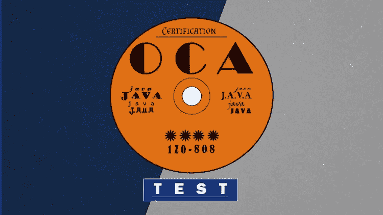
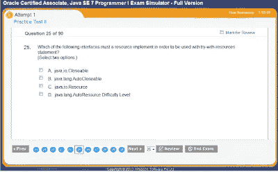
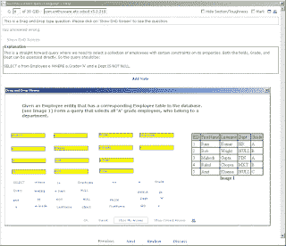
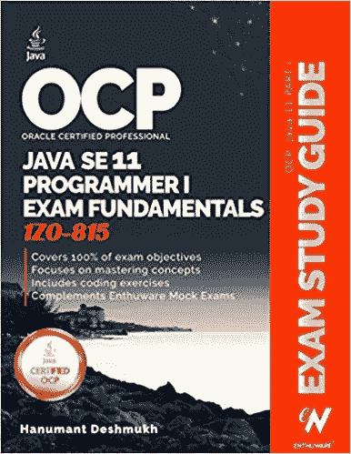

# 为 2023 年甲骨文 Java 认证做准备的 7 大实践测试和模拟考试— OCAJP 和 OCPJP

> 原文：<https://medium.com/javarevisited/top-7-practice-tests-and-mock-exams-to-prepare-for-oracles-java-certifications-ocajp-and-ocpjp-36502d4ca061?source=collection_archive---------1----------------------->

image_credit — Udemy

大家好，毫无疑问，考试模拟器在准备任何 Java 认证中起着至关重要的作用，像 [OCAJP](https://javarevisited.blogspot.com/2019/12/how-to-crack-java-se-11-certification.html) ， [OCPJP](/javarevisited/java-certifications-how-to-crack-it-practical-tips-to-prepare-ocajp-and-ocpjp-exams-538f6fe36b37) ，Java 基础考试，OCEJWCD，OCMJEA 考试。事实上，它们是最重要的支柱之一，因为选择一个好的考试模拟器和一本好书通常是许多 Java 认证追求者的成功口头禅。

考试模拟器通过展示真实复习中可能出现的问题水平，为考试做好准备。他们在类似复习的环境中提供了非常需要的练习来衡量你的速度和准确性。

我亲眼见过做很多模拟考试的人和不做模拟考试的人在分数上有 30%的**差异**。考生在第一次参加考试时会犯更多的错误，通过参加模拟考试，你可以训练自己的思维减少错误。

> 他们也帮助你更好地处理真正考试的时间压力。

虽然没有必要购买可能是最划算的商业考试模拟器，但你的钱花得很值。你不仅会学到你的错误，而且这些模拟器给出的全面解释也会帮助你改正错误。

因为我的很多读者都问，OCAJP 11[和 OCAJP 8](https://javarevisited.blogspot.com/2019/12/how-to-crack-java-se-11-certification.html) 买哪个考试模拟器最好？或者说，哪个是最便宜但是质量好的考试模拟器，我决定草草记下一些 Oracle 的 Java 认证的质量优秀的考试模拟器。

# 破解 Oracle Java 认证的 7 大模拟测试和模拟考试

下面是我列出的目前市场上最好的 Java 考试模拟器。这个列表完全是基于我从使用它的人那里读到和知道的，但我没有亲自使用所有的考试模拟器。

我的个人经验仅与 [Whizlabs](http://shrsl.com/?g0cb) 有关，我认为对于任何想要在 OCAJP 或 OCPJP 取得 80%以上成绩的考生来说，这已经绰绰有余了，但我已经列出了其他商业模拟考试提供商，以提供一个全面的考试模拟器列表。

大多数考试提供商不仅为和【OCPJP】提供模拟器，还为更高级的 Java 考试提供模拟器，如 OCEJWCD (Oracle 认证专家 Java Web 组件开发人员)和 [OCMJEA](https://javarevisited.blogspot.com/2017/04/2-free-oracle-certified-master-java.html#axzz5W8lbNQj2) (Oracle 认证 Java 企业架构师)。所以，无论你在准备哪种考试，你都会发现这些供应商提供了一些很好的考试模拟器。

## 1. [**Whizlabs 考试模拟器**](http://shrsl.com/?g0ce)

这是 Java 认证最好的考试模拟器。我个人使用过它，所以我可以保证 Whizlabs 的质量。它为 OCAJP 和 OCPJP 分别准备了 Java 11 和 8 的模拟测试，这取决于你准备的是哪个版本。

OCPJP 11 考试模拟器包含 400 多个问题和五个完整长度的模拟考试，价格约为 20 美元，您可能还会有一些折扣。你可以在任何设备上进行在线测试，它还会提供你强项和弱项的详细报告。

也可以在 Udemy 上购买 Whizlabs 练习题。以下是在 Udemy 上购买 Whizlabs 模拟器的链接:

1.  [Java SE 11 程序员 1(1z 0–815)—模拟测试(440 题)](https://click.linksynergy.com/deeplink?id=JVFxdTr9V80&mid=39197&murl=https%3A%2F%2Fwww.udemy.com%2Fcourse%2Fjava-se11-programmer-1-1z0-815-practice-tests%2F)
2.  [Java SE 程序员 II(1z 0–816)—模拟测试(400 题)](https://click.linksynergy.com/deeplink?id=JVFxdTr9V80&mid=39197&murl=https%3A%2F%2Fwww.udemy.com%2Fcourse%2Fjava-se-programmer-ii-1z0-816-practice-test%2F)

## 2. [Udemy Java 认证问题](https://click.linksynergy.com/deeplink?id=JVFxdTr9V80&mid=39197&murl=https%3A%2F%2Fwww.udemy.com%2Fcourse%2Fjava-oca%2F)

我不知道你也可以在 Udemy 上购买练习题，但是你可以，他们也有一些 Java 认证的最佳练习题，比如 Java SE 8 和 Java SE 11。

这里有一些值得注意的 Java 练习题，你可以在 Udemy 上买到，它们也很便宜，你可以在不时发生的几次 Udemy 销售中只花 10 美元买到其中的大部分。

1.  [**Java SE 11 开发者认证(1z 0–819)考试**](https://www.udemy.com/course/java-se-11-certification-exam-1z0-819-practice-tests/?referralCode=6A43D9FD2DD560081062)
2.  [whiz labs OCPJP 8[1z 0–809]备考课程](https://click.linksynergy.com/deeplink?id=JVFxdTr9V80&mid=39197&murl=https%3A%2F%2Fwww.udemy.com%2Fcourse%2Focpjp-8-1z0-809%2F)
3.  [**Java 基础考试练习题(1z 0–811)考试**](https://www.udemy.com/course/java-foundations-exam-1z0-811-practice-tests-new/?referralCode=FE9DD7923503304B7EE3)
4.  [Java 认证(1z 0–815)主题式测试](https://click.linksynergy.com/deeplink?id=JVFxdTr9V80&mid=39197&murl=https%3A%2F%2Fwww.udemy.com%2Fcourse%2Fjava-11_1z0-815%2F)UDAYAN KHATRI
5.  [Java 认证:OCA(1z 0–808)考试模拟](https://click.linksynergy.com/deeplink?id=JVFxdTr9V80&mid=39197&murl=https%3A%2F%2Fwww.udemy.com%2Fcourse%2Fjava-oca%2F)
6.  [甲骨文 Java 认证:破解 OCA 1z 0–808 的最短途径](https://click.linksynergy.com/deeplink?id=JVFxdTr9V80&mid=39197&murl=https%3A%2F%2Fwww.udemy.com%2Fcourse%2Foracle-java-certification-shortest-way-to-crack-oca-1z0-808%2F)

## **3。** [**大卫·梅尔的 Java 8 转储和模拟器**](https://www.certification-questions.com/practice-exam/java/1z0-808?affiliateCode=fcff36fd-557a-4713-abf6-973e9924770f&utm_source=Javin&utm_medium=affiliate&utm_campaign=affiliate)

这是另一个很棒的 Java 考试模拟器，但仅适用于 Java 8，即仅适用于 1z 0–808 和 1z 0–809 考试。

他们还有一个 Java 1z 0–808 和 1z 0–809 免费测试，用于演示我们的 Java8 Associate Web 模拟器的所有功能。

您将能够回答 25 个完整的问题，并有 53 分钟的时间完成测试。如果你愿意，也可以下载他们[免费的 PDF 格式的 1z 0–808](https://www.certification-questions.com/practice-exam/java/1z0-808?affiliateCode=fcff36fd-557a-4713-abf6-973e9924770f&utm_source=Javin&utm_medium=affiliate&utm_campaign=affiliate)a[1z 0–809 转储](https://www.certification-questions.com/practice-exam/java/1z0-809?affiliateCode=fcff36fd-557a-4713-abf6-973e9924770f&utm_source=Javin&utm_medium=affiliate&utm_campaign=affiliate)供参考。

## [**4。Enthuware 考试模拟器**](http://enthuware.com/)

如果你想买便宜的和最好的，那么没有什么能打败 Entuware。它包含大约 9.95 美元的一个大约有 500 个问题的题库。当然，你不能比这更便宜了。

这些项目也是高质量的，几乎与 [Whizlabs](http://shrsl.com/?g0cb) 的水平相同，详细的答案也是高质量的，并解释了为什么正确的答案是正确的，为什么错误的答案是不正确的。

## [**5。卡普兰自测与超越者**](https://www.transcender.com/practice-exam/oracle/1z0-808.kap)

**Kaplan SelfTest** 由甲骨文授权，因此您可以确信它很好地涵盖了考试目标。卡普兰自测包含 170 多个问题，价格为 69 美元起，可在线使用 30 天。

这张 CD 大约要花 99 美元。面向 Java SE 7 程序员 II 的 Kaplan 1x 0–804 模拟测试(OCPJP7)还包括 275 张免费抽认卡，一份全面的分数报告有助于您集中精力学习。

超越者类似于卡普兰，也是甲骨文授权的实践考试提供商。他们在不同的时间段有不同的包，比如 190 个问题；售价 109 美元起。

你应该只买 Kaplan 或超越者，因为它们实际上包含相同的问题，唯一不同的是涵盖的主题数量和提供的问题数量。他们实际上现在合并在一起，被称为超越者，由 Kaplan IT 培训提供支持。

## [**6。EPractizeLabs**](https://www.epractizelabs.com/)

这是另一个很好的 Oracle 和 Java 考试模拟器提供商，它为几乎所有的 Java 认证提供培训课程和[考试模拟器](http://javarevisited.blogspot.sg/2016/11/top-5-java-8-practice-test-and-exam-simulators-best-OCAJP-OCAPJP.html)。您可以从该提供商处购买 OCPJP 11 在线培训、OCPJP 11 学习指南+模拟试题来进行练习。

他们的网站上也有免费的测试，以便你在购买前评估他们的内容，也值得尝试检查你的知识。

## **7。Java 认证指南中的模拟考试**

在购买 Java 认证学习指南时，您还可以找到一些模拟考试。学习指南是备考的极好资源，因为它们提供了教学大纲的全部内容，并通过展示从考试角度来看更有价值的概念来帮助您为考试做准备。

这里有一些优秀的 Java 学习指南，适用于 OCAJP 和 OCPJP，也适用于 Java SE 11 和 Java SE 8。

*   [OCA Java SE 8 程序员 I 认证指南 Mala Gupta](https://www.amazon.com/OCA-Java-Programmer-Certification-Guide/dp/1617293253?tag=javamysqlanta-20)
*   [OCA:甲骨文认证助理 Java SE 8 程序员 I 学习指南](https://www.amazon.com/dp/1118957407?tag=javamysqlanta-20)
*   [Java SE 11 认证学习指南](https://www.amazon.com/Oracle-Certified-Professional-Programmer-Study/dp/1119584701?tag=javamysqlanta-20)
*   [Hanumant desh mukh 的 Java SE 11 学习指南](https://www.amazon.com/dp/1086955811/?tag=javamysqlanta-20)

除了这些，还有一些其他的书籍和学习指南，这取决于你是在准备 OCAJP 11，OCPJP11，OCPJP 8，还是 OCPJP 8。你可以在这个博客中查看我为这些考试推荐的书籍，[这里](http://javarevisited.blogspot.sg/2016/08/5-free-ocajp-7-and-ocpjp7-mock-exams.html)。

面向Java 程序员和 IT 专业人员的其他**认证资源**

*   [破解 Java SE 11 认证的 5 大书籍和课程](https://javarevisited.blogspot.com/2019/10/top-5-books-courses-to-crack-oracles-java-se-11-certification-OCAJP11.html)
*   面向程序员的前 5 名免费 Java 11 实践测试
*   [如何通过 Spring Core Professional 5.0 认证](https://javarevisited.blogspot.com/2018/08/how-to-crack-spring-core-professional-certification-exam-java-latest.html)
*   [如何破解 2023 年 AWS 解决方案架构师考试](https://javarevisited.blogspot.com/2019/08/how-to-crack-aws-certified-solution-architect-exam.html)
*   [如何破解甲骨文 2023 年 Java 认证](https://medium.freecodecamp.org/how-to-pass-oracles-java-certifications-a-practical-guide-for-developers-e9b607ba6173)
*   [Vmware Spring 认证对工作和职业生涯有帮助吗？](https://javarevisited.blogspot.com/2017/07/does-spring-certification-help-in-job-and-career.html)
*   [2023 年 Java 开发者路线图](https://javarevisited.blogspot.com/2019/10/the-java-developer-roadmap.html)
*   [Java SE 11 认证官方指南](https://education.oracle.com/oracle-certified-professional-java-se-11-developer/trackp_815)
*   [10 门免费学习数据结构和算法的课程](http://www.java67.com/2019/02/top-10-free-algorithms-and-data.html)
*   [通过 AWS 解决方案架构师助理考试的 5 次免费模拟测试](https://javarevisited.blogspot.com/2019/08/top-5-free-aws-solution-architect-Associate-certification-dumps-practice-questions.html)
*   [每个软件开发人员都应该学习的 10 件事](https://dev.to/javinpaul/10-things-every-software-developer-should-know-39pe)
*   [2023 年破解 PMP 认证的五大课程](https://javarevisited.blogspot.com/2019/09/top-5-courses-to-crack-pmp-project-management-professional-certification-exam.html)
*   [程序员学习 Git 的五大免费课程](https://javarevisited.blogspot.com/2018/01/5-free-git-courses-for-programmers-to-learn-online.html)
*   [OCAJP 和 OCPJP 考试 10 道免费样题](http://www.java67.com/2017/05/10-free-java-8-certification-sample-questions-OCAJP8-OCPJP8-Mock-Exams.html)

以上是针对 OCAJP 和 OCPJP 考试的**最佳 Java 商业考试模拟器列表。大多数 Java 考试模拟器提供者还提供了其他 Java 认证的模拟考试，如 OCPJWCD 或 OCMJCEA 和其他评论。**

也有很多免费的模拟考试可供 [OCAJP 11](https://javarevisited.blogspot.com/2019/12/how-to-crack-java-se-11-certification.html) 和 [OCPJP8](http://javarevisited.blogspot.com/2015/11/5-free-ocajp8-ocpjp8-mock-exams-and-practice-questions.html) 使用，你可以在购买任何 Java 考试模拟器之前看看。你可以用它们来判断完整考试的质量

**P. S. —** 如果你是 Java 开发世界的新手，并且想在获得认证之前深入学习 Java，那么我也建议你参加由 Tim Buchalaka 和他的团队在 Udemy 上举办的 [**完整 Java 大师班**](https://click.linksynergy.com/fs-bin/click?id=JVFxdTr9V80&subid=0&offerid=323058.1&type=10&tmpid=14538&RD_PARM1=https%3A%2F%2Fwww.udemy.com%2Fjava-the-complete-java-developer-course%2F) 课程。它也是学习 Java 的最新课程之一，涵盖了最新 Java 版本的新特性。

<https://click.linksynergy.com/fs-bin/click?id=JVFxdTr9V80&subid=0&offerid=323058.1&type=10&tmpid=14538&RD_PARM1=https%3A%2F%2Fwww.udemy.com%2Fjava-the-complete-java-developer-course%2F> 