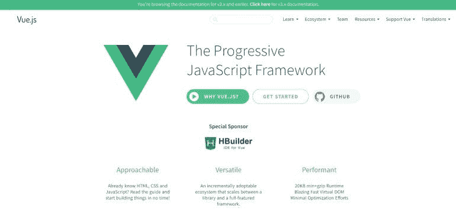
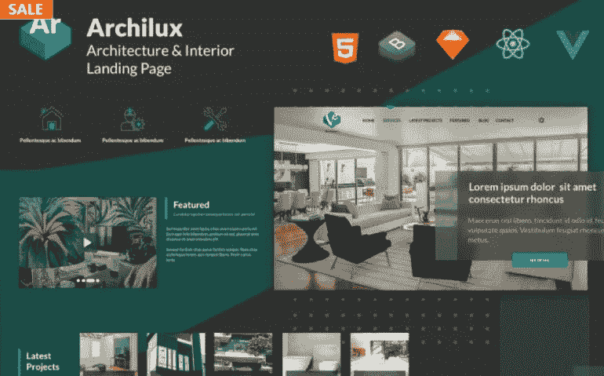
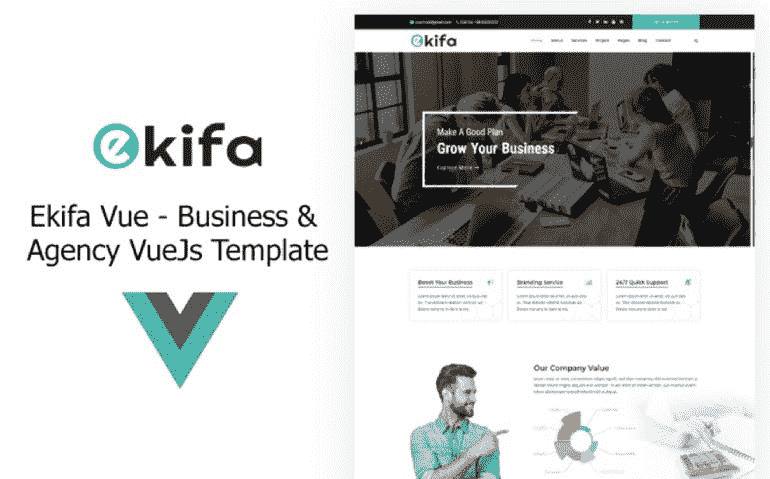
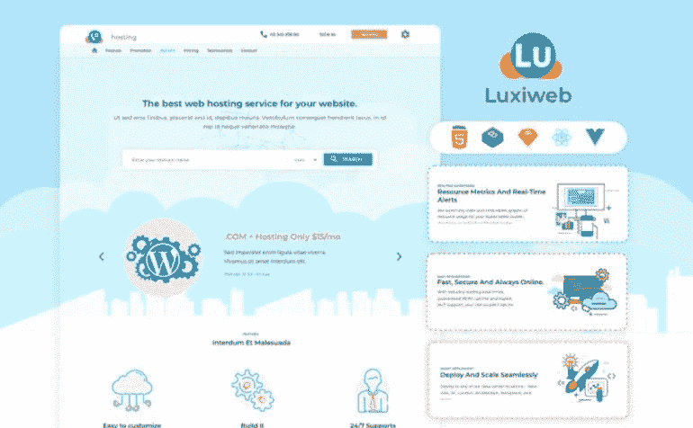
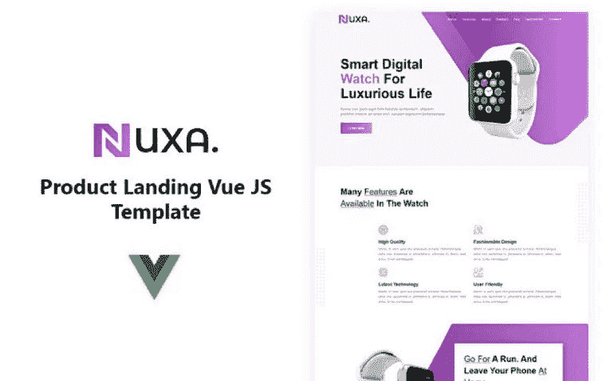
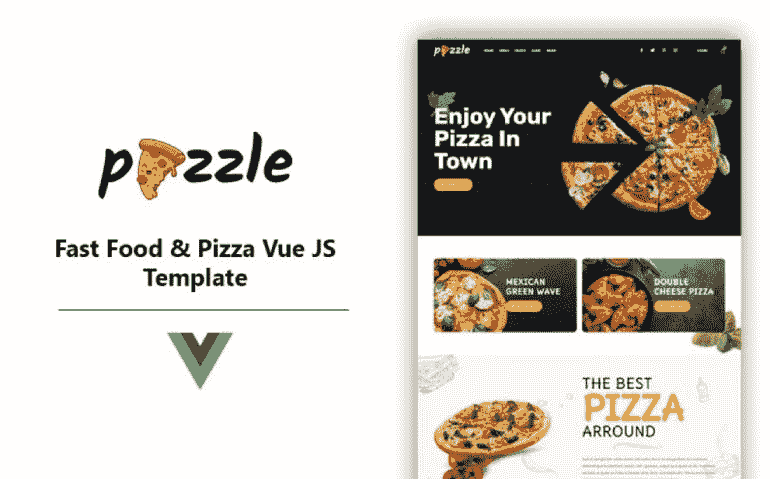

# 8 大 Vue.js 网站模板选择:利弊&对框架有什么期望？

> 原文：<https://medium.com/javarevisited/top-8-vue-js-website-template-choices-pros-and-cons-what-to-expect-from-the-framework-b9e1ee6a8bf2?source=collection_archive---------3----------------------->

Vue.js 是一个 JavaScript 框架，允许你创建用户界面和单页应用。Vue.js 和其中最好的一样，是开源的。它遵循模型-视图-视图模型(MVVM)模式。今天，我们将谈论高质量的 [Vue。JS 网站模板](https://www.templatemonster.com/products/types/website-templates/tags/vuejs/?aff=javarevisited&utm_campaign=postmedium&utm_source=mediumjavarevisited&utm_medium=referral)变种。在了解它们的特性之前，让我们先来关注一下 [Vue。JS 框架](/javarevisited/10-free-vue-js-nuxt-js-online-courses-for-beginners-in-2021-a347ea2ad144)本身，优缺点，功能。

# 初学 Vue 应该了解什么？JS？

该框架的名字 Vue 在发音上与英语中的视图相同，它与经典的模型-视图-控制器(MVC)架构相关。简单的说，视图就是一个应用或者网站的用户界面，Vue.js 的基础库默认聚焦视图层。

像任何其他流行的技术一样，Vue.js 编程在社区中引发了争论。然而，它有很多好处要记住。

1.  包含框架的 zip 文件只有 18 KB。作为一个轻量级，该框架不仅可以快速下载和安装库，还可以提高你的搜索引擎优化和 UX。
2.  DOM 操作的另一个优势是 Vue 从 [Angular](/javarevisited/10-courses-to-learn-angular-for-web-development-6da1bd2856dc) 中获得的双向数据绑定。
3.  在 Vue 中，你未来应用的每个组件都是一个组件。组件是已经封装的接口的一部分。Vue.js 中的组件可以用 HTML、CSS 和 JavaScript 开发，而无需分离到不同的文件中。
4.  因为所有组件都包含在单独的文件中，所以代码更容易阅读和理解，也更容易维护和更正。
5.  封装的组件本质上是代码块，可以作为类似系统的模板重用。

在使用 Vue.Js 之前，还有一些缺点值得一提。

1.  通俗地说，Vue.js app 是由用户可能与之交互的组件组成的。每个组件都有一个观察器，每当用户触发组件时，该观察器都会重绘数据。只有被激活的数据块被反应机制重新绘制。问题是它不是很聪明，在读取数据时经常出错，因此需要将数据展平。
2.  Vue.js 是一个相对较新的框架。它的社区和开发团队仍然由更成熟的 Angular 主导。它也没有得到大公司的财政援助。要在大型项目中使用，该技术必须是健壮的和得到良好支持的，这样问题才能得到及时解决。
3.  生态系统是相当大的，所有必要的工具都可以用来开始使用 Vue，但它仍然没有 React 或 Angular 大。

# Vue。Js 模板选择:8 大多功能美观解决方案

同样重要的是提及我们的促销代码" **javarevisited5** "的可用性，它为所有 HTML5 模板提供 5%的折扣。

## Archilux 建筑师和家庭室内 React Vue HTML 登录页面模板

首先，我们想说一个复杂的 Vue.js 网站模板，供建筑师和家居室内设计师使用。它能够帮助你创建一个与众不同的令人难以置信的网站。这种当代的现成解决方案有各种灵活的选项，你会认为非常有用。值得一提的是，它还兼容 React.js、Vue.js、静态 HTML、Sketch UI 设计。除此之外，它还提供了一种完全响应的设计，人们可以通过多种现代设备进行查看。你也会很高兴得到一个材质设计，Next.js，和 Nuxt.js 来体验一个毫不费力的定制过程。不要忘记一些额外的选项，如视频背景。

主要特点:

*   24 种颜色组合；
*   深色和浅色版本；
*   RTL 支持六种语言；
*   谷歌地图；
*   联系页面。

[立即购买](https://www.templatemonster.com/landing-page-template/archilux-architect-amp-home-interior-react-vue-html-landing-page-template-220938.html?aff=javarevisited&utm_campaign=postmedium&utm_source=mediumjavarevisited&utm_medium=referral) | [在 MonsterONE](https://www.templatemonster.com/monsterone/tm-membership/?id=220938?aff=javarevisited&utm_campaign=postmedium&utm_source=mediumjavarevisited&utm_medium=referral) 免费下载

## Ekifa Vue —企业和机构 VueJs 模板

Ekifa 是一个干净的、有吸引力的、现代的 Vue.js 网站模板，可能适合你的视觉。它是大量利基市场的完美匹配，包括商业、金融和商业用途。你可以理解，它是用开发人员友好的 VueCLI 和 Vuex 组件构建的。这个包有一堆可重用的组件。这个专业的现成解决方案的创造者尽其所能提供了一个使用起来并不复杂的选择。因此，您将获得一个令人难以置信的模板，它能有效地完成工作，拥有所有必要的组件，并且看起来很棒。

主要特点:

*   社会融合；
*   我们的服务和产品组合；
*   客户的评论；
*   最近的新闻；
*   博客功能。

[立即购买](https://www.templatemonster.com/website-templates/ekifa-vue-business-and-agency-vuejs-template-219515.html?aff=javarevisited&utm_campaign=postmedium&utm_source=mediumjavarevisited&utm_medium=referral) | [在 MonsterONE 免费下载](https://www.templatemonster.com/monsterone/tm-membership/?id=219515?aff=javarevisited&utm_campaign=postmedium&utm_source=mediumjavarevisited&utm_medium=referral)

# Luxi web——使用 React Vue HTML5 的云和托管登录页面

Luxiweb 是一个非凡而时尚的主题，使用 React.js、Vue.js、HTML5 JQuery 和 Sketch 进行 UI 设计。对于那些希望构建或改进他们当前关于托管或云网站的网站的人来说，这将是一个极好的选择。由于不同框架技术和向量设计的可用性，您将获得一个适应性强的模板。无论如何，它将适合您的需求和技能，这要归功于它易于更改、定制和扩展。重要的是要提到黑暗和光明模式的可用性。因此，人们可以选择最舒适的方式浏览您的网站。还有 24 种颜色组合，可以通过设计来表达您的品牌。

主要特点:

*   视差效应；
*   滑块；
*   联系页面；
*   RTL 支持六种语言；
*   全响应设计。

[立即购买](https://www.templatemonster.com/landing-page-template/luxiweb-cloud-and-hosting-landing-page-with-react-vue-html5-218496.html?aff=javarevisited&utm_campaign=postmedium&utm_source=mediumjavarevisited&utm_medium=referral) | [在 MonsterONE](https://www.templatemonster.com/monsterone/tm-membership/?id=218496?aff=javarevisited&utm_campaign=postmedium&utm_source=mediumjavarevisited&utm_medium=referral) 免费下载

## Nuxa —产品登陆 Vue。JS 网站模板

下一个 Vue。Js 将协助您建立一个引人注目和有吸引力的产品登录页面。它也适合那些需要各种数字产品的联盟营销资源的人。它有一个独一无二的设计，一定会打动你的观众的想象力。毫无疑问，你会得到一个完全响应的设计。这意味着人们可以使用不同的设备自由访问你的登录页面。由于 PWA 的支持，这是可能的。有许多能力可以让你创造一些奇妙的东西。其中，至关重要的是提到 Vue 旋转木马滑块和 AOS 动画。

主要特点:

*   联系方式；
*   Vuex 集成；
*   VueCli
*   单页模板；
*   证明。

[立即购买](https://www.templatemonster.com/landing-page-template/nuxa-product-landing-vue-js-template-188444.html?aff=javarevisited&utm_campaign=postmedium&utm_source=mediumjavarevisited&utm_medium=referral) | [在 MonsterONE 免费下载](https://www.templatemonster.com/monsterone/tm-membership/?id=188444?aff=javarevisited&utm_campaign=postmedium&utm_source=mediumjavarevisited&utm_medium=referral)

## luxigen-HTML React Vue 机构登录页面视差

Luxigen 是一个 HTML5 登陆页面模板，由 React.js、Vue 和 Sketch 等广泛使用的技术构建而成。它致力于帮助你为一家新成立的公司或初创企业发展有效的互联网业务。它拥有增强网站外观和功能的所有必要技术。在这项任务中，有多个功能将成为您的强大助手。例如，您应该注意六种语言的 RTL 支持。还有一个联系页面，如果人们有兴趣与您联系，可以访问该页面。

主要特点:

*   24 种颜色组合；
*   视差效应；
*   视频背景；
*   全响应设计；
*   完全可定制的设计。

[立即购买](https://www.templatemonster.com/landing-page-template/luxigen-html-react-vue-agency-landing-page-parallax-217991.html?aff=javarevisited&utm_campaign=postmedium&utm_source=mediumjavarevisited&utm_medium=referral) | [在 MonsterONE](https://www.templatemonster.com/monsterone/tm-membership/?id=217991?aff=javarevisited&utm_campaign=postmedium&utm_source=mediumjavarevisited&utm_medium=referral) 免费下载

## Pizzle —快餐和 Pizza Vue Js 模板

这个 Vue。Js 网站模板似乎是展示快餐和比萨饼相关话题的一个独特而简洁的选择。这也将是推广你的餐馆或咖啡馆的一个极好的方式。此外，你的观众会对一个完全响应的设计感到满意，这将保存它在各种小工具上的精心设计的外观。你可以自由地用一些流畅的动画效果来装饰你的网站。多亏了他们，完成在线项目可能会更令人愉快，更有吸引力。

主要特点:

*   联系方式；
*   猫头鹰转盘滑块；
*   Vuex 集成；
*   Vue JS Webpack
*   下拉菜单。

[立即购买](https://www.templatemonster.com/website-templates/pizzle-fast-food-and-pizza-vue-js-template-186461.html?aff=javarevisited&utm_campaign=postmedium&utm_source=mediumjavarevisited&utm_medium=referral) | [在 MonsterONE 免费下载](https://www.templatemonster.com/monsterone/tm-membership/?id=186461?aff=javarevisited&utm_campaign=postmedium&utm_source=mediumjavarevisited&utm_medium=referral)

## Exomac —企业业务 Vue Nuxt JS 网站模板

Exomac 是一个视觉效果惊人且适应性强的基于 Vue JS 的网站模板。有了这个令人惊叹的选项，您可以在瞬间自由创建一个有效的公司网站。它包括 11 个现成的网页和三个不同的主页选项。因此，你会得到一个惊人的在线存在，让你的网站访问者惊叹不已。此外，值得一提的是一个结构良好的布局，将改善你的网站的外观。不要忘记完全响应的设计，它适用于平板电脑、台式机、智能手机和笔记本电脑，消除了兼容性难题。

主要特点:

*   博客帖子；
*   时事通讯订阅；
*   流畅的动画效果；
*   谷歌字体；
*   服务区。

[立即购买](https://www.templatemonster.com/website-templates/exomac-corporate-business-vue-nuxt-js-website-template-177608.html?aff=javarevisited&utm_campaign=postmedium&utm_source=mediumjavarevisited&utm_medium=referral) | [在 MonsterONE](https://www.templatemonster.com/monsterone/tm-membership/?id=177608?aff=javarevisited&utm_campaign=postmedium&utm_source=mediumjavarevisited&utm_medium=referral) 免费下载

## 哥特式-建筑 Vue Nuxt JS 网站模板

哥特式是一个强大而有用的 Vue。各种架构相关主题的 JS 网站模板。举个例子，提升建筑公司、室内设计师和工程师是可能的。总的来说，这个包包括 7 个以上的网站，每个网站都由最新版本的 Vue.js 和 Nuxt 驱动。可以快速为建筑公司开发一个灵活有效的网站。在主页上，你会发现一个精彩的幻灯片，它会用你的视觉内容给观众留下深刻的印象。可以添加精美的照片和抢眼的动画效果。

主要特点:

*   证明；
*   谷歌地图；
*   博客功能；
*   谷歌字体；
*   最新作品。

[立即购买](https://www.templatemonster.com/website-templates/gothic-architecture-vue-nuxt-js-website-template-website-template-175278.html?aff=javarevisited&utm_campaign=postmedium&utm_source=mediumjavarevisited&utm_medium=referral) | [在 MonsterONE 免费下载](https://www.templatemonster.com/monsterone/tm-membership/?id=175278?aff=javarevisited&utm_campaign=postmedium&utm_source=mediumjavarevisited&utm_medium=referral)

# 几句话作为结论

没有必要的工具是不可能完成一个建筑过程的。当涉及到物理结构时，这个概念并不简单适用。这同样适用于在线应用。要创建一个有价值的在线项目，你还需要适当的相关技术。对于这项任务，没有比 Vue.JS 更好的工具了。因此，我们试图通过收集最好的 Vue 来纪念这个奇妙的框架。不同用途的 JS 网站模板选择。我们希望你已经在 [HTML5 网站模板](https://www.templatemonster.com/html-website-templates/?aff=javarevisited&utm_campaign=postmedium&utm_source=mediumjavarevisited&utm_medium=referral)中找到了一些东西。感谢阅读！