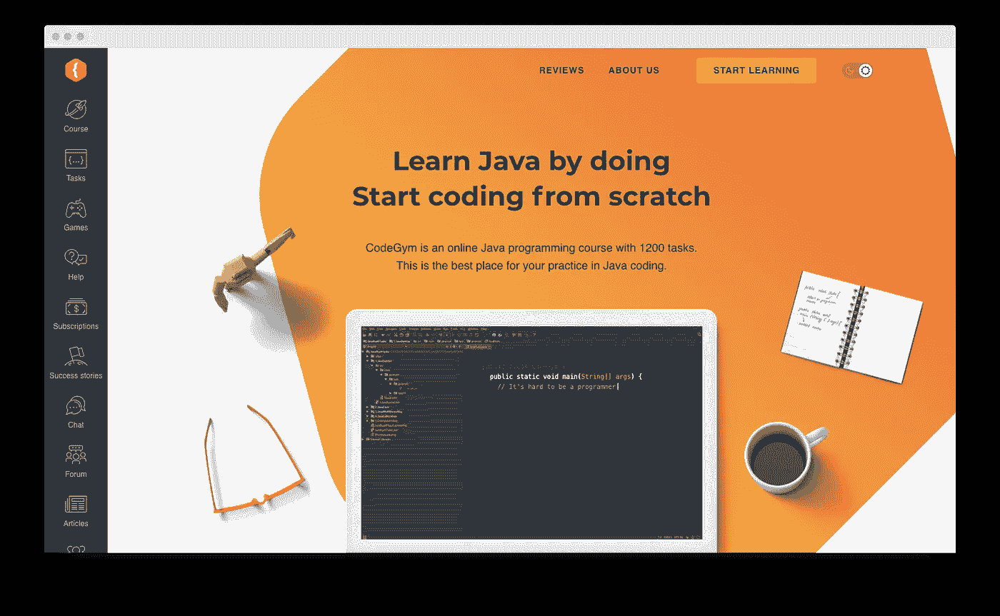
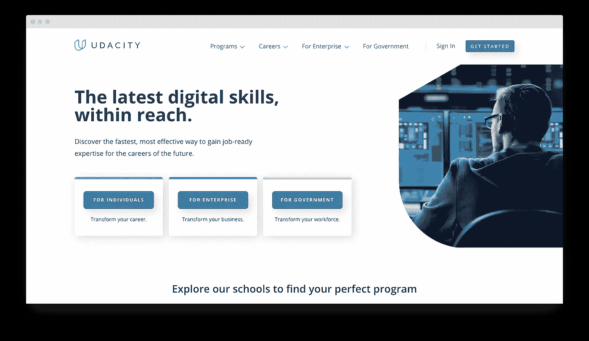
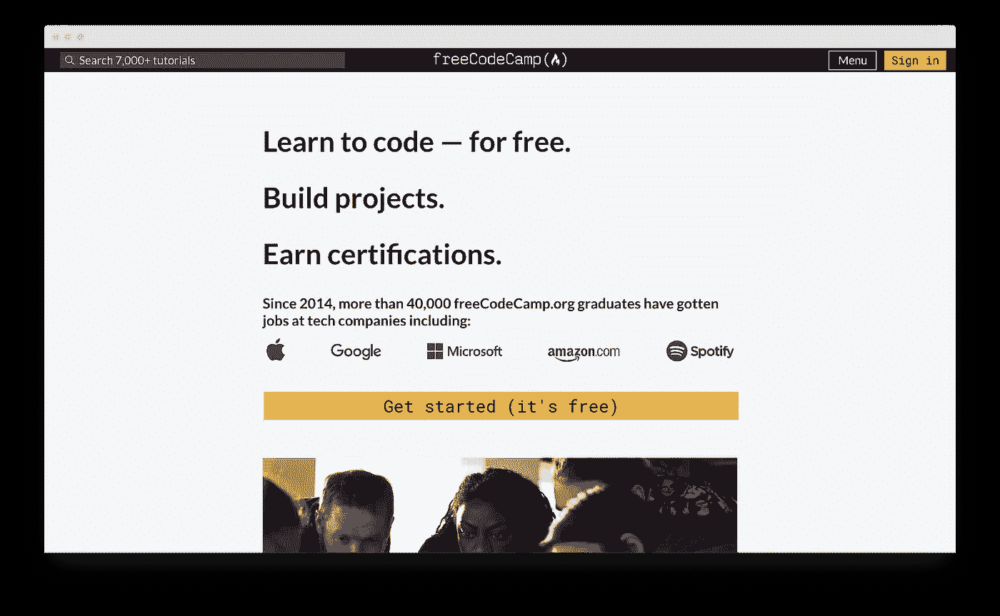
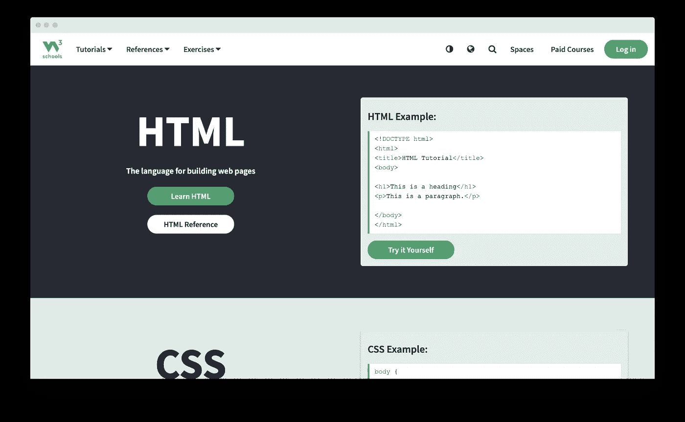
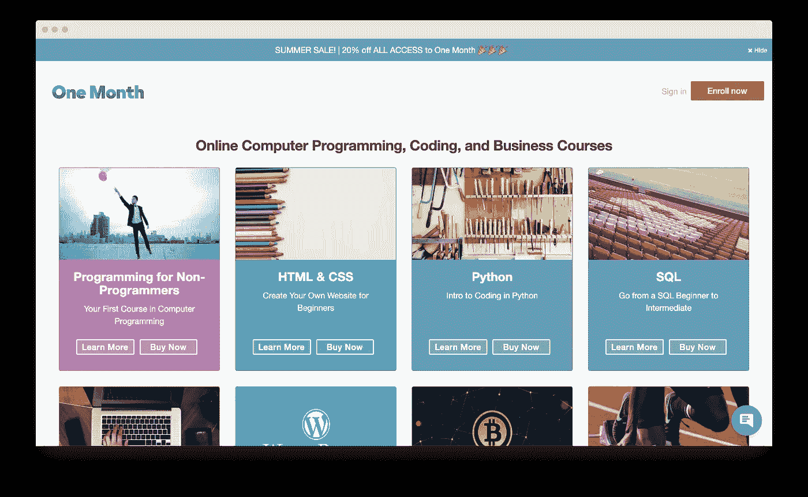

# 2021 年学习编程的 9 大最佳网站

> 原文：<https://medium.com/javarevisited/top-9-best-websites-to-learn-programming-in-2021-cf8db4ab8e43?source=collection_archive---------2----------------------->

编程已经获得了巨大的普及，导致人们跳入这个领域。但是要成为一名成功的开发人员，你需要确保你对编程及其语言有足够的了解。互联网上充满了惊人的资源，可以帮助新人[从零开始学习 Java](/javarevisited/top-5-java-online-courses-for-beginners-best-of-lot-1e1e240a758) 和其他语言，达到高级水平。

下面是 9 个最好的网站，它们可能会帮助你找到最完美、最方便的学习网站。

# 代码集

[Codecademy](https://www.codecademy.com/) 是寻找优秀编程教育资源的好地方之一。它包括许多经过认证的结构良好的课程；其中一些是免费的。极其高效的课程和任务会让你立刻成为一名拥有丰富经验和知识的专业人士。

大多数课程将会有 50 多个讲座和测验，从头开始教你概念和基础知识。此外，它还包括一个在线导师，他会回答你的问题并检查你的任务。除了 Java，许多其他编程语言也在这个平台上教授

*   **平台:**可在浏览器、桌面、iOS、Android 上在线使用。
*   **编程语言:** [Java](/javarevisited/10-best-places-to-learn-java-online-for-free-ce5e713ab5b2) ， [JavaScript](/javarevisited/top-10-javascript-courses-from-pluralsight-to-learn-in-2021-26352abe4fcd) ， [PHP](/javarevisited/10-best-php-courses-for-beginners-and-experienced-developers-db18057a814f) ， [C](/javarevisited/9-free-c-programming-courses-for-beginners-2486dff74065) ，C++， [Ruby](/javarevisited/10-best-ruby-on-rails-courses-for-beginners-dca4d66e9f7b) ， [Swift](/javarevisited/7-free-courses-to-learn-swift-programming-language-in-2020-f40ac9d3ee53) ， [Python](/javarevisited/the-complete-python-bootcamp-udemy-course-review-b1ab69f232b5) 等等。
*   **定价:**免费获得基础课程，但是，要解锁高级课程，您需要每月支付 15.99 至 19.99 美元

# CodeGym

[CodeGym](https://codegym.cc/) 是一个优秀的平台，帮助初学者通过互动的游戏化课程学习 Java 编程，不会感到厌烦。人们通过执行任务而不是死记硬背理论来有效地学习；因此，本课程包含 1200 多项实用任务。

各种级别的游戏化课程会让初学者急于完成每一个级别以快速到达下一个级别。虚拟导师将检查你的所有任务，并向你提供一份进度报告，这将有助于你确定自己取得的进步。

为了方便全职工作的人学习，还有一个移动版本的应用程序，可以在任何地方使用，无论是在办公室的休息时间还是在任何其他空闲时间。

*   **平台:**你可以在浏览器上通过 CodeGym 的网站访问它，下载一个 Android 应用程序。此外，你可以通过桌面 [IntelliJ IDEA](/javarevisited/7-best-courses-to-learn-intellij-idea-for-beginners-and-experienced-java-programmers-2e9aa9bb0c05) 插件解决编码任务
*   **编程语言:** [Java](/javarevisited/10-free-courses-to-learn-java-in-2019-22d1f33a3915)
*   **定价:**免费零级别，在此之前，高级订阅每月收费 49 美元，高级专业版每月收费 99 美元，或者高级专业版每年收费 499 美元，高级专业版每年收费 999 美元。此外，还有一个免费的 Android 应用程序。

# 树屋

编码不是作为一系列抽象概念来教授的，相反，它帮助你识别和完善执行特定项目所需的技能。这个 [Treehouse](https://teamtreehouse.com/) 项目可以从构建一个移动应用程序，创建你自己的 WordPress 博客，到回答一个大学作业的 CS 工作表。

你会发现几乎所有的编程语言，像 [Python](/javarevisited/6-best-python-books-for-data-science-and-machine-learning-in-2021-2f41d9fbf8be) 、 [C++](https://javarevisited.blogspot.com/2020/07/top-10-courses-to-learn-c-in-depth-best.html) 、 [Ruby](/javarevisited/top-5-free-courses-to-learn-ruby-and-rails-for-beginners-best-of-lot-e149fe03c964) 、 [Java](/javarevisited/5-best-core-java-books-for-beginners-20e3f723e3a?source=extreme_sidebar----d3a191ac6ed-----0-1----------------------) 等等。资源库经常更新，以确保它包含所有关于编程领域的最新新闻和更新。

为了鼓励初学者，完成课程并在测试中表现良好的人会获得徽章。该平台易于使用，短片和实践驱动的性质也将有助于您了解树屋网站是如何运作的。在解决任务时，你很快就会获得足够的自信。

*   平台:可以在桌面、iOS 和 Android 上运行
*   **编程语言:** Java，Python，C#，PHP，Ruby，HTML。
*   定价:它提供 7 天免费试用，之后你每月需要支付 25-199 美元

# 乌达城

大量面向初学者的优秀课程涵盖了各种主题，如 web 开发、编程和数据科学。在 [Udacity](https://www.udacity.com/) 上的大多数课程都是免费的，因此你可以免费学习所有的基础知识和高级概念。

每门课程都包括著名教授的讲座，评估所学知识的练习，确定你知识水平的测试，以及将你的知识运用到现实生活实践中的大型项目和作业。每当一个具体的概念不清楚，或者如果你不能解决一个问题，那么你可以去讨论板，从你的同伴那里获得支持。

此外，Udacity 为特定技能和编程语言提供纳米技术学位，允许初学者根据自己的兴趣在特定领域开展职业生涯。这些学位是由像脸书、IBM 和美国电话电报公司这样的行业领导者颁发的，它们以帮助新程序员完成他们开始的旅程而闻名。

*   **平台:**适用于网络、桌面、iOS、Android。
*   **编程语言:**所有流行的编程语言的资源都可以在这里找到。
*   **定价:** Udacity 有大量不同时长的课程。每道菜都有自己的价格。有些课程完全免费(但不提供证书)。其他人可能会达到整个课程 3000 美元。此外，你可以提前几个月支付减少的金额。

# 自由代码营

Freecodecamp 是一个了不起的平台，拥有最大的技术社区、大量的 Java 教程和优秀的课程。许多专家声称 Freecodecamp 的博客是无与伦比的。

但它适合那些知道基本概念的用户，因为在这个平台上你会发现所有的实际任务和基于项目的作业。因此，在访问网站之前，你需要获得基本概念的知识，并完善你现有的技能。

*   **平台:**兼容在线，仅桌面。
*   **编程语言:** [Python](/javarevisited/8-advanced-python-programming-courses-for-intermediate-programmer-cc3bd47a4d19) ，Java，C，PHP，JS，CSS，HTML
*   **定价:**免费

# 极客论坛

想要参考一些项目或阅读关于编程的信息文章，那么 [Geeksforgeeks](https://www.geeksforgeeks.org/) 是您的完美平台。每个概念都被每个作家以不同的方式彻底解释。这个网站的每个投稿人都是著名的技术专家。每一篇教程都将讲述处理一个编程相关问题的不同方法。

这个免费的网站有一个易于导航的界面，有一个巨大的图书馆，里面充满了有趣的信息教程。

*   **平台:**支持在线，仅桌面。
*   **编程语言:** Java，JS，PHP，Swift， [Scala](/javarevisited/10-best-scala-and-functional-programming-online-courses-for-beginners-b6461b27bf) ， [Rust](/javarevisited/7-best-rust-programming-courses-and-books-for-beginners-in-2021-2ed2311af46c) ，C 等等
*   **定价:**有几个免费教程，也有付费课程，每个课程高达 300 美元。

# w3 学校

在 W3Schools 远程学习 Java 和 web 开发既容易又简单。这个网站利用日常的例子来解释编程语言的编码，从基础开始，一直到专家水平。

作为免费学习编码的最佳网站之一，它有助于扩展你关于 JavaScript、C++和 50 多种其他编程语言的知识。在这里，你会发现易于理解的现实信息，优秀的参考教程，和例子。

*   **平台:**兼容在线浏览器、桌面、安卓。
*   编程语言:包含了几乎所有流行编程语言的资源。
*   **定价:**包括免费教程和收费课程，每门课程收费高达 200 美元。

# 一个月

顾名思义，这个平台将帮助你在一个月内学会编程语言。一个月就像一个新兵训练营课程，在那里你将以最有效的方法获得关于 Python、Ruby 和 JS 的基本概念。只有像命令行这样的少数课程是免费的，而大多数课程是付费的。

要获得所有关于编码的最新消息和更新，你需要关注他们最新的博客帖子和信息播客。因此，如果你打算快速获取信息，那么一个月是适合你的平台。

*   **平台:**仅适用于在线浏览器和桌面
*   **编程语言:** [JavaScript](/javarevisited/my-favorite-free-tutorials-and-courses-to-learn-javascript-8f4d0a71faf2) ， [Python](/javarevisited/10-free-python-tutorials-and-courses-from-google-microsoft-and-coursera-for-beginners-96b9ad20b4e6) ，Ruby， [SQL](/hackernoon/top-5-sql-and-database-courses-to-learn-online-48424533ac61) ， [HTML CSS](/javarevisited/top-10-free-courses-to-learn-html-5-css-3-and-web-development-872d62d97a97) 等。
*   定价:有一个免费的试用版，你可以找到一些课程，但是，要访问所有的编程课程，你需要每年支付 299 美元

# 奥丁计划

Odin 项目对于初学者来说是一个从零开始学习 web 开发的好地方，他们可以利用所有的特性而不需要支付任何费用。在学习过程中，你需要创建对你的投资组合非常有益的项目。

通常，初学者很难确定如何使用在现实生活项目中获得的所有信息，但在 Oden 项目中，你将学会每项技能的正确用法。课程和任务永远不会让你感到失落，事实上，它们会适当地训练你开始做无与伦比的项目。

*   **平台:**仅支持在线浏览器和桌面
*   **编程语言:** [HTML](/javarevisited/10-best-html-and-css-courses-for-beginners-in-2021-6757eec00032) ， [CSS](/javarevisited/10-best-css-online-courses-for-beginners-and-experienced-developers-54aa2e8c0253) ， [JavaScript](/javarevisited/7-best-courses-and-books-to-learn-design-patterns-in-javascript-5b0b30fa5c3) ， [Ruby](https://javarevisited.blogspot.com/2021/04/top-10-online-courses-to-learn-ruby-on.html)
*   **定价:**所有功能均可免费访问。

# 包裹

有大量的资源可供你学习编程，你可以选择一个最吸引你的。例如，如果你在玩游戏时理解得更好，那么 **CodeGym** 非常适合你[学习 Java](https://www.java67.com/2018/08/top-10-free-java-courses-for-beginners-experienced-developers.html)；然而，如果你通过创建项目学得很好，那么 Odin 项目适合你。对于想要立即学习编程语言的用户来说，一个月的时间是最合适的。所以选一个，开始做优秀的项目。