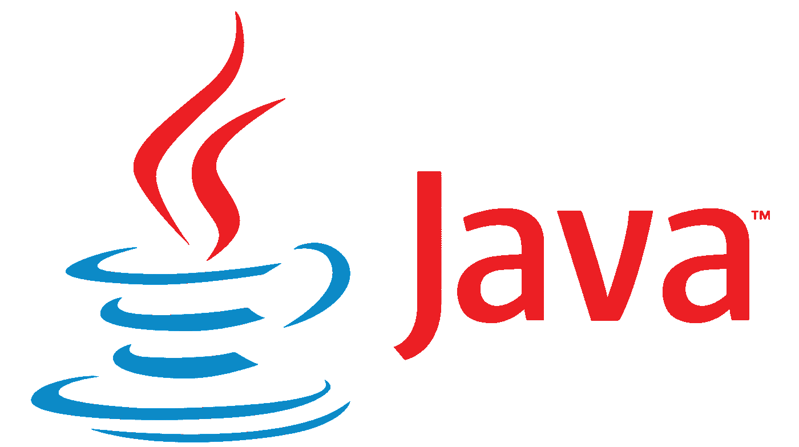
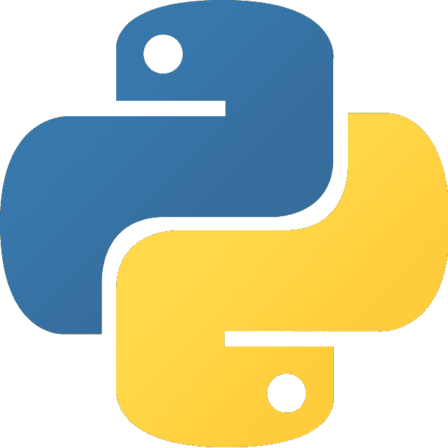
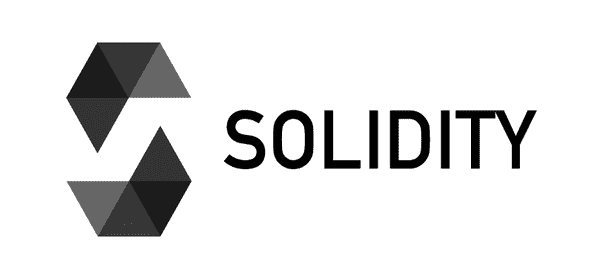
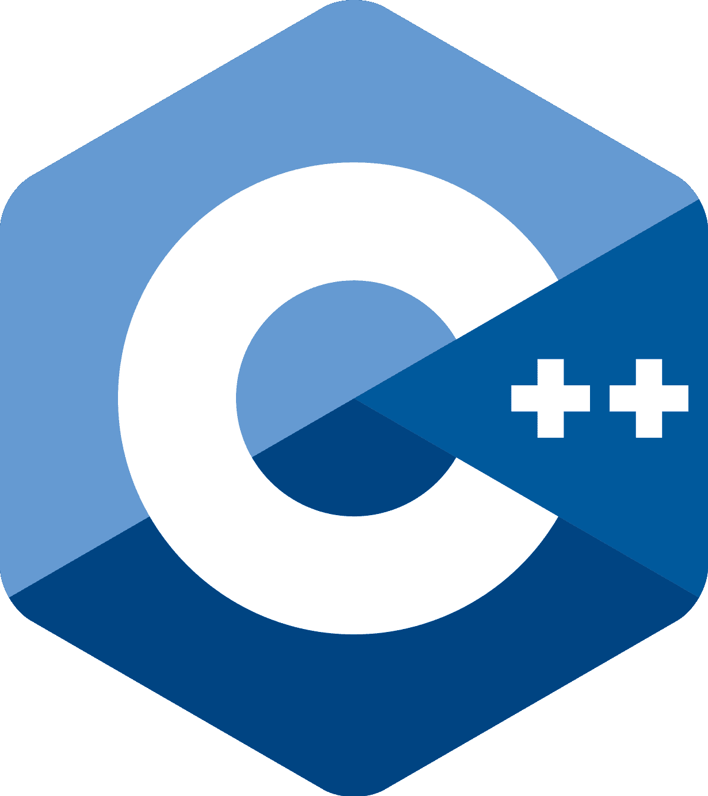
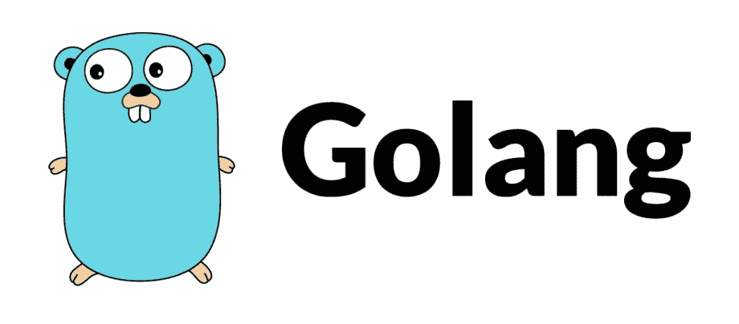
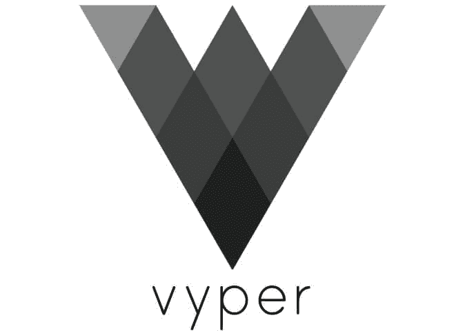

# 顶级区块链编程语言:选择最适合您业务的语言

> 原文：<https://medium.com/javarevisited/top-blockchain-programming-languages-choose-the-perfect-one-for-your-business-a0c53d9a58ad?source=collection_archive---------3----------------------->

区块链是加密货币背后的革命性技术，正在改变当今快节奏世界中许多行业的面貌。

无论你的行业/业务领域可能是什么，[区块链](/javarevisited/7-free-courses-to-learn-blockchain-in-2020-764e66b47ebe)都可以对你和你的公司有所帮助——而且比你想象的要简单。

此外，根据[的一份报告](https://www.grandviewresearch.com/industry-analysis/blockchain-technology-market)，全球区块链技术市场规模在 2021 年价值 59.2 亿美元，预计到 2030 年将达到*14，315.4 亿美元*，在预测期内 CAGR 为 85.9%。

然而，对于许多不同的[区块链开发语言](https://javarevisited.blogspot.com/2022/01/5-best-blockchain-certifications-and.html#axzz7XlFFFwCH)，选择正确的语言可能很困难。

为了帮助您做出正确的选择，我们研究并开发了这份顶级区块链开发语言列表，以帮助您轻松创建您的[区块链网络](https://javarevisited.blogspot.com/2022/01/5-best-courses-to-learn-cryptocurrency.html)。

那么，我们来看看吧！

***相关博客:*** [***用于区块链最好的 10 种编程语言是哪几种？***](/geekculture/which-are-the-10-best-programming-languages-used-for-blockchain-54c07fd83da6)

**找出最好的区块链编程语言**

# **1。Java**

Java 是最流行的区块链开发语言之一。它是一种广泛使用的语言，已经存在了二十多年。另外，它像 [Solidity](https://javarevisited.blogspot.com/2022/01/top-5-courses-to-learn-solidity-for.html) 一样是面向对象的，这使得开发智能合同变得很容易。

使用 Java 的一个优点是，它可以在多个平台上用相同的代码库运行。所以，如果你想让你的智能合约兼容不同的区块链，这可能是正确的语言。

另一个好处是已经有一个庞大的 Java 开发人员社区。这意味着你可能比一些新的区块链开发语言更容易找到人才。

**主要功能:**

*   Java 是独立于平台的。
*   它有一个庞大的开发者社区
*   它有自动内存管理。
*   它提供了比其他语言更好的安全性。
*   Java 提供了高性能。

**一些使用 Java 的区块链项目的例子:**

*   极微小
*   [以太坊](https://javarevisited.blogspot.com/2021/11/top-5-courses-to-learn-ethereum-for.html)
*   新的
*   [总账](https://javarevisited.blogspot.com/2022/02/top-5-courses-to-learn-hyperledger-blockchain.html)

# **2。Python**

Python 是一种通用的脚本语言，已经存在了二十多年。它是最流行的语言之一，数百万开发人员用它来创建各种应用程序。

近年来， [Python](/swlh/5-free-python-courses-for-beginners-to-learn-online-e1ca90687caf) 因区块链开发而广受欢迎。许多企业现在选择这种语言，因为它容易学习和使用。Python 也适合开发复杂的 dApps。

Python 是一种典型的高级语言，这意味着它提供了底层硬件的抽象。这有利于区块链开发，因为它有助于减少错误和提高性能。

[Python](https://betterprogramming.pub/top-5-courses-to-learn-python-in-2018-best-of-lot-26644a99e7ec) 也提供了许多特性，比如广泛的标准库、面向对象编程和异常处理。这些特性有利于开发复杂的 dApps。

**主要特点:**

*   Python 是易学易用的脚本语言。
*   它适合开发复杂的 dApps。
*   它提供了许多特性，比如广泛的标准库、[面向对象编程](/swlh/5-free-object-oriented-programming-online-courses-for-programmers-156afd0a3a73)和异常处理。

**一些使用 Python 的区块链项目的例子:**

*   超分类帐结构
*   新的
*   斯蒂米特

***也读:*** [***加密货币 App 开发十大编程语言***](/nerd-for-tech/top-10-programming-languages-for-cryptocurrency-app-development-f7f4ca3e8599)

# **3。坚固性**

Solidity 是一种面向契约的高级语言，用于实现智能契约。它是由[以太坊](https://www.courserevisited.com/2022/03/top-10-ethereum-courses-learn-trade.html)的团队开发的，是目前编写以太坊智能合约最流行的语言。

Solidity 是一个类似于 [JavaScript](/javarevisited/my-favorite-free-tutorials-and-courses-to-learn-javascript-8f4d0a71faf2) 的语法，它是针对 EVM(以太坊虚拟机)设计的。企业可以使用 Solidity 来创建令牌、投票系统、众筹平台等等。

然而，稳健并非没有缺陷。一个主要的缺点是，它是一门新语言，开发人员相对较少。此外，Solidity 容易受到安全漏洞的影响，比如最近的 DAO 黑客攻击。

**主要特点:**

*   为以太坊开发智能合约。
*   类似于 [JavaScript](https://www.java67.com/2019/01/best-websites-to-learn-javascript-online.html) 的语法。
*   目标 EVM(以太坊虚拟机)。
*   企业用于创建代币、投票系统和众筹平台。

**区块链项目中使用 Solidity 的一些例子:**

*   链环
*   Sushiswap
*   复合协议

# **4。C++**

C++ 是另一种流行的区块链开发语言。它以速度和效率著称。因此，如果您希望您的区块链应用程序快速且可伸缩，C++可能是一个不错的选择。

近年来， [C++](/javarevisited/top-10-courses-to-learn-c-for-beginners-best-and-free-4afc262a544e) 已经为区块链开发所普及。许多企业现在选择这种语言，因为它适合开发智能合同和其他分散应用程序(dApps)。

谷歌、脸书和亚马逊等大公司也在使用 C++。因此，如果您想构建企业级应用程序，这可能是适合您的语言。

C++显然是一种低级语言，它给了开发人员更多的内存管理控制权。这有利于区块链开发，因为它有助于减少错误和提高性能。

C++ 也提供了许多特性，比如标准模板库、面向对象编程和异常处理。这些特性有利于开发复杂的 dApps。

**主要特性:**

*   C++是一种快速而强大的编程语言。
*   它适合开发智能合同和其他分散式应用程序(dApps)。
*   它提供了许多特性，比如标准模板库、面向对象编程(T2)和异常处理。

**区块链项目中使用 C++的一些例子:**

*   黎明的女神
*   主要的
*   莱特币

# **5。戈朗**

Golang 是谷歌在 2009 年创造的一种新的编程语言。它是一种静态类型的编译语言，最近开始流行。

Golang 适合于[区块链开发](https://javarevisited.blogspot.com/2020/07/top-5-online-courses-to-learn-blockchain.html)，因为它提供了广泛的特性，比如并发编程、垃圾收集和内存安全。Golang 也比其他语言更快，这对于开发复杂的 dApps 是有益的。

而且， [Golang](/javarevisited/7-online-courses-to-learn-golang-or-go-programming-languages-in-2020-f599a25cf14a) 是一种低级语言，让开发者对内存管理有更多的控制权。这有利于区块链开发，因为它有助于减少错误和提高性能。

也可以联系 top [区块链发展公司](https://www.valuecoders.com/blockchain-development-company)成功开发区块链项目。

**主要特点:**

*   它是用户友好的。
*   Golang 更具可伸缩性，更灵活，速度更快。
*   Golang 结合了 C++、 [Java](/javarevisited/top-5-java-online-courses-for-beginners-best-of-lot-1e1e240a758) 和 [Python](/javarevisited/the-complete-python-bootcamp-udemy-course-review-b1ab69f232b5) 的特性，成为一种可靠而有趣的语言，用于高效的区块链开发。

**使用 Golang 的区块链项目的一些例子:**

*   GoChain
*   人（戏谑语）
*   织机网络

# 6。Vyper

Vyper 是一种新的编程语言，由以太坊背后的团队开发。这是一种类似 Python 的语言，旨在简单易懂。

Vyper 适合区块链开发，因为它提供了广泛的特性，比如形式验证，这有助于减少错误和提高安全性。此外，Vyper 是一种快速高效的语言，有利于开发复杂的 dApps。

如果您希望开发智能合同或其他分散式应用程序，您应该考虑使用 Vyper。但是，请记住，Vyper 仍然是一种新语言，它没有其他语言那么多的支持。

**主要特性:**

*   Vyper 是一种简单易懂的编程语言。
*   它提供了广泛的功能，如形式验证，这有助于减少错误和提高安全性。
*   这是一种快速高效的语言，有利于开发复杂的 dApps

**使用 Vyper 的区块链项目的一些例子:**

*   以太三角洲
*   占卜师
*   马克道

# 总结一下！

这些区块链编程语言中的每一种都有自己独特的好处和特性，使其适合于[区块链开发](https://www.java67.com/2020/07/top-5-websites-to-learn-blockchain-in.html)。如果你想开发智能合同或者其他分散的应用程序，你应该考虑使用这些语言中的一种。

然而，选择一种适合你需要的语言是很重要的。您可以考虑每种语言的关键特性，并决定哪种语言最适合您的项目。

如果你仍然不确定使用哪种语言，我们建议你 [**聘请区块链开发者**](https://www.valuecoders.com/hire-developers/hire-blockchain-developers?utm_source=Techtoday&utm_medium=Organic%2FAnu_B11&utm_id=Blockchaindevelopers) 或者咨询区块链专家。

**你可能会觉得有意思:** [**为什么 2022-23 年企业要对数字资产采用区块链？**](https://www.valuecoders.com/blog/technology-and-apps/why-should-enterprises-adopt-blockchain-for-digital-assets/)