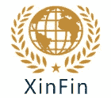
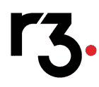
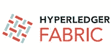
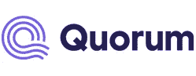

# 顶级企业区块链平台

> 原文：<https://medium.com/javarevisited/top-enterprise-blockchain-platforms-c894c5f30a0f?source=collection_archive---------6----------------------->

区块链技术正变得日益重要，并作为主流技术在世界范围内得到认可。有鉴于此，企业和初创公司更有兴趣探索[区块链](/javarevisited/best-blockchain-courses-and-certification-in-2020-63729f8f04d0)作为他们真正业务问题的解决方案。

为了迎合市场对企业级区块链解决方案的需求，众多区块链平台正以疯狂的速度涌现。

这些平台也称为区块链协议，有助于开发和部署 dApps、分散式存储系统、智能合同和其他区块链应用程序。

每个区块链平台或协议都旨在创建更专业、更高效、更透明的业务流程。因此，它们具有特定的优势、共识机制和分权程度。医疗保健、物流、供应链和许多其他技术领域等行业正处于采用企业级区块链解决方案的前沿。

这个博客列出了五个区块链协议，它们支持并加速了基于区块链的应用和解决方案的开发。

这些平台是根据平台的开发状态、在 Github 等开源软件开发社区中的声誉、共识协议、可扩展性范围以及平台是否支持智能合约功能等因素入围的。

# **辛芬**

eXchange inFinite (XinFin)是一家总部位于新加坡的非营利性区块链公司。这是一个主要关注国际贸易和金融的平台，旨在弥合链外遗留系统和[区块链](/javarevisited/7-free-courses-to-learn-blockchain-in-2020-764e66b47ebe?source=---------5------------------)之间的差距。

XinFin 协议建立在区块链联盟的范例之上，它支持私有和公共网络。在其产品中，XinFin 寻求通过私有区块链的安全性和高交易速度来巩固公共链的去中心化能力。

它也有自己的加密货币 XDC。但是 XDC 没有使用工作证明，而是使用 XinFin 委托利益证明(XDPoS)共识机制。该机制依赖于 108 个可信的分布式主节点，这些主节点是安全的，并且通过满足打桩要求来运行网络。XinFin 的另一个值得注意的地方是它的低交易费用和 2 秒的交易确认时间。

XinFin 支持原子跨链令牌转移和所有 EVM 兼容的智能合约。它在 XinFin Network 的 Masterernode 架构中融入了新的扩展技术，如分片、EVM 并行化、私有链生成和新的硬件集成。

XinFin 的独特产品包括:

*   XinFinMaster:它支持主节点候选位置的应用，并显示主节点的性能统计。
*   XinFinScan:它代表所有块、交易、智能合约、dApps 和令牌信息。
*   xdcwallet:它允许在 XinFin 网络上跟踪奖励并安全地存储、发送和接收代币。

# 2.R3 Corda

R3 是一个由金融机构组成的财团，在 2015 年建立了一个名为 Corda 的开源区块链平台。为了使企业能够直接和严格地执行交易，Corda 支持 DLT 应用程序。

它没有任何内置令牌或加密货币。它提供对数字记录的细粒度访问控制，并通过在许可模式下操作来增加隐私。它的共识机制是异步拜占庭容错共识，它支持智能合约功能。

最初，Corda 旨在为金融行业服务，但现在正被用于医疗保健、供应链、贸易和政府机构等各种其他行业。

像英特尔和微软这样的许多大牌都在使用 Corda 作为区块链平台。R3 Corda 使用 CDL (CorDapp 设计语言)、capacity 2in sprints 和部署支持来提供解决方案架构服务。

# 3.超分类帐结构

Hyperledger 是一个流行的开源社区，为企业级区块链部署开发了一套稳定的框架、库和工具。

它是各种分布式分类帐框架(如 Hyperledger Fabric、锯齿)的中立或主机平台。Hyperledger Fabric 支持使用模块化架构开发解决方案和应用程序。其主要特点包括:

*   高性能和可扩展性
*   支持插件组件的模块化架构
*   许可成员资格
*   可查询的数据
*   更低的终结延迟

# 海德拉哈希图

Hedera hashgraph 是一个公共网络，它不涉及繁重的工作验证算法的计算。它是高度可扩展的，并且促进了创新的和可扩展的分散应用程序的设计和开发。它依赖于异步拜占庭容错(aBFT)共识机制。Hedera 与其他区块链平台的区别在于其公平、快速、安全和独特的机制，为更高的透明度提供了相当可靠的算法。

Hedera Hashgraph 的主要功能包括:

*   比其他区块链平台相对更快
*   安全稳定
*   低交易费用
*   多重签名交易和账户

# 法定人数

作为 JP 摩根的创意，Quorum 是一个以企业为中心的平台，它利用了区块链以太坊，旨在满足金融行业的需求。这是一个开源的区块链协议，旨在用于私人区块链网络。Quorum 在许可的网络上运行，因此，它允许组织根据自己的需要定制平台。法定人数的主要特征包括:

*   开源
*   社区驱动
*   成熟的
*   值得信赖且企业就绪
*   增强的合同和交易隐私
*   更好的性能
*   基于投票的共识机制
*   适当的对等和网络管理

# **结论**

如今，数据管理和快速交易对任何组织都至关重要。数据管理面临的主要挑战是安全性、缺乏透明度和更高的复杂性。目前活跃和正在进行的区块链项目彰显了区块链处理组织级数据管理需求的能力。

如果您正在寻找您的下一个区块链解决方案，并愿意探索不同的[企业区块链平台](https://www.leewayhertz.com/top-enterprise-blockchain-platforms/)的能力，那么您可以与 LeewayHertz 联系。该公司在[区块链](https://www.java67.com/2018/02/5-free-blockchain-technology-courses.html)咨询和开发多种区块链平台/协议方面拥有多年的经验，包括本文中提到的那些。