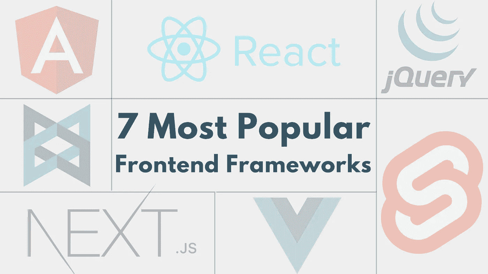

# 开发人员最常采用的 7 个前端框架💜

> 原文：<https://medium.com/javarevisited/top-frontend-frameworks-6e5f12977c79?source=collection_archive---------3----------------------->

前端框架是 [web 开发](/javarevisited/10-best-coursera-courses-for-web-development-and-web-design-9ec54ed92dd9)的重要工具，因为它们为构建 web 应用程序的用户界面提供了结构化和有组织的方法。它们帮助开发人员创建一致且高效的布局、样式和交互，使开发和维护 web 应用程序变得更加容易。

它允许您的 web 应用程序以与任何其他程序(在桌面操作系统、移动设备或其他地方)相同的方式与 API 交互。此外， [*前端框架*](/javarevisited/10-best-frontend-and-backend-frameworks-for-java-python-ruby-and-javascript-developers-cce3c951787a) 可以改善用户体验，因为它们完整地保留了页面的公共部分(如导航等)。)并加载用户请求的任何数据，而不是每次点击都刷新和重新加载。

在本文中，您将了解最流行的前端框架</javarevisited/10-best-frontend-and-backend-frameworks-for-java-python-ruby-and-javascript-developers-cce3c951787a>*，并确定哪一个最适合您的网站或 web 应用程序。或者，选择正确的前端框架将帮助您节省时间和金钱。🚀*

# *Web 开发的 7 个最佳前端框架🏆*

*最流行的前端框架有 [React](/javarevisited/6-best-websites-to-learn-react-js-coding-for-free-ba7ec5c43433) 、 [Angular](/javarevisited/top-10-angular-books-and-courses-for-beginners-and-experienced-web-developers-best-of-lot-9a2dae87f04c?source=collection_home---4------1-----------------------) 和 [Vue.js](/javarevisited/top-5-online-courses-to-learn-vue-js-in-2021-249e66b60646) ，其中 React 在 [42.62%](https://gist.github.com/tkrotoff/b1caa4c3a185629299ec234d2314e190) 应用最广泛。*

# *7.主干 JS*

*框架非常适合在一组 REST APIs 上构建客户端丰富的应用程序。所有必要的代码，如 HTML、CSS 和 JavaScript，都可以在一个页面中检索到，BackboneJS 提供了丰富而流畅的 UX。*

# *6.jQuery*

*一个小巧、简单、易用、功能丰富的 JavaScript 框架，是最好的前端框架之一。jQuery 用一行代码包装了多行 JavaScript 代码。它简化了 JavaScript 的许多复杂事情，比如 AJAX 和 DOM 操作。*

# *5.Next.js*

*[Next.js](/javarevisited/7-best-online-courses-to-learn-next-js-for-react-developers-ced862a3864) 是一个用于构建服务器渲染或静态导出的 React 应用的框架。它简化了通用(同构)React 应用程序的开发，具有服务器端渲染、自动代码分割和优化的性能。*

# *4.苗条的*

*[Svelte](https://javarevisited.blogspot.com/2020/05/top-3-courses-to-learn-sveltejs-in-2020.html) 是一款用于构建 web 应用的轻量级 JavaScript 编译器。它在构建时将组件编译成高效的普通 JavaScript，这可以提高应用程序的性能。*

# *3.vue . j*

*[Vue.js](/javarevisited/10-free-vue-js-nuxt-js-online-courses-for-beginners-in-2021-a347ea2ad144) 是一个用于构建用户界面的渐进式 JavaScript 框架。它是轻量级的，易于学习，并且专注于应用程序的视图层。常用于构建单页面应用和 [*移动应用*](/javarevisited/10-frameworks-and-libraries-mobile-application-developers-can-learn-in-2020-e0b91391cade) 。*

# *2.有角的*

*[Angular](/javarevisited/10-free-angular-and-react-js-courses-from-udemy-and-coursera-best-of-lot-e67f7d811e6b) 是一个全面的 JavaScript 框架，用于构建单页面应用程序(spa)。它由 Google 维护，提供了丰富的特性，包括强大的模板系统、依赖注入和反应式编程模型。*

# *1.反应*

*一个由脸书开发的用于构建用户界面的 JavaScript 库。它广受欢迎，经常与其他 JavaScript 库或框架结合使用，如用于状态管理的 [Redux](https://javarevisited.blogspot.com/2018/08/top-5-react-js-and-redux-courses-to-learn-online.html) 或 MobX，以及用于 API 通信的 [GraphQL](/javarevisited/top-5-graphql-tutorials-and-courses-for-beginners-fb5543506fc2) 。*

# *总结*

*最终，项目的最佳前端框架将取决于项目的特定需求和目标，以及开发团队的偏好和经验。仔细评估可用选项并选择最能支持项目需求的框架非常重要。*

## *文章来源:*

*<https://bit.ly/3j7Ogh3>  

**感谢阅读！😊***