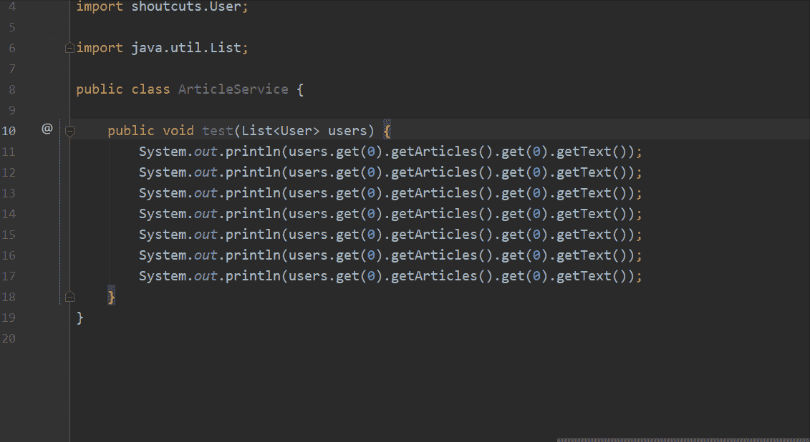
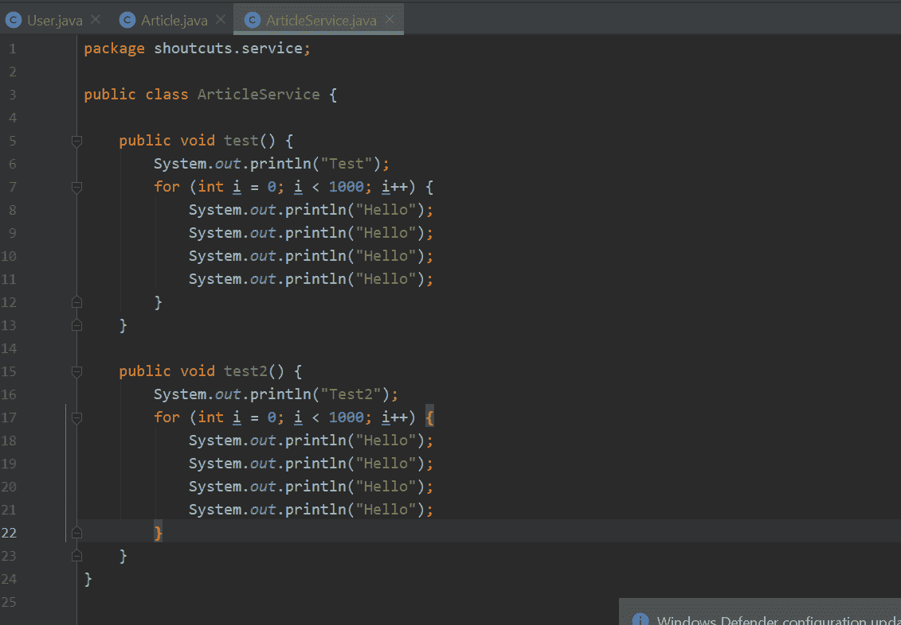
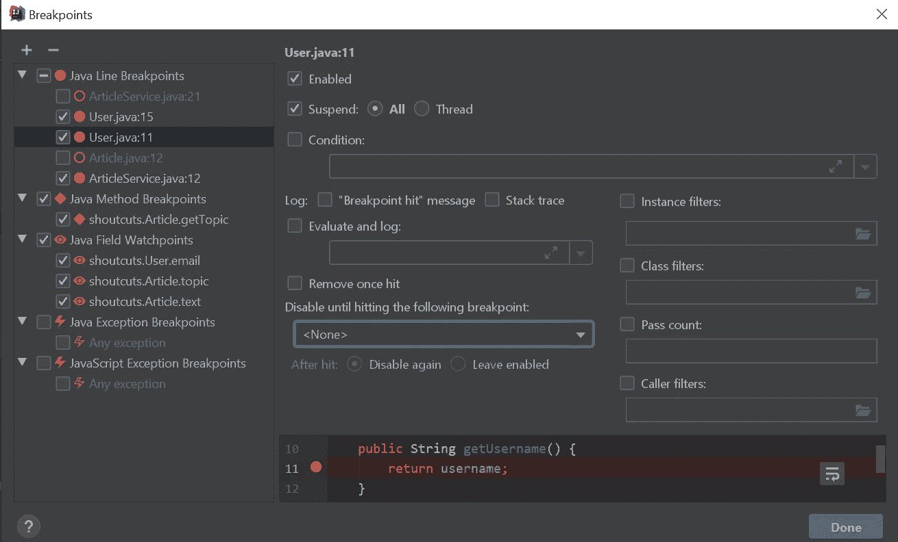
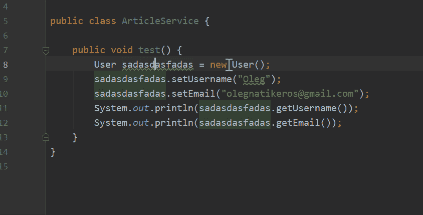
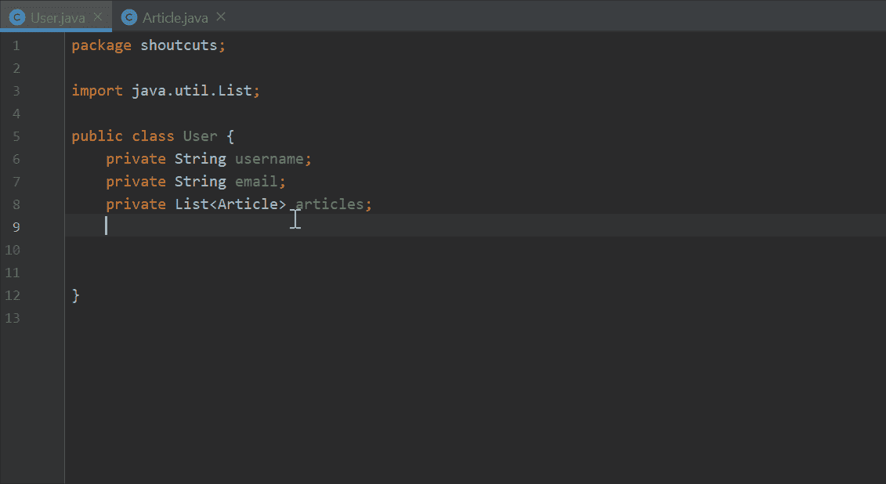
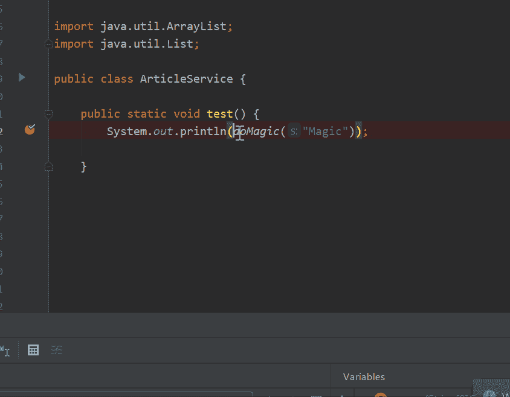
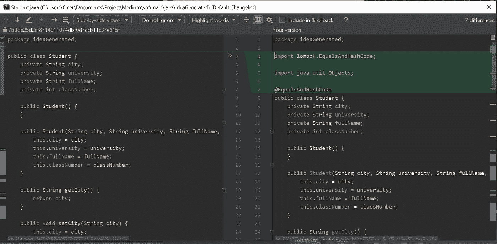

# 每个开发人员都应该知道的顶级 IntelliJ 创意热键

> 原文：<https://medium.com/javarevisited/top-intellij-idea-hotkeys-every-developer-should-know-36b14930ec5e?source=collection_archive---------4----------------------->

## 10 个必须知道的 IDEA 快捷方式特性，它们对每个开发人员来说都是至关重要的，并且可能是大一新生的良好开端

照片由[雅利安·迪曼](https://unsplash.com/@mylifeasaryan_?utm_source=medium&utm_medium=referral)在 [Unsplash](https://unsplash.com?utm_source=medium&utm_medium=referral) 上拍摄

热键是开发过程中最重要的方面之一，它们使编程更简单、更快，因此了解热键是必要的。有一个最重要的热键列表，经验表明，不管职位和经验如何，并不是所有的开发人员都使用甚至知道它们。所有这些热键都是不可或缺的，在调试、重构或使用 git 时并不明显。这个列表对专业人士和新生都很有用，前者可以确保他/她没有跳过任何东西，后者可以从关键的开始学习热键。

## 1.提取变量

> **Windows: Ctrl + Alt + V**
> 
> **Mac: ⌘+⌥ +V**

这个热键可以让你节省时间，不用手动编写引用类型和名称。例如，你不需要输入整个表达式`User *user* = **new** User();`，你所需要的只是输入`**new** User()`并按下 **Ctrl + Alt + V** ，IDE 会为你做所有的脏活累活。

此外，它还可以帮助您用一个变量替换所有特定的相似代码块。这个特性可以帮助你重构糟糕的代码，节省你大量的时间。

**2。提取方法**

> **Windows: Ctrl + Alt + M**
> 
> **Mac: ⌘+⌥ +M**

它允许您从代码块中创建一个方法。如果有几个相同的代码块，IDE 会用生成的方法调用替换它们。此外，这个特性在处理重复代码时非常方便。它允许您摆脱样板代码，并从在多个地方使用的代码块中创建方法。

**3。查看断点**

> **Windows: Ctrl + Shift + F8**
> 
> Mac: ⌘+⇧+F8

显示项目中创建的所有断点。有了这个选项，当你不想要代码执行的时候，如果它们停止了你的代码执行，你就不必搜索你的断点并手动删除它们。此外，这个特性允许您禁用断点。被禁用的断点不会在调试期间停止您的代码，但是当您需要它时，您可以很容易地再次激活它们，因此您不需要记住项目中的所有关键位置以及每次创建和移除断点。

如果您想了解更多关于 IntelliJ IDEA 调试特性的信息，请随意阅读这篇关于在 IDEA 中调试最佳实践的文章。

</swlh/intellij-idea-debugging-best-practices-e374ae9a7ed8>  

**4。重命名**

> **Windows: Shift + F6**
> 
> **Mac: ⇧+F6**

它允许你在整个项目中重命名你的一个变量/方法/文件。这意味着如果你重命名一个在其他文件中使用的变量，它也会被重命名。重命名文件或方法也是如此。在提高代码可读性的过程中，这个选项是必不可少的。

**5。生成代码**

> **Windows: Alt + Insert**
> 
> **Mac: ⌘+N ⌃+Enter**

它允许你生成 getter/setter/constructor/equals/hashcode/等。

这个特性让您不必每次都专注于编写相同的代码，而是将更多的时间花在业务逻辑上。IDE 为您提供了用不同数量的参数创建多个构造函数的可能性。例如，如果您生成一个构造函数，IntelliJ IDEA 让您选择该构造函数的参数。

**6。评估表达式**

> **Windows: Alt + F8**
> 
> **Mac: ⌥+F8**

[IntelliJ IDEA](https://itnext.io/top-5-intellijidea-and-android-studio-courses-for-java-and-android-programmers-afcc27309b60) 允许你在断点处计算表达式。这是一种非常方便的方式来查看该方法如何处理其他值。

如果您需要用不同的值测试您的方法，不要手动创建对象并重新启动应用程序，您可以用这些值评估方法，这可以节省您很多时间，而且，您将看到返回对象的所有属性。

7。回滚

> **Windows: Ctrl + Alt + Z**
> 
> Mac: ⌘+⌥+Z

IDE 允许您回滚本地更改。自上次提交以来对选定文件所做的所有更改都将被丢弃，并且它们将从活动更改列表中消失。您可以查看已更改文件的列表，并选择要回滚的文件。

双击时，您可以看到上次提交和本地更改之间的差异:

如果您想在不隐藏或搁置的情况下撤销一些本地更改，这个特性非常方便。

如果你想了解更多关于在 IntelliJ IDEA 中使用 git 的信息，请阅读这篇关于几乎所有 IDEA git 特性的文章:

</swlh/intellij-idea-git-features-7fff92ffa6b5>  

**8。在路径**中查找

> **Windows: Ctrl + Shift + F**
> 
> **Mac: ⌘+⇧+F**

让您搜索方法/文件/类等。显著改进了项目导航，它让您可以配置您想要搜索的位置，并在您搜索文件时提供扩展名。它可以节省你大量的时间，特别是如果你已经加入了一个新的项目。

最后两个热键可能是最流行的 IntelliJ IDEA 快捷方式，但是我把它们添加到列表中只是为了初学者，他们只是学习 IntelliJ IDEA 的特性。

**9。优化进口**

> **Windows: Ctrl + Alt + O**
> 
> **Mac: ⌃ +⌥ +O**

优化您的导入，删除未使用的导入。如果你从同一个包中导入许多类，IDEA 可以导入整个包，反之亦然。所以要小心，如果因为某种原因不需要导入整个包。

**10。重新格式化代码**

> **Windows: Ctrl + Alt + L**
> 
> **Mac: ⌘+⌥ +L**

只需格式化您的代码。在需要的地方添加空白和线条。如果您有特定的代码风格项目约定，您可以在**设置- >编辑器- >代码风格**中轻松配置

记住热键是开发过程中非常重要的一部分，了解热键可以为你创造更多的学习、商业逻辑和放松的时间。

[***在这里***](https://resources.jetbrains.com/storage/products/intellij-idea/docs/IntelliJIDEA_ReferenceCard.pdf?_ga=2.261763144.479909709.1591123989-1888623525.1591123989) 你可以找到 IntelliJ IDEA 所有快捷键的键位图。当然，短期内不可能全部学会。为了简化这种学习，你可以安装 [***快捷键启动器 X***](https://plugins.jetbrains.com/plugin/9792-key-promoter-x) ，每当你跳过热键的时候它都会通知你，第一次会很烦，但是你不会注意到当你使用快捷键的时候会显著增加。

此外，如果您想了解更多关于 IntelliJIDEA 的知识，您也可以查看这些在线课程:

<https://itnext.io/top-5-intellijidea-and-android-studio-courses-for-java-and-android-programmers-afcc27309b60> 