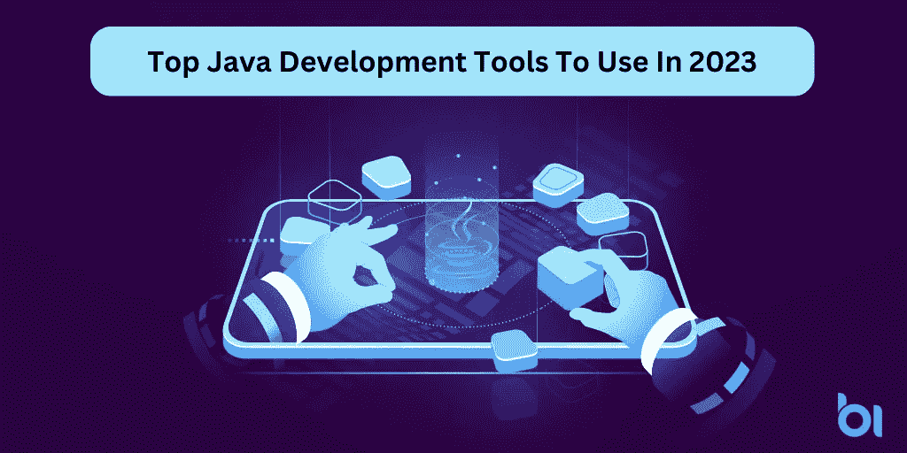
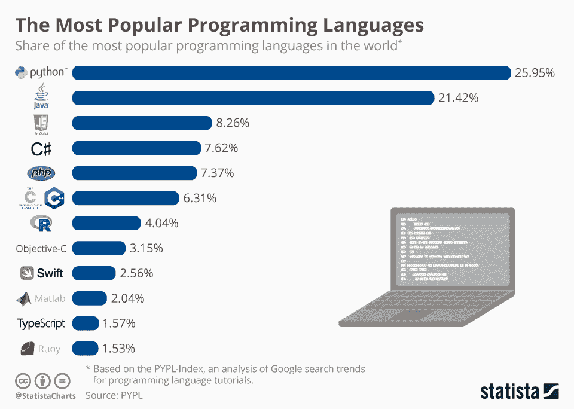

# 2023 年将使用的顶级 Java 开发工具

> 原文：<https://medium.com/javarevisited/top-java-development-tools-to-use-in-2023-8ce666ad8dfa?source=collection_archive---------0----------------------->

## **帮助您在 2023 年保持领先的 8 款顶级 Java 开发工具**

尽管企业正转向数字平台以创建在线业务，但许多人仍不知道如何开始？如果你也是那些寻找最好的语言来开始软件开发的人之一，那么 [JAVA 开发工具](/javarevisited/10-best-java-development-tools-you-can-learn-66f7d4d837e6)就在这里帮助你。

*这个博客将帮助你了解 2023 年可以使用的顶级 Java 开发工具。*

Java 是世界上最流行的编程语言之一，在过去的几年里变得越来越流行。它的受欢迎程度也没有下降的迹象，它继续在所有行业受欢迎，从应用程序开发到 web 开发。

随着 Java 越来越受欢迎，可用来更快、更有效地构建 Java 应用程序的软件工具也越来越多。但是哪些是值得你花时间的呢？在本文中，我们来看看八种 Java 开发工具，当你在 2023 年从事下一个大项目时，你一定会考虑这些工具。

但是，在深入了解这篇博客的细节以发现应用程序开发中使用的 8 大 java 工具之前，有必要了解一下这篇博客的主要亮点:

*   ***Java 是什么，为什么这么受欢迎？***
*   ***用 Java 工具可以构建什么？***
*   ***为什么公司信任并偏爱使用 Java 编程？***
*   ***2023 年可以使用的 8 大 Java 工具***
*   ***结论:下一步何去何从？***

让我们进入每一点的细节…

# **Java 是什么，为什么这么受欢迎？**

Java 是一种编程语言和计算平台，由 Sun Microsystems 于 1995 年首次发布。这种语言有许多不同的版本，最新的版本是 Java 11。该技术已被企业和组织广泛采用。但是是什么让它如此受欢迎呢？

## ***Java 如何继续成为流行的企业编码语言之一？***

随着软件开发行业的发展，许多开发语言来来去去。但是 Java 保持了它在最流行语言中的地位。在你 [**雇佣应用开发者**](https://www.appsdevpro.com/hire-developers.html) 开始构建你的应用之前，你需要理解为什么 Java 及其工具在 2023 年仍然是趋势。

[图片来源](http://cdn.statcdn.com/Infographic/images/normal/16567.jpeg)

Java 最大的亮点在于它是一种通用语言，可以在任何类型的计算机或设备上运行。它可以在从智能手机到超级计算机的任何东西上工作，因为它是平台独立的。它还具有自动内存管理，这意味着你不必担心摆脱不需要的对象。

Java 也比其他语言更有效地处理安全问题，因为它可以自动防御病毒、恶意软件和黑客。这样，用户可以专注于自己的代码，而不必担心这些威胁不断出现。

# **用 Java 工具可以构建什么？**

Java 工具可以用于各种目的，从开发 Android 应用程序到构建桌面应用程序。

它们是通用的和跨平台的，这意味着 Java 开发人员可以在 MAC 和 PC 上无缝工作。因此，你所需要的就是 [**雇佣 java web 开发者**](https://www.appsdevpro.com/hire-developers/hire-web-app-developers.html) 来定制你的软件解决方案。Java 是免费和开源的，这意味着开发者社区很大并且支持它。有了 Java 开发工具，开发人员可以构建任何他们想要的东西。

除此之外，以下是您可以使用 Java 工具构建的内容:

*   **安卓应用**

Android 平台对应用程序开发产生了巨大的影响。据估计，谷歌 Play 商店有超过 300 万个应用程序，下载次数超过 1000 亿次。这种巨大的用户基础是可能的，因为开发人员知道他们可以依赖用 Java 编写的库。

在 Android 出现的大部分时间里，开发人员一直在使用 Java 语言。要为 Android 操作系统编程，你必须使用 Android Studio——官方授权的 IDE。由于 Android 依赖于 API，并且支持使用大量的 Java 库，所以你可以很容易地用 Java 编写 app。

*   **网络应用**

Java 也非常适合 web 应用程序开发，因为它提供了优秀的工具和集成开发环境(IDE)。此外，开发人员可以使用普通 Java 对象和 Spring 框架创建现代 web 应用程序。开发人员可以使用它们来创建 web 应用程序，这些应用程序使用普通的 Java 对象或用户界面(ui ),这些界面是用 NetBeans、Apache Flex 或 GWT 等工具创建的。

无论您是想从头开始创建一个新的移动应用程序，还是想将现有的应用程序转换成移动格式，开发人员都可以利用 Java 的平台独立性，有几个很好的选择。

此外，你可以雇佣一个专门的开发团队，用许多流行的 Java 框架创建一个 web 应用程序，并为 Android 和 iOS 设备提供原生绑定。例如，Android 基于 Java SE 7，这意味着它与用 C++等传统语言创建的企业应用程序所使用的现有库和框架兼容。

*   **桌面应用**

除了开发企业应用和网站，Java 还可以用来编写嵌入式设备的应用，以及编写桌面应用。Java 最常见的用途是作为中间件，它提供的接口使程序员更容易构建连接到数据库和组织系统其他部分的应用程序。

*   **用 Java 开发游戏应用**

Java 是最流行的游戏开发编程语言。Java 已经被用于开发许多不同类型的游戏，从像《孤岛危机 3》和《生化奇兵无限》这样的第一人称射击游戏到像 Jetpack Joyride 和 Crossy Road 这样的街机风格游戏。

Java 还支持其他编程语言的集成，这使得在使用单一代码库的同时混合不同的语言变得很容易。你可以使用 Java 工具在所有平台上构建游戏，包括 Windows、 [Mac OS X](https://javarevisited.blogspot.com/2022/02/top-5-macos-courses-for-beginners-in.html) 、 [Linux](/javarevisited/top-10-courses-to-learn-linux-command-line-in-2020-best-and-free-f3ee4a78d0c0) 以及搭载 Android 或 iOS 操作系统的移动设备。

*   **面向大数据的 Java】**

Java 已经成为企业的主要编程语言，尤其是由于大数据的兴起。Java 是一种高级编程语言，旨在创建健壮的程序和服务，只需要很少的维护。Java For [Big Data](/dataseries/top-6-courses-to-learn-big-data-and-hadoop-in-2020-2e20593347fe) 为开发人员提供了工具，使他们可以通过 Hadoop 和 Spark 框架轻松地探索大型数据集，这可能很难自行配置。

*   **面向物联网的 Java**

Java 是一种流行的编程语言，也是最受物联网欢迎的编程语言。面向物联网的 Java 使开发人员能够构建灵活、可扩展、安全的应用，这些应用几乎可以在任何设备上运行。为了利用这个物联网工具，你可以雇佣一个 web 应用开发者**。**它还支持远程更新，因此您可以通过无线方式(OTA)推送安全补丁或新功能。使用 Java 工具的另一个重要原因是与其他技术的互操作性，比如云服务。

# **为什么公司信任并喜欢使用 Java 编程？**

当开发一个软件应用程序时，它的性能是企业的第一要务。但是为什么公司更喜欢用 Java 呢？

各行各业的许多大银行、政府机构和公司都在使用 Java。它是世界上使用最广泛的编程语言之一，如果你是 [**招聘移动应用程序开发人员**](https://www.appsdevpro.com/hire-developers/hire-mobile-app-developers.html) ，你可能会在某个时候需要了解它。因此，在使用 Java 开发应用程序时，您需要了解 Java 开发工具的几个最常见的优点:

*   **它是为程序员设计的** —这种语言的语法从一开始就为程序员设计得易于使用。
*   **巨大的库**——Java 拥有超过 50000 个包，提供了足够多的功能来满足任何项目需求。
*   **可移植语言**——一个用 java 编写的程序可以在任何东西上运行，从你的笔记本电脑到托管几十个网站的服务器。
*   **可访问语言**——如果你对 java 学得足够好，没有其他编程语言会比你学习和理解起来困难得多。
*   **健壮的编译器** — Java 编译快速且无错误，因此项目可以直接投入生产，而不像其他语言那样需要等待数天或数周的编译错误。
*   **强大的支持** —大多数操作系统都预装了 java，并与 Eclipse、Netbeans 和 IntelliJ IDEA 等流行工具捆绑在一起。
*   **内置线程** — Java 内置了对线程的支持，与没有这一特性的语言相比，它简化了并行编程。
*   **开源** —甲骨文并不拥有 java 的权利，因此任何人都可以对代码库进行修改，从而加快版本之间的更新。
*   **轻松部署** —与需要预先设置服务器的语言不同，部署 java 应用程序非常简单，只需在需要访问的每台机器上运行一次命令行工具。
*   Android 开发 — Android 使用 java 的修改版本 Dalvik，可以在手机和平板电脑上运行，而不是在电脑上。
*   **数据分析工具—** 有几个数据分析库是用 java 编写的，比如 Apache Spark 和 Apache Hadoop。
*   **更大的社区**——当构建新的东西时，你不再局限于你当地的社区，因为你可以在网上找到来自世界各地的开发者，他们知道自己在做什么。

这些是帮助 Java 保持其地位的几个主要优势。然而，对于许多企业来说，问题是您需要学习的 Java 开发工具的最佳选择是什么。

# **2023 年可以使用的 8 大 Java 工具**

如果你想知道哪个是 Java 开发工具的最佳选择，那么你可以考虑一下 [Stack Overflow 的 2021](https://insights.stackoverflow.com/survey/2021#technology-most-popular-technologies) 的调查报告。Java 的灵活性使得它在构建多个应用程序时很受欢迎，因为它提供了 8 大开源工具来帮助您创建高性能的应用程序。

## **1。声纳座**

SonarQube 是一个自动代码审查工具，它扫描代码并协助程序员编写更安全、更干净的代码。它集成了像 Jenkins、Azure DevOps Server 等 CI/CD 工具。

SonarQube 提供了许多特性，使您的代码质量更好，安全性更强。比如一个编辑器，它可以帮助确保你不会留下任何重要的错误，以及一种判断你的项目是否足够稳定以用于生产的方法，SonarQube 的社区版本是完全免费的，但是通过一些更高级的功能和更专业的分析工具，你可以升级到商业许可证。

> **sonar cube 的工具特性**

*   SonarQube 是一个开源平台，提供代码质量度量、问题跟踪和持续分析功能。
*   它支持各种编程语言，并使用各种测试框架来分析代码。
*   SonarQube 可以自动检测代码中的许多问题，包括重复代码、未使用的变量和方法、过度使用的方法等等。
*   此外，它使您能够创建自己的规则来检测特定的问题。
*   它以托管服务的形式提供，因此您无需担心在自己的服务器上安装或维护它。

## **2。詹金斯 CI**

Jenkins 是一个开源的持续集成服务器。它自动化了从存储库中检出代码并通过一系列测试运行代码的过程。许多软件公司使用 Jenkins 在每次提交时检查他们的代码。

该工具还具有插件，允许您与各种其他工具集成，包括 Sonar，它可以帮助早期发现问题，以便快速修复。

> **Jenkins CI 的工具特性**

*   Jenkins CI 是一个持续集成和交付工具，允许开发人员构建、测试、打包和部署代码。
*   该工具最初是由 Kohsuke Kawaguchi 创建的，但现在它已经成为 CloudBees 支持的完全成熟的产品。
*   Jenkins 主要用 Java 编写，安装过程从安装 Oracle JDK 开始。
*   Jenkins CI 具有各种各样的特性，这使得它成为当今开发团队使用的最流行的工具之一。
*   其中一个主要特性是它能够通过网页或电子邮件通知来报告进度，这使得团队成员更容易跟踪他们的任务。
*   Jenkins 还监控事件，如谁推动了什么变化，什么时候发生的，在哪个分支上提交的等等。

## **3。NetBeans**

NetBeans 是最流行的 Java 开发工具之一，几乎可以在所有平台上运行，包括 Windows、Linux、Solaris 和 MacOS。除了 Eclipse，它还支持其他编程语言，如 C、C++、JavaScript 等。

> **以下是 NetBeans 的主要特性:**

*   对于 Java Swing 桌面应用，它是一个框架。
*   它可以用来保存和加载任何类型的数据。
*   向导框架支持逐步对话。
*   开源的集成开发工具。强大的调试功能。使用 HTML5、CSS3 和 Javascript 开发 web 应用程序的优秀 IDE
*   JavaScript 调试器允许开发人员远程调试浏览器中运行的客户端代码或 Node.js 服务器端脚本

## **4。安卓工作室**

使用 NetBeans 可以构建桌面和 web 应用程序，但是编写 Android 应用程序需要 Android Studio。基于 IntelliJ IDEA，Android Studio 自带了 Android 特有的重构工具、Lint 工具等等。

你日常使用的大多数移动应用程序仍然使用 Java，尽管谷歌已经用 Kotlin 取代 Java，作为其 Android 应用程序的首选编程语言。

使用 Android Studio，你可以编译你的应用程序，如果你的应用程序符合谷歌的开发者政策，它可以直接发布在谷歌 Play 商店上。

> **Android Studio 的主要特性**

*   Android Studio 是一个用于编写 Android 应用程序的 IDE。
*   它提供了一个完全集成的开发环境，允许您在一个屏幕上编写代码、测试应用程序、调试应用程序和构建 Android 应用程序。
*   即时运行——这是一种快速获得代码变更即时反馈的方式，而不必等待 gradle sync 或完全重建。如果愿意，可以将其关闭。
*   VCS 集成——版本控制系统集成可用于 Git 和 Subversion 存储库，并且能够查看对文件的修改历史，如果需要的话还能够恢复任何更改。

## **5。Maven**

Maven 是一个用于 Java 项目的项目管理工具，它还将所有项目的构建、报告和文档存储在一个中心位置。Django 要求约定胜于配置，这意味着它固执己见，你需要遵循它的标准方法，用清晰的指导方针来构建项目。

Maven 的另一个替代品叫做 Ant。Ant 比 Maven 更少固执己见，这使得它更容易配置。你也可以 [**雇佣一个网络应用开发者**](https://www.appsdevpro.com/hire-developers/hire-web-app-developers.html) 来构建运行更快的 Maven 应用。因此，开发人员必须自己编写所有命令。除非您的项目有不寻常的构建结构，否则 Maven 是更容易的选择。

> **Maven 的主要特性**

*   速度越快，性能越好。
*   介绍并行构建的概念。
*   该软件的错误报告得到了改进，使其与过去的软件完全兼容。
*   在子模块中没有必要指定父版本，因为默认情况下会假定父版本。
*   可以从存储库中提取。
*   故意快。
*   如果没有找到依赖项，则会自动下载。
*   每一个依赖项和每一段构建代码都与您自己的代码捆绑在一个 Maven 规范中。
*   结构相对简单。
*   您可以自动获取所有 jar 的 Javadoc，并可以执行单元测试。
*   维护和模块化代码。

## **6。IntelliJ IDEA**

它是一个由 JetBrains 构建的框架，可以作为 Apache2 许可证下载，或者作为商业人士和软件开发人员的专有许可证下载。Jasypt 是为代码重构而设计的。它是用 Java 编程语言编写的，可以作为开源环境获得。

> **IntelliJ IDEA 的主要特性**

*   支持版本控制系统。
*   此外，它还支持其他构建工具，如 Maven、Ant、Gradle 等。
*   这是执行单元测试的简单方法。
*   它内置了一个反编译器。
*   支持 Apache Tomcat、WebLogic、Glassfish 和其他应用服务器。
*   支持 JavaScript、SQL、Scala、Groovy 等语言。
*   键盘快捷键用于编辑、使用 Windows 工具等。
*   因此，它有助于通过查找重复来优化代码。

## **7。詹金斯**

JavaServer Page (JSP)用于编程，是一个用 Java 编程语言编写的开源框架。Apache Tomcat 是它的一个示例 servlets，它是一种基于 Java 服务器的自动化系统。该软件使开发人员能够找到并修复编码错误，并自动化该过程。

> **詹金斯的关键特性**

*   一个简单、用户友好、可扩展的开源应用程序。
*   因为引入了插件，所以使用起来很简单。
*   安装和升级很容易。
*   开源的免费工具。
*   此外，它支持构建管道。
*   与所有主要工具轻松集成。
*   各种插件。
*   因为它是开源的，所以很容易学习、理解和使用。
*   API 被集成到系统中。

## **8。格雷德**

Gradle 是一个依赖管理和构建自动化工具，它基于 Ant 和 Maven 的概念。它用一种易于使用的特殊语言构建，而不是选择一种称为 XML 的文本形式。更小的配置文件和更少的混乱通常是缩小的结果。

用 Gradle 编译 Java 需要一个 Java 插件。Gradle 的大部分功能来自于它的插件。如果您不熟悉 Groovy 或 Kotlin，它的学习曲线会更高，但是它对于复杂的数据库特别有用，因为它更快并且提供了高级调试特性。

> **Gradle 的主要特点**

*   能够快速适应和反应。
*   因为它支持各种语言，比如 Java、Groovy 和 Scala。
*   允许您使用基于 Groovy 语言的 DSL。
*   用于管理任务、项目和依赖工件等的深度和广度的 API。
*   完全免费。
*   对依赖项和构建的自动化支持。
*   由于依赖项和构建的工作方式，迁移很容易。
*   快节奏。
*   优雅的使用和阅读。
*   安装容易，有良好的文件，并从破损安全。

# **结论**

Java 是一种用于开发桌面、web 和移动应用程序的编程语言。它已经存在了二十多年，是应用程序开发中最流行的语言之一。因此，如果你计划用 Java 工具创建一个应用程序，但不确定哪个工具适合你的项目需求，那么你可以 [**雇佣一个应用程序开发人员**](https://www.appsdevpro.com/hire-developers.html) 来帮助你。

它不会很快普及，因为许多开发人员仍在使用它来构建他们的解决方案。随着对软件需求的不断增长，它将继续流行。Java 语言可以编译，也可以解释，后者比前者快。

因此，如果您心中有一个项目想法，并且正在寻找一个专家应用程序开发团队来帮助您选择最佳的 Java 工具，那么您可以联系我们或在下面提出疑问。