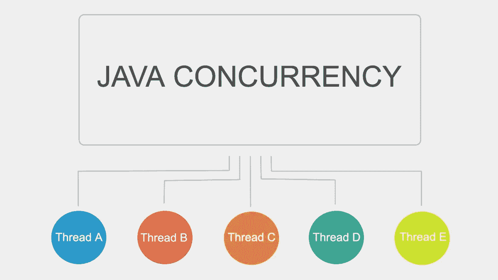

# 每个开发人员/架构师都必须知道的主要性能问题—第 2 部分—并发性

> 原文：<https://medium.com/javarevisited/top-performance-issues-every-developer-architect-must-know-part-2-concurrency-a15bd0b2b3b6?source=collection_archive---------0----------------------->

大家好。本文是第 1 部分的延续