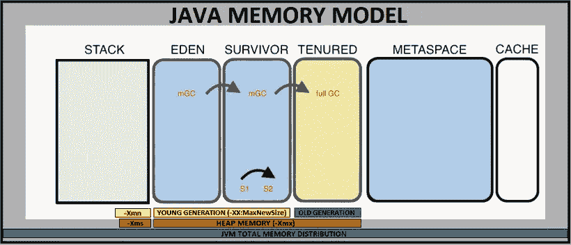

# 每个 Java 开发人员/架构师都必须知道的主要性能问题—第 3 部分—内存

> 原文：<https://medium.com/javarevisited/top-performance-issues-every-java-developer-architect-must-know-part-3-memory-351144590489?source=collection_archive---------0----------------------->

大家好。本文是以下文章的延续

**第 1 部分—数据库问题**