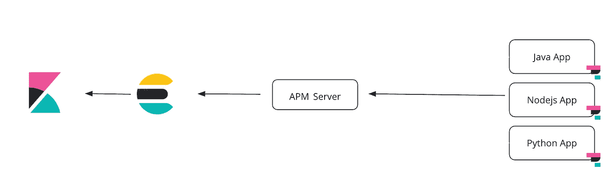
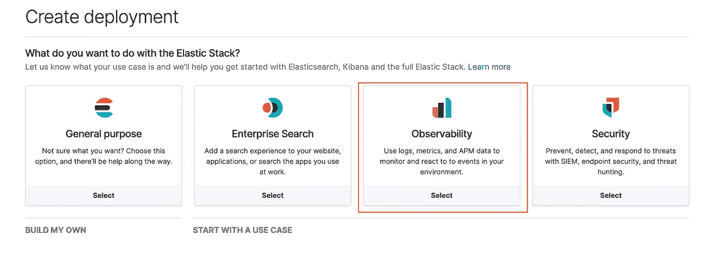
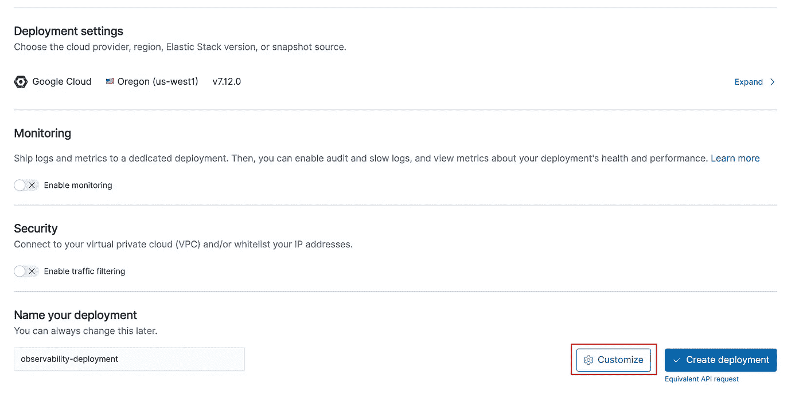
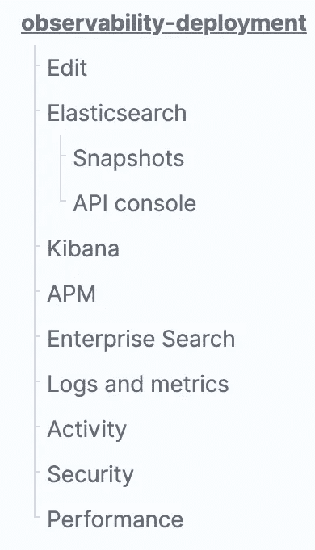
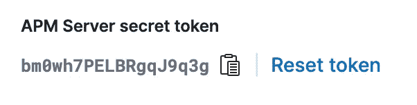
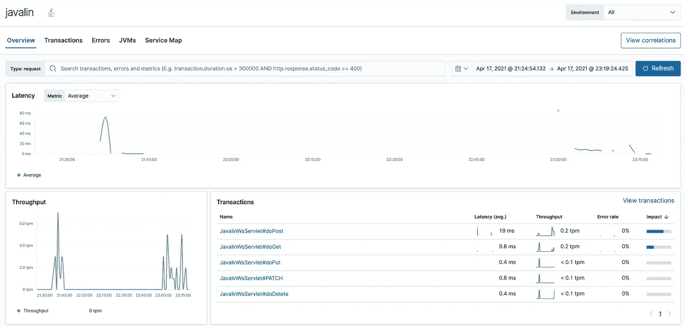
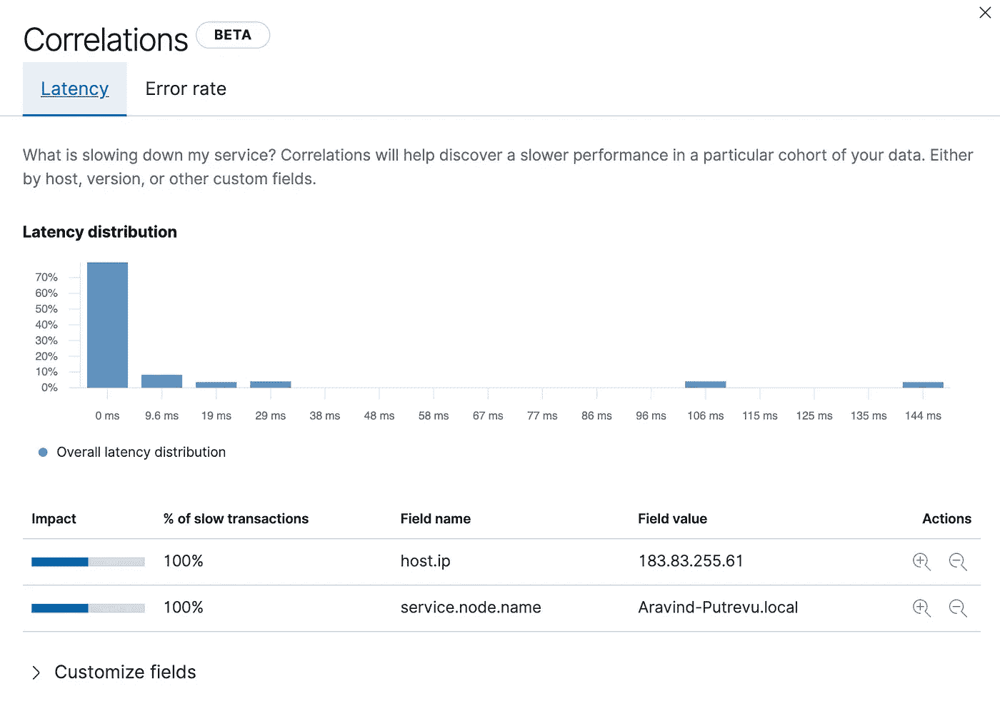

# 用弹性 APM 跟踪 Java 应用程序

> 原文：<https://medium.com/javarevisited/tracing-a-java-application-with-elastic-apm-62d4b90f031e?source=collection_archive---------0----------------------->


图片来源: [NeONBRAND](https://unsplash.com/@neonbrand) 来自 [Unsplash](http://unsplash.com)

TL；DR:在这篇博客中，我们将看到如何使用一个简单的 Java CRUD 应用程序开始使用弹性 Java APM。

Elasticsearch 是一个基于 java 的分布式搜索引擎，用于构建搜索引擎、分析日志、存储指标、安全事件，甚至是应用程序跟踪，支持微服务环境的分布式跟踪。

Elastic 在 2018 年通过 Elasticsearch 6.2 推出了开源应用性能监控(APM)，使应用能够发布它们的踪迹。今天的 APM 有更多的特性，比如相关性。

在这篇博客中，我们将了解如何使用 Java 代理为 Java 应用程序配置跟踪，以及 spin 在云上部署 APM 所需的基础设施。弹性 APM 还支持[开放式遥测](https://opentelemetry.io)，还有一个[弹性导出器](https://github.com/open-telemetry/opentelemetry-collector-contrib/tree/main/exporter/elasticexporter)。但是，我们关注的是本地弹性 APM Java 语言代理。

# 分布式跟踪

分布式跟踪有助于您了解基于分布式微服务的应用程序中发生的请求流。我们可以进行性能分析、根本原因分析、查找故障、错误和异常！

开发人员对微服务架构和其他生态系统工具感兴趣，如 Docker、Kubernetes、Java 框架，如 [Quarkus](/javarevisited/10-best-free-dropwizard-vert-x-micronaut-and-quarkus-online-courses-for-java-developers-9c2b4161f17) 、 [Micronaut](https://javarevisited.blogspot.com/2020/09/top-5-courses-to-learn-dropwizard-Micronaut-Quarkus-Java-Microservices.html) 、 [Spring Boot](/javarevisited/top-10-courses-to-learn-spring-boot-in-2020-best-of-lot-6ffce88a1b6e) 。

# 弹性 APM 的高层架构:

[微服务](/javarevisited/10-best-java-microservices-courses-with-spring-boot-and-spring-cloud-6d04556bdfed)应用程序本质上可以包含来自不同编程语言的服务，这些服务相互交流，共享信息。

弹性 APM 代理是 Java Jar、Nodejs 包或 Python 包，被配置为从应用程序收集数据。下面是数据如何流动的高级架构图。

[](https://www.java67.com/2021/04/5-free-microservice-courses-for-java.html)

弹性 APM 部署

APM 服务器接收来自各种应用程序的所有数据，并在 Elasticsearch 中创建文档。

# Java CRUD 应用程序

[源代码](https://github.com/aravindputrevu/javalin-student)

## 爪哇林

我正在使用 Javalin，一个轻量级的 web 框架来快速构建 Java 端点。Javalin 运行在 Jetty 之上，Jetty 是 JVM 上最常用和最稳定的 web 服务器之一。

Java 应用程序存储学生的详细信息，如 Id、姓名、年龄。如果愿意，您可以添加其他属性。

该应用程序有两个端点:

*   /学生:获取、发布、上传、删除
*   /school/_count:查找学生人数。

注意:您可以使用 VS 代码或 [IntelliJ](/javarevisited/7-best-courses-to-learn-intellij-idea-for-beginners-and-experienced-java-programmers-2e9aa9bb0c05?source=---------16------------------) 来添加代码。无论哪种方式，项目的根目录下都有一个 *pom.xml* 。

## 创建 APM 部署:

我使用弹性云来部署弹性 APM 部署。您可以[开始试用](https://cloud.elastic.co/registration)并加快部署。或者，您也可以通过下载二进制文件来部署 [Elasticsearch](https://www.elastic.co/downloads/elasticsearch) 、 [Kibana](https://www.elastic.co/downloads/kibana) 和 [APM Server](https://www.elastic.co/downloads/apm) 。



弹性云部署页面

[](https://www.java67.com/2020/12/5-free-cloud-computing-courses-for-beginners.html)

选择任意云厂商，最好是最新版本的 Elastic Stack，点击`Create deployment`。或者，您可以选择单击`Customize`通过添加额外的硬件层(热层、冷层)来进行部署。

创建部署后，您需要复制 APM 服务器 URL 和秘密令牌。



部署的左侧菜单

*   单击左侧菜单中的 APM 链接，如上图所示。
*   我们将需要 APM 服务器的 URL，秘密令牌。



## 克隆存储库:

```
git clone [https://github.com/aravindputrevu/javalin-student.git](https://github.com/aravindputrevu/javalin-student.git)
```


克隆完成后，请注意 resources 文件夹下的文件。添加 APM 服务器 URL，从控制台复制到`server_urls`和`secret_token.`的秘密令牌

**elasticapm.properties**

```
service_name=javalin
application_packages=com.example
server_urls=
secret_token=
```

## 建筑应用

在源代码的根文件夹中，您可以找到项目。像 javalin、 [sl4j](https://javarevisited.blogspot.com/2013/08/why-use-sl4j-over-log4j-for-logging-in.html#axzz6JyHI5fGb) 和 [Jackson](https://javarevisited.blogspot.com/2013/02/how-to-convert-json-string-to-java-object-jackson-example-tutorial.html) 这样的依赖很少。

```
<dependencies>
    <dependency>
        <groupId>io.javalin</groupId>
        <artifactId>javalin</artifactId>
        <version>3.9.1</version>
    </dependency>
    <dependency>
        <groupId>org.slf4j</groupId>
        <artifactId>slf4j-simple</artifactId>
        <version>1.7.30</version>
    </dependency>
     <dependency>
         <groupId>com.fasterxml.jackson.core</groupId>
         <artifactId>jackson-databind</artifactId>
         <version>2.11.2</version>
     </dependency>
</dependencies>
```

执行`mvn clean`、`mvn install`在`target`文件夹下生成`jar`。

**注意:**你需要在你的机器上安装`[maven](/javarevisited/6-best-maven-courses-for-beginners-in-2020-23ea3cba89)` </javarevisited/6-best-maven-courses-for-beginners-in-2020-23ea3cba89>(而 java dev 的笔记本电脑上没有`ant``maven``[gradle](/javarevisited/5-best-gradle-courses-and-books-to-learn-in-2021-93f49ce8ff8e)`)！😉)

启动应用程序:`java -jar target/javalin-student-1.0-snapshot.jar`

您可以使用 REST 客户端如`[Postman](/javarevisited/7-best-courses-to-learn-postman-tool-for-web-service-and-api-testing-f225c138fa5a?source=---------13------------------)` </javarevisited/7-best-courses-to-learn-postman-tool-for-web-service-and-api-testing-f225c138fa5a?source=---------13------------------>或命令行工具如`[cURL](https://javarevisited.blogspot.com/2017/03/10-examples-of-curl-command-in-unix-and-Linux.html)` <https://javarevisited.blogspot.com/2017/03/10-examples-of-curl-command-in-unix-and-Linux.html>来检查应用程序端点。

**创建:**

```
$ curl -X POST -H "Content-Type: application/json" [http://localhost:8080/students](http://localhost:8080/students) -d '{ "id": "003","name": "Javalin","age": 15}'$ curl -X POST -H "Content-Type: application/json" [http://localhost:8080/students](http://localhost:8080/students) -d '{ "id": "005","name": "Micronaut","age": 12}'$ curl -X POST -H "Content-Type: application/json" [http://localhost:8080/students](http://localhost:8080/students) -d '{ "id": "001","name": "Quarkus","age": 16}'
```

**改为:**

```
$ curl -X GET [http://localhost:8080/students](http://localhost:8080/students)$ curl -X GET http://localhost:8080/students/003
```

**更新:**

```
$ curl -X PATCH -H "Content-Type: application/json" [http://localhost:8080/students](http://localhost:8080/students) -d '{ "id": "001","name": "Quarkus","age": 32}' #updating age
```

**删除:**

```
$ curl -X DELETE http://localhost:8080/students/001
```

**计数:**

```
$ curl -X GET http://locahost:8080/school/_count
```

## 跟踪应用程序

我们还没有开始跟踪我们的申请。您需要从 [maven central](https://search.maven.org/search?q=g:co.elastic.apm%20AND%20a:elastic-apm-agent) 下载 Java 代理，并将其放在项目的根文件夹下。

有三种方法可以设置代理:

1.  使用`-javaagent`标志。
2.  使用`apm-agent-attach-standalone.jar` — Beta
3.  使用编程连接。—贝塔

我们将使用选项 1，`javaagent`方法。

您需要启动带有`javaagent`标志的应用程序，如下例所示。

```
$ java -javaagent:elastic-apm-agent-1.22.0.jar -jar target/javalin-student-1.0-SNAPSHOT.jar
```

**注意:**您还可以按照[文档](https://www.elastic.co/guide/en/apm/agent/java/1.x/setup-javaagent.html#application-server-setup)中所述配置支持的应用服务器。

## 在 Kibana 中查看应用程序跟踪

当您开始访问应用程序端点时，您应该在 Kibana -> Observability -> APM 中看到数据。



您可以使用相关性观察特定字段的较慢性能和错误率。它使用弹性搜索的`significant terms`集合来提供这些信息。



不是这个。您可以创建特定的阈值、延迟警报、从错误面板中查找错误、使用`@CaptureSpan`注释为特定方法创建跨度。

除此之外，您可以启用日志关联来查找属于特定跟踪的日志，反之亦然。Elastic 提供了 [ECS 日志库](https://www.elastic.co/guide/en/ecs-logging/java/current/setup.html)来从您的应用程序进行结构化日志记录，并将其直接导入到 Elasticsearch。

# 结论

使用弹性 Java APM 很容易上手。支持大多数应用服务器和框架。您还可以使用[公共 API](https://www.elastic.co/guide/en/apm/agent/java/1.x/public-api.html) 手动创建跟踪和事务。

## 资源:

*   [APM 快速入门培训](https://www.elastic.co/training/apm-quick-start)
*   [弹性公共 APM 页面](https://github.com/elastic/apm)
*   [APM 服务器源代码](https://github.com/elastic/apm-server)
*   [Java 代理源代码](https://github.com/elastic/apm-agent-java)

## 关于 Elasticsearch 的更多问题？

请随意在这里写下您的回复，或者在 [Twitter](https://twitter.com/aravindputrevu) :)上给我发短信