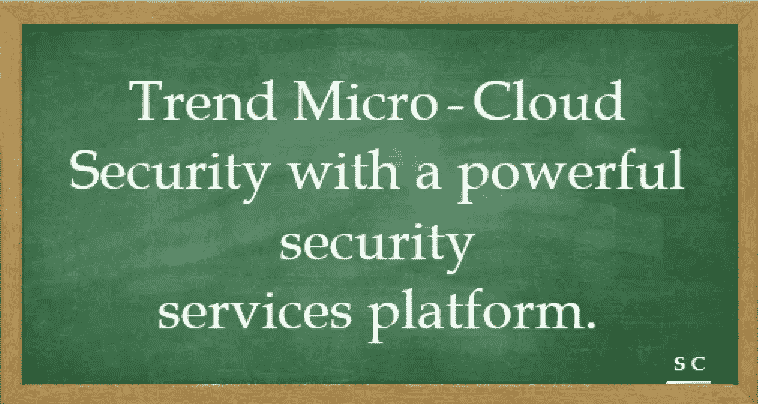

# 趋势科技—具有强大安全服务平台的云安全

> 原文：<https://medium.com/javarevisited/trend-micro-cloud-security-with-a-powerful-security-services-platform-b16eaf9d9aef?source=collection_archive---------4----------------------->

**云卓越运营** —自动评估您的云服务符合云配置最佳实践和行业合规标准的程度。借助趋势科技 Cloud One，您可以让您的团队在云中构建更好的架构和应用程序，同时拥有必要的安全防护来发展和扩展您的业务，从而在您的组织中融入 **DevSecOps** 文化。

[**DevSecOps**](/javarevisited/the-2018-devops-roadmap-31588d8670cb) 代表开发、安全、运营。这是一种文化、自动化和平台设计的方法，它将安全性作为整个 It 生命周期的共同责任进行集成。

DevSecOps 意味着从一开始就考虑应用程序和基础设施的安全性。

[**工作负载安全**](https://www.trendmicro.com/en_in/business/products/hybrid-cloud/cloud-one-workload-security.html) 通过机器学习和虚拟补丁等技术，可以自动保护新的和现有的工作负载免受未知威胁。

工作负载安全性由以下一组组件组成，这些组件协同工作以提供保护:

**工作负载安全控制台:**基于 web 的集中式管理控制台。
1。**安全客户端:**直接部署在计算机上，为安装它的计算机提供应用程序控制、防恶意软件、Web 信誉服务、防火墙、入侵防御、完整性监控和日志审查保护。
2。**中继模块:**代理包含一个中继模块，可帮助代理在您的工作负载安全组件网络中分发软件和安全更新。
3。**通知程序:**在本地计算机上传递有关安全状态和事件的信息的应用程序，对于启用了中继的代理，还提供有关从本地计算机分发的安全更新的信息。

**保护模块:**工作负载安全具有这些紧密集成的模块，可以轻松扩展您的[安全](https://javarevisited.blogspot.com/2020/03/top-5-courses-to-learn-cyber-security.html)功能

1.  **防恶意软件:**保护您的 Windows 和 Linux 工作负载免受恶意软件(如恶意软件、间谍软件和特洛伊木马)的攻击。
2.  **防火墙:**用于控制传入和传出流量，还维护防火墙事件日志以供审核。
3.  **Web 信誉:**通过阻止对恶意域和罪犯使用的已知通信和控制(C & C)服务器的访问来提供内容过滤。
4.  **设备控制:**控制对连接到计算机的外部存储设备的访问。设备控制有助于防止数据丢失和泄露，并且与文件扫描相结合，有助于防范安全风险。
5.  **应用程序控制:**监控与计算机原始软件相比的变化——“漂移”或“增量”。
6.  **入侵防御:**检查传入和传出的流量，以检测和阻止可疑活动。这可以防止利用已知漏洞和零日漏洞。
7.  **完整性监控:**提供跟踪对系统进行的授权和未授权更改的能力，并使您能够接收有关计划外或恶意更改的警报。
8.  **日志检查:**帮助您识别可能隐藏在多个日志条目中的重要安全事件。

[文件存储安全性](https://www.trendmicro.com/en_in/business/products/hybrid-cloud/cloud-one-file-storage-security.html)让您了解云存储风险，并通过恶意软件检测和阻止等创新技术保护工作流。

文件存储安全为云存储服务中的文件提供反恶意软件扫描，例如[亚马逊网络服务(AWS)](https://cloudone.trendmicro.com/docs/file-storage-security/supported-aws) 、 [Azure](https://cloudone.trendmicro.com/docs/file-storage-security/supported-azure) 和 [GCP](https://cloudone.trendmicro.com/docs/file-storage-security/supported-gcp) 。

当用户或程序将文件上传到指定的云存储容器时，文件存储安全会执行扫描。仅对添加的文件执行扫描，而不对存储容器中的现有资源执行扫描。当扫描完成时，您的自定义插件或 Lambdas 会获取扫描结果，并与您的下游工作流连接以进行进一步处理。

**文件存储安全组件:-**

1.  **保护存储帐户**是对传入(添加)文件进行监控的存储帐户。扫描添加到保护存储帐户中任何容器的文件。
2.  **存储堆栈**监控传入(添加)文件的保护存储帐户，并将它们发送到扫描仪堆栈进行扫描。
3.  **扫描仪堆栈**扫描文件并将结果发布到扫描结果主题。可以部署扫描仪堆栈。
4.  **一体化堆栈**使用一体化 Azure 资源管理器模板部署。一体机堆栈包括:
    扫描仪堆栈
    存储堆栈
    支持资源。
5.  **Blob 监听器功能**是存储栈的一部分，负责监控添加文件的保护存储账户，并向扫描器栈发送扫描请求。
6.  **扫描器功能**是扫描器堆栈的一部分，负责扫描文件，然后将文件标识信息发送到趋势科技全球云安全智能防护服务器进行进一步扫描。
7.  Azure 服务总线扫描器队列是扫描器堆栈的一部分，是 BlobListenerFunction 向其发送扫描请求消息的队列。
8.  **Azure Service Bus 扫描结果主题**是存储栈的一部分，是扫描器栈向其发布结果的主题。您可以订阅此主题的自定义扫描后操作功能，以获得新扫描的通知。
9.  **扫描后操作标记功能**是存储堆栈的一部分，负责标记扫描文件及其相关扫描结果。
    您的 Azure Active Directory 是您将要安装文件存储安全堆栈的地方。如果你愿意，你可以把这些栈安装到同一个 Azure 活动目录下的多个 Azure 订阅中。
10.  **自定义扫描后动作功能**是您编写的功能。它负责处理从扫描结果主题获得的扫描结果。
11.  **控制台**是一个 web 界面，您可以在其中查看扫描结果和部署堆栈。该控制台由趋势科技托管，位于您的 Azure Active Directory 之外。

[合规性](https://www.trendmicro.com/en_in/business/products/hybrid-cloud/cloud-one-conformity.html)针对行业最佳实践检查(包括 SOC 2 和 ISO 27001 ),提供云基础架构的集中可见性和放松时间监控、自动化安全性和合规性检查。

一致性使您能够通过云的防护栏来履行您在共享责任模型中的职责。在云原生平台中提供持续的安全性、合规性和治理，帮助您管理云资源的错误配置并增强您的安全态势。

**云安全**是一门网络安全学科，致力于保护云计算系统的安全，既有挑战性，也很有趣…..让我们一起继续学习吧…让我们一起航行吧…！！