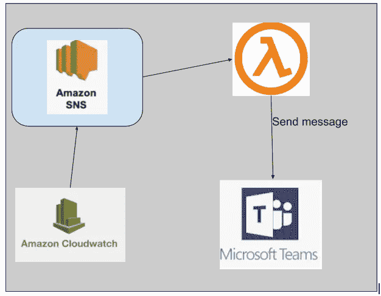
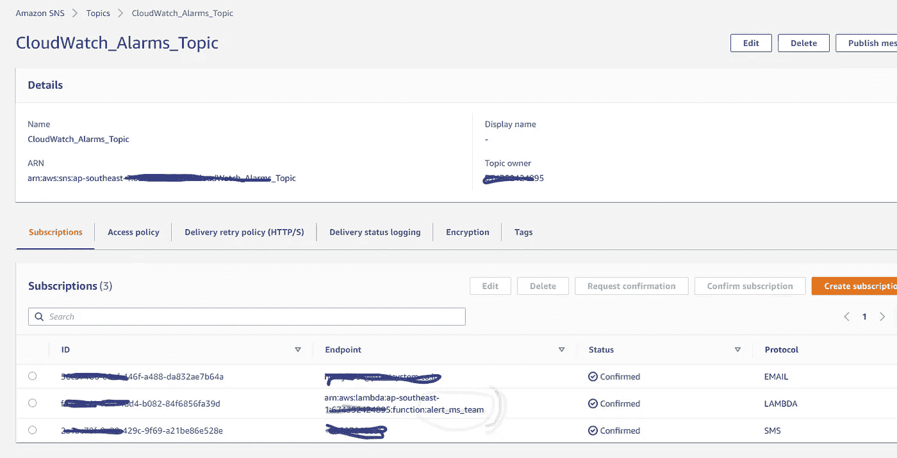
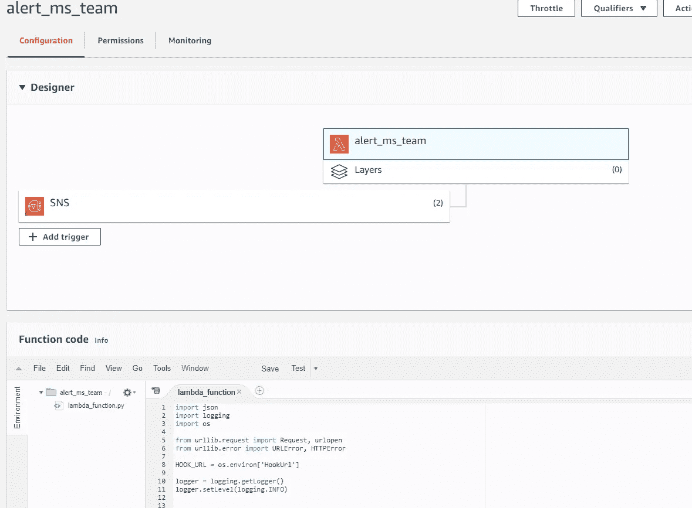
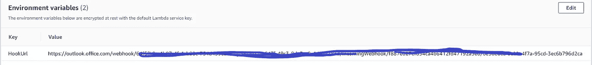
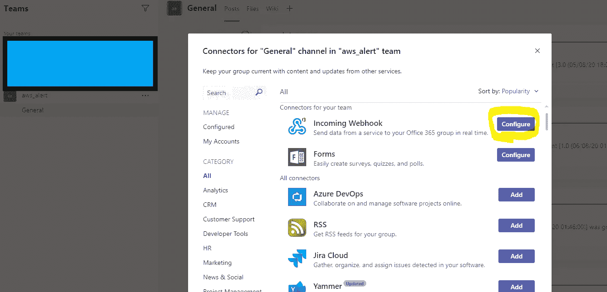
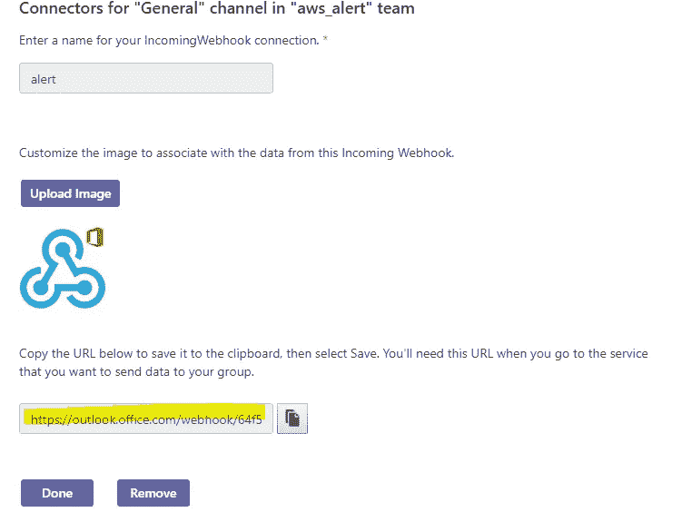
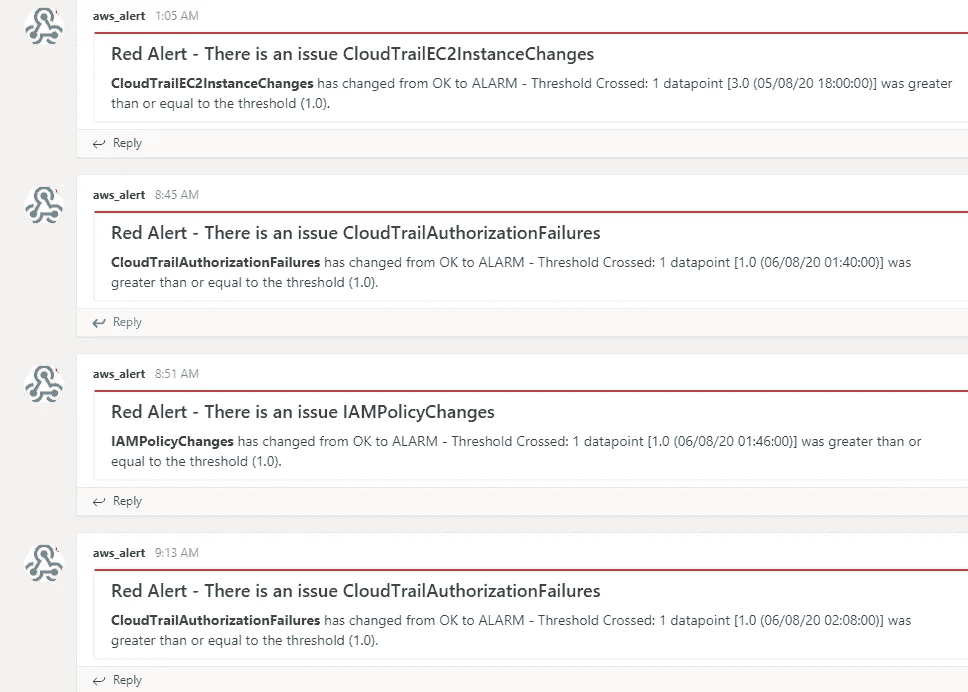

# 使用 AWS SNS 和 Lambda 功能向 MS-Team 触发警报消息

> 原文：<https://medium.com/javarevisited/trigger-the-alert-message-to-ms-team-using-aws-sns-and-lambda-function-1c7769012eff?source=collection_archive---------0----------------------->



AWS 提供许多服务来管理您的基础设施，并监控服务发生的情况。您可以通过电子邮件、短信或其他服务提醒错误消息。

在这篇文章中，我想分享如何通过 SNS 将消息从 AWS Cloudwatch alert 发送到 Microsoft-Team 并推送到 Lambda 函数。所以让我们开始吧。我们将:

*   创建 Cloudwatch 警报向 SNS 发送消息
*   用 [Python 编程语言](/swlh/5-free-python-courses-for-beginners-to-learn-online-e1ca90687caf)创建一个 lambda 函数
*   配置由 SNS 主题触发的 lambda
*   将“Incoming Webhook”连接器添加到我们的团队频道
*   将 webhook URL 作为环境变量添加到[λ](https://javarevisited.blogspot.com/2020/07/top-6-courses-to-learn-aws-lambda-and-serverless.html)中
*   测试 lambda

# 创建社交网络

*   亚马逊社交网络
*   主题→创建主题

[](https://medium.com/javarevisited/top-5-online-courses-to-become-aws-certified-developer-associate-in-2020-best-of-lot-9b22baf84ca8)

使用 LAMBDA 的社交网络订阅

# 创建 Lambda 函数

用[Python 3.8](/better-programming/top-5-courses-to-learn-python-in-2018-best-of-lot-26644a99e7ec):**alert _ ms _ team**创建 lambda 函数

*   转到服务
*   点击 Lambda
*   点击创建功能
*   从头开始选择作者

在窗口中输入以下信息:

名称: **alert_ms_team**
运行时:Python 3.8
角色:选择一个已有的角色
角色名称: **alert_ms_team**
点击创建函数



环境 Webhook URL

python lambda

# MS-团队频道



团队频道-添加连接器 webhook



复制 webhook url

# 测试有效负载


测试 json 有效负载

```
{
  "Records": [
    {
      "Sns": {
        "Message": "{\"AlarmName\": \"my-alarm-TestService\", \"OldStateValue\": \"ALARM\", \"NewStateValue\": \"OK\", \"NewStateReason\": \"service is back\"}"
      }
    }
  ]
}
```



# 最后

您可以使用 Lambda 函数将来自 [AWS CloudWatch](/javarevisited/top-5-aws-training-courses-to-crack-amazon-web-service-solutions-architect-associate-certification-3f4affa8f660?source=collection_home---4------0-----------------------) 的消息通过 SNS 提醒给 MS-Team。

如果这篇文章有帮助，请支持按下**按钮**👏按钮，并帮助与其他读者分享这个故事。