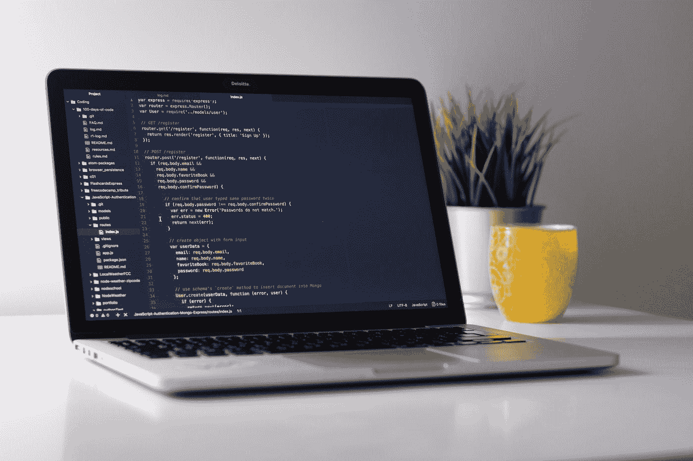
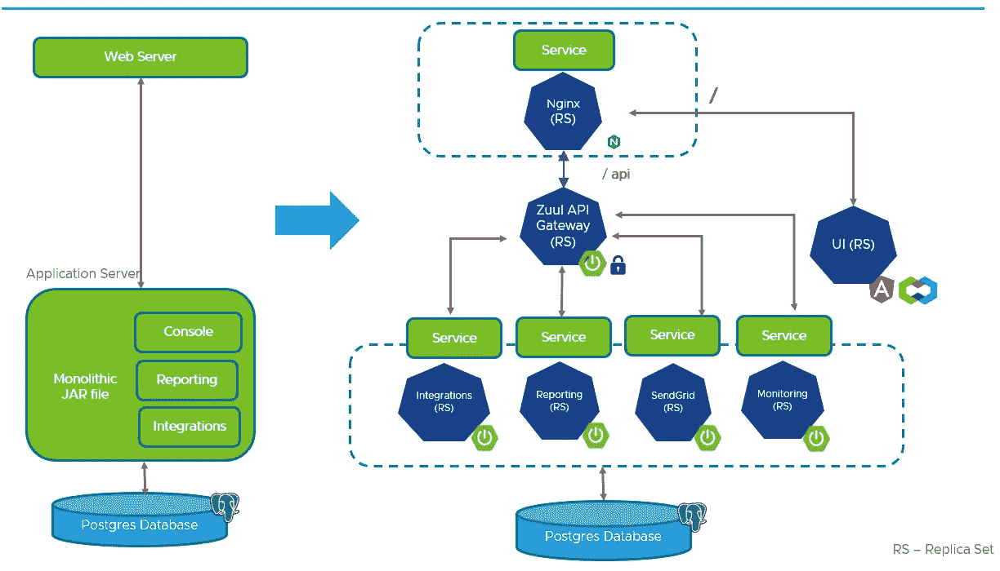
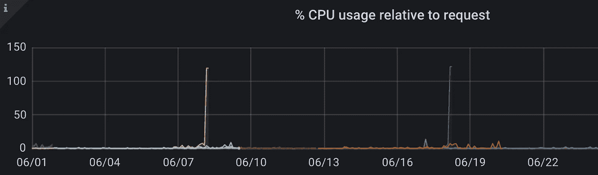
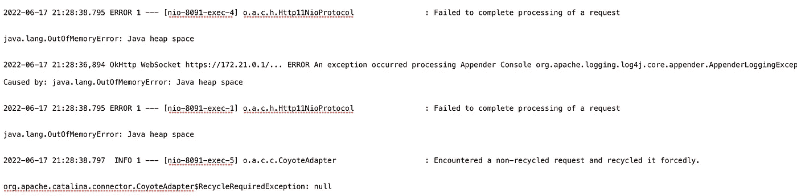
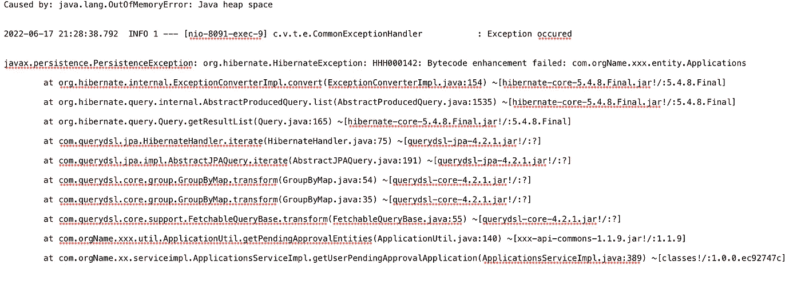

# Spring Boot 内存不足错误的故障排除和修复

> 原文：<https://medium.com/javarevisited/troubleshooting-and-fixing-outofmemoryerror-in-spring-boot-5cc559f556ea?source=collection_archive---------1----------------------->

照片由 [Unsplash](https://unsplash.com?utm_source=medium&utm_medium=referral) 上的 [Clément Hélardot](https://unsplash.com/@clemhlrdt?utm_source=medium&utm_medium=referral) 拍摄

我在一家领先的跨国公司工作，在一个工程团队中，帮助为员工打造优秀的内部产品。我主要从事 [Java](/javarevisited/top-5-java-online-courses-for-beginners-best-of-lot-1e1e240a758) 、 [Spring Boot](/javarevisited/top-10-courses-to-learn-spring-boot-in-2020-best-of-lot-6ffce88a1b6e) 和 RDBMS([Postgres](/javarevisited/7-best-free-postgresql-courses-for-beginners-to-learn-in-2021-3bf369d73794)/[MySQL](/javarevisited/top-5-courses-to-learn-mysql-in-2020-4ffada706))栈的工作。几年前，我们的团队开始了从 Monolith 到[微服务](/javarevisited/10-best-java-microservices-courses-with-spring-boot-and-spring-cloud-6d04556bdfed)的转型之旅，下面是我们的应用通常遵循的架构。

整体到微服务

# 性能问题

Grafana 仪表板显示巨大的 CPU 利用率

在我们公司最近的一次公告之后，我们开始看到我们的应用程序的流量出现了意想不到的激增。最终用户开始抱怨应用程序变得缓慢，我们也开始从我们团队使用的日志监控工具 [LogInsight](https://www.vmware.com/in/products/vrealize-log-insight.html) 收到许多错误警报。从 Grafana [仪表板](https://grafana.com/solutions/kubernetes/?pg=dashboards&plcmt=featured-dashboard-1)(查看两个 CPU 利用率峰值)中，我们发现微服务单元承受着巨大的压力，这导致 Spring Cloud Gateway 单元抛出 C [连接超时异常](https://javarevisited.blogspot.com/2013/02/java-net-ConnectException-Connection-refused.html)，从而发出警报。

## 应用技术规范:

应用程序运行在遵循网关设计模式的微服务架构上。后端 pod 是基于 JAVA 8 的 Spring Boot docker 映像。部署规格为 2CPU 和 4GB RAM，每个微服务总共有 3 个 pod。Java 正在使用[默认堆参数运行。](https://javarevisited.blogspot.com/2016/10/how-to-increase-heap-size-of-eclipse-OutOfMemoryError.html)我们使用 [Postgresql](https://www.sqlrevisited.com/2022/03/mysql-vs-postgresql-pros-and-cons.html) 作为我们的 RDBMS。

最初，我认为由于异常巨大的流量，pod 无法承受负载，所以我增加了我们的 [TKG](https://docs.vmware.com/en/VMware-Tanzu-Kubernetes-Grid/index.html) 命名空间上的资源，以便我可以增加后端 pod 的数量。它创造了奇迹。厉害了，长舒了一口气。几周后，我们开始看到同样的警报。是时候系好安全带，找到问题的根源了。

# **影响:**

由于应用程序运行缓慢，最终用户对用户体验不满意。应用程序管理员在完成审批流程时面临问题，这增加了他们的积压工作。

# 这个问题是如何解决的？

来自 LogInsight 的屏幕截图:内存不足错误

[**登录查看**](https://www.vmware.com/in/products/vrealize-log-insight.html) **救援**。我开始搜索我们的微服务 pods 的日志来找出缓慢的原因，发现这是可怕的 [**OOM 错误:Java 堆空间**](https://javarevisited.blogspot.com/2011/09/javalangoutofmemoryerror-permgen-space.html) 。我从 [**LogInsight**](https://www.vmware.com/in/products/vrealize-log-insight.html) 导出了日志，检查了 OOM 错误的堆栈跟踪，发现有一个 API 导致了这个问题。

LogInsight 的屏幕截图:OOM 错误的堆栈跟踪

# 我是如何修复它的？

好了，现在我已经缩小了导致瓶颈的 API 的范围。看起来像是 API 依次发出一个数据库查询，返回超过 100k+行，阻塞了整个堆内存。一般来说，这不是一个很大的计数，但是如果我们的实体映射类包含很多属性并且有多个关联，这就会成为一个问题

。我没有一次获取所有行并[将它们映射到 Java 对象](https://www.java67.com/2016/10/3-ways-to-convert-string-to-json-object-in-java.html)来获得计算值，而是用一个高级的高效查询来代替它，以获得相同的结果。这一变化极大地提高了应用程序的性能，并极大地减少了堆的大小。

除了解决这个问题，我还调整了某些东西，这样我们就可以维持不断增长的流量。

1.使用弹簧 Kubernetes 致动器[端点](https://www.baeldung.com/spring-liveness-readiness-probes)引入 [**活性和就绪探针**](https://kubernetes.io/docs/tasks/configure-pod-container/configure-liveness-readiness-startup-probes/)；因此，万一应用程序停止响应，Kubernetes 可以停止并重启容器。

2.JAVA 8 没有 [docker 感知](/marionete/managing-java-heap-size-in-kubernetes-3807159e2438#:~:text=As%20we%20may%20have%20been,are%20not%20imposing%20any%20quotas.)，因此不会根据部署 YAML 中提供的请求和限制来分配适当的 JVM 堆空间。如果不指定`-Xmx`，默认的“最大堆”是主机 RAM 的 1/4 (25%)。所以我在 Dockerfile 的启动命令中添加了初始和最大堆大小参数。

`java -Xms1024m -Xmx2048m -jar /opt/java/microservices/$APP_NAME/jar/$APP_NAME*.jar`

3.使用 [**Ehcache**](https://www.ehcache.org/) 为最热门的 GET APIs 引入[分布式缓存](/javarevisited/distributed-caching-with-ehcache-using-mysql-16b71d62ec23)。

其他可以调查的事项:

Hibernate 的查询计划缓存加快了查询的准备。这减少了它们的总执行时间，并提高了应用程序的性能。**默认情况下，计划缓存中的最大条目数为**[**2048**](https://docs.jboss.org/hibernate/orm/4.1/javadocs/org/hibernate/cfg/AvailableSettings.html#QUERY_PLAN_CACHE_MAX_SIZE)**。**如果`HQLQueryPlan`对象占用 2–3mb，它可以占用 4–6GB 的堆内存。

**通过设置以下属性减小查询计划缓存大小**:

*   `spring.jpa.properties.hibernate.query.plan_cache_max_size`:控制计划缓存的最大条目数(默认为 **2048** )
*   `spring.jpa.properties.hibernate.query.plan_parameter_metadata_max_size`:管理缓存中`ParameterMetadata`实例的数量(默认为 **128**

更多详情在 [**索雷本的博客**](https://thorben-janssen.com/hibernate-query-plan-cache/) **。**

**结果:**

没有来自 LogInsight 的警报，最终用户很高兴。

# 结论

这段经历教会了我如何调试和修复 Spring Boot 应用程序中的性能问题。通过修复 SQL 查询、使用索引和实现缓存层来微调应用程序应该是提高应用程序性能的主要步骤；如果这不能解决问题，那么我们应该考虑增加资源。

如果你喜欢这篇文章，请花一分钟给我鼓掌👏或者请我喝杯咖啡[https://www.buymeacoffee.com/abhiandy](https://www.buymeacoffee.com/abhiandy)