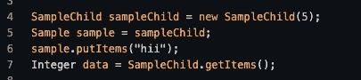
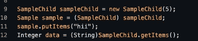

# Java 中的类型擦除…

> 原文：<https://medium.com/javarevisited/type-erasure-in-java-a07b1ffe4d6e?source=collection_archive---------1----------------------->

## 一种缓解你的 RAM 的方法

在编译时施加类型约束并在运行时丢弃元素类型信息的过程。

换句话说，编译器用**实际类**或**桥方法**替换泛型参数。此外，编译器确保**没有额外的类被创建**并且**没有运行时开销。**

事实上，**类型删除**确保你的代码与旧版本的 java 兼容，旧版本的 Java 可能根本不包含泛型。

*Flowers flower = sample . empty bucket()；*

编译器将以强制转换的方式转换上述代码。

*Flowers flower =(Object)sample . empty bucket()；*

## 键入擦除优点。

*   双向向后兼容
*   更容易实现
*   不需要改变字节码或[虚拟机](https://javarevisited.blogspot.com/2011/12/jre-jvm-jdk-jit-in-java-programming.html)
*   [JIT](https://www.java67.com/2013/02/difference-between-jit-and-jvm-in-java.html) 由于从所有通用实例的一个版本生成，编译器花费的时间更少，用于存储生成代码的 RAM 也更少。
*   由于堆内存中的对象数量较少，因此性能更好。

## 类型擦除的类型。

*   类别级类型擦除
*   方法级类型擦除

## 类类型擦除？

这里，编译器忽略了类的类型参数，并用第一次绑定替换它们。

原始实现

编译器替换后

有时类型参数可以是有界的。

有界类型参数

编译器用第一个绑定类替换绑定类型参数。

编译器替换后

## 方法型擦除？

为了便于理解，方法级擦除可以表述如下。

*   如果未绑定，方法的参数在未存储时会转换为其父类型*对象*。
*   如果是绑定的，该方法的参数将转换为它的第一个绑定类。

让我们通过一个实现来详细说明方法级类型擦除。

下面的元素计数器示例显示了第一种情况，即未绑定。

两个视点上的方法声明

接下来，下面的示例方法声明将详细说明[有界声明](https://javarevisited.blogspot.com/2012/04/what-is-bounded-and-unbounded-wildcards.html)。

两个视点上的方法声明

> 让我们熟悉一下合成方法和类…

Java 编译器引入了这些合成的[类](https://javarevisited.blogspot.com/2012/02/difference-between-instance-class-and.html)、[方法](https://www.java67.com/2019/02/can-you-add-non-abstract-method-on-interface-in-java.html)、字段以及任何其他类似的构造，它们在源代码中是不可见的。

这些仅用于运行时的内部目的。作为一名程序员，你可能肯定遇到过 bug。您可能有意或无意地浏览了堆栈跟踪，从中获得了一些有用的合成输出。

## 边缘案例？

在类型擦除过程中，编译器有时会在存在类似方法时创建合成方法。其实这主要是因为要区分一种方法和另一种方法。

例如，让我们尝试一些实现来更好地理解这些概念。

打字前擦除。

类型擦除后。

最后一行抛出一个异常。因为我们已经把一个字符串类型的对象放到了 *SampleChild* 中，其中 *putItem(Object)* 继承了 *sample < Integer >* 类型。因此，最后一行抛出一个 [ClastCastException](https://javarevisited.blogspot.com/2012/12/how-to-solve-javalangclasscastexception-java.html#axzz6qVaG06bu) 。

## 桥接方法。

扩展参数化类或由类或接口实现的参数化接口中的方法签名的模糊性创建了这些桥接方法。事实上，这些是**合成方法**，用于解决我们在上一节中讨论的边缘情况，也适用于协变返回类型。

通过确保两个类的下列方法之间没有冲突，编译器在类型擦除后执行泛型类型的多态性。

SampleChild 类— → putItem(Integer)方法

示例类— →putItem(Object)方法

编译器桥方法

## 参考

 [## Java 中的类型擦除解释| Baeldung

### 在这篇简短的文章中，我们将讨论 Java 泛型中一个重要机制的基础知识，称为类型擦除…

www.baeldung.com](https://www.baeldung.com/java-type-erasure)  [## Java 中的类型擦除- GeeksforGeeks

### 先决条件:泛型泛型概念是在 Java 语言中引入的，用于在编译时提供更严格的类型检查…

www.geeksforgeeks.org](https://www.geeksforgeeks.org/type-erasure-java/)  [## Java 泛型类型擦除

### 泛型用于在编译时进行更严格的类型检查，并提供泛型编程。要实现通用…

www.tutorialspoint.com](https://www.tutorialspoint.com/java_generics/java_generics_type_erasure.htm)