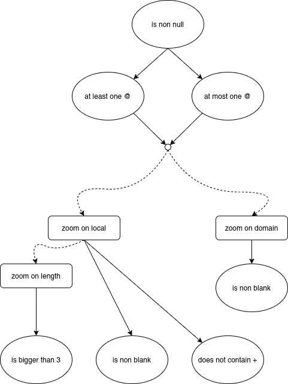
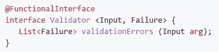
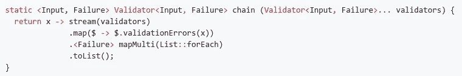
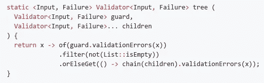
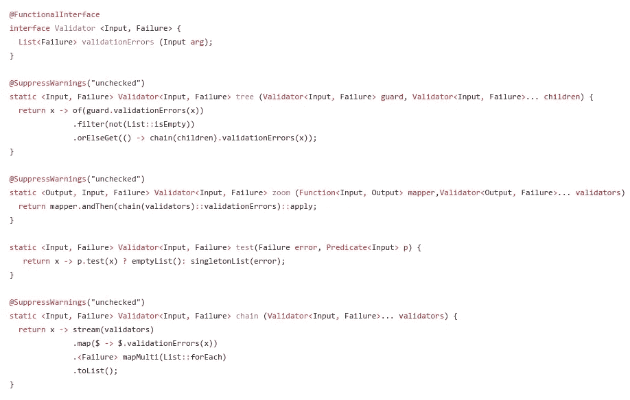
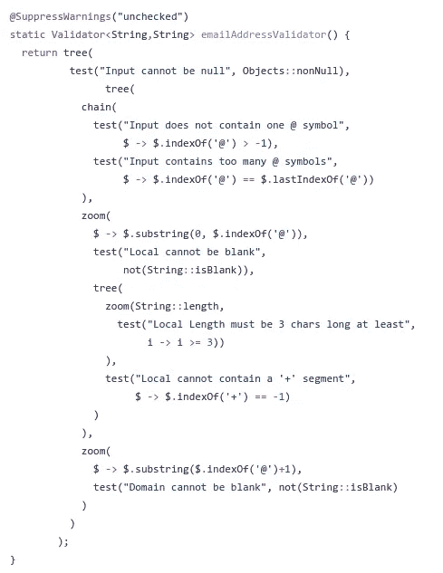

# 类型理论用例:验证器树

> 原文：<https://medium.com/javarevisited/type-theory-use-case-validator-tree-e48418fe13e2?source=collection_archive---------2----------------------->

在这篇短文中，我们探索了如何从玩弄函数和类型理论思维中获益，以解决编程中常见的具体问题。语言是 Java(但是不要用 Spring)，我们关注的用例是验证器树的主题。

[](https://javarevisited.blogspot.com/2015/01/adapter-vs-decorator-vs-facade-vs-proxy-pattern-java.html)

一棵小树——如果它不明显的话

# 我们的最终目标

在整篇课文中，我们将经常引用下面的典型例子:

[](https://www.java67.com/2012/09/top-10-java-design-pattern-interview-question-answer.html)

我们的模型示例

是的，先生/女士，你答对了！这是一个简化的电子邮件地址格式验证器。

以下是我们对不同输入运行此树时的期望输出:

```
Input: null reference
  Error list: [
                Input cannot be null
              ]Input: hello
  Error list: [
                Input does not contain one @ symbol
              ]Input: ju@
  Error list: [
                Local Length must be 3 chars long at least,
                Domain cannot be blank
              ]Input: @jude
  Error list: [
                Local cannot be blank,
                Local Length must be 3 chars long at least
              ]Input: @
  Error list: [
                Local cannot be blank,
                Local Length must be 3 chars long at least,
                Domain cannot be blank
              ]Input: ju@de@keyser
  Error list: [
                Input contains too many @ symbols
              ]Input: jude+123@keyser
  Error list: [
                Local cannot contain a '+' segment
              ]Input: jude@keyser
  Error list: []
```

我们的目标是用一种以类型为主要对象的函数式编程来实现这个机器。

# 履行

我们提出的实现基于函数式编程，遵循类型理论方法。

引用透明性，纯函数，不可变数据，…在这篇阅读中忘掉它们。这一次，我们将把注意力从这些方面转移到其他方面:类型，以及我们如何组合它们。

我们不会介绍很多材料，因为我们更喜欢直观和熟悉的东西。如果下面的术语不会让读者感到恐慌，读者可以理所当然地认为他知道得够多了:

*   **类型定义**:定义一个类型(=:=运算符)是什么意思
*   **箭头运算符**:从给定的两种类型`A`和`B`(函数类型)中创建箭头类型`A -> B`的方法
*   **布尔模式匹配**:就像模式匹配一样，但是有布尔判别式(所以，换句话说，if-then-else)
*   **产品类型**:从给定的两种类型`A`和`B`中创建产品`A x B`的一种方法(把它当成一对)
*   **复数 monad** :讲“很多事”的手工词汇，所以实际上:一个列表；我们用后缀`-s`来表示。

## 引入功能验证器类型

我们真正想从验证器中得到什么？非常简单:一种将输入映射到失败列表的方法:

```
Validator =:= Input -> Failure-s
```

我们如何用 Java 翻译它？嗯，可能有许多方法，但我们选择了这一种，因为我们发现它非常方便:



验证器类型，如箭头输入->失败-s

很容易理解为我们想要将一个`Input`映射到一个复数形式的`Failure`。我们选择了内置的标准`List`接口，因为它有一个`isEmpty`方法来快速模式匹配列表是否为空？)，并且它与`Stream`接口具有良好的互操作性，这是 Java 中最接近 monad 的概念。

## 验证器的和

我们建议对同类验证器进行如下求和运算:

```
(Validator1 + Validator2)(ipt) = Validator1(ipt) + Validator2(ipt)
```

换句话说，我们用一个总和来丰富验证器类型，与复数类型的总和相兼容。中性元素的一个自然选择是平凡的验证器，它验证一切:

```
neutralValidator = input -> emptyList
```

Java 没有真正的列表求和，也没有操作符重载。因此，我们建议使用下面的静态助手(我们称之为*链*，而不是*总和*，因为我们认为这样听起来更直观):



用类似求和的方法链接验证器

中性元素是`chain()`的结果，或者简称为`emptyList()`。

## 验证器的组成

成功时阻止验证或委托其子节点的验证器节点背后的机制是我们的组合概念(“然后”的措辞)。我们用基本布尔模式匹配来实现它:

```
(Validator1 # Validator2)(input) = if Validator1(input) is empty
                                     then Validator2(input)
                                     else Validator1(input)
```

我们不打算设计类似于`Function`的`andThen`方法，因为它也不是我们为 sum 选择的方法。我们建议使用以下可变静态运算符:



作为验证器组合的树映射

## 验证器的拉回

最后是最后一个映射:通过外部映射拉回验证器的方法。给定一个`Output -> Failure-s`和一个映射`Input -> Output`，我们可以通过常规的箭头组合在输入上推断出一个新的验证器(请原谅我糟糕的分类理论图):

```
Input ----> Output ----> Failure-s
  |                         |
   \ - - - - - - - - - - - /
```

我们选择使用内置的`Function`类型来编码“常规映射”的概念，利用方法引用实例化来轻松桥接任何类型的函数类型。

我们的建议还是基于一个可变的静态帮助器:


通过常规映射拉回验证器

## 作曲很好，但我们需要一个开始

到目前为止，我们仅仅描述了如何构建验证器(求和、回调和通过特殊的树转换器)。

基本类型作为一个`Input -> Failure-s`足够通用，适合任何类型的实现(方法引用，一个类，一个 singleton Spring 组件，以防你还没有放弃 Spring，…)。提供一种从谓词创建验证器的简单方法也不错，因为它们可能是非常基本的验证的需要。

因此，我们寻求一种转换器

```
TEST : Failure x Predicate<Input> -> Validator<Input, Failure>TEST(failure, predicate) -> if predicate is true
                                 then neutralElement
                                 else of(failure)
```

上面利用了列表单子上的两个可能单位(其中空的是空列表单子上的单位，也是列表单子的中性；而`of`是非空列表的单位)。

再说一次，Java 方法真的很简单(只要避免去上课，你不需要它…真的):


将谓词和错误转换为验证器的测试映射。

# 一起

## 图书馆代码

以下是我们从文章中提炼出来的完整库代码:

[](https://javarevisited.blogspot.com/2018/02/top-5-java-design-pattern-courses-for-developers.html)

完整的代码，没有进口

我让它适应最大 80 个字符的宽度，只是因为我觉得它很酷。警告抑制是由于编译器所说的“堆污染”；在我们的情况下，这很好。

## 模型示例

现在是模型示例实现:

[](https://www.java67.com/2018/05/top-20-system-design-interview-questions-answers-programming.html)

我们的模型例子(同上；为了清楚起见，我们重复)

我们把它作为一个练习，用上面介绍的符号和记号写下完整的模型树。



模型示例实现

现在，您可以根据需要重用验证器:在某个地方使它成为静态的，在另一个可配置的验证器上动态地组合它，…无论什么。

# 外卖的

## 面向数据的编程？

在一种一切都是类的语言中，没有类的设计是相当具有挑战性的。最近的 Java 版本允许某种更简单的语法:尽管编译器将 lambda 表达式和方法引用解释为匿名类，并相应地实例化对象，但外观还是很不错的。

这里的关键点是:不要匆忙进入数据和类。你并不总是需要数据。

正如我们已经看到的，工作的主要部分是关于函数组合。在这幅图中，`test`工厂方法可以被认为是唯一的“数据持有者”，它自己的一半 DNA 是一个`Predicate`。

## 函数式编程还是面向对象编程？

我们的方法带有一点函数式编程的味道。

我们选择使用的基本类型显然是功能性的。但是我们并没有仅仅使用“纯静态函数”。相反，我们首先设计了一个类型，其目的是创建对象(可能通过方法引用或 lambda 表达式，但任何其他实现都可以)。

使用静态方法进行设计不会给实现组合的方式带来如此大的灵活性(特别是在 Java 中，内置方法不能作为参数传递):在 Java 中只有一种方式来组合方法，而且看起来像是一个汇编跳转。

拥有*功能对象*极大地改善了合成特性，并帮助我们导出合成和求和特性。(这些操作符在我们的文本中是静态的，但是也可以分别编码为`Validator#add`和`Validator#andThen`方法)。拉回是一个简单的练习，因为构图已经在`Function`物体上可用。

## 面向类型的编程？

我们在这里采用的方法可能会令人惊讶。

在 Java 中，你经常会发现像“产品是记录”和“联合是密封的类型/枚举”这样的措辞快捷方式。虽然这些结构肯定部分地反映了这些概念，但是还有更多要说！我们已经在这里展示了方法参数已经可以被认为是产品。重载提供了一种谈论联合的方式。这里已经足够完美了…

我们放弃了在核心 Java 的类型系统中反映产品、联合、拉回…的任务。它不是人们所说的“旨在实现这一目标的语言”。*然而，这并不意味着我们抛弃了类型理论*，恰恰相反！我们已经展示了您可以使用它，如果不是在语法级别，至少作为一个元级别。

我们可以用标准的 OOP 模式，如工厂方法、装饰器等来展示本文的内容，这无疑是另一种看待事物的方式。类型理论的优势在于它的代数性:在理论上，当我们思考模式时，我们有一个代数(`x, |, ->, ...`)来指导和帮助我们。这是标准模式无法比拟的:它们本质上是非结构化的，可能是在代码中，也可能是在纸上。

我们可以给出的关于类型理论的要点是:*类型也可以用作模式，它们在存在时摇摆不定！毫无疑问，强制记录类型和密封类型是我们不应该丢弃的强大工具。但是类型也可以有不同的用法，比如模式。在我们看来，这种基于类型理论的方法弥补了 GoF 中标准面向对象模式所缺乏的:一种易于组合模式的代数。*

希望你喜欢:-)

所有代码在 gist:[https://gist . github . com/Jude keyser/d2f 316861 dee EAC 8d 861 bcfb 97816701](https://gist.github.com/Judekeyser/d2f316861deeeac8d861bcfb97816701)