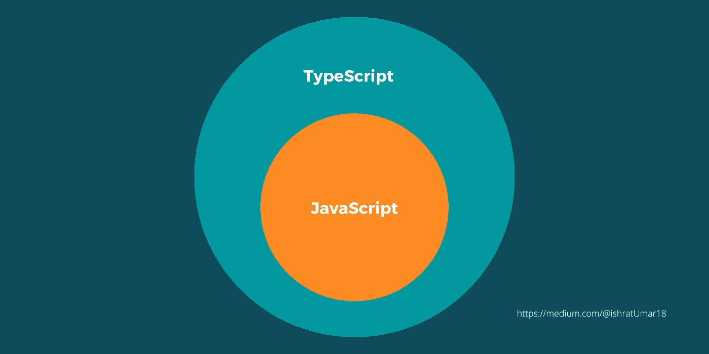

# 类型脚本与 JavaScript

> 原文：<https://medium.com/javarevisited/typescript-vs-javascript-caa8b67729a0?source=collection_archive---------4----------------------->

# TypeScript 如何改进 JavaScript？

JavaScript 开发团队在 JavaScript 首次发布时就将其作为客户端编程语言推出。

然而，当个人开始使用 [JavaScript](/javarevisited/10-best-online-courses-to-learn-javascript-in-2020-af5ed0801645) 时，他们发现它也可以用作服务器端编程语言。

JavaScript 和 TypeScript 的区别！

然而，随着 JavaScript 越来越流行，代码变得越来越复杂和沉重。结果，JavaScript 无法满足面向对象编程语言的所有要求。

这使得 JavaScript 不可能作为服务器端技术在业界取得成功。开发团队随后创造了 [**打字稿**](/@javinpaul/7-best-courses-to-learn-typescript-in-depth-58439e1ce729) 来填补空白。

# 主要区别:

1.  JavaScript 的超集是 Typescript，它是一种脚本语言，使您能够构造交互式网页。JavaScript 代码不需要编译，而 Typescript 代码必须编译。
2.  Typescript 使用诸如类型和接口之类的概念来描述被利用的数据，而 JavaScript 却没有。
3.  当比较 TypeScript 和 JavaScript 时，TypeScript 有一个 JavaScript 没有的原型特性。
4.  对于大型项目，Typescript 提供了具有泛型和 JS 功能的健壮类型系统，而 JavaScript 是小型项目的绝佳选择。

# 打字稿的优点:

1.  与 JS 相比，这是一个强大的系统。
2.  *易于维护。*
3.  *给予 ES6 支持。*
4.  *它提供了高水平的生产力。*
5.  *它提供了 HTML5 的可扩展性。*
6.  *指出编译时的错误。*

# 打字稿的缺点:

1.  *需要编译。*
2.  *复杂的软件。*
3.  虚构的安全感。

感谢您花时间阅读本文。我希望这能对你有所帮助，并与他人分享。

## 注意:有知识有经验优先考虑 TypeScript。