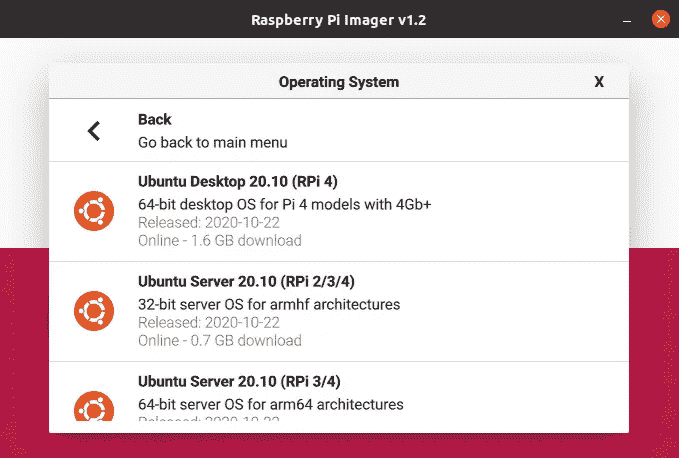
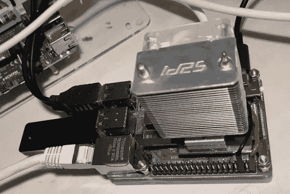
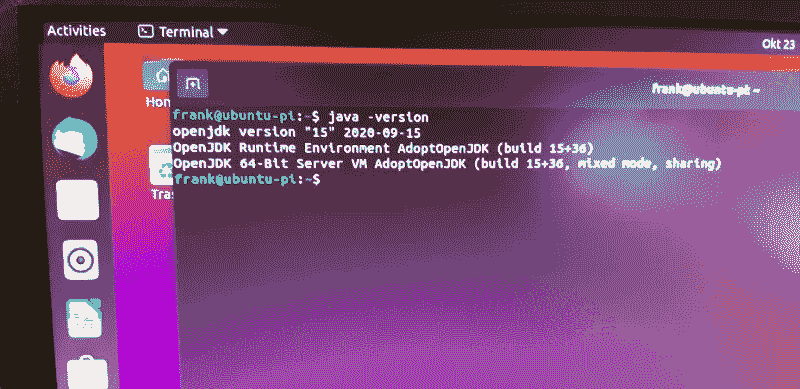
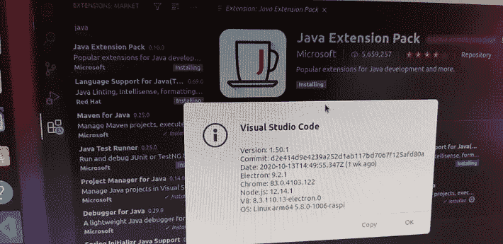

# Raspberry Pi 4 上的 Ubuntu desktop 可能是使用 Visual Studio 代码开发 Java 的完美 PC。

> 原文：<https://medium.com/javarevisited/ubuntu-desktop-on-raspberry-pi-4-161ea0a832a2?source=collection_archive---------1----------------------->

上周四晚上，Ubuntu [宣布发布 Ubuntu 20.10“Groovy Gorilla”，桌面支持树莓 Pi 4 (4 和 8Gb)](https://www.linuxjournal.com/content/ubuntu-2010-groovy-gorilla-arrives-linux-58-gnome-338-raspberry-pi-4-support) 。所以我就拿去快速试驾了！

当打开[Raspberry Pi Imager 工具](https://www.raspberrypi.org/downloads/)时，新的 Ubuntu 桌面操作系统已经可用。你可以把它刻录到 SD 卡上，但是因为我想要一个更快更可靠的光盘，所以我重新使用了这个[早先关于 USB Boot](https://levelup.gitconnected.com/improve-raspberry-pi-4-disc-read-speed-with-64-bit-raspbian-os-with-usb-mass-storage-boot-4a22ff2d34e1) 的帖子中的 [32Gb 闪存驱动器](https://www.kiwi-electronics.nl/32gb-transcend-jetflash-780-usb-30-flash-drive-mlc-210mbs)，并把新的 Ubuntu 操作系统刷新到它上面。

新 Ubuntu 桌面 20.10 的 Raspberry Pi 成像仪工具

一旦成像仪工具将操作系统刻录到光盘上，您只需将它放入 Raspberry Pi 并通电即可。是的，它就在那里，直接从 USB 闪存驱动器，不需要额外的步骤(我的树莓派的 EEPROM 已经是最新的)！一个完整的 64 位 Ubuntu 操作系统，现在更适合我日常的 Linux 工作电脑。SKDMAN、Visual Studio 代码、Java 15(adopt open JDK)……几分钟内全部安装完毕。

我将需要更多的测试时间，并真正开始使用它进行一些 Java 开发，但似乎廉价的 Raspberry Pi 可以与昂贵得多的笔记本电脑竞争。

