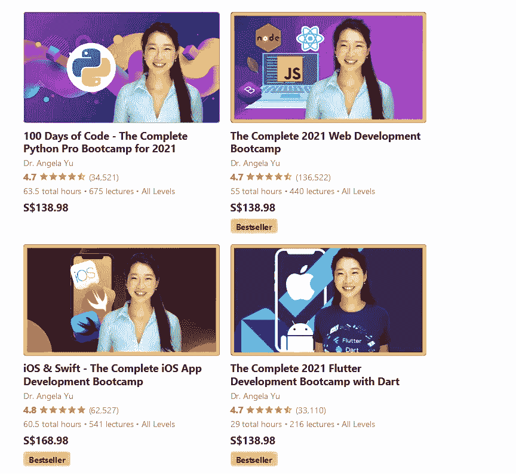

# Angela Yu 完整的 2023 Web 开发 Bootcamp 课程值得吗？[综述]

> 原文：<https://medium.com/javarevisited/udemy-course-review-the-complete-2021-web-development-bootcamp-course-by-angela-yy-is-it-worth-ee1b6812aba3?source=collection_archive---------0----------------------->

## 我对 Udemy 2023 年最受欢迎的 web 开发课程的评论 Angela Yu 从初学者的角度完成的 2023 年 Web 开发训练营课程。

大家好，如果你对 web 开发感兴趣，并希望加入 Udemy 上由 Angela Yu 开设的 2023 Web 开发训练营 课程，但不确定该课程是否适合你，那么你来对地方了。

之前，我已经分享了[最适合初学者的 Web 开发课程](/better-programming/my-5-favorite-courses-to-learn-web-development-in-2019-a5e74167f8b2)以及一些[高级 Fullstack 课程](/javarevisited/top-10-online-courses-to-become-a-fullstack-web-developer-in-2020-d608a6b63232)，在这篇文章中，我将回顾 Udemy 上最受欢迎的 Web 开发课程。

> 如果你赶时间，我强烈推荐你参加这个令人惊奇的课程，特别是如果你想成为一名网页开发者的话。[课程](https://click.linksynergy.com/deeplink?id=JVFxdTr9V80&mid=39197&murl=https%3A%2F%2Fwww.udemy.com%2Fcourse%2Fthe-complete-web-development-bootcamp%2F)结构良好，课时少且重点突出，有大量测验和练习，最重要的导师 [**Angela Yu**](https://click.linksynergy.com/deeplink?id=CuIbQrBnhiw&mid=39197&murl=https%3A%2F%2Fwww.udemy.com%2Fuser%2F4b4368a3-b5c8-4529-aa65-2056ec31f37e%2F) 擅长用简单的语言解释复杂的概念。

无论如何，在这篇文章中，我们将回顾这个了不起的网络开发课程，它可以帮助你决定是否应该在这个课程上投入时间和金钱。

如今，网络开发比你实际认为的更重要。更重要的是，网络开发正触及公司在线业务的方方面面。

这些公司不仅要关注在线服务的后端和质量，还要关注他们网站的外观，以及用户如何与你的网站互动，也就是所谓的用户体验。

[Web 开发](https://javarevisited.blogspot.com/2018/02/top-5-online-courses-to-learn-web-development.html#axzz6dwcQP2gs)简单来说就是创建网站前端的过程，即你在屏幕上看到的界面或外观，你可以与类似的按钮和文本进行交互，还有创建后端的过程，即在后台运行的操作，比如当你注册一个帐户，你的凭据在数据库中注册时。

# Udemy 上 Angela Yu 的 2023 Web 开发 Bootcamp 课程对初学者好吗？

乍一看，正如我在总结部分所说的那样，这确实是一门非常适合初学者学习 web 开发的课程，但是让我们以结构化的方式回顾一下这门课程的不同方面，如教师素质和声誉、课程结构和内容质量、社会证明，以及其他学习者对这门 web 开发课程的看法。

让我们深入学习这门面向初学者和全栈开发人员的课程，看看它是否值得你花费时间和金钱。

## 1.讲师声誉

这门令人惊叹的课程的讲师是一名医学博士、一名 IOS 开发人员以及一名被称为 [Angela Yu](https://click.linksynergy.com/deeplink?id=JVFxdTr9V80&mid=39197&murl=https%3A%2F%2Fwww.udemy.com%2Fuser%2F4b4368a3-b5c8-4529-aa65-2056ec31f37e%2F) 的网络开发人员，别忘了她是伦敦 App Brewery 的创始人，在这里你可以亲自学习许多东西的开发，比如网络和移动应用。Angela Yu 是 Udemy 平台的顶级讲师之一，注册学生超过 50 万，我没有提到像 Twitter、Google、脸书这样的公司邀请她给他们的员工上课，这是一个很大的迹象，表明这位讲师真的很擅长她所教的内容。

她拥有博士学位，她的大部分研究都是如何让学习编码变得有趣，让难懂的概念变得容易理解，她将这种学习应用到她的训练营课程中。

在她的课程中，包括这一门，你会发现许多极客式的幽默，但也有许多解释和动画，以确保一切都易于理解。这就是为什么她是 Udemy 的顶级导师之一，也是我个人最喜欢的导师之一。

# 2.课程结构和内容质量

这个庞大的课程包含超过 **53 个小时的视频内容**，目标是没有任何经验的初学者，需要开始学习并应用你将在现实生活中的网站或小企业中学到的东西。那么，让我们来探讨一下本课程的内容:

## 2.1.前端 web 开发

创建网站或在线服务时，首先要做的是开发前端部分，以及网站将如何为访问者服务，为此，您可以通过学习 [HTML/CSS](https://www.java67.com/2020/08/5-best-online-courses-to-learn-html-5.html) 开发来开始本课程。

HTML 是定义网站结构的语言，而 CSS 是定制网站的外观，比如颜色和文本大小等等。

## 2.2.JavaScript 简介

创建网站的前端后，无论是使用 [HTML/CSS](/javarevisited/10-best-html-and-css-courses-for-beginners-in-2021-6757eec00032) 还是 [Bootstrap](https://javarevisited.blogspot.com/2020/07/top-5-courses-to-learn-bootstrap-in.html) 你都需要为你的网站添加一些交互性，这也是你在本节将要做的。

JavaScript 是一种高级编程语言，它可以让你在网站上添加很多很棒的东西，创造更好的用户体验等等。

## 2.3.后端 web 开发

在开发了网站的整个前端之后，你必须创建它的后端，正如我之前所说的，当有人与你的服务进行交互时，这就是幕后的操作。

出于这个原因，您将使用两个 javascript 框架来实现这个目标，这两个框架分别叫做 [Node.js](https://www.java67.com/2019/07/top-5-free-nodejs-courses-for-web-development.html) 和 [Express.js](https://www.java67.com/2020/06/top-5-courses-to-learn-mern-stack-for-web-development.html) 。您还将了解 API 以及如何将其他服务连接到您的网站，如添加支付或通过其他服务发送电子邮件。

## 2.4.数据库技术

作为一名全栈 web 开发人员，还需要设计数据库，而不仅仅是创建前端和后端。在这一节中你将如何使用 [SQL 数据库](/hackernoon/top-5-sql-and-database-courses-to-learn-online-48424533ac61)技术以及其他一些如 [MongoDB](https://javarevisited.blogspot.com/2019/01/top-5-mongodb-online-training-courses.html) 和 Mongoose 来注册用户的数据等等。

在这之后，你将把所有东西放在一起，自己创建整个网站。是不是很棒！

## 2.5.学习反应

到目前为止，你已经学习了许多编程语言来创建你的网站的界面，像 [HTML/CSS](/javarevisited/5-free-html-and-css-courses-to-learn-front-end-web-development-online-8b04517c6ecb?source=---------85------------------) 、 [Bootstrap](/javarevisited/6-best-bootstrap-online-courses-for-web-designers-and-developers-a688e192b2e2) 等等，但是实际上还有许多其他的框架来做这件事，其中一个叫做 React。

如果你不知道， [React](https://www.java67.com/2018/02/5-free-react-courses-for-web-developers.html) 是脸书开发的一个 JavaScript 框架，用来创建用户界面或者说前端。它是最流行的前端开发框架之一，被世界各地的大公司和小公司所使用。

# 3.人物评论

如果你打算只上一门课就成为一名全面的 web 开发人员，那么这个 Web 开发人员训练营绝对是我推荐的最好的课程之一，因为它有超过 430，000 人注册，得分率为 4.7。

当您向下滚动评论部分时，您会看到人们对课程内容和视频非常满意，几乎 70%的学生给了本课程 5 颗星，这意味着您可以开始通过本课程学习 web 开发。

以下是本课程的链接—[**2023 年网络开发训练营**](https://click.linksynergy.com/deeplink?id=JVFxdTr9V80&mid=39197&murl=https%3A%2F%2Fwww.udemy.com%2Fcourse%2Fthe-complete-web-development-bootcamp%2F)

以上就是 2023 年**学习 Web 开发的最佳课程**。由 Angela Yu 在 Udemy 上完成的 2023Web 开发训练营对于 2023 年学习 Web 开发的初学者来说是一门非常好的课程。

它清晰、全面、引人入胜、实用、最新，同时非常经济实惠。我向任何想在 2023 年及以后[学习 Web 开发的人强烈推荐这门课程。](/javarevisited/10-best-coursera-courses-for-web-development-and-web-design-9ec54ed92dd9)

本课程还有很多我们在这里没有提到的内容要教你，比如身份认证、安全性和数据库加密，但总的来说，这是你在学习本课程时希望看到的内容。

您可能想探索的其他 **Web 开发资源**

*   [前端和后端开发者路线图](https://javarevisited.blogspot.com/2019/02/the-2019-web-developer-roadmap.html)
*   [面向 Java 和 DevOps 工程师的 5 门免费 Docker 课程](http://www.java67.com/2018/02/5-free-docker-courses-for-java-and-DevOps-engineers.html)
*   [2023 年学习 JavaScript 的 13 门免费课程](/javarevisited/12-free-courses-to-learn-javascript-and-es6-for-beginners-and-experienced-developers-aa35874c9a32)
*   [全栈开发者路线图](/javarevisited/the-2019-web-developer-roadmap-ab89ac3c380e)
*   [学习 Learn RESTful Web 服务的 3 本书和课程](http://www.java67.com/2018/02/3-books-and-courses-to-learn-restful-web-services-with-spring.html)
*   [2023 年 React JS 开发者路线图](https://javarevisited.blogspot.com/2018/10/the-2018-react-developer-roadmap.html#axzz5dPh5g7tg)
*   Web 开发人员学习 PHP 和 MySQL 的 5 门课程
*   [面向初学者的 10 门 Python Web 开发课程](/javarevisited/top-10-courses-to-learn-python-for-web-development-in-2020-best-of-lot-efe11fb6d212)
*   [2023 年学习打字稿的 10 门免费课程](/javarevisited/top-10-free-typescript-courses-to-learn-online-best-of-lot-44bce9da41d1)
*   [我最喜欢的初学者学习棱角的课程](/javarevisited/10-courses-to-learn-angular-for-web-development-6da1bd2856dc)
*   [免费学习 Ruby 和 Rails 的 5 门课程](http://www.java67.com/2018/02/5-free-ruby-and-rails-courses-to-learn-online.html)
*   [学习 Servlet、JSP 和 JDBC 的 5 门免费课程](http://www.java67.com/2018/02/5-free-servlet-jsp-and-jdbc-online-courses-for-java-developers.html)
*   [2023 年学习 Angular 的 5 门免费课程](https://javarevisited.blogspot.com/2018/06/5-best-courses-to-learn-angular.html)
*   【Fullstack 开发者应该学习的 10 个框架

感谢您阅读本文。如果你喜欢这个由 Angela Yu 在 Udemy 上发表的关于 2023 年网络开发训练营的课程回顾，请与你的朋友和同事分享。如果您有任何问题或反馈，请发表评论。

**P. S. —** 如果你是 web 开发新手，正在寻找一个免费的在线培训课程来学习 web 开发，那么你也可以看看 Udemy 的这个[**Web Development By do:HTML/CSS From Scratch[FREE]**](https://click.linksynergy.com/deeplink?id=JVFxdTr9V80&mid=39197&murl=https%3A%2F%2Fwww.udemy.com%2Fcourse%2Fweb-development-learn-by-doing-html5-css3-from-scratch-introductory%2F)课程。这是完全免费的，你只需要一个 Udemy 帐户就可以加入这个课程。

 [## 免费 HTML 教程- Web 开发实践:HTML / CSS 从头开始

### 在作为餐厅经理每天工作 15 个小时后，我决定是时候改变一下了。学完基础…

udemy.com](https://click.linksynergy.com/deeplink?id=JVFxdTr9V80&mid=39197&murl=https%3A%2F%2Fwww.udemy.com%2Fcourse%2Fweb-development-learn-by-doing-html5-css3-from-scratch-introductory%2F)