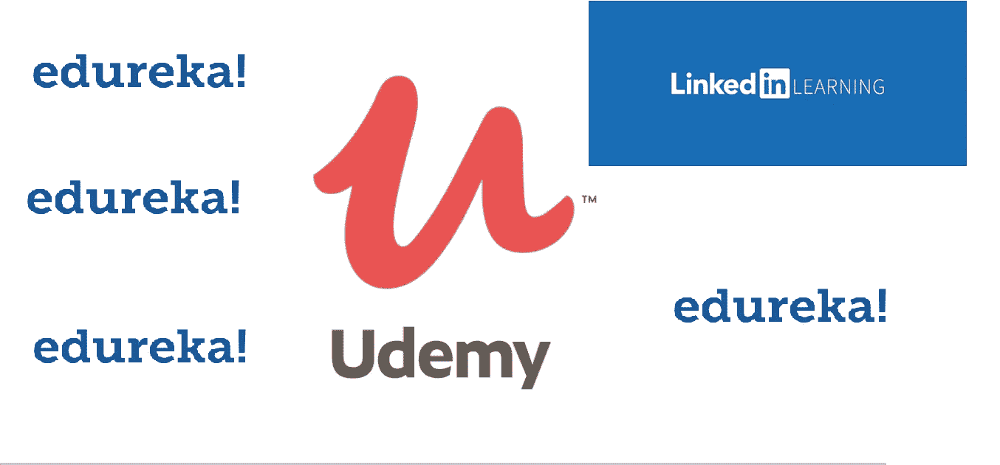
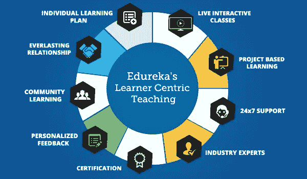

# 回顾—Udemy vs LinkedIn Learning vs edu reka？2023 年在线学习哪个平台最好？

> 原文：<https://medium.com/javarevisited/udemy-linkedin-learning-or-edureka-which-is-better-to-learn-tech-skills-adbe3442a547?source=collection_archive---------1----------------------->

## 学编程与开发哪个好？Udemy 还是 LinkedIn Learning 还是 Edureka？用他们最好的资源。

大家好，如果你正在网上学习，并且对不同的学习平台感到困惑，比如 Udemy、Pluralsight、Edureka、LinkedIn Learning、Educative 等等，那么你来对地方了。

早些时候，我已经回答了类似[**plural sight vs . CodeCademy**](/javarevisited/codecademy-or-pluralsight-which-is-a-better-platform-to-learn-coding-skills-59251a080642)和[**Udemy vs . CodeCademy**](/javarevisited/pluralsight-or-udemy-d9a94d2e8ee)的问题，但从未解释过 Edureka vs. Udemy 或 LinkedIn Learning vs Udemy，这是我的许多读者长期以来一直在问的问题。

现在，等待结束了，因为我将在本文中回顾 [Udemy](https://click.linksynergy.com/deeplink?id=JVFxdTr9V80&mid=42536&murl=https%3A%2F%2Fwww.edureka.co%2F&LSNSUBSITE=LSNSUBSITE) 、 [Edureka](https://click.linksynergy.com/deeplink?id=JVFxdTr9V80&mid=42536&murl=https%3A%2F%2Fwww.edureka.co%2F&LSNSUBSITE=LSNSUBSITE) 和 [LinkedIn learning](http://linkedin-learning.pxf.io/c/1193463/449670/8005) 。

通读文章后，你会有足够的信息了解每个平台的强项领域，以及哪个在线平台适合你的学习目标。

学习是适应这个世界上任何行业的新信息和新技能的能力，是你生活或职业生涯中必不可少的东西，它使你能够更快地理解和轻松地解决你的生活问题，并帮助你的大脑获得批判性思维技能。

出于这个原因，许多平台来到现实世界，帮助人们与导师联系，每天在线学习新技能，而不需要花那么多时间和金钱去大学，让每个人都可以访问，一些最好的平台叫做 [Udemy](https://click.linksynergy.com/deeplink?id=JVFxdTr9V80&mid=39197&murl=https%3A%2F%2Fwww.udemy.com%2F) 、 [Edureka](https://click.linksynergy.com/deeplink?id=JVFxdTr9V80&mid=42536&murl=https%3A%2F%2Fwww.edureka.co%2F&LSNSUBSITE=LSNSUBSITE) 和 [Linkedin learning](http://linkedin-learning.pxf.io/c/1193463/449670/8005) 。在这篇文章中，你将看到这三个平台在许多方面的不同，这样你就可以决定哪一个最适合你的需要，并花时间学习新的技术技能。

# 2023 年程序员 Udemy vs LinkedIn Learning vs edu reka 回顾

不浪费您的时间，让我们深入了解这些学习平台，了解它们的更多信息，看看它们的独特卖点是什么，以及它是否符合您的学习目标。

## 1. [Udemy](https://click.linksynergy.com/deeplink?id=JVFxdTr9V80&mid=39197&murl=https%3A%2F%2Fwww.udemy.com%2F)

Udemy 是一个市场平台，人们可以从几乎每个行业的数千门课程中学习，从编程到商业和咨询以及职业发展，任何人都可以将自己的热情转化为课程，并在这个平台上出售，也许可以通过做自己喜欢的事情来谋生。udemy 允许教师对他们的课程收取他们想要的任何费用，低价是每门课程 9.99 美元，终身不像大多数平台那样订阅一段时间，最贵的课程每门课程约 199.99 美元，但 Udemy 经常经营 [**闪购**](https://click.linksynergy.com/deeplink?id=CuIbQrBnhiw&mid=39197&murl=https%3A%2F%2Fwww.udemy.com%2F) 并暂时降低课程成本，instruction 可以让他们的课程免费获得一些评论，然后将其转化为付费课程。该平台允许任何人作为讲师加入他们，并以他想要的价格发布他的课程，无论是免费的还是付费的，因此它依赖于人们帮助填充平台的课程，并从每次课程购买的佣金中赚一些钱，并且在 Udemy 中的好事情是他们的大多数课程都很大，其中一些课程可以达到 60 多个小时的视频内容。

因此，**如果成本是你关心的问题，那么 Udemy 是最好的学习平台**因为你可以只花 10 美元就获得数千美元的课程，但同时，在 Udemy 上找到合适的课程并不容易，这就是推荐的帮助所在。

以下是我向所有学习使用 Java、Python 和 Javascript 编程的人推荐的 Udemy 课程:

1.  Tim Buchalaka 为任何想学习 Java 的人提供的完整的 Java 大师课程。
2.  [**《Python 3 训练营》**](http://bit.ly/2ysqzDa) 作者何塞·波尔蒂利亚，适合任何想学习 Python 的人。
3.  [**完整的 JavaScript 课程**](http://bit.ly/2ytow1z) **:** 适合任何想通过搭建项目学习 JavaScript 的人。
4.  [**完整的 2023 年 Web 开发训练营**](https://click.linksynergy.com/deeplink?id=JVFxdTr9V80&mid=39197&murl=https%3A%2F%2Fwww.udemy.com%2Fcourse%2Fthe-complete-web-development-bootcamp%2F) 适合任何想从头开始学习 Web 开发的人。

这些只是我最喜欢的 Udemy 课程的一部分，还有很多，如果你需要更多的选择，你还可以查看[我最喜欢的 Udemy 课程的完整列表](/javarevisited/15-best-udemy-courses-programmers-can-buy-on-black-friday-and-cyber-monday-2020-a803874f41d9)

## 2.[领英学习](http://linkedin-learning.pxf.io/c/1193463/449670/8005)

Linkedin learning 是一个在线课程平台，就像 udemy 一样，教师可以提交他们的课程，并在向学生发布之前进行审查，最初这个平台被称为 Lynda.com，但很快微软收购了这家公司，并将其合并到 Linkedin 平台。

[**Linkedin learning**](http://linkedin-learning.pxf.io/c/1193463/449670/8005)平台只接受在他们教授和提供给学生的内容方面有经验的人，因此没有人可以像 [Udemy](https://click.linksynergy.com/deeplink?id=CuIbQrBnhiw&mid=39197&murl=https%3A%2F%2Fwww.udemy.com%2F) 一样不通过验证过程就创建课程并发布它，这使得这个平台对他们教授的内容更加可信。

与 Udemy 或 Edureka 不同，LinkedIn Learning 是一个会员制或订阅式网站，只需一个计划，你就可以访问他们的所有课程。在这方面，它类似于[复数视线](https://pluralsight.pxf.io/c/1193463/424552/7490?u=https%3A%2F%2Fwww.pluralsight.com)和[代码学院](https://bit.ly/codecademypro)。

LinkedIn 也有一个非常有竞争力的计划，他们允许访问他们的 16，000 多门课程，只需每月<http://linkedin-learning.pxf.io/c/1193463/449670/8005?u=https%3A%2F%2Fwww.linkedin.com%2Flearning%2Fsubscription%2Fproducts>**19.99 美元，这对不断需要学习新东西的程序员和开发人员来说真是太棒了。它比 Pluralsight 便宜，而且你还可以学习更多的课程。**

****这是加入领英学习的链接**——[花 19.99 美元加入领英学习](http://linkedin-learning.pxf.io/c/1193463/449670/8005?u=https%3A%2F%2Fwww.linkedin.com%2Flearning%2Fsubscription%2Fproducts)**

****

**他们还提供 [**1 个月的免费试用期**](http://linkedin-learning.pxf.io/c/1193463/449670/8005?u=https%3A%2F%2Fwww.linkedin.com%2Flearning%2Fsubscription%2Fproducts) 开始免费学习，然后你需要升级你的计划，每月支付 29.99 美元作为订阅费，这样你就可以想学多少门课程就学多少门，不像之前的两个平台 Udemy 和 Edureka，你需要为个别课程付费。**

## **3..[爱德华卡](https://click.linksynergy.com/deeplink?id=JVFxdTr9V80&mid=42536&murl=https%3A%2F%2Fwww.edureka.co%2F&LSNSUBSITE=LSNSUBSITE)**

**Edureka 是一个在线学习平台，专注于所有与信息技术或 IT 相关的行业，如编程、web 开发以及数据分析、数据可视化和安全性。 更多的是由一些印度 IT 专业人士创建的，他们的课程有数千人注册，他们的 youtube 频道有超过 100 万订户

[Edureka 课程](https://click.linksynergy.com/deeplink?id=JVFxdTr9V80&mid=42536&murl=https%3A%2F%2Fwww.edureka.co%2F&LSNSUBSITE=LSNSUBSITE)通常**比 [Udemy](https://click.linksynergy.com/deeplink?id=CuIbQrBnhiw&mid=39197&murl=https%3A%2F%2Fwww.udemy.com%2F) 或其他在线学习平台**更贵[起价为 200 美元或更高，但与其他在线平台相比，教师非常专业。](https://click.linksynergy.com/deeplink?id=CuIbQrBnhiw&mid=39197&murl=https%3A%2F%2Fwww.udemy.com%2F)**

**Edureka 对其内容的专业性证明了高价的合理性，有时他们会进行销售，将成本降低到实际价格的 30%左右。**

**讲师指导培训也是 Edureka 的独特卖点(USP)。如果你喜欢一对一的辅导学习，并需要指导，Edureka 是适合你的在线学习平台。

*平台不允许个人讲师在 Udemy 或其他平台*上授课，相反，所有课程都自己创建了团队，以确保向学生提供最高质量的信息和他们的声誉，这也解释了为什么定价如此昂贵。**

**以下是我从 Edureka 为程序员和开发人员推荐的培训项目:**

1.  **[**DevOps 认证培训**](https://click.linksynergy.com/deeplink?id=JVFxdTr9V80&mid=42536&murl=https%3A%2F%2Fwww.edureka.co%2Fdevops-certification-training&LSNSUBSITE=LSNSUBSITE)**
2.  **[**AWS 建筑师认证培训**](https://click.linksynergy.com/deeplink?id=JVFxdTr9V80&mid=42536&murl=https%3A%2F%2Fwww.edureka.co%2Faws-certification-training&LSNSUBSITE=LSNSUBSITE)**
3.  **[**数据科学 Python 认证培训**](https://click.linksynergy.com/deeplink?id=JVFxdTr9V80&mid=42536&murl=https%3A%2F%2Fwww.edureka.co%2Fdata-science-python-certification-course&LSNSUBSITE=LSNSUBSITE)**

**这些都是很好的培训计划，您可以从讲师指导的 DevOps 在线课程中学习。**

****

**这就是关于在线学习技术技能的 Udemy vs edu reka vs LinkedIn Learning 的全部内容。你已经探索了三个平台，这三个平台被认为是任何人学习新技能的最佳选择，也许可以作为许多行业的专业人士开始新的职业生涯，无论你是想成为网站开发人员、创业还是自由职业者。**

**您可能喜欢的其他**编程**和**开发**文章:**

*   **[2023 年学习 Python 的十大 Udemy 课程](https://javarevisited.blogspot.com/2020/05/top-10-udemy-courses-to-learn-python-programming.html)**
*   **20 多个网站免费学习编码**
*   **[学习 Java 和 Spring 的 15 大 Udemy 课程](/javarevisited/top-15-java-and-spring-framework-courses-from-udemy-best-of-lot-d7b965b62a9f?source=rss------java-5)**
*   **[devo PS 程序员路线图](/hackernoon/the-2018-devops-roadmap-31588d8670cb)**
*   **[2023 年 Java 开发者路线图](https://javarevisited.blogspot.com/2019/10/the-java-developer-roadmap.html)**
*   **[2023 年学习 Python 的 5 大课程](https://hackernoon.com/top-5-courses-to-learn-python-in-2018-best-of-lot-26644a99e7ec)**
*   **[2023 年网络开发者训练营](https://hackernoon.com/the-2019-web-developer-roadmap-ab89ac3c380e)**
*   **[学习 React.js 的十大 Pluralsight 课程](https://javarevisited.blogspot.com/2020/08/top-10-pluralsight-courses-to-learn-React.js.html)**
*   **[我最喜欢的学习数据结构和算法的免费课程](https://www.freecodecamp.org/news/these-are-the-best-free-courses-to-learn-data-structures-and-algorithms-in-depth-4d52f0d6b35a/?gi=a41bf34d0c99)**
*   **[2023 年 Java 开发者可以学到的 10 件事](/swlh/10-things-java-developer-should-learn-in-2019-5e0cf388e07f)**

**感谢您阅读本文。如果你喜欢我对 Udemy vs edu reka vs LinkedIn Learning 的评论，那么请与你的朋友和同事分享。如果您有任何问题或反馈，请留言。**

**如果你正在寻找免费的在线网站来免费学习编码，那么不要担心，你会在 Udemy 上找到很多免费的课程。如果你需要更多的选择，你也可以查看这个 [20+网站的列表，在 Medium 上免费学习编码](/javarevisited/top-20-sites-to-learn-coding-in-2020-f57ff63d9cb3)。**

**</javarevisited/my-favorite-free-tutorials-and-courses-to-learn-javascript-8f4d0a71faf2> **