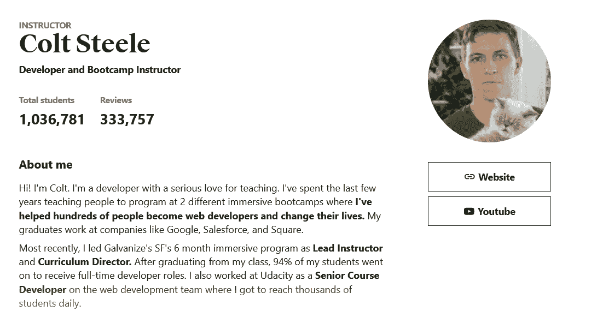

# Udemy 的《柯尔特·斯蒂尔的 Web 开发者训练营 2023》值得吗？[综述]

> 原文：<https://medium.com/javarevisited/udemys-the-web-developer-bootcamp-by-colt-steele-review-d94d668f63a7?source=collection_archive---------0----------------------->

## 柯尔特·斯蒂尔的 web 开发人员训练营是一个全面、清晰、引人入胜的最新课程，旨在学习 2023 年的基本 Web 开发技术。绝对值得。

大家好，如果你想学习网页开发并寻找一门令人惊叹的课程，或者你已经选择了柯尔特·斯蒂尔的 2023 网页开发者训练营，并想知道它是否适合你，那么你来对地方了。

早些时候，我已经分享了[免费的 web 开发课程](/javarevisited/10-free-web-development-courses-for-beginners-9942af352ed5)，在这篇文章中，我将回顾 Udemy 最受欢迎的 web 开发课程，由我在 Udemy 上最喜欢的导师之一柯尔特·斯蒂尔 主持的 [*2023 Web 开发者训练营。*](https://click.linksynergy.com/deeplink?id=CuIbQrBnhiw&mid=39197&murl=https%3A%2F%2Fwww.udemy.com%2Fcourse%2Fthe-web-developer-bootcamp%2F)

如今学习 web 开发是一项巨大的工作，因为你不仅要学习设计前端或 web 界面，还要学习后端以及为网站或在线服务设计和构建数据库系统，这就是所谓的[全栈 web 开发人员](https://javarevisited.blogspot.com/2019/01/10-web-development-frameworks-fullstack-developer-should-learn.html)。

雇佣一个全栈的 web 开发人员是任何公司或盈利组织的重要组成部分，他们减少了雇佣许多人从前端、后端和数据库创建整个网站的成本。

Glassdoor 估计，在美国，全栈 web 开发人员的平均年薪为 68，524 美元。

找到合适的课程来学习所有这些技能可能是一项艰巨的任务，但在这篇文章中，我发现了在这个领域开始职业生涯所需的最好的课程，这个课程名为 [**由 udemy 平台主办的 Web 开发人员训练营**](https://click.linksynergy.com/deeplink?id=CuIbQrBnhiw&mid=39197&murl=https%3A%2F%2Fwww.udemy.com%2Fcourse%2Fthe-web-developer-bootcamp%2F) ，本文是对该课程的回顾。请继续关注，看看你在参加这个训练营的过程中会学到什么。

 [## Web 开发人员训练营:学习 HTML、CSS、Node 等等！

### 嗨！欢迎来到全新版本的 web 开发者训练营，Udemy 最受欢迎的 Web 开发课程。这个…

udemy.com](https://click.linksynergy.com/deeplink?id=CuIbQrBnhiw&mid=39197&murl=https%3A%2F%2Fwww.udemy.com%2Fcourse%2Fthe-web-developer-bootcamp%2F) 

# Udemy 的《2023 Web Developer boot camp Corse by 柯尔特·斯蒂尔》值得吗？

正如我所说的，这是学习 web 开发最全面的课程之一，Colt 也用新的视频和讲座彻底改革了这门课程，使其跟上时代，我肯定认为它物有所值，但是，让我们以结构化的方式回顾这门课程，考虑讲师的声誉和教学风格、课程结构和内容质量，以及其他人对这门课程的看法。

## 1.讲师声誉

毫无疑问，**是最受欢迎的 Udemy 导师之一。他来自训练营，这体现了他的教学风格。他擅长简化复杂的概念，并用重要的例子来解释它们。**

**难怪，他在 Udemy 上注册了近 100 万名学生和大约 11 门不同专业的课程，如 web 开发、MySQL 数据库、Python、JavaScrip 和许多其他主题。他的学生毕业生在谷歌和 Square 等大型科技公司找到了工作。**

**他是 [**Udemy**](https://click.linksynergy.com/deeplink?id=CuIbQrBnhiw&mid=39197&murl=https%3A%2F%2Fwww.udemy.com%2F) 上最令人惊叹的导师之一，在 Udemy 上以像 *$9.9* 这样的一次性价格学习他的课程对任何学习者来说都是最好的事情。鉴于他是一名训练营教练，他的教学风格就像你在价值 10，000 美元的训练营中得到的那种，但只是价格的一小部分。**

**我真的很喜欢他清晰明了的解释概念的方式。他的嗓音和讲解方式令人惊叹，这让学习变得既有趣又简单。你可以在他的个人资料中了解更多关于他的信息。**

****

**你也应该看看这些课程，其中大多数都是畅销书，有数千名学生注册，这充分说明了柯尔特·斯蒂尔作为在线教师的受欢迎程度。**

## **2.课程结构和内容质量**

**关于这位讲师的背景已经说得够多了，让我们转到更重要的方面，即课程内容以及注册时您希望学到的内容，让我们开始探索内容:**

****2.1。HTML/CSS**
这两种技术是当今为任何网站创建网页最常用的技术。 [HTML](/javarevisited/10-best-html-and-css-courses-for-beginners-in-2021-6757eec00032) 用于创建你在浏览器屏幕上看到的网页的结构或布局，而 [CSS](/javarevisited/10-best-css-online-courses-for-beginners-and-experienced-developers-54aa2e8c0253) 用于定制 HTML 标签的颜色和文本。本节将从初学者向您介绍这两种技术，直到成为高级用户并创建许多示例和项目。**

****2.2。JavaScript**
在学习了 web 开发的基本部分之后，你现在必须学习 JavaScript，它将为你的网站增加更好的用户体验，比如交互，并使网页更加动态。目前大多数网站都在利用 JavaScript 来实现这些目标，所以如果你想成为一名 web 开发人员，这是一个很好的学习机会。**

****2.3。jQuery**
JavaScript 是一种非常强大的编程语言，可以制作交互式网站，但有点难以使用，因此开发人员创建了一个名为 [jQuery](https://www.java67.com/2018/04/top-5-free-jquery-courses-for-web-developers.html) 的框架来简化 HTML DOM 树，并且您可以使用 jQuery 用更少的代码为您的网站实现与 JavaScrit 相同的功能。**

****2.4。后端**
在学习了前端以及如何设计动态和交互式网页之后，现在是时候创建[后端](https://javarevisited.blogspot.com/2018/01/10-frameworks-java-and-web-developers-should-learn.html)以及当有人登录或使用你的服务时在幕后发生了什么。**

**本课程将向您展示如何使用一些 JavaScript 库，如 [Node.js 和 Express.js](https://javarevisited.blogspot.com/2018/01/top-5-nodejs-and-express-js-online-courses-for-web-developers.html#axzz5VllnxgVT) 来创建后端，您还将学习如何使用 API 来为您的服务或网站添加更多功能。**

****2.5。数据库技术**
正如我之前提到的，全栈式 web 开发人员需要学习三样东西设计前端、后端和数据库，这一节是关于数据库的。您将学习如何使用 MongoDB 创建一个 [NoSQL 数据库](https://javarevisited.blogspot.com/2019/03/top-5-nosql-database-web-developers-should-learn.html#ixzz64aBvbXQ4)，并将其与您的应用程序相链接。**

****2.6。在学习了创建 web 应用程序所需的所有基本技能之后，您将使用您在前端、后端和数据库中所学的知识来创建一个名为 YelpCamp 的项目。您将添加身份验证、地图、图片上传等等。****

**最后，您将在 Heroku 服务上部署 web 应用程序。**

# **3.人物评论**

**该课程可能是学习包含超过 60 小时视频内容的全栈 web 开发的最佳课程之一。该课程有超过 600，000 名学生注册，评分为 4.7 分，这意味着证明你在参加这个项目时会得到很好的照顾。**

**大约 66%的学生给本课程打了 5 颗星，通过阅读他们的评论和评论，您会发现他们对课程内容非常满意，视频质量和声音也非常棒。**

**以下是加入本课程的链接— [**网络开发者训练营 2023**](https://click.linksynergy.com/deeplink?id=CuIbQrBnhiw&mid=39197&murl=https%3A%2F%2Fwww.udemy.com%2Fcourse%2Fthe-web-developer-bootcamp%2F)**

****

**这些都在 Udemy 上柯尔特·斯蒂尔对 Web 开发者训练营课程的评论中。这个课程非常全面，针对的是没有任何经验的 web 开发初学者，涵盖了很多我在这里无法提及的技能，比如 CRUD 操作、验证数据、授权等等。**

**您可能想探索的其他 **Web 开发资源****

*   **[前端和后端开发者路线图](https://javarevisited.blogspot.com/2019/02/the-2019-web-developer-roadmap.html)**
*   **[2023 年学习 JavaScript 的 13 门免费课程](/javarevisited/12-free-courses-to-learn-javascript-and-es6-for-beginners-and-experienced-developers-aa35874c9a32)**
*   **[全栈开发者路线图](/javarevisited/the-2019-web-developer-roadmap-ab89ac3c380e)**
*   **[学习 Learn RESTful Web 服务的 3 本书和课程](http://www.java67.com/2018/02/3-books-and-courses-to-learn-restful-web-services-with-spring.html)**
*   **[2023 年 React JS 开发者路线图](https://javarevisited.blogspot.com/2018/10/the-2018-react-developer-roadmap.html#axzz5dPh5g7tg)**
*   **[2023 年学习打字稿的 10 门免费课程](/javarevisited/top-10-free-typescript-courses-to-learn-online-best-of-lot-44bce9da41d1)**
*   **[Angela Yu 的网络开发者训练营回顾](https://javarevisited.blogspot.com/2021/02/udemy-course-review-web-development-bootcamp-.html#axzz6rQaZvLlb)**
*   **[我最喜欢的初学者学习棱角分明的课程](/javarevisited/10-courses-to-learn-angular-for-web-development-6da1bd2856dc)**
*   **[免费学习 Ruby 和 Rails 的 5 门课程](http://www.java67.com/2018/02/5-free-ruby-and-rails-courses-to-learn-online.html)**
*   **[Udemy 完整 Python 开发者课程回顾](https://javarevisited.blogspot.com/2021/02/udemy-course-review-web-development-bootcamp-.html#axzz6rQaZvLlb)**
*   **[面向 Java 和 DevOps 工程师的 5 门免费 Docker 课程](http://www.java67.com/2018/02/5-free-docker-courses-for-java-and-DevOps-engineers.html)**
*   **[面向初学者的 10 门 Python Web 开发课程](/javarevisited/top-10-courses-to-learn-python-for-web-development-in-2020-best-of-lot-efe11fb6d212)**
*   **[2023 年学习 Angular 的 5 门免费课程](https://javarevisited.blogspot.com/2018/06/5-best-courses-to-learn-angular.html)**
*   **【Fullstack 开发者应该学习的 10 个框架**

**感谢您阅读本文。如果你喜欢柯尔特·斯蒂尔在 Udemy 上对 Web 开发人员训练营的课程回顾，那么请与你的朋友和同事分享。如果您有任何问题或反馈，请发表评论。

**P. S. —** 如果您是 web 开发领域的新手，并且正在寻找一个免费的在线 web 开发培训课程来从头开始学习，那么您也可以查看 Udemy 的这个 [**Web 开发实践:HTML / CSS 从头开始**](https://click.linksynergy.com/deeplink?id=JVFxdTr9V80&mid=39197&murl=https%3A%2F%2Fwww.udemy.com%2Fcourse%2Fweb-development-learn-by-doing-html5-css3-from-scratch-introductory%2F) 课程。这是完全免费的，你只需要一个 Udemy 帐户就可以加入这个课程。**

** [## 免费 HTML 教程- Web 开发实践:HTML / CSS 从头开始

### 在作为餐厅经理每天工作 15 个小时后，我决定是时候改变一下了。学完基础…

udemy.com](https://click.linksynergy.com/deeplink?id=JVFxdTr9V80&mid=39197&murl=https%3A%2F%2Fwww.udemy.com%2Fcourse%2Fweb-development-learn-by-doing-html5-css3-from-scratch-introductory%2F)**