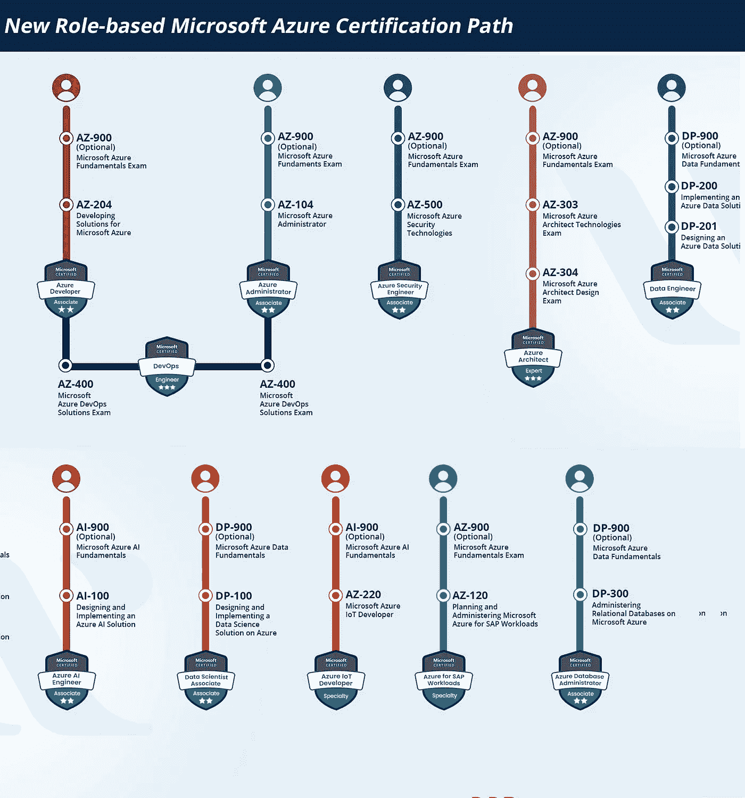
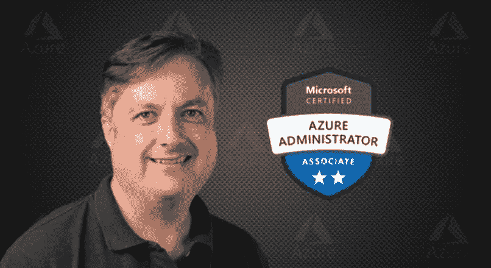
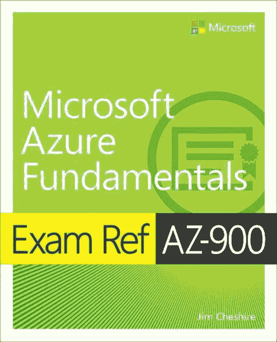

# 2023 年微软 Azure 管理员 AZ-104 认证考试准备终极指南

> 原文：<https://medium.com/javarevisited/ultimate-guide-to-prepare-az-104-certification-exam-for-microsoft-azure-administrator-19a11951e905?source=collection_archive---------0----------------------->

## 这是准备 2023 年代码为 AZ-104 的 Microsoft Azure 管理员考试的最终指南，包含最佳书籍、课程和模拟测试的资源链接。

image_credit — whizlabs

你好 Azure 专业人士，如果你正在准备 AZ-104 或微软 Azure 管理员助理认证，并寻找指导和资源，那么你来对地方了。

之前我已经分享过 [AZ 104 课程](/javarevisited/7-best-courses-for-az-104-microsoft-azure-administrator-associate-certification-exam-in-2021-7b620d61dcd8)和通过 AZ-104 考试的练习测试，而今天，我要讲的是准备 AZ-104 或微软 Azure 管理员认证的终极、逐步指南。

几年前，微软推出了新的基于角色的认证 AZ-104。这些是 AZ-103 考试的替代品，AZ-103 考试是微软 Azure 管理员认证的旧版本。

如果你想在 2023 年成为微软认证 Azure 管理员，那么你应该准备 AZ-104 考试。这是 Azure 管理员认证的最新版本。

之前所有与**微软 Azure 管理员认证**相关的考试如 AZ-100、AZ-101、AZ-102、AZ-103 都已过期，现在只需参加一次 AZ-104 认证考试即可获得微软 Azure 管理员助理认证徽章。

在本文中，我将向您展示如何开始准备这一久负盛名的 Azure 云认证，并提供相关资源的链接，如考试指南、官方考试主题、书籍、课程，甚至模拟考试，包括免费和付费的。简而言之，2023 年破解这个考试你需要的所有资源。

顺便说一句，如果你很匆忙，没有足够的时间进行广泛的准备，那么我建议你参加 Udemy 上 Scott Duffy 的 [**AZ-104 微软 Azure 管理员考试认证 2023**](https://click.linksynergy.com/deeplink?id=CuIbQrBnhiw&mid=39197&murl=https%3A%2F%2Fwww.udemy.com%2Fcourse%2F70533-azure%2F) 课程。它是最新的，包括从 2022 年 10 月起的变化，还提供了一个 PDF 学习指南供离线阅读。

 [## AZ-104 微软 Azure 管理员考试认证 2023

### 免费升级:本课程已更新至最新的 AZ-104 考试目标。课程奖励:免费学习指南 PDF…

udemy.com](https://click.linksynergy.com/deeplink?id=CuIbQrBnhiw&mid=39197&murl=https%3A%2F%2Fwww.udemy.com%2Fcourse%2F70533-azure%2F) 

# 如何在 2023 年通过 AZ-104 —微软 Azure 管理员助理考试认证

既然你已经知道微软的 Azure 认证正在与日俱增，那么是时候制定一个计划来成功通过这个声望很高的考试了。这是你在 2023 年破解微软新 AZ-104 Azure 管理员认证的一步一步的指南

## 1.微软 AZ-104 Azure 管理员考试

微软 Azure 管理员认证 AZ-104 考试衡量的是那些负责 Azure 管理员角色的人的能力。该考试旨在验证您在管理云服务方面的知识，这些云服务涵盖了计算、存储、网络、安全以及微软 Azure 的其他云功能。

在接下来的部分，你将会了解到更多关于这个考试的知识，这将有助于你开始准备 AZ-104 考试。

候选人对整个 IT 生命周期中的每项服务都有透彻的理解，并接受基础设施、应用和环境服务的请求。

它们提供关于服务的建议，这些服务将用于实现最佳性能和规模，以及资源的供应、规模、监控和调整(如有必要)。

此外，这是来自领先的认证准备门户网站 [Whizlabs](http://shrsl.com/32cit) 的新的基于角色的 Microsoft Azure 认证路线图，它显示了您可以参加哪些认证来成为 Azure 开发人员、管理员、解决方案架构师等。

image_credit — whizlabs

## 2.Microsoft AZ-104 Azure 管理员关联考试概述

微软官方的 AZ-104 考试详细页面并没有提供更多关于 AZ-104 考试的信息，所以这里有一些关于这个流行的 Azure 认证的重要细节。

*   **名称** — AZ-104:微软 Azure 管理员认证
*   **持续时间—** 150 分钟
*   **类型**——多项选择考试
*   **问题数量**40–60
*   **考试费用—** $165
*   **资格/先决条件**——无
*   **考试有效期—** 2 年
*   **考试语言—** 英语、日语、韩语和简体中文

可以看到认证的全称是微软 Azure 管理员认证。AZ-104 考试包含 40-60 道选择题和多选题。

考试费是 165 美元。这个考试没有前提条件。该考试提供英语、日语、汉语和韩语版本。

## 3.Microsoft Azure AZ-104 考试目标

AZ-104 是 AZ-100 和 AZ-101 两种考试的结合，考试主题包含 AZ-100 和 AZ-101 考试的目标。这就是为什么现在微软 Azure 管理员认证的 aspire 将不得不在他们的 AZ-104 考试准备期间准备更多的教学大纲。

以下是 Microsoft Azure AZ-104 认证考试中涵盖的考试主题。

*   管理 Azure 身份和治理**(15–20%)**
*   实施和管理存储**(15–20%)**
*   部署和管理 Azure 计算资源**(20–25%)**
*   配置和管理虚拟网络**(25–30%)**
*   监控和备份 Azure 资源**(10–15%)**

在准备 [AZ-104 Azure 管理员考试](https://javarevisited.blogspot.com/2020/04/how-to-crack-microsoft-az-103-azure-administrator-associate-exam-certification.html)时，最重要的是完全专注于上述考试目标。你可以按照这个准备指南在第一次尝试中通过 AZ-104 Azure 管理员考试

# 准备 AZ-104 考试的逐步指南

在这一部分，我将分享你在准备 AZ-104 Microsoft Azure 管理员考试时遵循的所有步骤。这些步骤有助于你尽量减少通过 AZ-104 考试的准备工作。让我们看看黄金台阶:

## 1.查看微软官方 AZ-104 考试页面

在开始备考之前，请访问微软网站[官方 AZ-104 考试详情页](https://docs.microsoft.com/en-us/learn/certifications/exams/az-104)。这是微软提供的最值得信赖的页面，用于分享关于考试的最新和准确的真实信息。

在官方考试详情页面上，您可以看到最重要的信息，包括资格标准、考试先决条件、考试目标、考试报名费和考试安排选项等。

## 2.理解考试题目

每个新的考试都有新的模块和权重。所以，认真理解新的 [AZ-104 考试](https://javarevisited.blogspot.com/2020/06/top-5-course-to-become-microsoft-azure-administrator-certification-exam.html)目标很重要。微软在官方考试详情页上提供了不同模块权重的所有信息。

如果你对每个领域和每个模块都有很好的了解，你就可以为考试做好准备。这将有助于你更加专注于考试中权重较高的模块。

## 3.参加在线培训

其中一个简单方便的培训方式就是在线培训，这将帮助你准备 AZ-104 考试。在在线培训课程中，您将从行业专家那里学习考试模块的概念。微软还提供了一个免费的学习门户，你可以在那里参加 AZ-104 考试的在线自定进度培训。微软还提供付费的个性化讲师指导培训。

您也可以选择任何其他培训提供商提供的付费个性化讲师指导培训来准备考试目标，但这些培训可能会很贵。

如果你正在寻找一个划算的解决方案，那么在线课程可能是个不错的主意。如果你需要推荐，我建议你看看斯科特·达菲的 [**AZ-104 微软 Azure 管理员考试认证 2023**](https://click.linksynergy.com/deeplink?id=CuIbQrBnhiw&mid=39197&murl=https%3A%2F%2Fwww.udemy.com%2Fcourse%2F70533-azure%2F) **指南**。

这是一个很好的资源，涵盖了所有的主题，并且总是与考试主题的最新变化保持同步。

如果你需要替代，那么 Whizlabs 也有 9+小时 [**AZ-104 在线培训课程**](http://shrsl.com/32cj0) **。**本培训课程涵盖所有考试主题，并附带 42 个基于场景的实验室练习视频，推荐用于 AZ 104 考试。你也可以检查那个。

## 4 在线资源和参考书

微软出版社提供的 [**微软 Azure 管理员考试参考 AZ-103**](https://www.amazon.com/Exam-AZ-103-Microsoft-Azure-Administrator/dp/013546658X?tag=javamysqlanta-20) 书是考试参考系列的一部分。这本书的作者是 Michael Washam、Scott Hoag 和 Jonathan Tuliani，可以在微软出版社商店买到。

这本书涵盖了旧版本，因为这本书的新版本尚未发布，但它很快就会到来。到那时，你还可以学习 Azure 管理员助理考试的旧书，它涵盖了 AZ-104 考试的所有模块。

## 5.学习小组和在线论坛

你应该在准备考试的第一步就加入学习小组和讨论论坛。

加入学习小组和论坛为你提供了一个与 Azure 管理员或准备考试的人交流的机会。

您可以在论坛上获得问题的答案，并解决疑问。所以，在准备 [AZ-104 考试期间，加入一些 Azure 论坛和学习小组是非常重要的。](https://www.java67.com/2020/09/top-10-cloud-certification-you-can-aim.html)

## 6.用模拟器和模拟考试练习

在这最后一步，你可以增强你的信心，为你的 AZ-104 考试做好一切准备。当你觉得你已经通过所有的资源和准备步骤做好准备的时候，你要注意带一些好的模拟器。

这些 AZ-104 模拟器旨在为您提供一个真实的考试环境。通过使用模拟器，你可以找到自己的优势和劣势，从而改进自己的弱点。

互联网上有许多网站提供 Azure 认证的在线和桌面模拟器，包括这个，但我推荐大卫·梅尔的 [**微软 AZ-104 Azure 管理员模拟器**](https://www.certification-questions.com/practice-exam/microsoft/az-104?affiliateCode=fcff36fd-557a-4713-abf6-973e9924770f&utm_source=Javin&utm_medium=affiliate&utm_campaign=affiliate) ，因为它是一个完美的模拟器，价格适中，适合您准备 AZ-104 考试。

你也可以试试这些[免费的 10 个问题](https://www.certification-questions.com/microsoft-dumps/az-104.html?affiliateCode=fcff36fd-557a-4713-abf6-973e9924770f&utm_source=Javin&utm_medium=affiliate&utm_campaign=affiliate)，然后购买一个高级版本来准备考试，检查你的准备水平。

## 10.结论

根据 AZ-100 和 AZ-101 考试以及 AZ-103 考试收到的反馈，微软发布了 AZ-104:Microsoft Azure administrator，以简化 Azure 管理员的学习途径。

如果你渴望在 Azure 管理员的职业生涯中取得进步，你应该计划参加 AZ-104 考试。认证考试提高你的技能，并展示给你的雇主，让你脱颖而出。

这份 AZ-104 考试准备指南是帮助你准备 AZ-104 认证考试的权威指南。

其他**认证资源**面向 **IT 专业人士**和 Java 程序员

*   [如何破解 2023 年 AZ-900 认证](https://javarevisited.blogspot.com/2020/04/how-to-crack-microsoft-azure-fundamentals-certification-az-900-exam.html)
*   [微软 Azure 基础知识前 5 名模拟测试](https://javarevisited.blogspot.com/2020/02/top-5-AZ-900-exam-Azure-Fundamentals-certification-practice-tests-and-mock-exams-to.html)
*   [破解 AWS 解决方案架构师认证的 5 大课程](https://javarevisited.blogspot.com/2019/05/top-5-courses-to-crack-aws-solutions-architect-associate-certification-exam-SAA-C01.html#axzz5rHwAwycj)
*   [如何准备 Azure 解决方案架构师(AZ-303)认证](https://javarevisited.blogspot.com/2020/04/how-to-crack-microsoft-azure-solution-architect-exam-az-300.html)
*   [通过谷歌助理云工程师认证的前 5 门课程](https://javarevisited.blogspot.com/2019/07/top-5-google-cloud-platform-gcp-courses-certifications-online.html)
*   [学习数据结构和算法的 10 门免费课程](http://www.java67.com/2019/02/top-10-free-algorithms-and-data.html)
*   [程序员前 5 名 AZ-900 模拟测试](https://javarevisited.blogspot.com/2020/02/top-5-AZ-900-exam-Azure-Fundamentals-certification-practice-tests-and-mock-exams-to.html)
*   [10 门数据科学和机器学习认证课程](https://dev.to/javinpaul/10-data-science-and-machine-learning-courses-for-programmers-looking-to-switch-career-57kd)
*   [每个软件开发人员都应该学习的 10 件事](https://dev.to/javinpaul/10-things-every-software-developer-should-know-39pe)
*   [破解 Azure 云架构师(AZ-300)考试的前 5 门课程](https://javarevisited.blogspot.com/2019/07/top-5-courses-to-crack-azure-architecture-technologies-certification-az-300-exam.html#axzz6E6VuRMsx)
*   [OCAJP 和 OCPJP 考试 10 道免费样题](http://www.java67.com/2017/05/10-free-java-8-certification-sample-questions-OCAJP8-OCPJP8-Mock-Exams.html)

感谢您阅读本文。如果你喜欢这些 AZ-104 考试指南和资源，如在线课程、书籍和模拟考试，那么请与你的朋友和同事分享。如果您有任何问题或反馈，请留言。

**附言——**如果你很急，没有足够的时间进行广泛的准备，那么我建议你参加 Udemy 上 Scott Duffy 的 [**AZ-104 微软 Azure 管理员考试认证 2023**](https://click.linksynergy.com/deeplink?id=CuIbQrBnhiw&mid=39197&murl=https%3A%2F%2Fwww.udemy.com%2Fcourse%2F70533-azure%2F) 课程。它是最新的，包括从 2021 年 5 月到 2023 年 10 月的变化，还提供了 PDF 学习指南供离线阅读。

 [## AZ-104 微软 Azure 管理员考试认证 2023

### 免费升级:本课程已更新至最新的 AZ-104 考试目标。课程奖励:免费学习指南 PDF…

udemy.com](https://click.linksynergy.com/deeplink?id=CuIbQrBnhiw&mid=39197&murl=https%3A%2F%2Fwww.udemy.com%2Fcourse%2F70533-azure%2F)