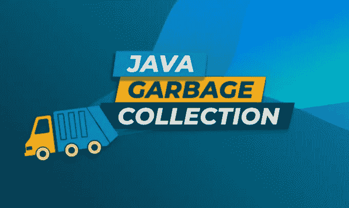
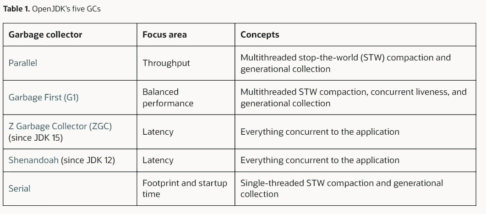

# 理解 Java 中的垃圾收集算法

> 原文：<https://medium.com/javarevisited/understanding-garbage-collection-algorithms-in-java-6d6e7ddf5272?source=collection_archive---------0----------------------->



**什么是垃圾收集器？**

垃圾收集器(GC)是 JVM 中管理应用程序堆的一个组件。它负责给对象分配内存，销毁它们为分配更多的对象腾出空间。

堆是所有线程共享的一块内存。在堆中，所有的类实例(对象)和数组都是分配的。最小和最大堆大小可以使用 *-Xms= < n >* 和 *-Xmx= < m >* 命令行选项来设置。

**垃圾收集(GC)算法的用例？**

可以找到多种垃圾收集算法。例如 JDK8 和先前使用的 ***并行 GC*** 算法，该算法通过完成尽可能多的工作来关注吞吐量，而不考虑延迟因素。JDK9+使用算法 ***垃圾优先(G1)*** 垃圾收集，试图平衡吞吐量和延迟。通过阅读本文，这些概念会变得更加清晰。耐心:)

不管怎样，继续前进；垃圾收集算法的最基本目的是:

1.  应该能够尽快为任何新的请求/操作提供内存空间
2.  应该能够通过销毁不需要的对象来清除内存。这个过程应该很快。
3.  在步骤 2 之后，当空间再次可用时，GC 应该在需要时快速地将对象分配给空闲空间。

暂停时间是垃圾收集器停止应用程序以回收内存的持续时间。这个变量直接影响延迟，因此目标是限制最长的暂停时间。

GC 组件的实现各不相同，因为每个算法都针对一个特定的**性能指标**。

在编写 GC 时，三个主要的性能指标是:吞吐量、延迟和内存占用。

## GC 算法针对的性能指标

1.  **吞吐量**是在指定的时间单位内可以完成的工作量。在短时间内做更多工作的 GC 算法是优选的。
2.  **延迟**是完成一个请求所花费的时间。GC 算法将尝试尽可能少地暂停垃圾收集，以便请求不必等待垃圾收集，即 GC 算法不会让任何请求/操作等待，它将尝试尽可能快地完成操作
3.  **内存占用**是 GC 进程顺利执行所需的内存。如果 GC algo 占用了更多的内存，就意味着我们有更少的内存可以用于堆。

*这三个指标是相互关联的*:高吞吐量的收集器可能会显著影响延迟(但会最小化对应用程序的影响)，反之亦然。较低的内存消耗可能需要使用在其他指标上不太理想的算法。作为应用程序执行的一部分，较低延迟的收集器可以并发地或以较小的步骤完成更多的工作，从而占用更多的处理器资源。

试图在一个或多个指标上提高 GC 通常会损害其他指标。很明显，对吧？这就是为什么我们有针对不同性能因素的不同算法。

OpenJDK 提供了五种侧重于不同性能指标的 GC 算法:



[https://blogs . Oracle . com/Java magazine/post/Java-garbage-collectors-evolution](https://blogs.oracle.com/javamagazine/post/java-garbage-collectors-evolution)

我们将主要关注上面列表中的两个主要算法:并行(Java8 和之前版本使用)和垃圾优先(Java9+使用)。

## 垃圾优先垃圾收集

G1 GC 是 Java9 及更高版本中使用的默认算法。G1 同样关注吞吐量和延迟。
*停止世界概念-* 基本上就是暂停应用一段时间，让垃圾收集可以工作。该算法使用 Stop the World(STW)暂停，但使暂停更短，从而可以减少延迟，即请求/操作不必等待更长时间才能完成。
缩短暂停时间意味着 GC 算法只在非常短的时间内工作，这样应用程序就可以平稳运行，最终用户不会注意到这些暂停。

G1 与应用程序并行执行这项冗长的工作，也就是说，当应用程序使用多线程运行时。这显著减少了最大暂停时间，但代价是总吞吐量有所下降。

这个 G1 算法是稳定的、非常成熟的，并且一直在用更新的思想进行升级。你可以在这个算法中请求停止世界的暂停不超过 x 毫秒。G1 的一个关键设计目标是使垃圾收集引起的停顿的持续时间和分布是可预测和可配置的。分代垃圾收集在切换 b/w 这一角色的两个性能指标(吞吐量和延迟)方面起着关键作用。G1 所做的是，它将堆内存分成两部分 **1。年轻一代 2。老一代。**分配给老一代的内存空间比年轻一代多得多。活动时间较长的对象会从年轻代移动到老代，即当一个对象经历了一定数量的 GC 后，收集器会将其移动到老代。较新的对象最初被分配给年轻的内存。这意味着年轻一代拥有临时或短命对象的概率更高。有道理？因为长期以来一直处于活动状态的所有对象都将驻留在旧的内存位置。因此，每当 G1 垃圾收集运行时，检查年轻一代内存是合乎逻辑的。这样我们就可以从年轻的内存中释放出空间，并且这个空间可以分配给新的请求&操作。

然而，老一代的记忆最终会被填满。为了解决这个问题，G1 垃圾收集算法使用分代垃圾收集，这意味着它检查整个年轻一代的垃圾收集内存，但对老一代内存使用增量方法。因为旧的分代内存会包含更多的活动对象(当前正被应用程序使用),所以如果没有分代垃圾收集的概念，针对该内存的 GC 所花费的时间会相对较长。

## 分代垃圾收集是如何工作的？

G1 GC 跟踪旧的分代内存，并找出应用程序当前使用的所有活动对象(它使用表和不同的数据结构来获取此信息)。现在，由于 G1 GC 知道当前活动的活对象，所以旧代中要检查垃圾收集的内存范围减少了很多，因为具有活动对象的空间不能被清除或垃圾收集。

*首先收集垃圾最多的区域。首先检查年轻内存，然后检查除活动/活动对象内存之外的旧内存。因此得名:垃圾优先收集。*

这将最终减少延迟，因为垃圾收集的暂停时间非常短。实际的内存回收，如果一次完成，在大型应用程序堆上会非常耗时，就像在并行 GC 模型中一样。每当 G1 GC 运行时，随着时间的推移，在每个 GC 周期中，它都会处理完整的年轻内存，并处理一小部分老一代内存，从而随着时间的推移释放旧内存上的空间。因此，它通过在每个 GC 周期中处理更小的内存块来对旧内存采取增量方法。
分代垃圾收集很复杂，因为活动/活对象使用数据结构进行跟踪。这些会占用额外的空间来跟踪活动对象。然而，GC 的一个关键性能指标(即延迟)大幅降低，因为垃圾收集的暂停时间非常短。

从 JDK 9 开始，G1 自动确定一个最佳点，在这个点开始老代跟踪。在 Java9 之前，这个时间是由用户手动选择的，这是一件复杂的事情，因为选择时间太晚或太早都会导致性能问题。G1 GC 还优先检查较大的对象，因为如果它被清除，我们就有更多的空闲空间可以分配。

从 Jdk8 到 Jdk18，**内存占用也有了巨大的改进。**内存占用是指 GC 算法在堆内存之外为顺利工作而占用的额外空间量。对于 G1 GC 算法，Jdk8 需要的空间量是 5.8Gb，现在在 Java18 中需要的空间量是 1.25GB

G1 最适合具有非常严格的暂停时间目标和适度的总吞吐量的应用程序，比如交易平台或交互式图形程序等实时应用程序。

## 并行 GC

并行 GC 是 JDK 8 和更早版本的默认收集器。它试图以更紧凑的形式将对象从堆中的一个位置复制到另一个位置，以便我们可以在内存中有更多的空间。有一个概念叫做停止世界(STW)停顿。当有新的请求等待时，会触发 STW 暂停，并且因为堆没有任何空间，所以没有内存可以分配。在这种情况下，JVM 将完全停止应用程序，并专注于使用所有专用于 GC 的线程和进程来运行 GC 算法。一旦堆中的空间被清空，JVM 就把空间分配给请求对象，最后继续执行应用程序。该算法关注吞吐量，试图在一个时间单位内完成更多工作，而对延迟(暂停)的关注最少。它使用多线程来完成工作，通常需要较长的暂停时间，因为它关注的是吞吐量。每一次暂停都更长，并且在这些更长的暂停期间收集垃圾。因此延迟会受到影响，因为应用程序请求必须在这些暂停期间等待。

通过对 JVM 使用以下命令或在 JVM 启动脚本中使用并行 GC，可以选择它作为默认 GC 算法:

```
java -XX:+UseParallelGC com.mypackages.MyExecutableClass
java -XX:+UseParallelOldGC com.mypackages.MyExecutableClass
java -XX:+UseParallelGC -XX:+UseParallelOldGC com.mypackages.MyExecutableClass
```

**ZGC 和谢南多厄的 GC**更喜欢通过补偿吞吐量来实现延迟目标。它们试图在没有明显停顿的情况下完成所有垃圾收集工作。这些分别在 JDK 15 号和 JDK 12 号上作为非实验版本首次推出。

**串行 GC** 顾名思义就是串行的，也就是说它只用一个线程来完成 STW(停止世界)的工作。它不能利用多处理器硬件。这种 GC 算法可以用于小型、短期运行的应用程序，因为它的方法简单，没有复杂性规则。这个算法被 Java5 & Java6 使用过。

## 参考资料:

<https://blogs.oracle.com/javamagazine/post/java-garbage-collectors-evolution>  <https://plumbr.io/handbook/garbage-collection-algorithms-implementations>  <https://stackoverflow.com/questions/9299339/garbage-collection-changing-collector-algorithm>  

## 结论:

希望本文对解释垃圾收集机制和算法有所帮助。请随时在 vivek.sinless@gmail.com 或在 [LinkedIn](https://www.linkedin.com/in/vivek-singh-a109b511a/) 联系我。