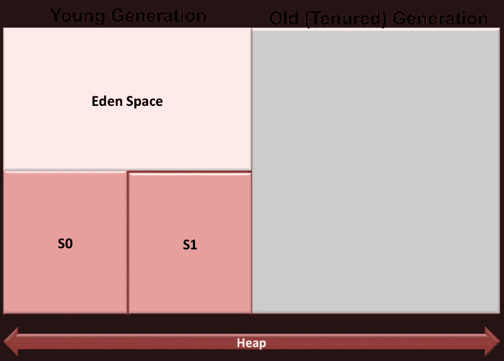
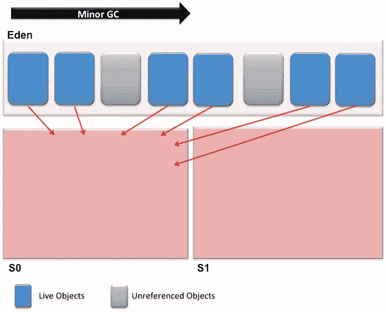
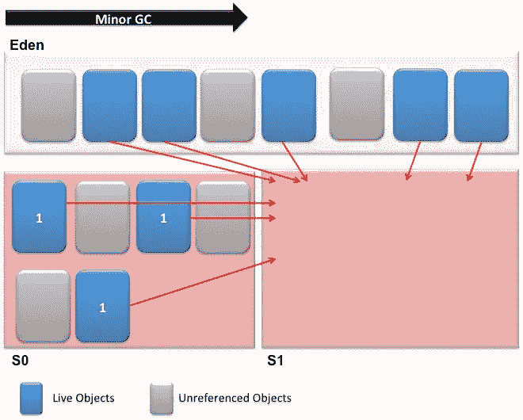
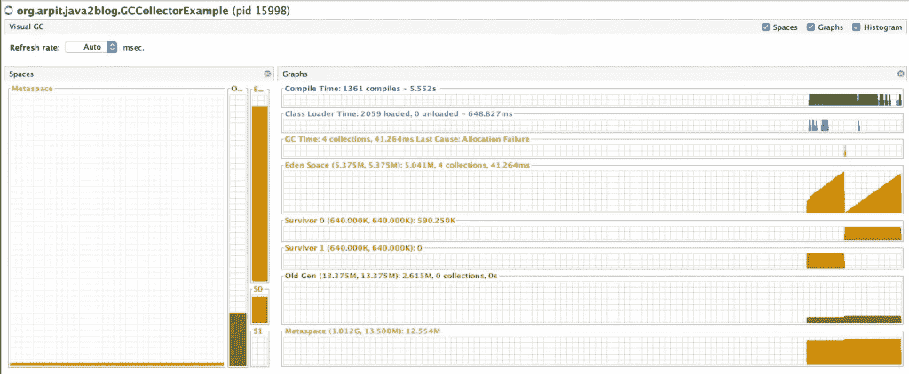
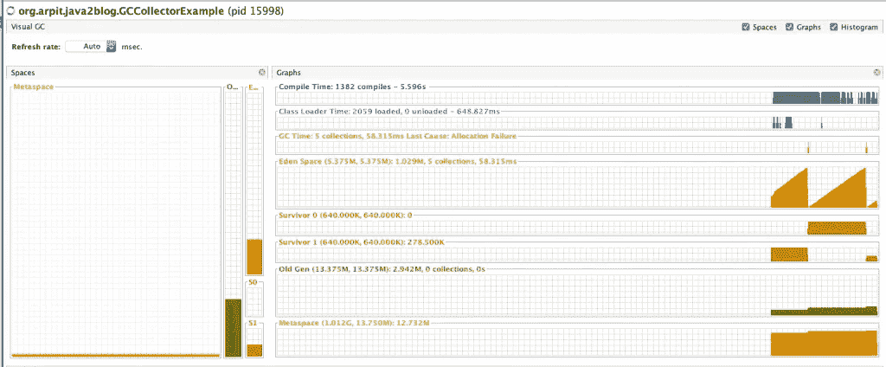
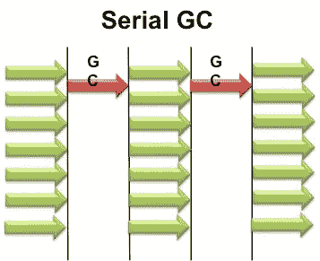
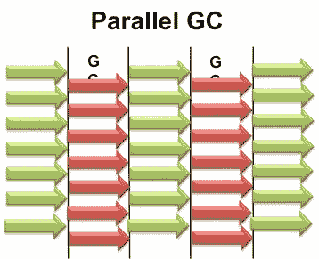
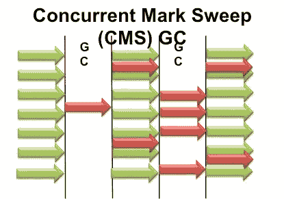

# 理解 java 中的垃圾收集— Java2Blog

> 原文：<https://medium.com/javarevisited/understanding-garbage-collection-in-java-java2blog-639bceaa4426?source=collection_archive---------0----------------------->

在这篇文章中，我们将会看到在 [java](https://java2blog.com/core-java-tutorial-for-beginners-experienced/) 中的垃圾收集。

我将尝试借助图表和例子而不是理论来解释。

[JVM](https://java2blog.com/java-virtual-machine-architecture/) 内存分为三部分

*   年轻一代
*   老一代
*   元空间(Perm Gen)

# 年轻一代

顾名思义，年轻一代是分配新创建的[对象](https://java2blog.com/object-class-java/)的区域。

*   当年轻一代填满时，会导致较小垃圾收集，也称为较小的 GC。
*   当小 Gcs 发生时，死亡对象将从年轻一代中移除。
*   如果年轻一代中有很多死对象，那么小规模的 GC 会执行得更快。
*   所有次要 GC 都是“停止世界”事件，因此当次要 GC 发生时，应用程序线程也会停止。

让我们更多地了解对象在年轻一代中是如何分配的。

年轻一代分为三部分。

这是年轻一代和年老一代的一个例子。

*   所有新创建的对象都在 eden 空间中分配。
*   当伊甸园空间完全被对象填满时，就会发生小规模的 GC。所有未死亡或未被引用的对象将被移动到一个幸存者空间。在我们的例子中，假设所有的物体都被移动到 S0。

让我们试着借助例子来演示这种行为:
你有下面的类，在这个类中我创建了短命的对象来进行演示。

当你运行程序时。让我们在 Visual GC(一个 visualVM 插件)中检查内存分配

如您所见，S0 中的对象很少，一旦 eden 空间完全填满，所有引用的对象都将被转移到 S1。

# 老一代

*   它被用来保存古老的长期保存的物品
*   一般比年轻一代大。
*   当占有空间被对象完全填满(或达到预定义的阈值)时，就会发生大规模 GC。它将回收内存并释放空间。
*   通常，主要 GC 比次要 GC 速度更慢，频率更低。

你如何利用这些信息来优化记忆？
这取决于应用的性质。
如果你有很多临时对象，那么就会有很多小的 gc。您可以提供参数 XX:NewRatio=1，将 50%分配给年轻一代，50%分配给年老一代。
默认情况下，NewRatio=2，因此年轻代是总堆的 1/3。
类似地，如果您有太多的长寿命对象，那么您可能需要通过设置较高的 NewRatio 值来增加使用权空间的大小。

# 为什么有两个幸存者空间？

你一定想知道为什么我们有两个幸存者空间。我们有两个幸存者空间，以避免内存碎片。每次你从伊甸园复制对象到幸存者，你得到一个空的伊甸园空间和一个空的幸存者空间。

# 垃圾收集算法

JVM 为年轻一代和老一代提供了几种算法。有 3 种算法

# 串行收集器

它使用一个[单线程](https://dzone.com/articles/top-5-courses-to-learn-java-concurrency-in-2019)来执行所有的垃圾收集，适用于单处理器机器的基本应用程序。

# 平行收集器

它使用多个 CPU 来执行垃圾收集器。串行收集器使用一个线程来执行垃圾收集，而并行垃圾收集使用几个[线程](https://javarevisited.blogspot.com/2014/07/top-50-java-multithreading-interview-questions-answers.html)来执行垃圾收集，这在有足够的内存和足够数量的内核时非常有用。

# 并发收集器

并发收集器使用应用程序线程执行[垃圾收集](https://javarevisited.blogspot.com/2011/04/garbage-collection-in-java.html#axzz4zt6jlTWS)。这对于具有中型到大型数据集并需要快速响应时间的应用程序非常有用。

你可以对年轻一代和老一代使用不同的 GC 算法，但是你只能配对兼容的算法。

**例如，**您不能将年轻代的并行清除与旧代的并行标记清除配对，因为并行清除不提供 CMS 中所需的同步。

在 Java 8 之后，垃圾收集器有了很多变化，我会在下一篇文章中介绍它们。

如果你对这篇文章有什么建议，请评论。

## 您可能还喜欢:

*   [学习垃圾收集的书籍](https://www.java67.com/2019/08/best-books-to-learn-java-virtual-machine-in-depth.html)
*   [学习 JVM 内部的课程](https://javarevisited.blogspot.com/2019/04/top-5-courses-to-learn-jvm-internals.html)
*   [Java 多线程面试问题](https://java2blog.com/java-multithreading-interview-questions-and-answers/)。
*   [Java 面试问题](https://java2blog.com/java-interview-questions/)
*   [5 年经验 Java 面试问题](https://java2blog.com/java-interview-questions-for-5-years-experience/)
*   [Java 集合面试问题](https://java2blog.com/java-collections-interview-questions/)
*   [Java 线程示例](https://java2blog.com/java-thread-example/)
*   [字符串编码面试问题](https://hackernoon.com/20-string-coding-interview-questions-for-programmers-6b6735b6d31c)

</javarevisited/top-5-java-online-courses-for-beginners-best-of-lot-1e1e240a758> 