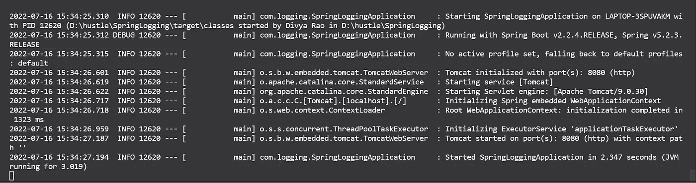
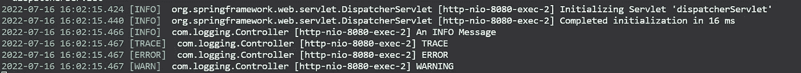
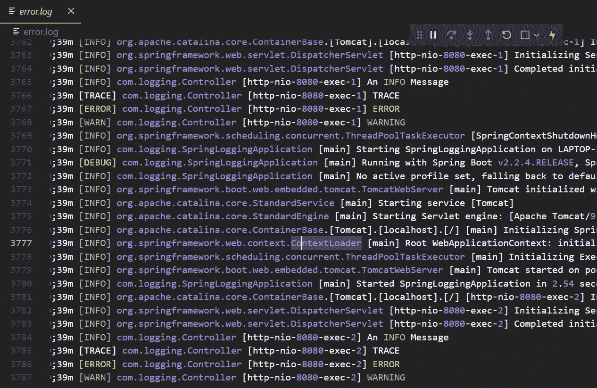

# 了解 Spring Boot 的伐木业

> 原文：<https://medium.com/javarevisited/understanding-logging-in-spring-boot-ac0fd79177b4?source=collection_archive---------0----------------------->

Spring Boot SLF4J、记录器、日志级别和格式化日志简介

[](https://javarevisited.blogspot.com/2022/07/free-courses-to-learn-spring-framework.html)

作为一名软件开发人员，你会花大部分时间调试你的代码吗？浏览了整个代码库，仍然不能找出你的代码哪里出错了？这就是伐木业的用武之地！

日志记录是跟踪一段代码运行后发生的所有事件的过程。这是软件开发的一个非常重要的方面，因为它有助于跟踪代码崩溃的确切位置，从而简化调试。

让我们来了解一下[在春开机](https://www.java67.com/2021/10/how-to-set-logging-level-in-spring-boot-.html)中是如何进行日志记录的！

为了让程序员更容易记录日志，Java 提供了各种日志框架，如:[、log4J](https://javarevisited.blogspot.com/2021/12/what-is-log4j-2-issue-how-to-solve-log.html) 、java.util.logging (JUL)、tiny log、logback 等。

日志框架可用于执行所有任务，如设置日志文件目的地、定制日志消息等。

Spring Boot 内置了 SLF4J，这是所有这些日志框架的抽象。 [SLF4J](https://javarevisited.blogspot.com/2013/08/why-use-sl4j-over-log4j-for-logging-in.html) 代表 Java 的简单日志外观。它允许用户使用任何具有单一依赖关系的日志框架。

每个日志框架都有三个元素。

1.  记录器—捕获消息
2.  格式化程序—格式化记录器捕获的消息
3.  处理程序—通过将消息打印在控制台上、存储在文件中、发送电子邮件等方式来分发消息。

让我们一步一步地了解这些元素。

## 记录器

为了生成记录器，我们使用 org.slf4j 的 LoggerFactory 类，Logger 接口是 slf4j API 的入口点。getLogger 是 Logger 工厂类的一个方法，它将一个字符串值作为名称，并提供指定名称的 Logger 对象。

```
*Logger* logger = LoggerFactory.getLogger(Controller.class);
```

记录器具有为各种日志级别打印日志消息的方法

示例:

```
logger.info("INFO MESSAGE")
```

# 什么是日志级别:

记录的消息可以具有不同的安全级别。 [Spring Boot](/javarevisited/10-advanced-spring-boot-courses-for-experienced-java-developers-5e57606816bd) 支持五种日志级别，分别是

1.  错误—运行时错误
2.  调试—关于系统流程的信息
3.  跟踪—关于系统流程的更详细信息
4.  警告—警告由于使用不推荐使用的 API 而导致的错误。
5.  信息—运行时发生的事件

让我们编写一些代码来创建一个日志记录器。用 spring web 依赖的 Spring 初始化器初始化一个 Spring 项目，并创建一个基本的 [rest 控制器](/javarevisited/top-10-rest-interview-questions-for-java-and-spring-developers-1611e3b78029)

Controller.java

默认情况下，[日志级别在 Spring Boot](https://www.java67.com/2021/10/how-to-set-logging-level-in-spring-boot-.html) 中设置为 INFO。我们可以根据我们在 applications.properties 文件中的要求设置日志级别

设置日志级别配置的格式是`logging.level.[classpath] = [level]`。

```
logging.level.com.logging = TRACE
```

我们还可以为不同的类设置不同的日志级别。

```
logging.level.root=INFO 
logging.level.com.logging =DEBUG
```

在这个配置中，除了日志类路径之外的每个类都将它们的日志级别设置为`INFO`

根据上面的讨论，这应该是我们更新的代码:

应用程序.属性

这样，我们可以在控制台中实现日志。

[](https://javarevisited.blogspot.com/2022/05/50-free-spring-professional-certification-questions.html)

控制台输出

# 日志格式

让我们分解日志消息并理解每个术语的含义，

*   2022–07–16 13:16:51.810-日期和时间
*   信息—日志级别
*   12620 —流程 ID
*   [nio-8080-exec-1] —线程名称
*   com.logging.Controller —记录器名称
*   正在初始化 Spring embedded WebApplicationContext—日志消息

**格式化程序**

通过设置颜色、消息格式等，可以根据我们的要求对日志消息进行格式化和定制。

# 控制台日志输出

为了定制[控制台](https://javarevisited.blogspot.com/2012/10/java-program-to-get-input-from-user.html)中的消息，我们可以在 application.properties 文件中添加几行代码

要启用颜色，

```
spring.output.ansi.enabled=always
```

要自定义消息，

```
logging.pattern.console= %d [%level] %c{1.} [%t] %m%n
```

在哪里，

%d —日期

% level —日志级别

% c-类路径

%t —线程正在执行

%m —消息

%n —新行

我们可以通过书写颜色和日期格式来添加更多的定制，

```
logging.pattern.console=%clr(%d{yyyy-MM-dd HH:mm:ss.SSS}){green} %clr([%level]){magenta}  %c{1.} [%t] %m%n
```

在哪里，

%clr —颜色

我们得到定制的输出，我们的控制台看起来像这样，

[](https://javarevisited.blogspot.com/2012/10/java-program-to-get-input-from-user.html)

控制台日志输出

**处理器**

我们可以通过在如上所示的控制台中显示日志消息来分派日志，也可以将日志消息存储在一个文件中。

# 文件日志输出:

我们可以在 application.properties 文件中设置文件路径和模式。

```
logging.file.name = error.loglogging.pattern.file= %clr(%d{yyyy-MM-dd HH:mm:ss.SSS}){green} [%level] %c{1.} [%t] %m%n
```

日志存储在“error.log”文件中(如果存在),否则会创建一个新文件。

[](https://javarevisited.blogspot.com/2017/04/log4j-tips-use-mdc-or-mapped-dignostic-context-to-log-per-client-or-request.html)

错误日志

日志一直存储在文件中，并在每次执行代码时自我更新。

# 摘要

*   每个日志框架都有三个元素— [Logger](https://javarevisited.blogspot.com/2013/12/how-to-configure-log4j-in-java-program.html) ，formatter，Handler
*   使用 logger 方法，我们可以记录 Spring Boot 支持的所有五个日志级别的消息——错误、调试、跟踪、信息、警告
*   使用 Logger 工厂类，我们可以生成 Logger 并在控制台上打印它们，或者根据我们的要求将它们保存在带有格式的文件中。

代码:[dsrao 711/loggininspringboot:了解 SpringBoot 中的日志记录(github.com)](https://github.com/dsrao711/LogginginSpringBoot)

在 LinkedIn 上联系我: [Divya Rao | LinkedIn](https://www.linkedin.com/in/divya-rao-739a8b143/)