# 理解 Maven

> 原文：<https://medium.com/javarevisited/understanding-maven-7df0ae4ada7b?source=collection_archive---------3----------------------->

如果你是一名 Java 开发人员，你在生活中最常听到的词之一就是 Maven。那么 Maven 是什么，它做什么？因此，在本文中，我们将介绍一些关于 Maven 的最重要的概念，以及如何将它用于自动化。

## 什么是阿帕奇 Maven？

如[https://maven.apache.org/](https://maven.apache.org/)中所示，

> Apache Maven 是一个软件项目管理和理解工具。基于项目对象模型(POM)的概念，Maven 可以从一条中心信息中管理项目的构建、报告和文档。

更全面地看 Apache Maven，

*   这是一个带有项目对象模型的**项目管理工具**。
*   它有一套**标准**。
*   它有一个**项目生命周期**。
*   一个**依赖管理系统**。
*   在不同的生命周期阶段，**执行插件目标**的逻辑。

有了上面提到的特性，Maven 可以给出一个使用最佳实践的简单项目设置，有了 Maven，我们的项目可以遵循一个独立于 ide 的**一致的结构**。此外，Maven 最重要的用途之一是它简化了项目依赖关系的声明。

关注最后一点，当您构建一个传统的 Java 应用程序时，您通过直接下载它们并将它们包含在项目结构中来包含依赖项。如果你已经这样做了，你就会知道这是一项多么费力的工作。此外，要下载这些依赖项，您必须跟踪它们的版本，以便您的项目能够正常工作。但这正是 Maven 来帮忙的地方。它帮助你**跟踪你的依赖项和它们各自的版本**，并在构建项目需要它们的时候下载它们。

这个过程由 Maven 使用一个名为 *pom.xml* 的独立文件来完成。通过这样做，Maven 极大地简化了项目依赖性管理。

## 下载 Apache Maven

要使用 Maven，请前往[https://maven.apache.org/](https://maven.apache.org/)并点击*下载*链接。你可以点击侧面板的*下载*或者内容区的*下载、安装、运行 Maven* 。

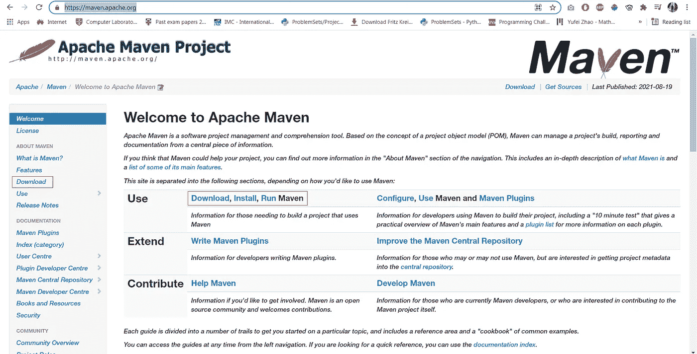

https://maven.apache.org 主页

当您单击该链接时，您将被定向到下载页面，在这里您将看到 Maven 的系统需求(总是尝试下载 Maven 的最新版本)。这里最重要的需求是 JDK 版本。现在 Maven 的最新版本是 3.8.2，而 JDK 版本需要的是 JDK 1.7。

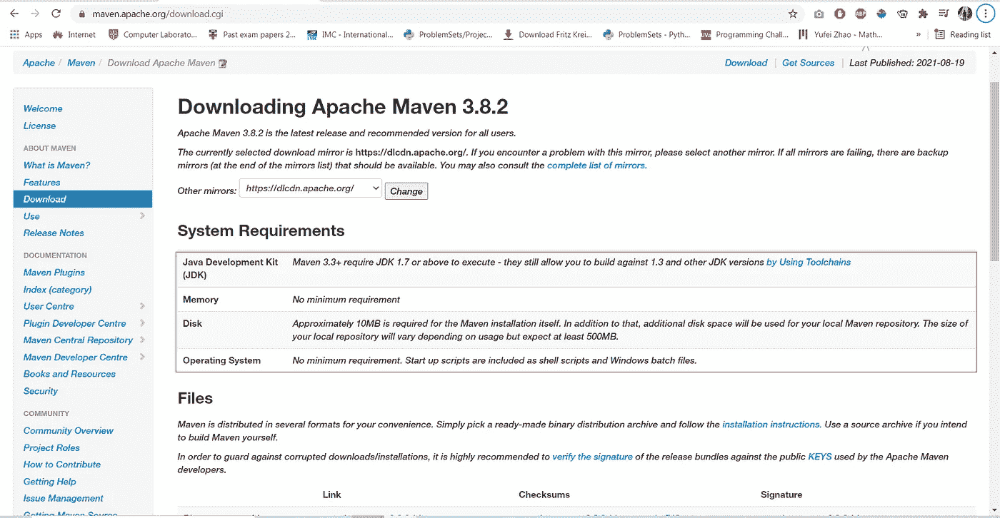

下载页面

当你向下滚动时，你会看到*安装说明*和可下载的文件。这里，我们将选择***Apache-maven-3 . 8 . 2-bin . zip***文件，稍后将查看*安装说明*。

下载 apache-maven-3.8.2-bin.zip

现在转到*安装说明*页面。在那里，您可以看到如何在本地机器上安装 Apache Maven 的说明。

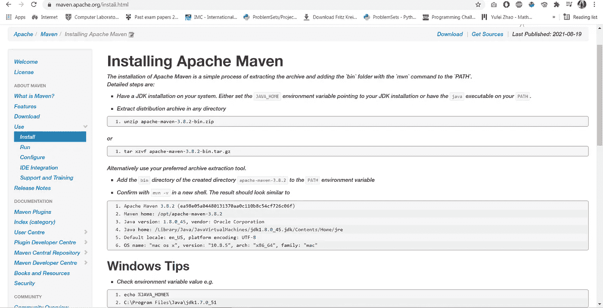

安装说明页面

按照说明，首先，解压缩下载的 zip 文件。解压缩文件后，您将拥有一个目录 **apache-maven-3.8.2** 。那个文件夹的内容是这样的。

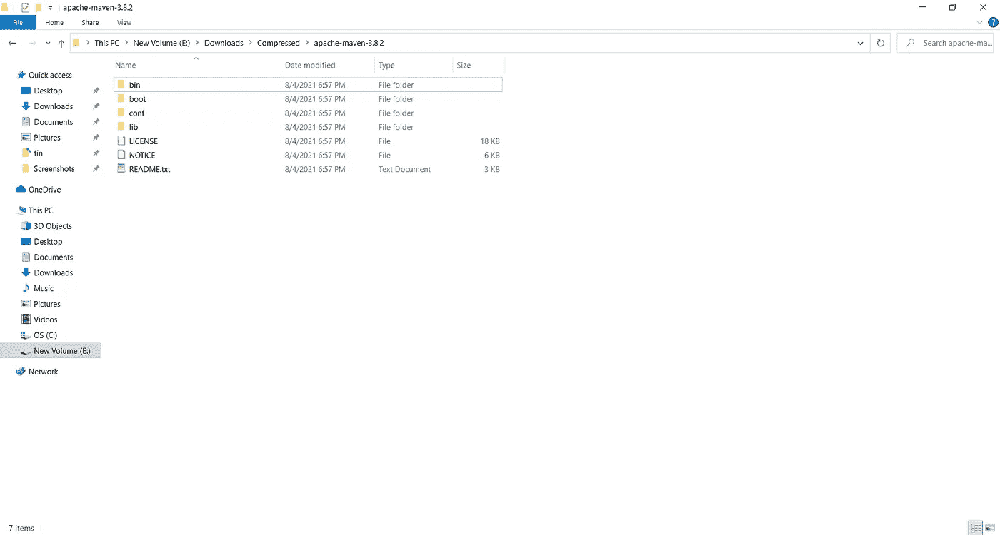

apache-maven-3.8.2 目录

在这里，我们将看看如何在 windows 机器上安装它。对于 Linux 机器用户，您可以遵循以下指南(步骤 3 和 4)。

> [https://docs . WSO 2 . com/display/is 400/Installing+Apache+Maven+on+Linux](https://docs.wso2.com/display/IS400/Installing+Apache+Maven+on+Linux)

对于 windows 用户，复制 apache-maven-3.8.2 文件夹，粘贴在 **C:\Program Files** 。然后在任务栏的 windows search 中输入*环境变量*，打开*编辑系统环境变量*。

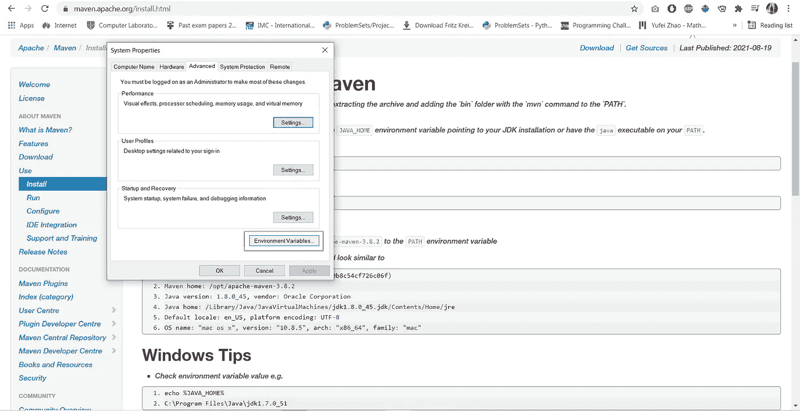

编辑环境变量

然后点击*环境变量*，在 ***系统变量*** 中点击**新建**。对于变量名，给出 **MAVEN_HOME，**，对于值，给出**C:\ Program Files \ Apache-MAVEN-3 . 8 . 2**。

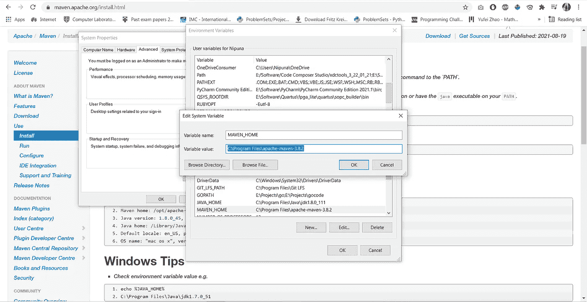

设置 MAVEN_HOME

然后在 ***系统变量*** 中选择**路径**变量，点击**编辑。**然后点击弹出菜单上的**新建**并输入 **%MAVEN_HOME%\bin。**然后按**确定。**

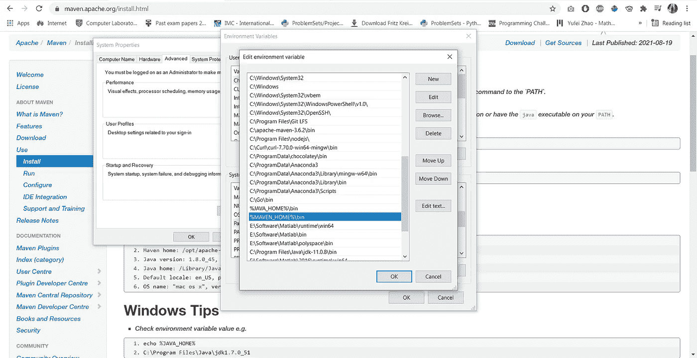

将 Maven 添加到路径中

然后您可以打开命令行并键入`mvn -v`来检查 Maven 是否被添加到您的路径中。

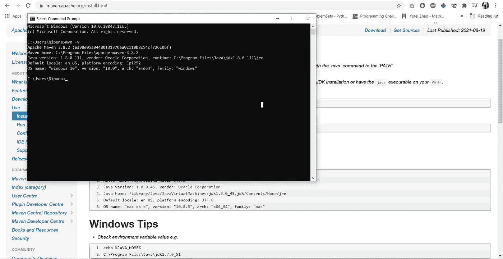

mvn -v 命令

我已经安装了 Java，并将其添加到路径中。您可以安装 Oracle JDK 或打开 JDK for Java，并通过定义一个新变量 **JAVA_HOME** 在 path 变量中设置它，如我们之前所讨论的。您可以通过在命令行中键入`echo %JAVA_HOME%`和`echo %MAVEN_HOME%`来检查变量是否工作。

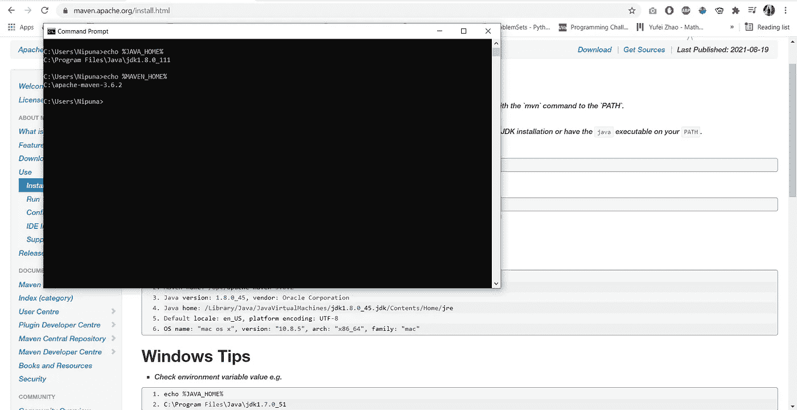

JAVA_HOME 和 MAVEN_HOME

## 了解 Maven — POM

如上所述，Maven 使用项目对象模型或 POM。根据 Github 的“Apache Maven 简介”，

> POM 代表项目对象模型。这个模型有一套标准，一个项目生命周期，一个依赖管理系统，以及一个在生命周期中定义的阶段执行插件目标的逻辑。

使用 Maven 创建 Java 项目时，可以看到以下特性。

*   项目是用默认行为设置的。
*   源代码必须在 src/main 文件夹中。
*   项目所需的资源在另一个文件夹中。
*   测试用例在一个特别命名的文件夹中。
*   目标文件夹用于最终的 JAR 文件。

让我们看一个项目结构，对 Maven 和 POM 文件有一个基本的了解。

## 了解 Maven —示例演示

为了获得关于 Maven 的基本概念，我们将使用 spring 初始化器创建一个简单的 Maven 项目。你可以使用 IntelliJ 这样的 IDE 或者使用 [start.spring.io](https://start.spring.io/) 网站。这里，我将使用 start.spring.io 网站，因为 Maven 是独立于 IDE 的。

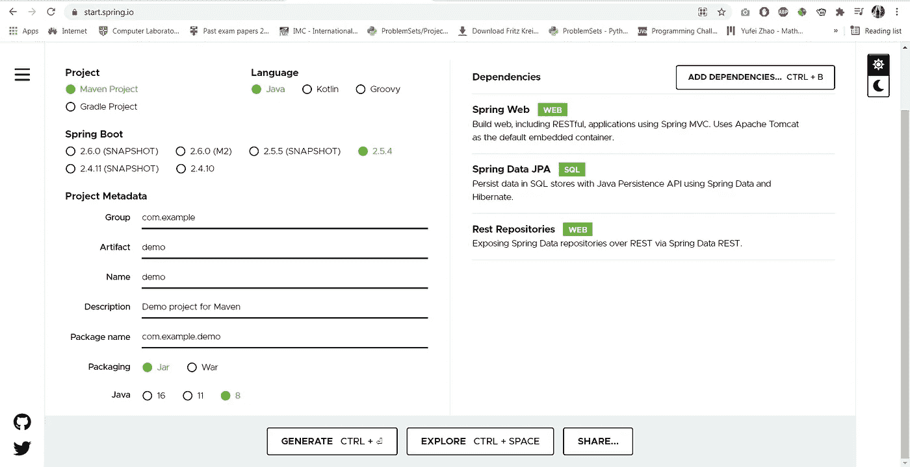

start.spring.io

在这里，您可以看到，对于工件名称，我们有“**演示”**，对于 Java 版本，我选择了 **Java 8。**对于依赖项，我添加了 **Spring Web、Spring Data JPA 和 Rest 存储库。**现在点击**生成**按钮，一个 zip 文件将被下载。提取 zip 文件，并使用您喜欢的 IDE 打开它。我将使用 IntelliJ 并使用 **pom.xml** 文件打开它。

这将需要几秒钟的同步，之后，你可以看到以下项目结构。

该项目在 IntelliJ 中打开

这里，在打开的 **pom.xml** 文件中，您可以看到您在 spring initializer 中的项目初始化期间指定的规范。

## 了解 Maven——Maven 生命周期

如果您打开名为 **Maven、**的侧菜单按钮，您可以看到 Maven 生命周期的各个阶段。Maven 生命周期有九个重要阶段。

*   clean —清除 Maven 通常构建项目的目标目录
*   验证-验证项目是否正确
*   编译—编译项目的源代码
*   测试—使用单元测试框架测试编译后的源代码
*   打包—打包编译后的代码
*   验证—运行任何检查以验证包是否有效
*   安装—将软件包安装到本地存储库中
*   部署—将最终包复制到远程存储库
*   集成测试(不在此项目中)—将包部署到可以运行集成测试的环境中

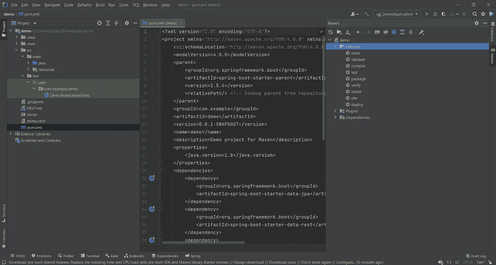

Maven 生命周期

由于插件目标可以附加到每个生命周期阶段，Maven 执行附加到每个阶段的目标。一个阶段可以有零个或多个目标。例如，如果您在 ide 中打开终端并键入`mvn install`，那么就会执行多个目标。现在，让我们跳过测试阶段，在我们的 ide 中运行 Maven。为此，打开终端并键入`mvn clean install -DskipTests`

mvn 全新安装-DskipTests

当你运行它时，你会发现在 **pom.xml** 文件中提到的所有依赖项都被下载到你的项目中，并且这个项目被捆绑到一个**文件中。jar** 文件(在**目标**文件夹中)。

您可以在**目标**文件夹以及 **.m2** 文件夹中找到捆绑文件。进入**C:\ Users \<USER _ NAME>\ . m2**可以进入 **.m2** 文件夹

## 了解 Maven——Maven 仓库

说到 Maven，有两个存储库，**Maven 中央存储库**，和本地存储库 **.m2** 。

查看 Maven 中央存储库，您可以使用[search.maven.org](https://search.maven.org/)访问该站点，它拥有您在 **pom.xml** 文件中提到的所有依赖项。

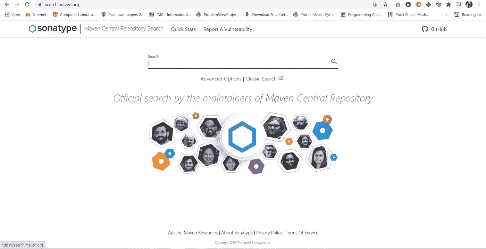

Maven 中央存储库

而 **.m2** 存储库是您本地机器中的本地存储库。因此，当您运行我们之前运行的`mvn clean install`命令时，本地机器连接到 **Maven Central** 并将您在 **pom.xml** 中提到的所有依赖项下载到您的本地 **.m2** 存储库。之后，这些依赖项被添加到项目的**外部库**文件夹中，从而解决了依赖项管理的问题。

## 了解 pom.xml

正如我们上面提到的， **pom.xml** 文件包含了一个项目的所有信息。即使您没有添加任何依赖项，您也可以创建 **pom.xml** 文件并在以后添加您的依赖项。您可以拥有的最简单的 **pom.xml** 文件如下所示。

`<groupId></groupId>`、`<artifactId></artifactId>`、`<version></version>`组成项目。因此，当您创建 Maven 项目时，它们是必不可少的。这些通常被称为**项目坐标。**

**pom.xml** 文件是一个 xml 文件(可扩展标记语言),其语法类似于 HTML。如果在一个 Maven 项目中有多个项目，所有这些项目都会自动扩展 super **POM** 。

当您向您的 **pom.xml** 文件添加依赖项时，您必须将它们添加到名为`<dependencies></dependencies>`的组中，下面显示了一个简单的例子。

当使用依赖关系时，你可以使用`<scope></scope>`标签来定义你希望依赖关系运行的范围。例如， **JUnit** 依赖项可以有`<scope>test</scope>`，因为它可以用于**测试**阶段。还有其他作用域，如**编译、提供、运行时**和**系统。**

*   编译-默认范围
*   提供——预计 JDK 何时提供
*   运行时—用于执行和测试，而不是编译
*   测试—测试时，正常运行期间不需要
*   system —类似于“provided ”,但是必须指定本地文件系统上 JAR 的显式路径

要更全面地了解示波器，请阅读下面的文章。

> [https://howtodoinjava.com/maven/maven-dependency-scopes/](https://howtodoinjava.com/maven/maven-dependency-scopes/)

现在，我们来看看 Maven 插件。插件是一个或多个目标的集合，目标是 Maven 中的一个工作单元。有许多核心插件，如 **JAR 插件、编译器插件、Surefire 插件等。此外，Maven 也允许用户创建自定义插件。要查看核心插件的完整列表，请访问[https://maven.apache.org/plugins/index.html](https://maven.apache.org/plugins/index.html)**

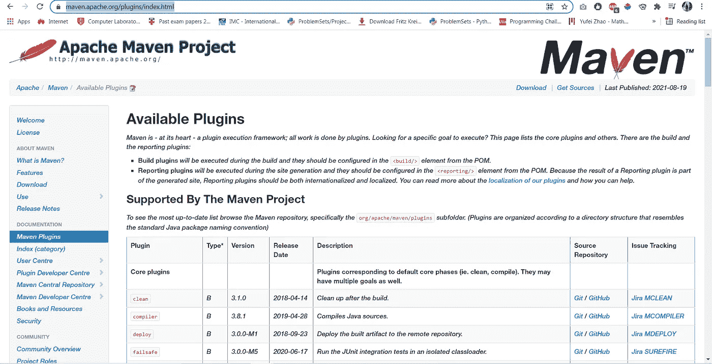

Maven 核心插件

例如，要使用编译器插件，你可以在这里输入`mvn compiler:compile`，`compile`是给定的目标。

mvn 编译器:编译

这些是你在使用 Maven 时应该知道的基本概念。当谈到使用 xml 编写 **pom.xml** 文件时，您总是可以按照文档来理解语法。

干杯！