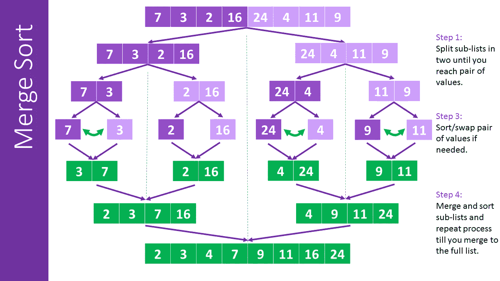
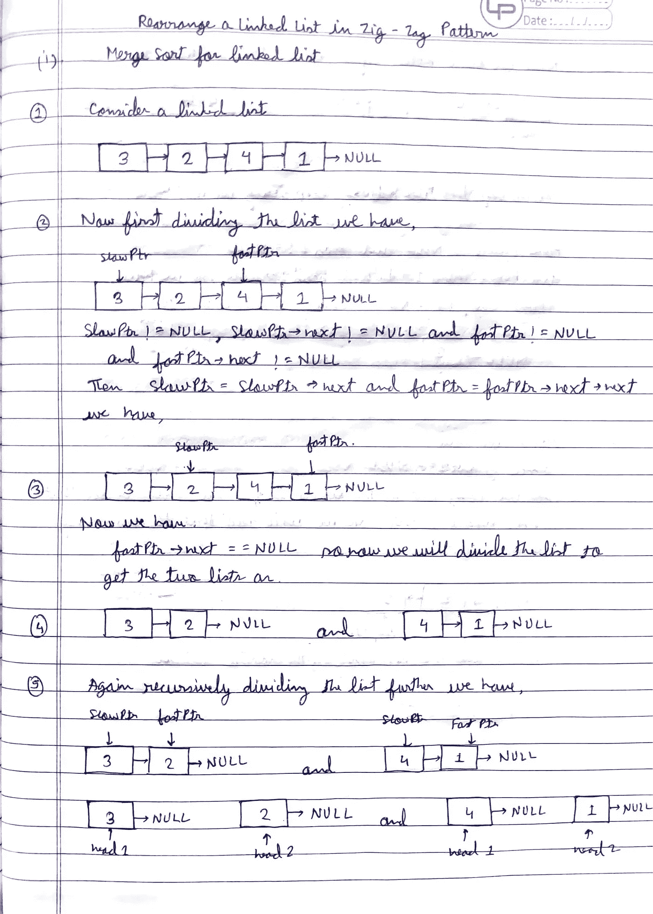
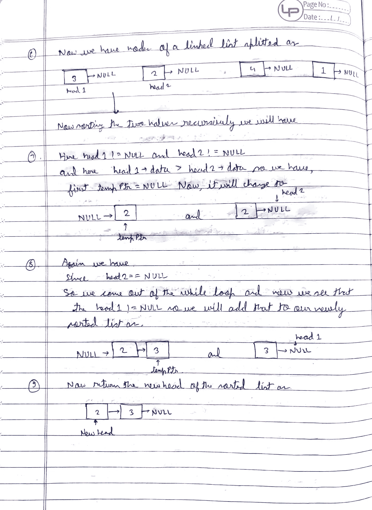
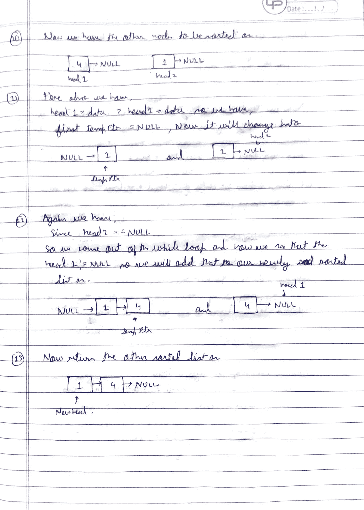
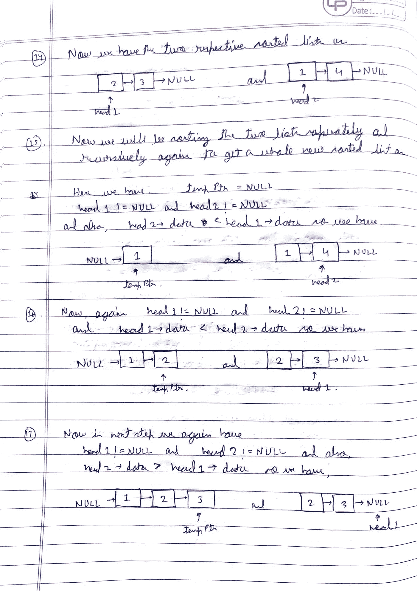
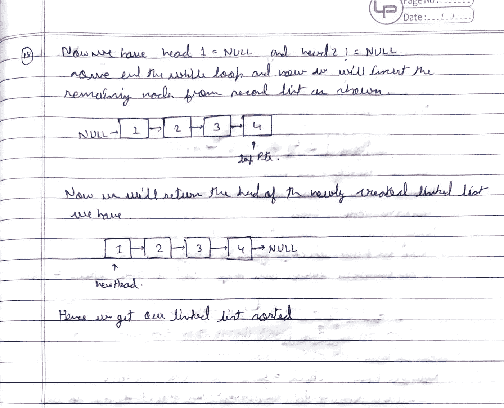

# 理解链表合并排序背后的算法

> 原文：<https://medium.com/javarevisited/understanding-the-algorithm-behind-merge-sort-for-linked-lists-79ef7f6f2f94?source=collection_archive---------2----------------------->


链表的合并排序

## 什么是合并排序？

**归并排序**是一种著名的优化排序算法，其工作原理是[分而治之](https://www.geeksforgeeks.org/divide-and-conquer-algorithm-introduction/)。又称为[分治](https://www.geeksforgeeks.org/divide-and-conquer-algorithm-introduction/)算法，时间复杂度**为 **O(n*logn)的**。**

## 它是如何工作的？

**合并排序**分两步进行:

*   将输入列表分成两个子列表，每个子列表具有相同的大小。
*   将两个子列表合并成一个大列表，列表中的每个元素都是有序/排序的。

现在，数组的 [**合并排序**的工作方式就很容易理解了，对于不知道**合并排序**如何工作的人可以参考这个](https://www.java67.com/2018/03/mergesort-in-java-algorithm-example-and.html)[链接](https://www.geeksforgeeks.org/merge-sort/)

[](https://www.java67.com/2018/03/mergesort-in-java-algorithm-example-and.html)

合并排序的图形表示

现在，继续讨论**合并排序**如何为[链表](/javarevisited/top-20-linked-list-coding-problems-from-technical-interviews-90b64d2df093)工作，我们将首先看一看**链表合并排序的简单方法**

## 方法:

```
Step1: Call divideList() and find the mid node of the given linked list and also divide the list into two halvesStep2: Recursively call sortMerge() on both left and right sub-linked list and store the new head of the left and right linked list.Step3: Call finalMerge() given the arguments new heads of left and right sub-linked lists and store the final head returned after merging.Step4: Return the final head of the sorted linked list.
```

在上面的段落中，我们已经讨论了**合并排序**是如何工作的，所以这里我们也以类似的方式首先[将链表分成两个子列表](https://javarevisited.blogspot.com/2017/03/how-to-reverse-linked-list-in-java-using-iteration-and-recursion.html)，然后递归排序这两个子列表，最后合并它们并返回最终列表。

讨论算法，它看起来像这样。

## 算法:

在第一步**中，如前所述，您必须将列表分成两个子列表，如以下算法所述:**

```
start fundtion divideList(headList){
    slowPointer = headList
    fastPointer = next of headList

    start while(slowPointer is not NULL and (fastPointer is not NULL and next of fastPointer is not NULL)){
          slowPointer = next of slowPointer
          fastPointer = next of next of fastPointer
    end while return slowPointerend divideList
```

上述将链表分成两半的算法俗称 [**龟兔算法**](https://javarevisited.blogspot.com/2013/05/find-if-linked-list-contains-loops-cycle-cyclic-circular-check.html#axzz5jI43Qiwi)

现在，在将列表分成两个子列表后，我们将基于实际的**合并排序**算法对两个子列表中的每一个进行排序，如下面的算法所解释的:

```
start function finalMerge(firstListHead, secondListHead) 
    firstHalf = new node
    secondHalf = new node

    firsthalf = secondHalf /* points to the head node later after sorting */ start while(firstListHead is not NULL && secondListHead is not NULL){
       start if(data of firstListHead node <= data of secondListHead node)
            next of secondHalf = firstListHead
            firstListHead = next of firstListHead
       end if
       start else next of secondHalf = secondListHead
             secondListHead = next of secondListHead
       end else
       secondHalf = next of secondHalf 
   end while /* If first list is not over */
   start while(firstListHead is not NULL){
       next of secondHalf = firstListHead
       firstListHead = next of firstListHead
   end while

   /* If second list is not over */
   start while(secondListHead is not NULL){
       next of secondHalf - secondListHead
       secondListHead = next of secondListHead
   end while return next of firstHalfend sortMerge
```

现在，在对列表进行排序后，我们将不得不最终获得完整排序列表的 head 引用，这个函数也将帮助我们使用 **divideList()** 函数获得对列表前半部分**和后半部分**的引用。[算法](https://javarevisited.blogspot.com/2019/04/top-20-searching-and-sorting-algorithms-interview-questions.html)看起来像这样:

```
start function sortMerge(headList){
   start if(next of headList is NULL)
        return headList
   end if

   midNode = new node
   secondHead = new node

   midNode = divideList(headList)
   secondHead = next of midNode
   next of midNode = NULL

   finalHead = finalMerge(sortMerge(midNode), sortMerge(secondHead)) return finalHeadend sortMerge
```

现在，最终，这解释了关于**合并排序**如何为链表工作以及列表如何通过**分治**方法排序的完整算法。

现在，既然你已经知道了问题背后的[算法](/javarevisited/20-algorithms-coding-problems-to-crack-you-next-technical-interviews-23191f229788)，那么你现在可以用你想要的编程语言编写你自己的功能性**代码**。

## 预演:

现在，以一个未排序的链表为例来考虑这个算法，并像我在这里所做的那样运行你的测试用例:



图:1.1



图 1.2



图 1.3



图:1.4



图:1.5

现在，你可以很容易地联想到列表是如何被一个接一个地排序的，这会让你更清楚这个算法是如何工作的！！

# 分析:

*   时间复杂度:`O(nlogn)`，其中 n 是链表中的节点数。
*   空间复杂度:`O(logn)`，其中 n 是链表中节点的个数。因为我们把列表分成两个子列表，所以我们给定的最终空间复杂度是`O(logn)`

**不断学习，不断成长，不断探索！**

**万事如意！**

更多有趣和信息丰富的文章和提示请关注我的 [**Medium**](https://swapnilkant11.medium.com/) **和**[**Linkedin**](https://www.linkedin.com/in/swapnil-kant-279a3b148/)