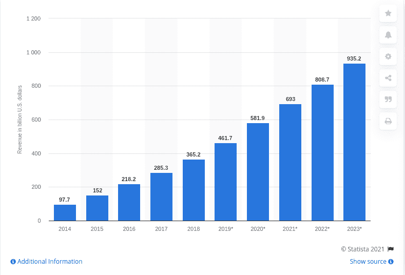
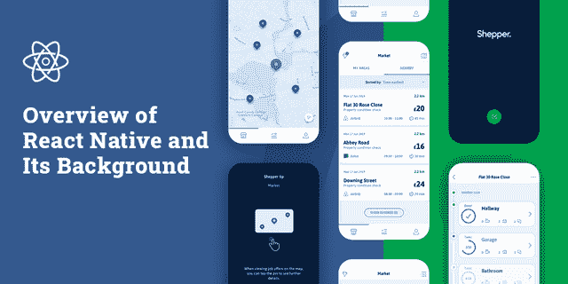
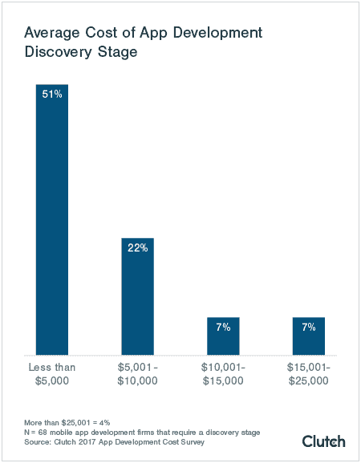
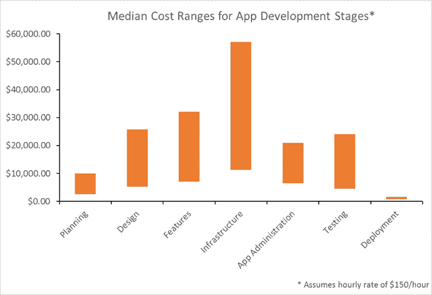

# 开发一个 React 原生 App 要多少钱？

> 原文：<https://medium.com/javarevisited/unlock-the-factors-affecting-react-native-app-development-cost-in-2021-96e9c010c8b?source=collection_archive---------1----------------------->

## **解开 2021 年 React 原生 App 开发成本的影响因素**

环顾四周，你会发现自己被非凡的技术空间所包围，这些技术正在为来自世界各地的企业带来越来越多的机会。无论是小型企业还是大型企业，技术都在主宰这个领域，并预计将在 2023 年将移动应用开发行业变成一个[9352 亿美元的市场](https://www.statista.com/statistics/269025/worldwide-mobile-app-revenue-forecast/)。

[图片来源](https://www.statista.com/statistics/269025/worldwide-mobile-app-revenue-forecast/)

这就是为什么几乎每个企业家都嚷嚷着要把他们的品牌带到移动设备上。但不确定的是，当企业进入新的移动应用市场时，他们可能会对应用开发的前期成本感到惊讶，这种成本通常从 38，000 美元到 171，000 美元不等，可以攀升到任何高价。

打住，我们没有吓到你！现实与这些成本估计相差甚远！让我们深入挖掘，找出方法？

*在这篇博客中，我们将帮助您了解为什么*[*REACT NATIVE*](/javarevisited/top-5-react-native-courses-for-mobile-application-developers-b82febdf8a46?source=---------112------------------)*成为跨平台应用程序移动应用程序开发行业的新宠，它将花费您多少钱，哪些因素可以帮助您决定应用程序开发的预算，以及选择 REACT NATIVE 用于业务应用程序的额外优势…*

> 听起来很有趣！让我们从基本的概述开始吧！

## 以下是该内容的一个重要亮点:

*   *React Native 及其背景概述*
*   *用 React Native 做一个 App 要多少钱？*
*   *React 原生应用开发成本计算器*
*   *为您的业务应用选择 React Native 的额外优势*
*   *结论:关键要点*

# **1。React Native 及其背景概述**

作者

随着市场上各种框架的出现，React Native 已经一枝独秀，成为 2020 年跨平台 app 开发的首选[框架。尽管它于 2015 年 3 月推出，但由于其灵活性以及鼓励企业开始使用 React 原生解决方案的灵活性和跨平台移动应用程序兼容性功能，它很快成为全球 42%的](/javarevisited/top-5-frameworks-to-create-cross-platform-android-and-ios-apps-in-2020-d02edf3d01f1)[开发人员](https://www.statista.com/statistics/869224/worldwide-software-developer-working-hours/)的选择。

> **土人到底是什么反应？**

React Native 是一个开源的移动应用开发框架，由脸书推出并提供支持。由于它为开发 [iOS](/javarevisited/top-5-online-courses-to-learn-ios-12-swift-in-2019-a35ae1be7b2b) 和 [Android](/hackernoon/top-5-courses-to-learn-android-for-java-programmers-667e03d995b4) 操作系统提供了广泛的小部件和工具选择，因此，开发者可以节省高达 40%到 90%的移动应用开发时间。有了这个框架的代码重用特性，它将帮助您节省成本、时间和开发资源。

由于 [React Native](/javarevisited/my-favorite-free-react-native-courses-for-beginners-in-2020-4629f5274eb6) 采用了现代但传统的应用程序开发方法的混合，并基于 [JavaScript](/javarevisited/10-best-online-courses-to-learn-javascript-in-2020-af5ed0801645) ，因此一些世界领先的品牌选择了这一框架作为他们的应用程序解决方案。除了脸书——Uber eats，Airbnb，Walmart，Instagram，Tesla 等都选择在 React Native 上开发应用，并利用数百万用户。

## **2。做一个 React 原生 App 要多少钱？**

无论你是一家初创公司，还是一直预算不足，但希望在多个操作平台上拥有一个应用程序的企业家，那么 React Native 是市场上可用的高性价比框架的完美选择之一。

然而，就像其他应用程序开发成本估计一样，很难揭示 React 原生应用程序开发的确切成本。应用程序开发成本很大程度上取决于应用程序的复杂性和业务需求。不过，在印度，React 本地应用开发的小时收费通常从每小时 15 美元到 25 美元以上不等。然而，同样，开发人员的每小时成本会随着技能、经验和地点的不同而不同。

在寻找具有成本效益的 React 本地解决方案时，印度相对来说提供了最好的和负担得起的服务。但是，这并不意味着你必须向质量妥协。由于印度拥有大量有才华的开发人员，因此，向 [**提供以有竞争力的价格雇佣应用程序开发人员**](https://www.xicom.biz/solutions/hire-developers/) ，使您能够以印度最低的价格开发应用程序。

> **专家提示:为了降低你的应用开发成本，分享或重用你的应用组件是值得的。要做到这一点，你可以使用一个** [**位**](https://bit.dev/) **，一个管理你的应用组件的完美工具。**

但是，主要的问题仍然没有答案:它实际上花了你多少钱？

与任何其他[应用开发](/javarevisited/my-favorite-free-courses-to-learn-ios-app-development-f172e7d3ba5d?source=---------79------------------)一样，React Native 应用的最终成本因各种因素而有很大差异。因此，让我们直接深入了解应用程序的成本驱动因素…

# **3。React 原生应用开发成本计算器**

当你开始寻找移动操作系统的外包软件开发时，你的最后决定总是以了解你的最终产品将花费你多少钱而告终？

如果你问任何一家应用程序开发公司关于 Android/iOS 应用程序开发解决方案的情况，他们中的许多人可能会向你保证开发一个低于 5000 美元到 7000 美元的应用程序。但这对你来说只不过是个陷阱！市场是巨大的，因此，产品的成本将取决于你雇佣的团队的选择、应用程序的复杂性、操作平台的选择、应用程序的设计等等。

任何一家知名而专业的 [**应用开发公司**](https://www.xicom.biz/offerings/mobile-app-development/) 总是不愿意马上回答你成本估算。即使是顶尖的软件开发公司也会给你不同的数字，从 10000 美元到 50000 美元+不等。

> 那么是什么造成了这些数字之间的巨大差距呢？让我们来了解一下导致财务状况巨大变化的因素:

*   应用程序开发流程
*   应用功能和复杂性
*   额外的应用程序加载项
*   设计的用户界面/UX
*   应用程序分发
*   应用开发团队:内部或外包应用开发人员
*   应用程序开发人员的团队规模和位置
*   应用维护和支持

> 让我们进入每一点的细节…

## **因素 1: App 开发流程**

当你开始一个应用程序开发项目时，你会发现各种预定义的方法来采用它。但老实说，那只在 90 年代有效。这不是任何应用程序开发公司在开发应用程序时可以跳过的。但事实是，你需要遵守构建应用程序的基本规则，并更好地掌握应用程序开发过程的细分，以了解应用程序开发的每个阶段是如何花费你的。

*   **发现、分析和战略规划:**这一步是评估业务应用创意、竞争分析、应用开发目标、确定目标受众和制定路线图。

根据离合器调查报告，51%的应用程序开发公司透露，应用程序开发发现阶段的平均成本将低于 5000 美元。

[图片来源](https://clutch.co/app-developers/resources/cost-build-mobile-app-survey)

*   **线框图和原型制作:**应用开发的这个阶段围绕着应用的线框图展开，这意味着用可点击的元素创建应用屏幕的粗略表示，以帮助理解你的应用到底会是什么样子。线框化可能需要 40 到 50 个小时来定义用户流和旅程创建，包括低保真草图和详细的视觉演示。
*   **应用程序的设计和开发:**这是应用程序的主要部分，所有的 UI 创建和实现都将在这里决定。从前端、后端到测试，它包含了开发的主要部分。应用程序开发的这一阶段占据了应用程序开发总成本的 50–70%。
*   **最终测试、发布和发布后维护:**许多专家认为，应用发布后支持是移动解决方案成本结构中最重要的组成部分。为了让你的应用程序在发布后仍能流畅运行，雇佣移动应用程序开发人员来进一步扩展功能并让它准备好大展拳脚是很重要的。

[图像来源](https://clutch.co/app-developers/resources/cost-build-mobile-app-survey-2015)

## **因素 2:应用功能和复杂性**

当需要估计 React 原生应用程序开发项目需要多长时间以及需要多少预算时，请记住，开发的成本和时间主要取决于应用程序的复杂性和功能。

应用程序中的功能列表可以很长，也可以相对较短。功能本身的数量是应用程序开发的主要成本驱动因素，这些功能的复杂性和新颖性会进一步增加开发成本。因此，根据功能集的不同，移动应用程序的开发可能需要大约一周到六个月的时间才能完成。

一个简单的 MVP 应用程序的预算较低，并且能够在较短的时间内完成。而具有现代特色的复杂项目可能需要很长时间才能完成，预算也会更高。因此，最终，app store 中的每个应用程序都被分为三个不同的类别，包括低复杂性、中等复杂性和高复杂性。

> 应用程序的复杂性还取决于六个因素，包括:

*   **部署架构模型:**说到后端开发，通常 app 开发公司有两个宽泛的选择——定制或 BaaS。在定制选项中，客户获得他们自己的架构，而 BaaS 必须使用现成的后端架构。
*   **第三方集成:**为了让你的应用程序对用户友好，集成第三方插件以使你的应用程序与其他应用程序的功能交互是很重要的。与原生应用开发流程相比，React 原生应用开发中第三方插件的集成有点复杂。
*   **内购:**你提供的内购选项越多，App 的复杂程度越高。
*   **管理面板开发:**你选择的管理面板功能越丰富，应用程序的复杂度就越高，从逻辑上来说也会影响成本。
*   **与遗留系统的集成:**应用程序的遗留集成取决于您尝试构建的应用程序的选择。它是否可以独立工作而不需要任何集成，或者您希望它与您的任何企业系统集成？默认情况下，应用程序类型属于中到高复杂性级别。

**专业提示:**为了避免在定制应用程序的特性和功能上耗尽您的大部分预算和时间，值得雇佣拥有在承诺的时间段内推出 react 原生应用程序的经验、技能和记录的 [**移动应用程序开发公司**](https://www.xicom.biz/offerings/mobile-app-development/) 。

## **因素 3:额外的应用加载项**

尽管 React Native 是一种允许您开发极具吸引力的应用程序的框架，但如果您试图构建一个以客户为中心的应用程序，那么您可以选择将您的应用程序与社交媒体渠道集成，或者为其提供附加组件。然而，应用程序的自定义附加组件会进一步增加预算成本，因此最终附加组件的集成完全取决于客户的选择和需求。

## **因素 App 的 UX/UI 设计**

你的应用程序的外观和对用户的作用会对它的成功和成本产生很大的影响。移动应用程序设计包括[用户界面](https://javarevisited.blogspot.com/2020/06/top-5-courses-to-learn-ux-design-in.html) (UI)和用户体验( [U](/javarevisited/top-5-free-courses-to-learn-web-design-in-2021-27beb817944f) X)，这实际上是让你的用户与应用程序保持更长时间的互动。此外，确保从一个屏幕到另一个屏幕平滑过渡的应用程序将确保高效的用户流和出色的用户体验。屏幕设计和用户体验很容易与应用程序开发成本联系起来。

> **Pro 提示:** React Native 为你提供了各种 UI 组件库，包括 NativeBase，React Native Element，Lottie Wrapper，Vector icons，React Native Maps，React Native Gifted Chat 等等。各种 UI 组件元素允许您设计漂亮的用户友好的应用程序，甚至不需要从头开始编写代码。

## **因素 App 的分发**

有许多分销渠道可以部署你的应用，每个渠道都有自己的定价。然而，随着谷歌 Play 商店和苹果应用商店分别拥有 31 亿和 37 亿的应用程序，这两个平台无疑已经成为当今商业领域的领军巨头。像 App store 和 Google Play 这样的商业商店可能会向你收取大约 100 美元的许可费。此外，应用程序开发人员必须从主机获得授权，以确保所有的开发标准和政策得到遵守。

使用 [Swift](/javarevisited/7-free-courses-to-learn-swift-programming-language-in-2020-f40ac9d3ee53?source=---------7------------------) 、 [Java](/javarevisited/top-5-java-online-courses-for-beginners-best-of-lot-1e1e240a758) 、Android 或 iOS 为每个平台原生构建一个应用程序，通常会花费大量时间来开发多个代码库。然而，使用 React Native，您可以轻松节省 25%到 50%的时间，因为您只需要创建一个代码库。

> **专业提示:**像 React Native 这样的跨平台应用程序开发框架可以削减高达 50%的应用程序开发成本和时间，并使您启动应用程序的速度比原生应用程序快 1.5 倍。

## **因素 6:应用程序开发团队:内部或外包应用程序开发人员**

在雇佣应用程序开发人员时，大体上你有两种选择:要么组建一个内部工程师团队，要么外包应用程序开发团队。外包开发团队的成本通常比开发内部团队的成本低，因为你不需要了解项目需要什么类型的工程师。此外，减少需要花费时间筛选每个配置文件，提供培训，承担电费，月薪等。

然而，借助外包 React 原生应用开发团队，您可以根据项目需求和复杂性从三种参与模式中进行选择，包括按小时、兼职或全职模式。

> **专业提示:**由于 React Native 已经成为应用开发的首选，并且基于 JavaScript，因此，企业可以有足够的选择来为他们的应用开发做出选择。

## **因素 App 开发团队的团队规模和位置**

在开发应用程序时，你需要一个由项目经理、后端开发人员、前端开发人员、应用测试人员和 [UX/UI 设计师](/javarevisited/7-free-online-courses-to-become-a-web-designer-and-frontend-developer-in-2020-dca73bc7fdc4)组成的工程师团队。但是每个开发人员的每小时成本根据地点和当地的生活成本有很大的不同。

尽管如此，根据调查报告，印度是 [**招聘应用程序开发人员**](https://www.xicom.biz/solutions/hire-developers/) 的热点，平均每小时费用为 15 美元至 25 美元+。

## **因素 8:应用维护和支持**

移动应用程序开发成本不会随着应用程序的最终部署而结束。为了使其顺利运行，许多应用程序开发公司为您提供应用程序维护和支持服务。定期更新和修复错误非常重要，因此，客户在估算成本时必须了解这一因素。要在现有应用中推出一些更新，你可以选择按小时雇佣移动应用开发者。

> **专业提示:**在 React 原生应用程序中维护和执行更新时，您需要雇佣更少的资源，因为您只需要维护一个代码库。

# **4。它如何帮助您节省移动应用程序开发成本？**

尽管 React Native 于 2015 年启动，但企业必须制定昂贵的预算来开发 Android 和 iOS 的两款原生应用。

为了将开发成本降至最低，脸书有意实施了一种新工具，主要致力于降低项目的开发成本。

脸书已经创建了与 JS 库集成的 React Native，该库是构建应用程序用户界面的核心。因此，无论您是 web 开发人员还是 React 原生应用程序开发人员，都可以无缝地利用这个广泛的库，并能够定制应用程序的外观和感觉，从而提供原生类型的用户体验。

第二，使用 React Native 最令人兴奋的部分是，任何移动应用程序开发公司都可以直接使用它，通过利用单个 JavaScript 代码库，为多个操作系统开发快速、高效和简单的应用程序。

> 此外，作为 JavaScript 框架，它允许移动应用程序开发人员为 iOS 和 Android 编写真正的本地嵌入式应用程序。以下是 React Native 的几个新增功能，这些功能使它几乎适用于任何类型的项目:

**JavaScript 作为编程语言:**有了 React Native，应用开发者不得不使用 [JavaScript](/javarevisited/12-free-courses-to-learn-javascript-and-es6-for-beginners-and-experienced-developers-aa35874c9a32) ，这已经是开发者中广泛使用且增长最快的编程语言之一。此外，90%的开发人员已经知道这种语言，所以他们可以跳过学习曲线。

**易于实现更新:**开发人员可以升级 React 原生应用程序，甚至无需下载应用程序，从而节省大量时间。

**跨平台和代码可重用性:** React 原生应用解决方案可以让你花费开发两个原生应用一半的成本。你所需要做的就是雇佣一家软件开发公司，该公司拥有获得这一特性最佳收益的所有技能，并且能够通过重用相同的代码库来开发多个应用程序。

**Hot Reload:** 它允许开发人员在项目开发中节省大量时间，因为他们可以在代码中进行即时更改并立即反映出来，而不必下载文件。

# **结论:关键要点**

如果你是一个企业家，想要开始使用移动应用程序，但预算不足，那么 React Native 可能是你的完美选择。从更快的开发到轻松的应用程序维护，从任何平台到强大的社区支持的移动应用程序的轻松迁移，React Native mobile**[**应用程序开发公司**](https://www.xicom.biz/offerings/mobile-app-development/) 可以确保您获得一切可以帮助您降低应用程序开发成本和时间的东西。**

**凭借所有这些功能和优势，React Native 似乎是一个天赐的框架，适合寻求经济高效的方法来为大部分市场构建跨平台应用程序的企业。这篇博客解释了 react 原生应用程序开发的所有成本决定因素，但是如果您对开发 React 原生应用程序的成本有任何疑问或疑问，请咨询工程师。**