# 使用 Raspberry Pi 作为 HDMI 摄像头

> 原文：<https://medium.com/javarevisited/using-a-raspberry-pi-as-hdmi-camera-92af84aafee2?source=collection_archive---------0----------------------->

# TL；DR；是的，您可以构建自己的 Raspberry Pi HQ 摄像机，用作 ATEM Mini 的 HDMI 信号源

寻找一款价格实惠的 HDMI 输出相机？用树莓派 Zero 2 自己做一个吧！

上面的视频是通过使用两个连接到 ATEM 迷你 Pro 的相机，结合两个树莓 Pi 来演示一些应用程序而录制的。这也包括画中画的树莓 Pi 屏幕与相机同步显示正在发生的事情。

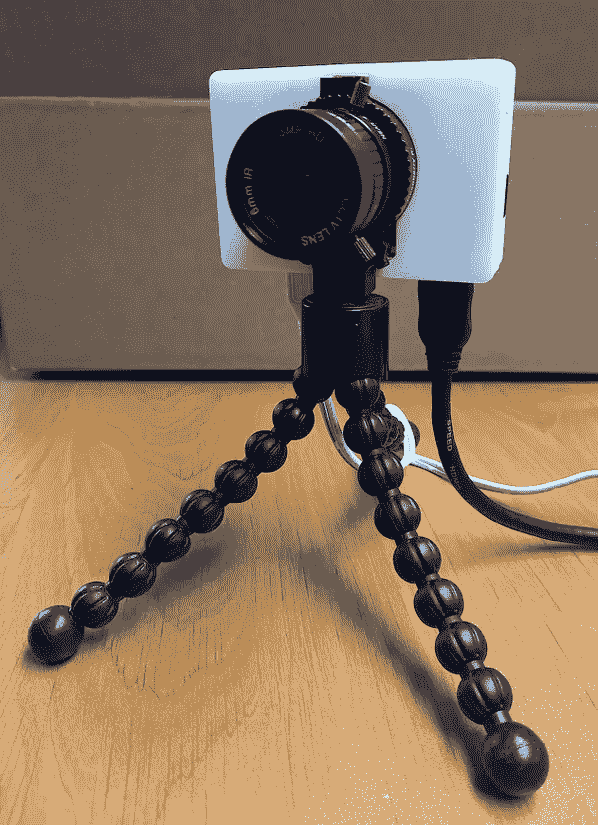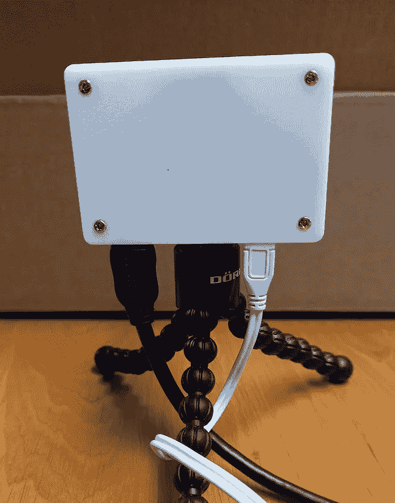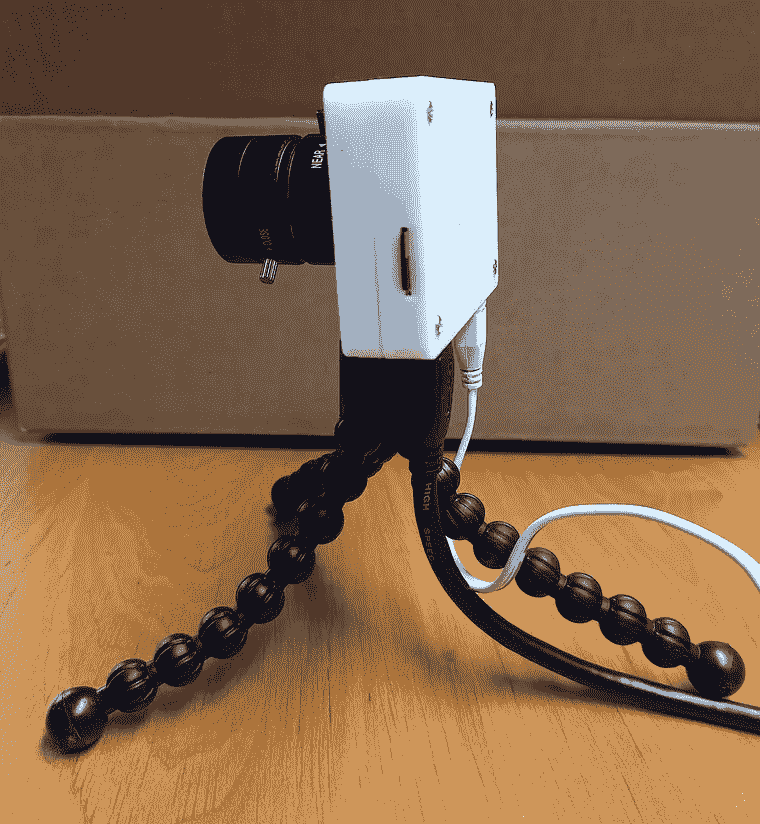

Raspberry Pi Zero 2 带 HQ 摄像头，采用 3D 打印外壳

# 一些历史…从儿童程序员到视频编辑再到编程

当我 11 岁得到 Commodore 64 时，我开始编程。从那以后，技术、编程和电影制作一直是我最感兴趣的。这就是为什么我去了电影学院，开始了我的视频编辑职业生涯。商业视频、CD-r om、DVD、互联网视频都是即将到来的新技术。当我需要将视频作品转换成多媒体项目时，我就是这样成为全职程序员的。

当时的视频编辑工作室是一个非常复杂和昂贵的系统，包含许多设备和电缆，需要大量的技术技能来调整一切。当电脑编辑出现时，当一台电脑能够取代几乎所有如此复杂的系统时，整个视频世界发生了天翻地覆的变化。

由于我目前正在用 Raspberry Pi 进行大量实验，并希望在演示和视频中展示这一点，我正在寻找一种理想的解决方案来进行屏幕和相机录制。是的， [OBS(开放式广播软件)](https://obsproject.com/)是一个很棒的工具，但它并不是我想要的…回到硬件视频解决方案对我来说是最理想的解决方案！

# ATEM 迷你专业版

Blackmagicdesign 设计的 [ATEM Mini 在我的愿望清单上已经有很长时间了。该设备有 4 个 HDMI 输入和 2 个音频输入，您可以录制到 USB-C 驱动器，或直接将其用作计算机的外部 USB 网络摄像头，例如视频通话。](https://www.blackmagicdesign.com/products/atemmini)

[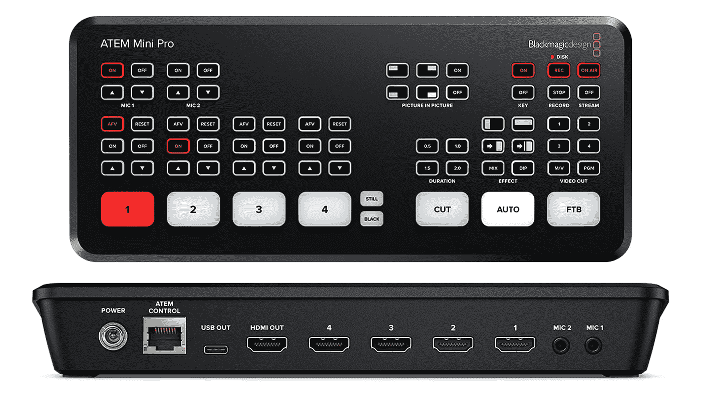](https://medium.com/javarevisited/7-best-java-fx-online-courses-for-beginners-9e774ba6f996)

因为价格([交叉点](https://shop.cross-point.be/en/blackmagic-design-atem-mini-pro.html)530€)，我犹豫买不买。但是我现在已经把这个盒子放在我的桌子上一个月了，哇，这是一个小盒子里的不可思议的魔力。盒子本身的用户体验和电脑上的控制器软件真的很棒。作为一名 20 年前的前视频编辑，这勾起了我很多回忆，真的感觉就像家里有一台专业的广播混音器！

大多数时候，我把它当作一个昂贵的视频开关，在一个显示器上显示我的许多树莓派中的一个。但是我想用几个摄像机来扩展我的设置，以便能够在视频录制或现场会议期间显示测试设置。

# 选择 HDMI 摄像机

由于 ATEM 迷你有四个 HDMI 输入，所以你所有的信号源都需要一个 HDMI 输出…对于树莓 Pi 的桌面屏幕来说，这不是问题(只要你有正确类型的电缆，从迷你或微型 HDMI 到全 HDMI)。对于相机来说，这有点难，但你有几个选择，都相当昂贵。

# DSLR 照相机

大多数 DSLR 相机都有 HDMI 输出，但你必须小心选择哪一个，因为不是所有的相机都提供“干净的输出”，这意味着没有观众信息在这个输出上。在为此目的购买相机之前，请确保搜索它是否提供这种清晰的输出。

# 摄像机或 GoPro

与 DSLR 相机相同的问题:确保有一个干净的 HDMI 输出。

# 网络摄像头

抱歉，没找到带 HDMI 输出的…

# HDMI 摄像头

这里有几个选择。

在所有“HDMI 相机”搜索中出现的一个品牌是 MOKOSE，例如[“12MP HDMI 相机”，起价 130€](https://www.amazon.com/MOKOSE-Streaming-Recording-Industry-Distortion/dp/B07YZPH97W/ref=sr_1_3?keywords=camera+with+hdmi+output&qid=1640014413&sr=8-3) ，但评论非常不一致。

还有专业相机，像[马歇尔 CV506 迷你广播相机](https://shop.cross-point.be/nl/marshall-cv506-mini-broadcast-camera.html)这似乎是最便宜的 450€。

让我们用另一种方法…当然是树莓派；-)

有很多教程可以将带摄像头的树莓派变成 USB 摄像头，例如 Jeff Geerling 的这个[帖子:“树莓派制作了一个 100 美元的 USB 摄像头”](https://www.jeffgeerling.com/blog/2020/raspberry-pi-makes-great-usb-webcam-100)。但是对于这个用例，我们需要在 HDMI 输出上全屏显示摄像头视图，最好是在启动时，这样我们除了给设备供电之外，不需要做任何事情。

最近，Raspberry Pi 操作系统得到了升级，现在基于 Debian Bullseye。这个版本的一个主要变化:【Raspberry Pi 用来访问相机模块的驱动程序已经被 libcamera 取代。更多信息见[“牛眼摄像系统”](https://www.raspberrypi.com/news/bullseye-camera-system/)。

包含的新工具之一是`libcamera-hello`。这是一个简单的应用程序，启动一个相机预览流，并在屏幕上显示它。

要制作一台相机，你需要所有这些组件来制作一台带有 Raspberry Pi Zero 2 和 HQ 相机模块的相机。有不同的镜头可供选择，下面的购物清单包括 6 毫米镜头。正如你所看到的，总额低于 150€。

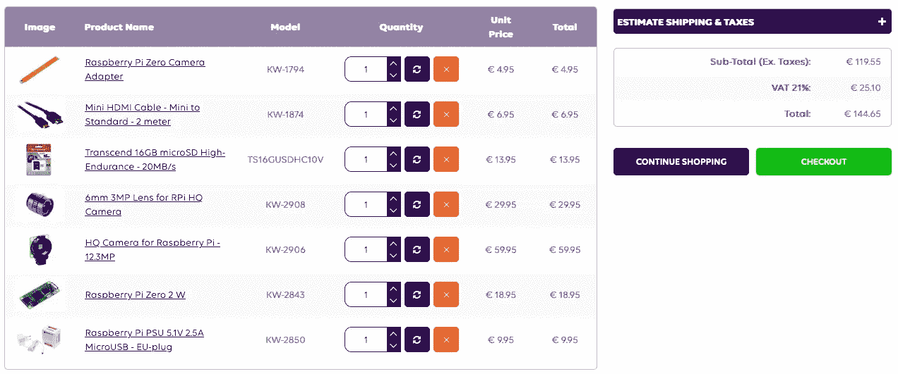

在 SD 上刻录“Raspberry Pi OS Lite”版本。请确保使用精简版，因为桌面版会导致相机图像抖动和闪烁，因为桌面和相机视频之间存在冲突。的确，我自己也犯了这个错误，但幸运的是 GitHub libcamera-apps 项目的团队很快帮助我发现了我的错误。开机后，我检查了主板和操作系统的版本，以确认 Debian 和主板的版本:

```
$ lsb_release -a
No LSB modules are available.
Distributor ID:	Raspbian
Description:	Raspbian GNU/Linux 11 (bullseye)
Release:	11
Codename:	bullseye

$ cat /proc/device-tree/model
Raspberry Pi Zero 2 Rev 1.0
```

顺便说一句，在`Raspberry Pi 4 Model B Rev 1.4`上也测试工作正常。

现在执行这些命令以获得所有的最新版本，并创建一个启动脚本，以便相机在开机时全屏启动。

```
$ sudo apt update
$ sudo apt upgrade
$ sudo nano /etc/systemd/system/camera.start.service

[Unit]
Description=Start the camera fullscreen

[Service]
Type=simple
ExecStart=libcamera-hello --viewfinder-width 1920 --viewfinder-height 1080 -f -t 0 &

[Install]
WantedBy=multi-user.target

$ sudo chmod 644 /etc/systemd/system/camera.start.service
$ sudo systemctl enable camera.start.service
$ sudo systemctl start camera.start.service
$ sync
$ sudo reboot
```

重新启动后，检查服务，但如果你看到屏幕上的摄像头，它已经工作；-)

```
$ sudo systemctl status camera.start.service
● camera.start.service - Start the camera fullscreen
     Loaded: loaded (/etc/systemd/system/camera.start.service; enabled; vendor preset: enabled)
     Active: active (running) since Sun 2021-12-12 19:17:07 CET; 9s ago
   Main PID: 891 (libcamera-hello)
      Tasks: 7 (limit: 409)
        CPU: 2.275s
     CGroup: /system.slice/camera.start.service
             └─891 libcamera-hello --viewfinder-width 1920 --viewfinder-height 1080 -f -t 0 &

Dec 12 19:17:08 raspberrypi libcamera-hello[891]: [0:05:40.618657773] [893]  INFO RPISTREAM rpi_stream.cpp:122 No buffers available for ISP Output0
Dec 12 19:17:08 raspberrypi libcamera-hello[891]: [0:05:41.156818620] [893]  INFO RPI raspberrypi.cpp:1636 Dropping frame at the request of the IPA (6 left)
```

# 3D 打印外壳

下一步，让我们将摄像机安装在外壳中。如果你有一台 3D 打印机，这是一个简单的步骤，因为有完整的树莓 Pi 和零的设计。

# 树莓 Pi 4 + HQ 摄像头

Prusa printers 网站上的项目，一步一步地在 Adafruit 上组装:

*   [打印文件](https://www.prusaprinters.org/prints/32718-raspberry-pi-hq-camera-case)
*   [逐步组装](https://learn.adafruit.com/raspberry-pi-hq-camera-case/)

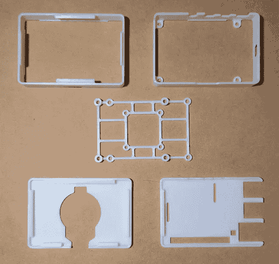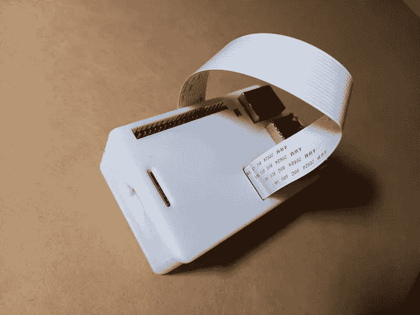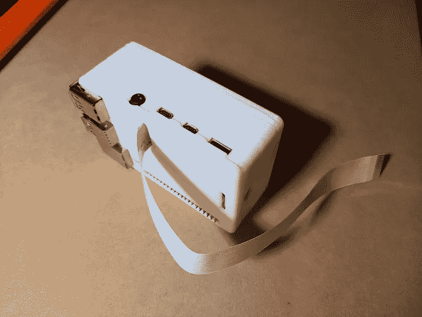

带 HQ 摄像头模块的 Raspberry Pi 4 外壳

# 树莓派 Zero + HQ 相机

前一个项目的混搭也适用于零的住宅:

*   [打印文件](https://www.prusaprinters.org/prints/48519-raspberry-pi-zero-webcam-hq-camera/)
*   2M 螺钉(相机和 Pi)和 2.5M 螺钉(关闭外壳)

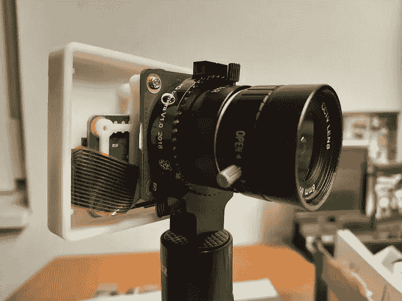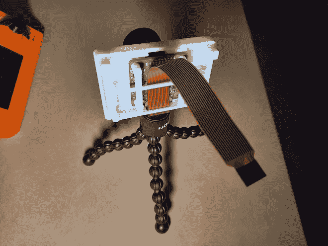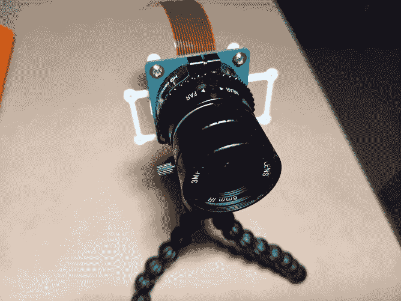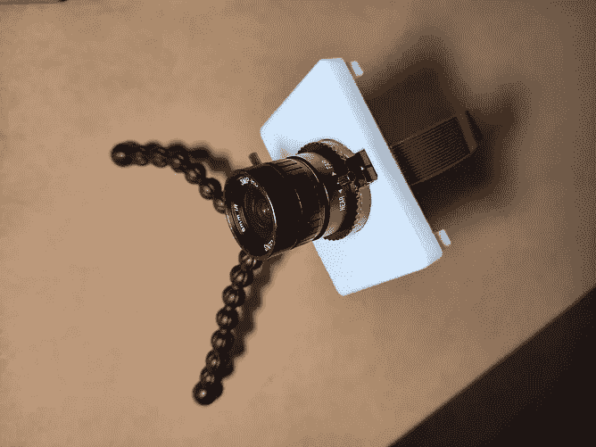

带 HQ 摄像头模块的 Raspberry Pi Zero (2)外壳

# 结论

Raspberry Pi 相机的质量对于我的使用案例来说已经足够好了。正如你在上面的视频中所看到的，相机的移动并不太平滑，但固定的视图显示例如一个电子项目是完美的。我可能仍然需要在一些更好的闪电中进行调查，因为我桌子上方的 LED 面板似乎也会产生一些“噪音”。

将 ATEM Mini 连接到我的测试电脑和 Raspberry Pi 的隐藏宝石之一是:在任何时候我都可以点击 REC 按钮，我所做的一切都被记录到 USB-C 驱动器上。因此，如果我想重复或记录设置或测试过程的特定部分，总是可以回放。

你可以在[“用 ATEM 迷你和树莓皮相机进行多机位录制”](https://frankdelporte.medium.com/multicam-recordings-with-atem-mini-and-raspberry-pi-cameras-a2ba0569411)中找到更多“幕后”和最终编辑。

# 额外小费

寻找专业的视频编辑解决方案？Blackmagicdesign 不仅生产所有价位的视频硬件产品，还免费提供精彩的[达芬奇解决方案](https://www.blackmagicdesign.com/products/davinciresolve/)！这个程序将编辑、色彩校正、视觉效果、动画和音频后期制作全部结合在一个软件工具中！有一个额外功能的付费版本，但我没有错过我需要创建的视频，我想我仍然只使用了一小部分的可能性…

*原载于*[*https://web techie . be*](https://webtechie.be/post/2021-12-20-raspberry-pi-as-hdmi-camera-for-atem-mini/)*。*