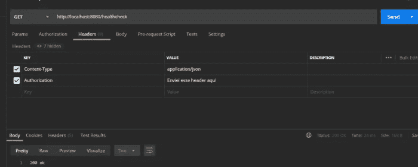
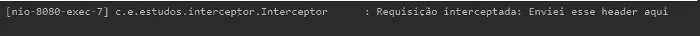
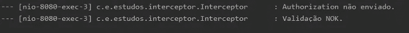
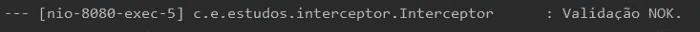
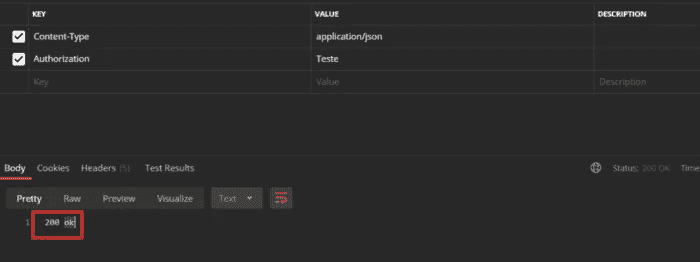

# 在 Spring Boot API 中使用拦截器

> 原文：<https://medium.com/javarevisited/using-interceptor-in-a-spring-boot-api-9d7a0781dd19?source=collection_archive---------0----------------------->


出于多种原因，有必要拦截对 API 路由的请求，其中一些原因可能是:

*   认证；
*   记录输入数据；
*   为请求响应生成一些信息；
*   和许多其他事情；

在这个 api 示例中，我将执行以下操作:

*   标题中某些字段的验证；
*   匿名请求的许可(没有上面提到的验证)；
*   在响应标头中包含某些字段；

首先要做的是创建项目。你可以在这里做:[https://start.spring.io/](https://start.spring.io/)

我有一些其他的文本，显示了如何创建项目，请求，数据库 crud，我不会在这里重复这些相同的东西。我将设置拦截器并使用它。

关于拦截器的重要信息:

我们可以使用三种方法:

*   **preHandle()** 这个方法用于对发送到控制器的请求执行一些操作。
*   **postHandle()** 这个方法用于对发送给客户端的响应执行一些操作。
*   **afterCompletion()** 该方法用于在请求和响应后执行动作。

我从 preHandle()开始验证一个字段，我称之为“Authorization ”,并将在请求头中发送。

我在控制器中创建了一个带有简单健康检查的方法:

```
@Slf4j
@Component
public class Interceptor implements HandlerInterceptor {

    @Override
    public boolean preHandle(HttpServletRequest request, HttpServletResponse response, Object handler) throws Exception {
        log.info("Request intercepted: " + request.getHeader("Authorization"));
        return true;
    }

}
```

现在我注册了这个拦截器:

```
@RequiredArgsConstructor
@Component
public class ConfigInterceptor extends WebMvcConfigurerAdapter {

    private final Interceptor interceptor;

    @Override
    public void addInterceptors(InterceptorRegistry registry) {
        registry.addInterceptor(interceptor);
    }

}
```

一旦完成，拦截器就可以使用了。

目前，它只是生成一个包含“Authorization”字段内容的日志，您可以通过调用 health check:

使用[邮递员](/javarevisited/7-best-courses-to-learn-postman-tool-for-web-service-and-api-testing-f225c138fa5a)的示例:



日志:



现在是时候拦截在这个头中没有特定值的请求了，我修改了拦截器类中的 preHandle()方法:

```
@Slf4j
@Component
public class Interceptor implements HandlerInterceptor {

    @Override
    public boolean preHandle(HttpServletRequest request, HttpServletResponse response, Object handler) throws Exception {

        if (request.getHeader("Authorization") == null){
            log.info("Authorization not sent.");
            log.info("Validation NOK.");
            return false;
        }
        else if (request.getHeader("Authorization").equals("Test"))    {

log.info("Validation OK.");
            return true;
        } else {
            log.info("Validation NOK.");
            return false;
        }

    }

}
```

结果发送相同的直通邮递员，但没有标题:



并且预期的“200 ok”没有被发送到客户端。

邮差用无效标题发送相同 GET 的结果:



在这种情况下，预期的“200 ok”也没有发送到客户端。

现在，发送具有正确值的报头的请求的结果是:


并且 200 ok 被发送到客户端:



好的，我们在头中有一个字段，当被验证时允许或不允许一个请求的成功。但这条路线是一个健康检查，它不会暴露任何敏感的东西，理论上，它可以在没有这项检查的情况下使用。

其结果将是在除“/healthcheck”之外的 API 的所有其他路由中对报头进行验证。

为此，我采取了几个步骤:

我创建了一个[枚举](https://www.java67.com/2018/07/java-enum-with-constructor-example.html):

```
public enum ValidationType {

    ANNONYMOUS ("Online");

    String value;

    ValidationType(String value){
        this.value = value;
    }

    public String getValue(){
        return value;
    }

}
```

我在[控制器](https://javarevisited.blogspot.com/2017/08/difference-between-restcontroller-and-controller-annotations-spring-mvc-rest.html#ixzz6OYNB9oii)上使用了这个注释:

```
@RestController
public class HealthCheck {

    @AllowAnnonymous
    @GetMapping(value = "/healthcheck")
    public String getHealthCheck(){
        return "200 ok";
    }

}
```

我更改了 preHandle():

```
@Slf4j
@Component
public class Interceptor implements HandlerInterceptor {

    @Override
    public boolean preHandle(HttpServletRequest request, HttpServletResponse response, Object handler) throws Exception {

        final AllowAnnonymous allowAnnonymous = ((HandlerMethod)handler).getMethod().getAnnotation((AllowAnnonymous.class));

        if(allowAnnonymous != null){
            return true;
        }

        if (request.getHeader("Authorization") == null){
            response.addHeader("Interceptor", "Authorization not sent");            
            log.info("Authorization not sent.");
            log.info("Validation NOK.");
            return false;
        }
        else if (request.getHeader("Authorization").equals("Test")) {
            response.addHeader("Interceptor", "Authorization OK");
            log.info("Validation OK.");
            return true;
        } else {

            log.info("Validation NOK.");
            return false;
        }

    }
}
```

在《邮差》中，你可以看到我回复的标题:


这是一个需要重构的基本示例，但它也给出了如何使用拦截器的想法。

希望有帮助。

我把消息来源留在这里:【https://github.com/mmarcosab/interceptor-example 