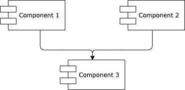
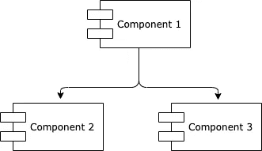
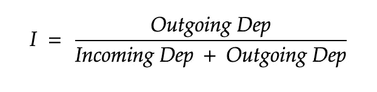
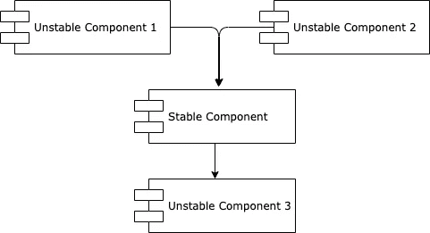
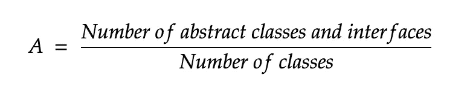
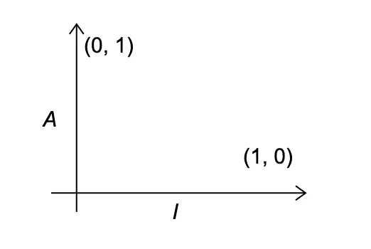
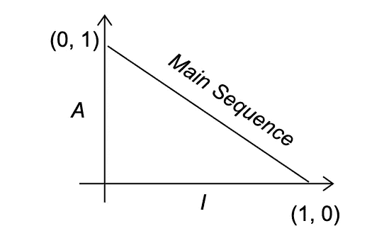
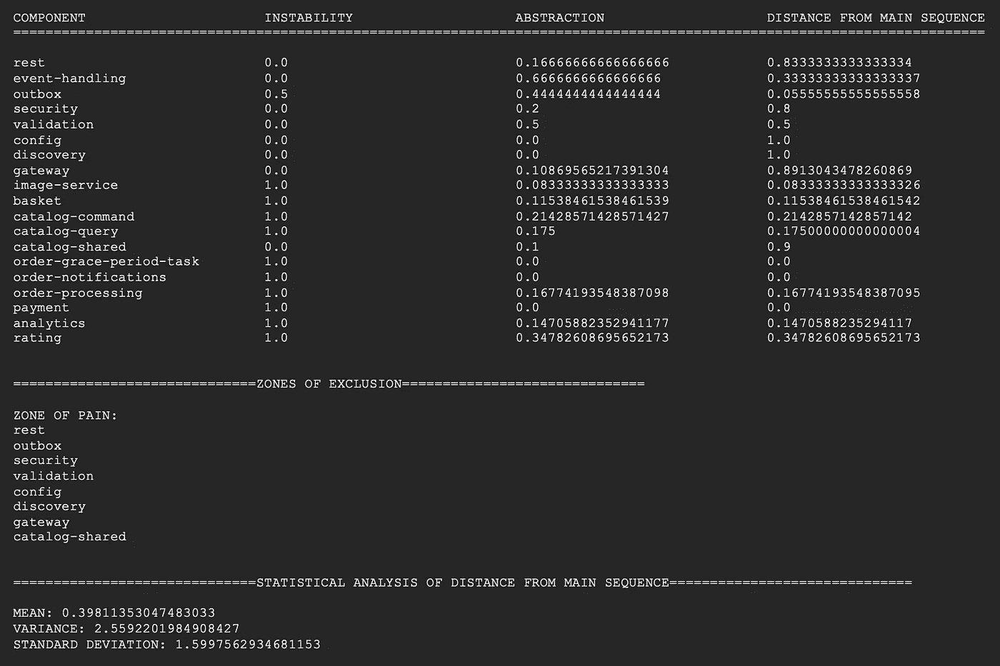

# 使用度量来打造更好的软件架构 Java 和 Maven 方法

> 原文：<https://medium.com/javarevisited/using-metrics-for-crafting-maintainable-solutions-on-the-long-run-the-maven-way-1a2d84508bf0?source=collection_archive---------1----------------------->

您是否发现自己处于这样一种情况:更改一行简单的代码会导致整个应用程序出现一系列编译错误？或者在你至少会想到的地方引入一个 bug？如果你没去过那里，我去过，让我告诉你那并不愉快。
不是。在。全部。

但是，我们作为一个团队问的问题是，我们是如何做到这一点的？回顾过去，我们遵循了一些通用的指导方针，有一个良好的测试覆盖率，确保事先建立一些良好的实践，然而我们设法到达了一个地方，在那里改变一行变成了整整三天的努力。

祝你能向你的经理解释清楚！

让我从头开始。你开始了一个新项目，开始很简单，但事情很快开始升级，在你知道之前，你必须建立一些基本规则。
你可能有一些业务逻辑，所以你创建了一个模块来包装这些逻辑，我们称之为**核心**模块。您可能还需要一个 API，因此您还将添加一个 **API** 模块。你需要安全，所以你增加了一个**安全**模块。更不用说如果你和 DDD 一起工作，或者有一个 CQRS 或六边形的架构，那么你可能会以一堆不同的模块结束，谁知道最后是什么。

不要误解我的意思，如果你想有一个长期可维护和可伸缩的解决方案，这可能是正确的方法。这绝对是一个很好的方法，可以将不同的关注点分开，将共同的关注点组合在一起。

那么，我们到底做错了什么，才落得如此下场？

事实证明，不仅创建不同的模块和分离关注点很重要，如何连接这些模块，如何引入它们之间的依赖关系也很重要。

Robert C.Martin 在他的《干净的建筑》一书中提到了这个问题，并提出了一个解决方案。他提出的是引入某种完全基于系统模块之间连接方式的度量标准。这些度量的目的是能够确定系统的可伸缩性和可维护性。

在本文的下一部分，在开始更实际的工作之前，我将尝试对罗伯特·马丁在他的书的章节中更详细解释的度量背后的理论做一个非常简短的总结(是的，显然我强烈建议在接下来的两分钟长的 TL 中阅读那个；DR 部分)。

# 依赖性管理指标

依赖性管理指标由两个原则组成:

*   稳定依赖原则
*   稳定抽象原则

在接下来的部分中，我们将提到术语**组件**，它实际上相当于 Java 和 Maven 生态系统中的 Maven 模块。

## 稳定依赖原则

*“任何我们认为不稳定的组件，都不应该依赖于一个很难改变的组件。否则，挥发性成分也将难以改变。”*

是什么让一个组件变得难以改变(也叫“稳定”)？
许多因素可能会使软件组件难以更改(大小、复杂性、清晰性、依赖于它的组件数量……)。
我们特别感兴趣的是最后一种情况，即一个组件有许多其他组件依赖于它。具有大量引入依赖项的组件很难更改，因此被称为“稳定”组件:

你可能已经猜到了，一个“不稳定”的组件是完全相反的。
“不稳定”组件是指依赖于其他组件但没有其他组件依赖于它的组件:

**组件不稳定**

我们可以将组件的术语**不稳定性** 定义如下:

现在我们已经定义了**不稳定性**，我们可以定义**稳定依赖性** *:* 的实际原理

*“一个组件应该总是依赖于一个更稳定的组件。”*

在下图中，我们可以看到明显违反了该原则:

其中**稳定组件**(依赖于两个组件)依赖于不稳定组件(仅依赖于一个组件——稳定组件)。

## **稳定抽象原则**

为了能够定义**稳定抽象**原则，我们首先需要建立术语的定义— **抽象组件**。

*“抽象组件是只持有接口或抽象类的组件。”*

这些抽象组件非常稳定，非常适合不太稳定的组件依赖。

我们可以通过以下方式定义单个组件的抽象级别:

既然我们已经定义了组件抽象这个术语，我们可以定义**稳定抽象**原则:

组件应该总是依赖于更抽象的组件

## 主序列

我们已经定义了两个原则，那么下一步是什么？
让我们尝试在 x-y 轴上定义**不稳定性**和**抽象性**指标之间的联系:

X-Y 轴，其中 X 轴是不稳定性，Y 轴是组件的抽象性

如果我们在上述 x-y 轴上的 *(0，1)* 和 *(1，0)* 点之间画一条线，我们得到一条线，叫做**主序列**线:

这条线代表所有组件应该在的地方。位于**主序列**上的组件既不太抽象，也不太不稳定。

现在我们已经定义了组件应该在哪里，是时候定义它们不应该在哪里了，在所谓的**排除区**:

排除区

正如我们所看到的，有两个区域是我们不希望组件出现的:

**疼痛区
和**高度稳定的混凝土构件。这是不希望的，因为该区域中的部件非常坚硬。它们不能被扩展，因为它们缺乏抽象性，并且由于它们的高稳定性，它们很难被改变。

**无用区** 高度抽象的组件，没有任何依赖，即无用组件。

**距主序列的距离** 现在是时候定义与组件距**主序列**的距离相对应的度量了:

任何具有不接近零的 **D** 度量值的组件，都可以被进一步重新检查和重构。

通过计算组件的所有 **D** 度量的**均值**和**方差**也可以对设计进行统计分析。
符合要求的设计应该具有接近于零的**均值**和**方差**值。

# 依赖性管理指标 Maven 插件

希望您已经从理论部分得到了这个想法，现在是时候看看我们如何在使用 Java 和 Maven 的项目中更实际地从这些指标中获益了。

[**依赖管理度量**](https://github.com/ignatij/dependency-management-metrics-maven-plugin) 是一个 Maven 插件，它计算并输出 Java 多模块项目中每个 Maven 模块的依赖管理度量。该插件只考虑内部的和特定于项目的依赖，不考虑外部的依赖(如 Spring)。

每个 Maven 模块都考虑了以下指标:

*   稳定性度量
*   抽象度量
*   与主序列的距离

插件还在单独的部分**排除区**中输出**痛苦区**和**无用区**中存在的模块。

最后，如果违反了**稳定依赖**或**稳定抽象**原则，插件可能会破坏 Maven 的构建。

## 结果

在多模块 Java 项目中运行插件会产生以下输出:

从输出中我们可以看到，一些被放错地方最多的模块属于**痛苦区**部分，这意味着它们是高度稳定的模块，明显缺乏抽象。

这对我们意味着什么？这实际上意味着这些模块中的变化应该尽可能小，尽可能少，这样我们就不会意外地引入一些 bug、构建问题或者只是增加开发人员(以及稍后的管理人员)的头痛因素。

# 结论

插件本身并没有为我们解决问题，它的目的是指出我们可以进一步行动和改进的地方。

它既可以作为当前架构的总体概述，更重要的是，作为未来计划工作的指南——能够预先识别是否需要一些重构或重组，希望从长远来看，它将有助于开发更好、更具可扩展性和可维护性的软件。