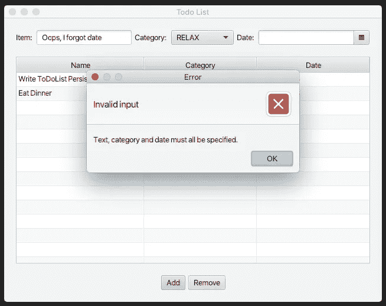
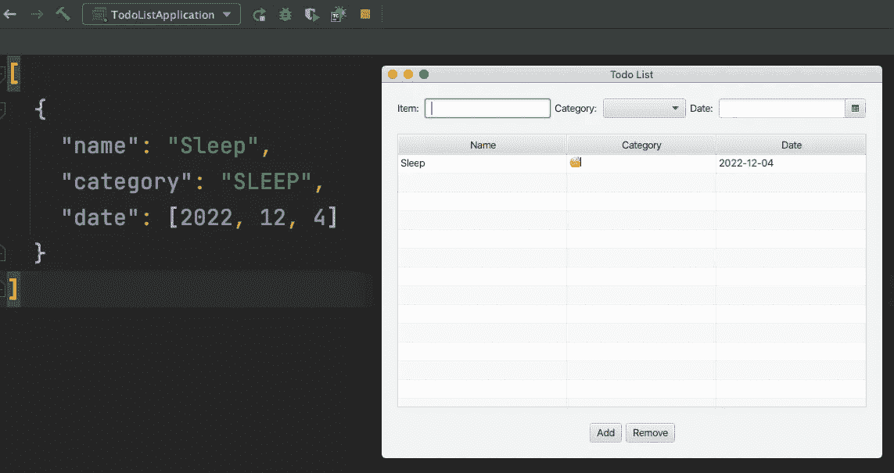
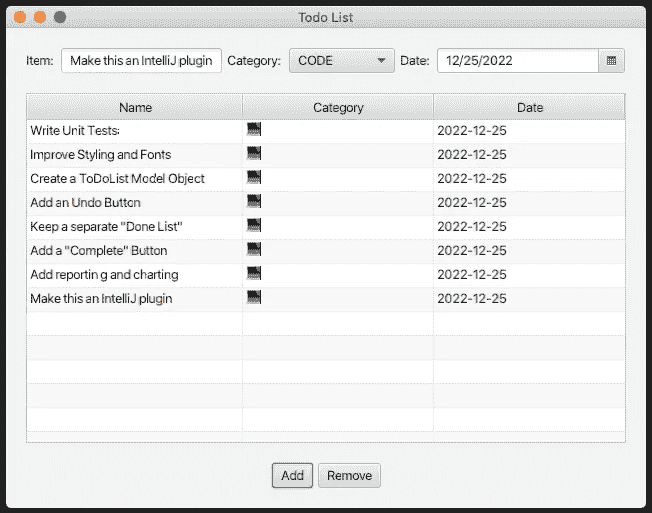

# 使用 Jackson 库将我的 JavaFX ToDo 列表持久化到 JSON

> 原文：<https://medium.com/javarevisited/using-the-jackson-library-to-persist-my-javafx-todo-list-to-json-8a4b31917c09?source=collection_archive---------2----------------------->

了解如何将 Jackson 用于 Eclipse 集合和 Java 日期/时间


我的 JavaFX ToDoList 使用 Jackson 库作为 JSON 文件持久化

# 将我的 JavaFX 升级到 DoList 应用程序

在我的`TodoListApplication`的第三次迭代中，我添加了一个带有表情符号`String`的`ToDoCategory` enum，并用它来填充一个 JavaFX `ComboBox`。

<https://donraab.medium.com/experimenting-with-java-enums-emojis-and-combobox-in-javafx-2c12492cf65>  

在本系列的第三篇博客的结尾，我说我会在下一篇博客中解释如何让 ToDoList 持久化。我终于来了，做我说过要做的事。这是我第一次尝试使用带有 [Eclipse 集合](https://github.com/eclipse/eclipse-collections)、Java 日期时间和 Java 记录的 [Jackson](https://github.com/FasterXML/jackson) 库。我边走边学习，并打算与你，读者，分享这种学习，同时它也发生在我身上。很有可能有人会看到我在这里所做的，并给我宝贵的反馈意见，告诉我如何改进。

# 我的 ToDoItem 实例晚上睡在哪里？

当我第一次学习面向对象编程并接触到“持久性”的概念时，这个主题叫做“对象晚上睡在哪里？”这里存在一个古老的问题:当我们关掉电源时，我们的数据去了哪里。到目前为止，我的 JavaFX ToDoList 只在内存中工作，当应用程序关闭时，`ToDoItem`实例就会消失。

持久化数据有很多选择。我决定使用 Jackson 库将我的`ToDoItem`实例中的`MutableList`转换成 JSON，保存到一个文件中并从中读取。

# 杰克森、日蚀收藏和 JSR 310

Jackson JSON 库是一个非常棒的库。你可以在这里找到更多信息。

<https://github.com/FasterXML/jackson>  

你也可以通过关注 Medium 上的 [@cowtowncoder](https://medium.com/u/b9b3ec1cfbf7?source=post_page-----8a4b31917c09--------------------------------) 来了解杰克逊的最新消息。

我使用 [Eclipse 集合](https://github.com/eclipse/eclipse-collections) `MutableList`来保存我的应用程序中的`ToDoItem`实例。我正在使用 Java 8 中包含的 [Java Date Time](https://docs.oracle.com/javase/8/docs/technotes/guides/datetime/index.html) (JSR 310)中的`LocalDate`类。

为了使用 Jackson 持久化我的待办事项列表，我需要在我的 Maven `pom.xml`文件中包含以下依赖项。

```
<dependency>
    <groupId>com.fasterxml.jackson.core</groupId>
    <artifactId>jackson-databind</artifactId>
    <version>${jackson.version}</version>
</dependency>
<dependency>
    <groupId>com.fasterxml.jackson.datatype</groupId>
    <artifactId>jackson-datatype-jsr310</artifactId>
    <version>${jackson.version}</version>
</dependency>
<dependency>
    <groupId>com.fasterxml.jackson.datatype</groupId>
    <artifactId>jackson-datatype-eclipse-collections</artifactId>
    <version>${jackson.version}</version>
</dependency>
```

我用 JavaFX `17.0.1`、Eclipse Collections `11.1.0`和 Jackson `2.14.1`搭配 Java `17`。我使用 Java Date Time 中的`LocalDate`来包含额外的 Jackson 库(`jackson-datatype-jsr310`)以支持`LocalDate`序列化。

```
<javafx.version>17.0.1</javafx.version>
<eclipse-collections.version>11.1.0</eclipse-collections.version>
<jackson.version>2.14.1</jackson.version>
```

## 与 JPMS 合作

IntelliJ 为我生成的 JavaFX 项目框架被设置为使用 JPMS。我以前从未在 Java 应用程序中明确使用过 JPMS。这让我有些头疼，但是我能够成功地让事情进入工作状态。

下面是位于我的 Java 源代码根目录下的`module-info.java`文件的内容。

```
module example.todolist {
    requires javafx.controls;
    requires javafx.fxml;
    requires org.eclipse.collections.api;
    requires org.eclipse.collections.impl;
    requires com.fasterxml.jackson.annotation;
    requires com.fasterxml.jackson.core;
    requires com.fasterxml.jackson.databind;
    requires com.fasterxml.jackson.datatype.jsr310;
    requires jackson.datatype.eclipse.collections;
    opens example.todolist;
}
```

让我陷入循环的是`jackson.datatype.eclipse.collections`的模块名不一致。我不得不去 Jackson GitHub 网站查找模块的名称。

<https://github.com/FasterXML/jackson-datatypes-collections/blob/2.15/eclipse-collections/src/moditect/module-info.java>  

不幸的是，这遵循了一个不同的模块命名惯例，而不是 Google Guava 的模块，它包含在同一个项目中。

<https://github.com/FasterXML/jackson-datatypes-collections/blob/2.15/guava/src/moditect/module-info.java>  

看起来，在 jackson-datatypes-collections 中，番石榴和 HPPC 遵循一个 JPMS 模块命名约定，而 Eclipse 集合和 PCollections 遵循另一个命名约定。

<https://github.com/FasterXML/jackson-datatypes-collections>  

## 为 Json 序列化对 ToDoItem 进行更改

我在我的`ToDoItem`记录中添加了以下注释，以便与 Jackson 一起使用。我可能不需要其中的一些注释，但这肯定是有效的(并且是一致的)，所以在这里分享一下。如果可以简化，请在评论里告诉我。

> 多森多 discimus

```
public record ToDoItem(
        @JsonProperty String name,
        @JsonProperty ToDoCategory category,
        @JsonProperty LocalDate date)
{
    @JsonIgnore
    public String getCategory()
    {
        return this.category.getEmoji();
    }

    @JsonIgnore
    public String getName()
    {
        return this.name;
    }

    @JsonIgnore
    public String getDate()
    {
        return this.date.toString();
    }
}
```

**Update (12/6):** 我已经将注释更新为使用 JsonProperty 而不是 JsonSerialize，并移除了对 LocalDate 的特殊处理。

我希望持久化记录中的数据，而不是从 getters 返回的值。我意识到我在这里混合了数据和表格表示逻辑。这纯粹是出于方便。正如我在以前的博客中提到的，我使用了 getters，这样我的`ToDoItem`记录就可以与 JavaFX `TableView`一起工作。使用`todolist-view.fxml`文件中的`PropertyValueFactory`定义。

## 将 Json 文件读入 Eclipse 集合可变列表

下面是我写的将 Json 文件读入我在`TodoListController`中使用的`MutableList`的代码。

```
private MutableList<ToDoItem> readToDoListFromFile()
{
    ObjectMapper mapper = this.getObjectMapper();
    MutableList<ToDoItem> list = null;
    try
    {
        list = mapper.readValue(
                Paths.get("todolist.json").toFile(),
                new TypeReference<MutableList<ToDoItem>>() {});
        return list;
    }
    catch (IOException e)
    {
        System.out.println(e);
    }
    return Lists.mutable.empty();
}
```

我按照我们从 Eclipse Collections GitHub README 中链接的说明，用 Jackson 序列化 Eclipse Collections。如果文件不存在(或者发生了其他异常)，将返回一个空的`MutableList`实例。

我创建了一个`getObjectMapper`方法，它总是加载我需要的两个 Jackson 模块。我可能会在某个地方保留`ObjectMapper`实例，但它现在工作正常，只需在启动和关闭时根据需要创建它来读写文件。

```
private ObjectMapper getObjectMapper()
{
    ObjectMapper mapper = new ObjectMapper()
            .registerModule(new EclipseCollectionsModule())
            .registerModule(new JavaTimeModule());
    return mapper;
}
```

## 从可变列表中写入 Json 文件

使用 Jackson 编写 Json 文件的代码几乎和读取 Json 文件的代码一样简单。

```
public void writeToDoListToFile()
{
    ObjectMapper mapper = this.getObjectMapper();
    MutableList<ToDoItem> list =
            this.todoList.getItems().stream()
                    .collect(Collectors2.toList());
    try
    {
        mapper.writeValue(
                Paths.get("todolist.json").toFile(),
                list);
    }
    catch (IOException e)
    {
        throw new RuntimeException(e);
    }
}
```

我遇到的一个问题是，我的`MutableList`被包装在一个`ObservableList`中，该 T1 保存在`todoList`变量的`TableView`中。我通过调用`getItems`来访问`ObservableList`。我无法通过`ObservableList`直接到达`MutableList`。我有一些想法可以在以后的迭代中改进这一点(不仅仅是保持对`MutableList`的直接引用)，但是现在我采用简单的方法，使用 Java Streams 和 Eclipse 集合中的`Collectors2`实用程序将`ObservableList`转换为`MutableList`。

我的异常处理还可以改进，但是对于持久性的第一次迭代来说还可以。

## 使用杰克逊效果很好

最后，使用 Json 来持久化和具体化我的 ToDoItem 可变列表并不需要很多代码。Jackson 库工作得和我希望的一样好，我在 JPMS 模块中遇到了一个小的包命名问题。

这是 json 文件的输出(用 IntelliJ 格式化后)。

```
[
  {
    "name": "Write ToDoList Persistence Blog",
    "category": "RELAX",
    "date": [2022, 12, 4]
  },
  {
    "name": "Eat Dinner",
    "category": "EAT",
    "date": [2022, 12, 4]
  }
]
```

# JavaFX 生命周期事件

我想让`ToDoItem`的`MutableList`在应用程序启动时自动加载，并在窗口关闭和应用程序关闭时自动保存。我将解释我是如何让它工作的。

## 正在加载待办事项列表

我将读取 JSON 文件的代码添加到了`TodoListController`的`initialize`方法中。

```
@FXML
protected void initialize()
{
    MutableList<ToDoItem> items = this.readToDoListFromFile();
    ObservableList<ToDoItem> list = FXCollections.observableList(items);

    this.todoList.setColumnResizePolicy(TableView.CONSTRAINED_RESIZE_POLICY);
    this.todoList.setItems(list);

    ObservableList<ToDoCategory> categories =
            FXCollections.observableList(
                    Lists.mutable.with(ToDoCategory.values()));

    this.todoCategory.setItems(categories);
}
```

该代码在窗口打开时执行。一旦使用 Jackson 从文件中读入`MutableList`，它将被设置到`todoList`中的项目列表中，并带有一个包装的`ObservableList`。

## 保存待办事项列表

这对我来说是最棘手的部分。我本能地知道，我应该能够将一些回调挂钩到窗口的关闭事件中。所以我做了一些谷歌搜索，找到了一些关于如何做到这一点的答案。这要求我对我的`TodoListApplication`类做一些改变。

我修改了 IntelliJ 最初为我生成的`start`方法，如下所示。

```
@Override
public void start(Stage stage) throws IOException
{
    FXMLLoader fxmlLoader = new FXMLLoader();
    Parent root = fxmlLoader.load(TodoListApplication.class.getResourceAsStream("todolist-view.fxml"));
    TodoListController controller = fxmlLoader.getController();
    Scene scene = new Scene(root, 640, 480);
    stage.setTitle("Todo List");
    stage.setScene(scene);
    stage.show();
    stage.setOnCloseRequest(event -> {
        controller.writeToDoListToFile();
        Platform.exit();
        System.exit(0);
    });
}
```

我需要修改`FXMLLoader`周围的代码，以便获得`TodoListController`的句柄，这样我就可以将`Stage` `setOnCloseRequest`事件与调用控制器的`writeToDoListToFile`方法挂钩。作为副产品，我学到了如何通过视图本身访问与视图相关联的控制器。我仍然需要完全理解这一点，但是代码至少是有效的。

## 哎呀，我需要一条错误处理消息

当我摆弄我的待办事项列表时，我导致了一个异常的发生。如果我把日期或其他东西留空，我会得到一个可怕的`NullPointerException`。呸。我想在输入无效并显示错误消息时发出警告。我发现了一种使用`Alert`类的简单方法。

我按如下方式重构了`TodoListController`类中的`onAddButtonClick`方法，因此任何空输入都会显示一条错误消息。

```
@FXML
protected void onAddButtonClick()
{
    String text = this.todoItem.getText();
    ToDoCategory category = this.todoCategory.getValue();
    LocalDate date = this.todoDate.getValue();
    if (text == null || category == null || date == null)
    {
        this.displayInvalidInputMessage();
    }
    else
    {
        this.createAndAddToDoItem(text, category, date);
    }
}

private void displayInvalidInputMessage()
{
    Alert errorAlert = new Alert(Alert.AlertType.ERROR);
    errorAlert.setHeaderText("Invalid input");
    errorAlert.setContentText("Text, category and date must all be specified.");
    errorAlert.showAndWait();
}
```

如果您不指定文本、类别或日期，下面的错误消息会立即弹出。



无效的输入错误消息

## 我今天的最后一件事

希望我能在午夜前发表这篇文章。



# 完整的源代码

我最终会将我的待办事项列表实验的源代码上传到 GitHub 项目中。目前，我的`TodoListApplication`的源代码包含在以下四个文件中。

`TodoListApplication.java`

```
package example.todolist;

import java.io.IOException;

import javafx.application.Application;
import javafx.application.Platform;
import javafx.fxml.FXMLLoader;
import javafx.scene.Parent;
import javafx.scene.Scene;
import javafx.stage.Stage;

public class TodoListApplication extends Application
{
    @Override
    public void start(Stage stage) throws IOException
    {
        FXMLLoader fxmlLoader = new FXMLLoader();
        Parent root = fxmlLoader.load(TodoListApplication.class.getResourceAsStream("todolist-view.fxml"));
        TodoListController controller = fxmlLoader.getController();
        Scene scene = new Scene(root, 640, 480);
        stage.setTitle("Todo List");
        stage.setScene(scene);
        stage.show();
        stage.setOnCloseRequest(event -> {
            controller.writeToDoListToFile();
            Platform.exit();
            System.exit(0);
        });
    }

    public static void main(String[] args)
    {
        TodoListApplication.launch();
    }
}
```

`todolist-view.fxml`

```
<?xml version="1.0" encoding="UTF-8"?>

<?import javafx.geometry.Insets?>
<?import javafx.scene.control.Button?>
<?import javafx.scene.control.cell.PropertyValueFactory?>
<?import javafx.scene.control.ComboBox?>
<?import javafx.scene.control.DatePicker?>
<?import javafx.scene.control.Label?>
<?import javafx.scene.control.TableColumn?>
<?import javafx.scene.control.TableView?>
<?import javafx.scene.control.TextField?>
<?import javafx.scene.layout.HBox?>
<?import javafx.scene.layout.VBox?>
<VBox alignment="CENTER" spacing="20.0" xmlns:fx="http://javafx.com/fxml"
    fx:controller="example.todolist.TodoListController">
    <padding>
        <Insets bottom="20.0" left="20.0" right="20.0" top="20.0" />
    </padding>

    <HBox id="HBox1" alignment="CENTER_LEFT" spacing="5.0">
        <Label text="Item: " />
        <TextField fx:id="todoItem" />
        <Label text="Category: " />
        <ComboBox fx:id="todoCategory" />
        <Label text="Date: " />
        <DatePicker fx:id="todoDate" />
    </HBox>
    <TableView fx:id="todoList">
        <columns>
            <TableColumn text="Name" minWidth="75.0" sortable="true">
                <cellValueFactory>
                    <PropertyValueFactory property="name" />
                </cellValueFactory>
            </TableColumn>
            <TableColumn text="Category" minWidth="50.0" sortable="true">
                <cellValueFactory>
                    <PropertyValueFactory property="category" />
                </cellValueFactory>
            </TableColumn>
            <TableColumn text="Date" minWidth="50.0" sortable="true">
                <cellValueFactory>
                    <PropertyValueFactory property="date" />
                </cellValueFactory>
            </TableColumn>
        </columns>
    </TableView>
    <HBox id="HBox2" alignment="CENTER" spacing="5.0">
        <Button text="Add" onAction="#onAddButtonClick" alignment="BOTTOM_LEFT" />
        <Button text="Remove" onAction="#onRemoveButtonClick" alignment="BOTTOM_RIGHT" />
    </HBox>
</VBox>
```

`TodoListController.java`(包含`ToDoItem`和`ToDoCategory`类)

```
package example.todolist;

import java.io.IOException;
import java.nio.file.Paths;
import java.time.LocalDate;

import com.fasterxml.jackson.annotation.JsonIgnore;
import com.fasterxml.jackson.core.type.TypeReference;
import com.fasterxml.jackson.databind.ObjectMapper;
import com.fasterxml.jackson.databind.annotation.JsonSerialize;
import com.fasterxml.jackson.datatype.eclipsecollections.EclipseCollectionsModule;
import com.fasterxml.jackson.datatype.jsr310.JavaTimeModule;
import com.fasterxml.jackson.datatype.jsr310.ser.LocalDateSerializer;
import javafx.collections.FXCollections;
import javafx.collections.ObservableList;
import javafx.fxml.FXML;
import javafx.scene.control.Alert;
import javafx.scene.control.ComboBox;
import javafx.scene.control.DatePicker;
import javafx.scene.control.TableView;
import javafx.scene.control.TextField;
import org.eclipse.collections.api.factory.Lists;
import org.eclipse.collections.api.list.MutableList;
import org.eclipse.collections.impl.collector.Collectors2;

public class TodoListController
{
    @FXML
    private TextField todoItem;

    @FXML
    public ComboBox<ToDoCategory> todoCategory;

    @FXML
    private DatePicker todoDate;

    @FXML
    private TableView<ToDoItem> todoList;

    @FXML
    protected void initialize()
    {
        MutableList<ToDoItem> items = this.readToDoListFromFile();
        ObservableList<ToDoItem> list = FXCollections.observableList(items);

        this.todoList.setColumnResizePolicy(TableView.CONSTRAINED_RESIZE_POLICY);
        this.todoList.setItems(list);

        ObservableList<ToDoCategory> categories =
                FXCollections.observableList(
                        Lists.mutable.with(ToDoCategory.values()));

        this.todoCategory.setItems(categories);
    }

    @FXML
    protected void onAddButtonClick()
    {
        String text = this.todoItem.getText();
        ToDoCategory category = this.todoCategory.getValue();
        LocalDate date = this.todoDate.getValue();
        if (text == null || category == null || date == null)
        {
            this.displayInvalidInputMessage();
        }
        else
        {
            this.createAndAddToDoItem(text, category, date);
        }
    }

    private void displayInvalidInputMessage()
    {
        Alert errorAlert = new Alert(Alert.AlertType.ERROR);
        errorAlert.setHeaderText("Invalid input");
        errorAlert.setContentText("Text, category and date must all be specified.");
        errorAlert.showAndWait();
    }

    private void createAndAddToDoItem(String text, ToDoCategory category, LocalDate date)
    {
        ToDoItem item = new ToDoItem(text, category, date);
        this.todoList.getItems().add(item);
    }

    @FXML
    protected void onRemoveButtonClick()
    {
        int indexToRemove = this.todoList.getSelectionModel().getSelectedIndex();
        this.todoList.getItems().remove(indexToRemove);
    }

    private MutableList<ToDoItem> readToDoListFromFile()
    {
        ObjectMapper mapper = this.getObjectMapper();
        MutableList<ToDoItem> list = null;
        try
        {
            list = mapper.readValue(
                    Paths.get("todolist.json").toFile(),
                    new TypeReference<MutableList<ToDoItem>>() {});
            return list;
        }
        catch (IOException e)
        {
            System.out.println(e);
        }
        return Lists.mutable.empty();
    }

    public void writeToDoListToFile()
    {
        ObjectMapper mapper = this.getObjectMapper();
        MutableList<ToDoItem> list =
                this.todoList.getItems().stream()
                        .collect(Collectors2.toList());
        try
        {
            mapper.writeValue(
                    Paths.get("todolist.json").toFile(),
                    list);
        }
        catch (IOException e)
        {
            throw new RuntimeException(e);
        }
    }

    private ObjectMapper getObjectMapper()
    {
        ObjectMapper mapper = new ObjectMapper()
                .registerModule(new EclipseCollectionsModule())
                .registerModule(new JavaTimeModule());
        return mapper;
    }

    public record ToDoItem(
            @JsonProperty String name,
            @JsonProperty ToDoCategory category,
            @JsonProperty LocalDate date)
    {
        @JsonIgnore
        public String getCategory()
        {
            return this.category.getEmoji();
        }

        @JsonIgnore
        public String getName()
        {
            return this.name;
        }

        @JsonIgnore
        public String getDate()
        {
            return this.date.toString();
        }
    }

    public enum ToDoCategory
    {
        EXERCISE("🚴"),
        WORK("📊"),
        RELAX("🧘"),
        TV("📺"),
        READ("📚"),
        EVENT("🎭"),
        CODE("💻"),
        COFFEE("☕️"),
        EAT("🍽"),
        SHOP("🛒"),
        SLEEP("😴");

        private String emoji;

        ToDoCategory(String emoji)
        {
            this.emoji = emoji;
        }

        public String getEmoji()
        {
            return this.emoji;
        }
    }
}
```

`module-info.java`

```
module example.todolist {
    requires javafx.controls;
    requires javafx.fxml;
    requires org.eclipse.collections.api;
    requires org.eclipse.collections.impl;
    requires com.fasterxml.jackson.annotation;
    requires com.fasterxml.jackson.core;
    requires com.fasterxml.jackson.databind;
    requires com.fasterxml.jackson.datatype.jsr310;
    requires jackson.datatype.eclipse.collections;
    opens example.todolist;
}
```

# 我的 todolis 应用程序的未来

每次我用我的`TodoListApplication`完成一件事，似乎就有更多我想做的事。我想这是有道理的。我们总是不得不做。以下是我将来可能会尝试的一些事情。



我的圣诞节到了——也许圣诞老人会送来

# 最后的想法

我希望你喜欢我探索 JavaFX 和 Jackson 的第一组博客。在这个过程中，我学到了很多东西，并最终对 JavaFX UI 开发的精彩世界大开眼界。围绕 JavaFX 似乎有一个非常活跃的社区，我最近看到的一些东西看起来真的很棒。我期待在这个领域继续我的学习。

感谢您的阅读！

我是由[*Eclipse Foundation*](https://projects.eclipse.org/projects/technology.collections)*管理的*[*Eclipse Collections*](https://github.com/eclipse/eclipse-collections)*OSS 项目的创建者和提交者。Eclipse Collections 为* [*投稿*](https://github.com/eclipse/eclipse-collections/blob/master/CONTRIBUTING.md) *打开。*

你可能喜欢的其他 Java JSON 教程

*   [如何在 Java 中格式化 JSON 字符串？](https://javarevisited.blogspot.com/2015/05/how-to-print-json-string-in-java-jackson-example.html)
*   [Java 中将 JSON 字符串转换为对象的 3 种方法](https://javarevisited.blogspot.com/2022/03/3-examples-to-parse-json-in-java-using.html)
*   [如何用 Gson 解析 JSON？](http://www.java67.com/2017/05/how-to-convert-json-string-to-java-object-gson-example.html)
*   [如何用 Java 解析 JSON 数组？](http://javarevisited.blogspot.sg/2013/04/convert-json-array-to-string-array-list-java-from.html)
*   [如何在 json-simple Java 中迭代 JSONObject？](https://javarevisited.blogspot.com/2022/12/how-to-iterate-over-jsonobject-in-java.html)
*   [如何用 Java 下载 Jackson JAR 文件](https://javarevisited.blogspot.com/2017/06/how-to-get-jar-files-of-jackson-libary-for-JSON.html)
*   [如何解决无法识别的 PropertyException:无法识别的字段，未标记为可忽略](https://javarevisited.blogspot.com/2017/10/jackson-json-parsing-error.html) -
*   [20 个 JSON 面试问题及答案](https://javarevisited.blogspot.com/2022/08/json-interview-questions-with-answers.html)
*   [如何在 Java 中将 JSON 转换成 HashMap？](http://javarevisited.blogspot.sg/2017/04/how-to-convert-map-to-json-to-hashmap-in-java.html)
*   [Java 开发人员应该学习的 10 件事](http://javarevisited.blogspot.sg/2017/12/10-things-java-programmers-should-learn.html#axzz53JaDYLsP)
*   [Java 解析 JSON 时如何忽略未知属性？](http://javarevisited.blogspot.sg/2018/01/how-to-ignore-unknown-properties-parsing-json-java-jackson.html#axzz56KqU1RoL)
*   [如何从 Spring MVC 控制器返回 JSON？](https://javarevisited.blogspot.com/2022/05/how-to-return-json-xml-or-thymeleaf-.html)

<https://javarevisited.blogspot.com/2022/03/3-examples-to-parse-json-in-java-using.html> 