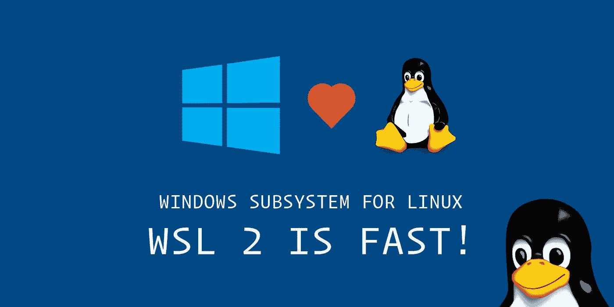

# 在 X-Server 上使用 WSL 2——Windows 上的 Linux

> 原文：<https://medium.com/javarevisited/using-wsl-2-with-x-server-linux-on-windows-a372263533c3?source=collection_archive---------0----------------------->

# 什么是 WSL 2

Linux 的 Windows 子系统允许开发人员直接在 Windows 上运行 GNU/ [Linux](/javarevisited/top-10-courses-to-learn-linux-command-line-in-2020-best-and-free-f3ee4a78d0c0?source=collection_home---4------0-----------------------) 环境，包括大多数命令行工具、实用程序和应用程序，无需修改，没有传统虚拟机或双引导设置的开销。

# 在 Windows 10 上安装 WSL2