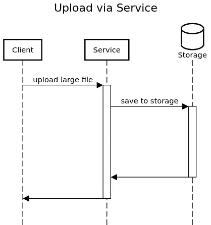
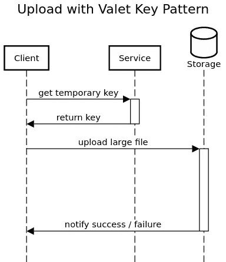

# 30 秒内完成钥匙设计图案

> 原文：<https://medium.com/javarevisited/valet-key-design-pattern-in-30-seconds-4ab0715c7416?source=collection_archive---------1----------------------->

## 不要在大上传上浪费你的应用资源。

[老钱](https://unsplash.com/@moneyphotos?utm_source=unsplash&utm_medium=referral&utm_content=creditCopyText)在 [Unsplash](https://unsplash.com/s/photos/key?utm_source=unsplash&utm_medium=referral&utm_content=creditCopyText) 上的照片

通过应用程序路由大量的上传和下载会消耗宝贵的资源，如带宽和 CPU 时间。在服务验证了上传请求后，它会将数据上传到存储系统，如亚马逊 S3 或谷歌云存储。认证很快。**服务在等待存储系统保存文件时浪费了大部分时间。**

该服务在等待存储系统保存文件时浪费了大部分时间。通过服务上传锁定资源。

为什么要浪费这么多宝贵的时间？代客钥匙模式为这个问题创造了一个补救措施。

<https://verbosemode.dev/membership>  

客户不再调用你的服务来上传东西。他们只调用您的服务来获得一个具有有限有效性的专用密钥。然后，他们使用此密钥将数据直接上传到存储系统。存储系统必须能够验证密钥是否有效。这样，您的应用程序就不必等待上传。

使用代客钥匙模式来减少系统负荷。

不利的一面是，您失去了对存储系统的一些控制。您必须确保该键具有尽可能小的范围。限制最大上传大小、密钥的可重用性及其有效性。如果可能的话，让客户端在上传完成后通知您，这样您就可以马上使密钥失效。

在使用之前，不要忘记验证和清理所有上传的数据。你可以通过自己的服务来实现这一点，该服务会定期扫描所有新上传的内容。

仅当客户端必须经常上传大量文件时，才使用此模式。这会节省你的资源。这将节省你的钱。

*想了解更多关于云设计模式的知识吗？看看这些文章:*

</javarevisited/fabulous-claim-check-design-pattern-explained-in-just-one-minute-5bac14df0edc>  </javarevisited/circuit-breaker-pattern-in-30-seconds-79166ddedaed>  </javarevisited/4-really-helpful-and-important-cloud-design-patterns-explained-in-short-time-4b087bebb97b> 